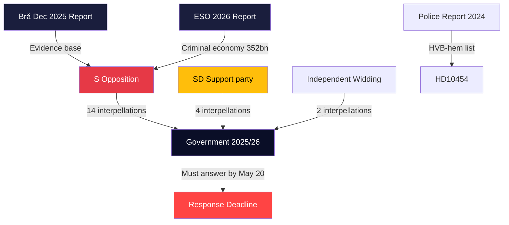

# Stakeholder Perspectives — Interpellations 2026-04-29

**Author**: James Pether Sörling | **Confidence**: HIGH [B2]

## 6-Lens Stakeholder Matrix

### Lens 1: Government Actors

| Stakeholder | Role | Position | Pressure Level |
|-------------|------|----------|---------------|
| Camilla Waltersson Grönvall (M) | Socialtjänstminister | Under pressure on HVB-hem (HD10454); must respond by 2026-05-20 | CRITICAL |
| Gunnar Strömmer (M) | Justitieminister | Dual pressure: criminal economy (HD10451), constitutional criticism (HD10452), police shortage (HD10439) | HIGH |
| Ebba Busch (KD) | Energiminister | Challenged by coalition partner SD on gas bridge (HD10453) and desinformation on wind (HD10448) | HIGH |
| Elisabet Lann (KD) | Sjukvårdsminister | Two concurrent interpellations: organ harvesting (HD10456) + rare diseases (HD10457) | MEDIUM-HIGH |
| Elisabeth Svantesson (M) | Finansminister | Challenged on employer payroll tax exploitation (HD10444), false death declarations (HD10446), eating disorder controversy (HD10442) | MEDIUM |
| Andreas Carlson (KD) | Infrastrukturminister | Södra stambanan (HD10449), kommunal förköpsrätt (HD10445) | MEDIUM |
| Anna Tenje (M) | Socialförsäkringsminister | Sick insurance day-180 exception (HD10450) | MEDIUM |
| Erik Slottner (KD) | Civilminister | Social dumping (HD10443) | MEDIUM |
| Nina Larsson (L) | Jämställdhetsminister | Women's shelter closures (HD10438) | MEDIUM |
| Johan Britz (L) | Arbetsmarknadsminister | Occupational health doctor shortage (HD10440) | LOW-MEDIUM |
| Parisa Liljestrand (M) | Kulturminister | Mobile cultural heritage (HD10455) | LOW |

### Lens 2: Opposition Parties

| Actor | Strategy | Key dok_ids | Electoral Vector |
|-------|----------|-------------|-----------------|
| S (Socialdemokraterna) | Coordinated welfare-dismantlement narrative + crime governance failures | HD10454, HD10451, HD10438, HD10443, HD10450, HD10446, HD10449, HD10444, HD10439, HD10447, HD10445, HD10442, HD10440, HD10457 | HIGH — election 2026 positioning |
| SD (Sverigedemokraterna) | Intra-coalition pressure on energy + foreign policy/human rights | HD10453, HD10456, HD10448, HD10455 | MEDIUM — tests Tidö limits |
| Elsa Widding (independent) | Constitutional and rule-of-law challenges | HD10452, HD10441 | LOW — niche accountability |

### Lens 3: Civil Society / Affected Groups

| Group | Affected by | Pressure Direction |
|-------|------------|-------------------|
| Vulnerable youth in HVB-homes | HD10454 | Critical — direct welfare harm |
| Women's shelter operators | HD10438 | Financial survival threatened |
| Rare disease patients | HD10457 | Drug access at risk |
| Small/medium enterprises (SMEs) | HD10444, HD10447 | Competitive distortion from criminal enterprises |
| Stockholm municipality | HD10454, HD10443 | Autonomy over sensitive information |
| Occupational health sector | HD10440 | Capacity/training crisis |

### Lens 4: Regulatory/Administrative Bodies

| Body | Relevance | Expected Response |
|------|-----------|------------------|
| IVO (Inspektionen för vård och omsorg) | HVB-hem oversight, should have flagged criminal operators | Under scrutiny — HD10454 |
| Polismyndigheten | Intelligence sharing with municipalities | HD10454, HD10439 |
| Ekobrottsmyndigheten | Economic crime enforcement | HD10451 |
| Bolagsverket | Company registration oversight | HD10451 |
| Svenska kraftnät | Grid investment program | HD10453 |
| Socialstyrelsen | Rare disease drug availability | HD10457 |

### Lens 5: Coalition Dynamics

The Tidökoalitionen (M+KD+L+SD) faces intra-coalition stress specifically on energy (HD10453: SD vs KD) and a potential legitimacy test if the HVB-hem scandal is seen as government-level rather than police-level failure. SD's interpellations (HD10453, HD10456, HD10455) are simultaneously constructive engagement and pressure maintenance, consistent with SD's role as the governing-from-outside support party.

### Lens 6: Influence Network

