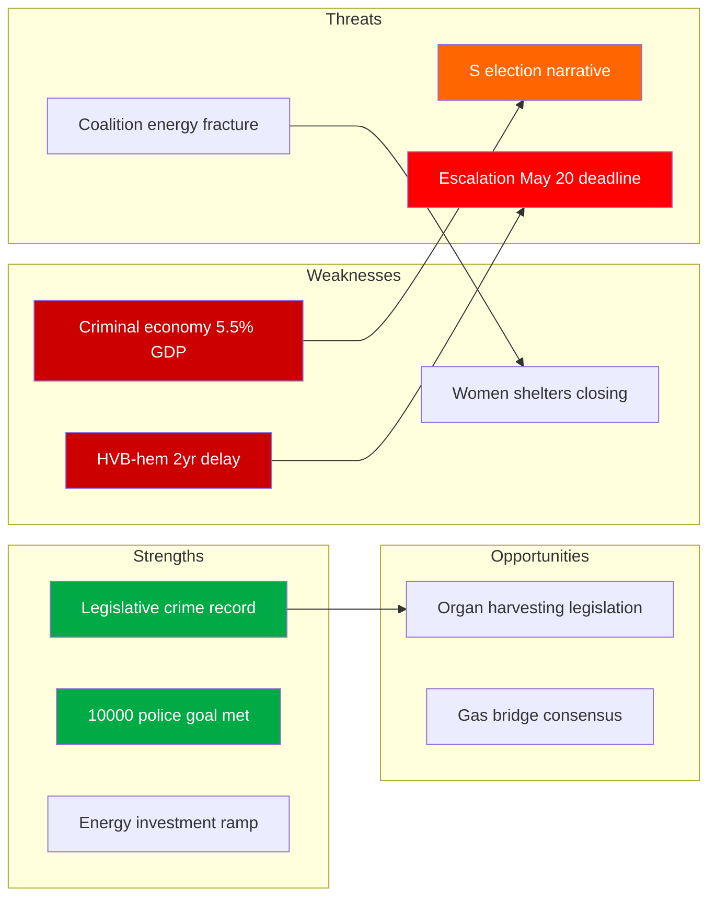

# SWOT Analysis — Interpellations 2026-04-29

**Author**: James Pether Sörling | **Confidence**: HIGH [B2]

## SWOT Matrix: Government (Tidökoalitionen) Position

### Strengths [A2]
- **Legislative track record on crime**: Strömmer (M) can point to Jan 2025 legislation against company-as-crime-tool (HD10451 context). New tools implemented as scheduled. Source: riksdagen.se, legislative record 2025.
- **Energy investment commitments**: Ebba Busch (KD) can demonstrate SVK's investment ramp-up — from 0.7 to 14.6 billion in 20 years (HD10453, Josef Fransson SD citation). Source: riksdagen.se HD10453.
- **Healthcare minister Lann (KD) on organ harvesting**: Sweden joining international consensus on this issue positions KD as principled human rights actor (HD10456). Source: riksdagen.se HD10456.
- **Police numbers achieved**: Government can cite Brå's positive finding on 10,000-police target being met (HD10439 context). Source: Brå polismål report cited in HD10439.

### Weaknesses [A2]
- **HVB-hem information delay**: ~2-year gap between police identifying criminal HVB-homes and Stockholm municipality receiving the list is a concrete, documentable governance failure (HD10454). Source: riksdagen.se HD10454, SR reporting cited therein.
- **Criminal economy at 5.5% of GDP**: ESO 2026 report's estimate of 352 billion SEK criminal economy makes the government's crime narrative look disconnected from results (HD10451). Source: riksdagen.se HD10451.
- **Energy gap before nuclear**: SD correctly identifies that nuclear power is 10 years away, creating a credibility gap in the energy transition narrative (HD10453). Source: riksdagen.se HD10453.
- **Women's shelter closures**: Documented closures of women's shelters undermine the government's social protection narrative (HD10438). Source: riksdagen.se HD10438.

### Opportunities [A2]
- **Cross-party consensus on organ harvesting**: HD10456 offers KD/M opportunity to table legislation with broad parliamentary support (Spain, Belgium, Israel precedents). Source: riksdagen.se HD10456, international precedents cited.
- **Criminalization of business-tool crime**: Government can accelerate the roadmap post-Brå report, pre-empting S's critique with concrete next steps (HD10451). Source: riksdagen.se HD10451.
- **Gas bridge transitional measure**: A limited Öresundsverket activation could satisfy SD demands while not derailing nuclear long-term plan, demonstrating coalition flexibility (HD10453). Source: riksdagen.se HD10453.

### Threats [A2]
- **S election-year narrative consolidation**: The cluster of interpellations — social dumping (HD10443), women's shelters (HD10438), sick insurance (HD10450), rare diseases (HD10457), occupational doctors (HD10440) — suggests coordinated S strategy to build a "social protection dismantlement" narrative ahead of 2026 elections. Source: riksdagen.se multiple dok_ids above.
- **HVB-hem scandal escalation**: Failure to announce concrete prohibitions by May 20 deadline could trigger a parliamentary inquiry motion from S+V+MP. Source: riksdagen.se HD10454.
- **Criminal economy credibility gap**: ESO's 352 billion estimate undermines the government's core crime-fighting narrative at a critical electoral moment. Source: riksdagen.se HD10451, ESO 2026.
- **Coalition energy fracture**: SD's gas-bridge challenge to Busch (HD10453) tests whether KD can hold energy policy leadership within Tidökoalitionen. Source: riksdagen.se HD10453.

## TOWS Matrix

| | Strengths | Weaknesses |
|---|---|---|
| **Opportunities** | **SO**: Use police-target achievement to underpin organ-harvesting legislation — demonstrates law enforcement credibility (HD10439+HD10456). | **WO**: Accelerate company-crime legislation to pre-empt S's ESO-based critique; concrete measures by Q3 2026 (HD10451). |
| **Threats** | **ST**: Deploy legislative record on crime to counter HVB-hem narrative — emphasize Jan 2025 law while announcing additional HVB-home oversight measures (HD10454). | **WT**: Coalition risk: if SD breaks with government on energy, combined with HVB-hem scandal, creates dual governance-failure narrative in election year (HD10453+HD10454). |

## Mermaid: SWOT Force Field

