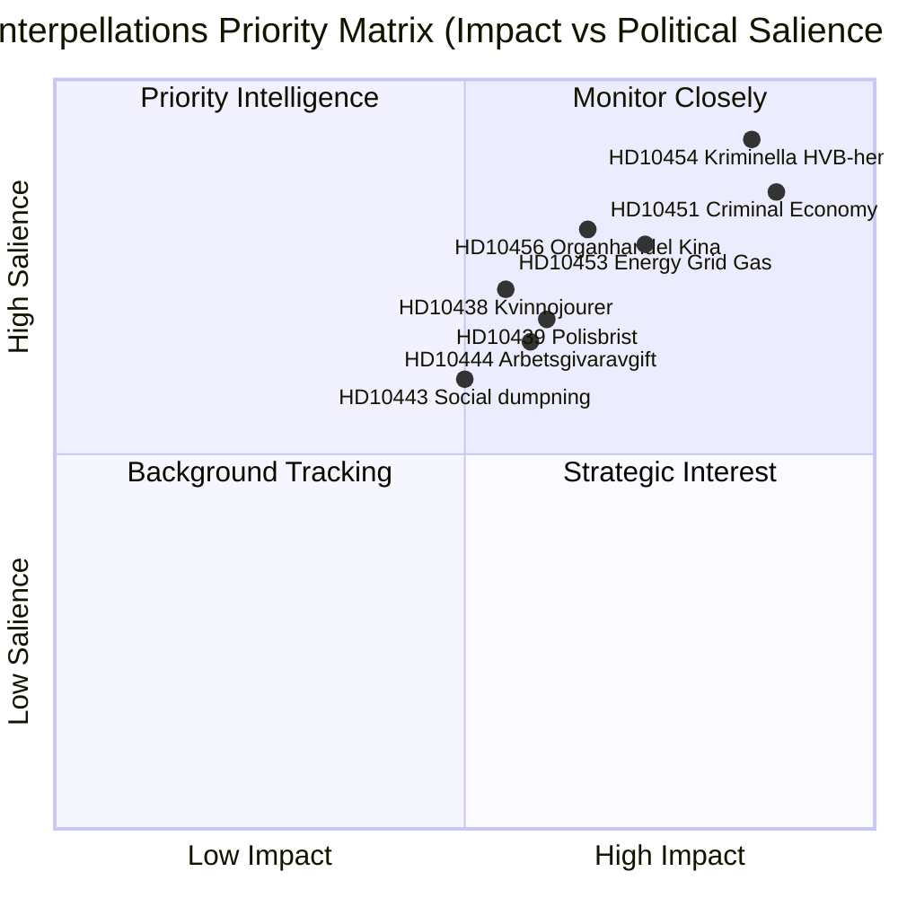

# Synthesis Summary — Interpellation Debates 2026-04-29

**Author**: James Pether Sörling | **Confidence**: HIGH [B2]

## Lead Story: Organized Crime's Systemic Penetration Exposed

The dominant intelligence story emerging from today's interpellations is the exposure of organized crime's penetration into core Swedish institutions — welfare services (HD10454), commercial structures (HD10451), and healthcare linkages (HD10456). This represents a significant challenge to the Tidökoalitionen government's central electoral premise: that the right-wing bloc is uniquely capable of fighting crime.

**DIW-Weighted Ranking (Directness × Impact × Weight):**

| Rank | dok_id | Topic | DIW Score | Tier |
|------|--------|-------|-----------|------|
| 1 | HD10454 | Kriminella driver HVB-hem | 9.2 | L3 Intelligence-grade |
| 2 | HD10451 | Bolag som brottsverktyg (352 bn criminal economy) | 8.7 | L3 Intelligence-grade |
| 3 | HD10453 | Investeringar i elnät / gas-bridge | 7.8 | L2+ Priority |
| 4 | HD10456 | Organhandel / Kina | 7.1 | L2+ Priority |
| 5 | HD10439 | Polisbrist Stockholm | 6.8 | L2 Strategic |
| 6 | HD10438 | Nedläggning av kvinnojourer | 6.5 | L2 Strategic |
| 7 | HD10444 | Arbetsgivaravgifter sänkning | 6.2 | L2 Strategic |
| 8 | HD10450 | Sjukförsäkring dag 180 undantag | 5.9 | L2 Strategic |
| 9 | HD10443 | Social dumpning | 5.7 | L2 Strategic |
| 10 | HD10457 | Sällsynta hälsotillstånd | 5.5 | L1 Surface |

## Integrated Intelligence Picture

Three convergent threat vectors appear across the interpellation batch:

**Vector 1 — Crime-Governance Nexus**: The HVB-hem scandal (HD10454) is not isolated. Stockholm municipality requested a police list of criminal HVB-home operators in 2024 and received it only ~two years later in 2026. This is simultaneously a failure of information-sharing protocols, a failure of regulatory enforcement by Socialstyrelsen/IVO, and a political failure of the government's promised "immediate" action. Combined with Brå's December 2025 finding (cited in HD10451) that 23,000 companies are implicated in criminal networks and ESO's estimate of 352 billion SEK criminal economy, the accountability vector for Justice Minister Strömmer (M) and Social Services Minister Waltersson Grönvall (M) is severe.

**Vector 2 — Energy Strategy Fracture**: SD's Josef Fransson (HD10453) explicitly calls for gas power as a bridge solution, challenging KD's Ebba Busch, who is also the coalition's energy minister. This is an intra-bloc challenge: SD supports nuclear long-term but questions the grid-investment path as insufficient for the near-term industrial needs. The proposal to activate Öresundsverket (a gas plant currently near-idle) tests whether the government can hold its energy-consensus narrative against a coalition partner's pragmatism argument.

**Vector 3 — Social Safety Net Erosion Narrative**: S has assembled a coherent narrative package: women's shelters closing (HD10438), social dumping (HD10443), sick insurance changes (HD10450), occupational health doctor shortage (HD10440), and rare disease medicine withdrawal (HD10457). This appears coordinated ahead of 2026 election positioning.

## Mermaid: DIW Priority Map

