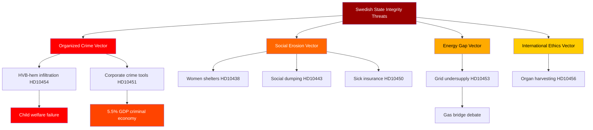

# Threat Analysis — Interpellations 2026-04-29

**Author**: James Pether Sörling | **Confidence**: HIGH [B2]

## Political Threat Taxonomy

### Threat 1: Governance Capture by Organized Crime (CRITICAL)

**Category**: State-Capture / Institutional Integrity  
**Actors**: Organized crime networks operating HVB-homes and commercial entities  
**Target**: Swedish welfare system, business environment  
**Evidence**: HD10454 (HVB-hem infiltration); HD10451 (Brå Dec 2025: 23,000 companies; ESO 2026: 352bn SEK criminal economy = 5.5% GDP)  
**Admiralty**: [B2] Probably True from credible source  

**Attack tree**:
```
Criminal Economy 352bn SEK [ESO 2026]
├── HVB-Home infiltration [HD10454]
│   ├── Child welfare compromised
│   └── Criminal recruitment of vulnerable youth
├── Company exploitation [HD10451]
│   ├── Tax fraud (momsbedrägerier)
│   ├── Money laundering
│   └── Public subsidy extraction
└── Political consequence: Government crime-fighting credibility undermined
```

### Threat 2: Energy Infrastructure Gap (HIGH)

**Category**: Economic / Industrial Competitiveness  
**Actors**: SD (Josef Fransson) pressuring government; grid operators  
**Target**: Swedish industrial competitiveness  
**Evidence**: HD10453 (SVK 15x investment growth; 1 trillion SEK needed in 20 years; nuclear 10 years away)  
**Admiralty**: [B2]  

**Kill chain**: Grid undersupply → industrial bottlenecks → competitiveness loss → loss of foreign investment → economic nationalism vulnerability.

### Threat 3: Social Cohesion Erosion (HIGH)

**Category**: Social Policy / Electoral  
**Actors**: S (coordinated interpellation cluster), women's shelter organizations, municipalities  
**Target**: Social safety net, vulnerable groups  
**Evidence**: HD10438 (women's shelters closing), HD10443 (social dumping), HD10450 (sick insurance cuts), HD10440 (occupational doctor shortage)  
**Admiralty**: [B2]  

### Threat 4: International Human Rights Obligations (MEDIUM)

**Category**: Foreign policy / Health ethics  
**Actors**: SD (Nima Gholam Ali Pour), Chinese institutions  
**Target**: Swedish healthcare ethics, international human rights standing  
**Evidence**: HD10456 (organ harvesting from Chinese prisoners of conscience; Sweden lacks criminalization of receiving coerced organs; comparison: Spain, Belgium, Israel, Taiwan have legislation)  
**Admiralty**: [B2]  

### Threat 5: Constitutional/Rule of Law (MEDIUM)

**Category**: Institutional Integrity  
**Actors**: Independent MPs (Elsa Widding), legal system self-review  
**Target**: Judicial independence appearance  
**Evidence**: HD10452 (challenge to lawyer-reviewing-lawyers in civil cases), HD10441 (rättssäkerhet)  
**Admiralty**: [C2]  

## MITRE-style TTP Mapping (Political Threats)

| TTP ID | Technique | Actor | Target | Evidence |
|--------|-----------|-------|--------|----------|
| PT-GOV-01 | Infiltrate social services | Organized crime | HVB-homes | HD10454 |
| PT-GOV-02 | Shell company exploitation | Criminal networks | Public subsidies | HD10451 |
| PT-POL-01 | Coordinated interpellation cluster | S opposition | Government narrative | HD10438/443/450 |
| PT-POL-02 | Coalition stress testing | SD Fransson | Energy consensus | HD10453 |
| PT-INTL-01 | Forced organ harvesting | PRC institutions | Swedish healthcare ethics | HD10456 |

## Mermaid: Threat Attack Tree


