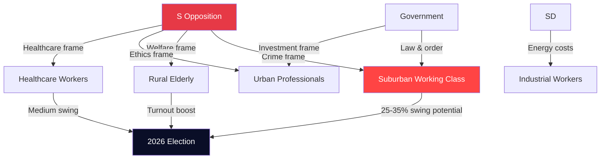

# Voter Segmentation Analysis — Interpellations 2026-04-29

**Author**: James Pether Sörling | **Confidence**: MEDIUM [C2]

## Segment Matrix

| Segment | Size | Primary Interpellation Sensitivity | Party 2022 | Swing Potential |
|---------|------|-----------------------------------|------------|-----------------|
| Suburban working class | ~12% electorate | HD10454 (HVB), HD10451 (crime), HD10439 (police) | Split S/SD | HIGH |
| Rural elderly | ~8% electorate | HD10450 (sick insurance), HD10438 (shelters) | S base | MEDIUM-HIGH |
| Urban professionals | ~15% electorate | HD10452 (rule of law), HD10456 (organ harvesting), HD10448 (wind disinformation) | M/L | MEDIUM |
| Healthcare workers | ~5% electorate | HD10440 (doctor shortage), HD10442 (ätstörning), HD10457 (rare diseases) | Split S/M | MEDIUM |
| Industrial workers | ~8% electorate | HD10453 (energy grid), HD10443 (social dumping) | SD strong | LOW-MEDIUM |
| Small business owners | ~6% electorate | HD10444 (employer taxes), HD10451 (criminal companies) | M | MEDIUM |
| Gender-sensitive voters | ~10% electorate | HD10438 (women's shelters), HD10443 | S/MP | MEDIUM |
| Youth (18-30) | ~12% electorate | HD10456 (ethics), HD10448 (disinformation), crime | Mixed | MEDIUM |
| Long-term sick/disabled | ~3% electorate | HD10450 (day-180 exception), HD10457 | S | LOW (captive) |

## Swing Segment Deep Dives

### Segment 1: Suburban Working Class (Critical)
These voters (Järva, Rinkeby, Botkyrka, Gothenburg E) moved significantly toward SD in 2022 on crime/security narrative. The interpellation cluster (HD10454, HD10451, HD10447, HD10439) provides S with a different crime narrative: not immigration-driven crime (SD's framing) but government-enabled criminal infiltration of social services (S's new frame).

**Key message from this cluster**: "Under this government, criminals are running the care homes for your most vulnerable children."  
**Counter-message potential**: SD/M — "We're increasing police, record arrests."  
**Swing probability to S**: 25-35% of 2022 SD-switchers if HVB narrative dominates.

### Segment 2: Rural Elderly (Base Consolidation)
HD10438 (shelter closures) and HD10450 (sick insurance) directly affect or are visible to rural elderly voters. These are largely S base voters who need motivation to turn out.

**S opportunity**: Solidify base turnout by making welfare state tangible.  
**Government response**: "We've not cut benefits; we've reformed them."  
**Estimated impact**: +2-3% turnout boost in S-leaning municipalities.

### Segment 3: Healthcare Voters
HD10456, HD10457, HD10442, HD10440 together create a healthcare system framing. Voters with personal healthcare system experience (chronic illness, disability, occupational injury) are a 5-6% slice but disproportionately politically active.

**S opportunity**: Personal evidence — "The government doesn't care about your medicine supply."  
**Swing probability**: MEDIUM — healthcare has historically moved votes in Sweden.

## Voter Communication Map

