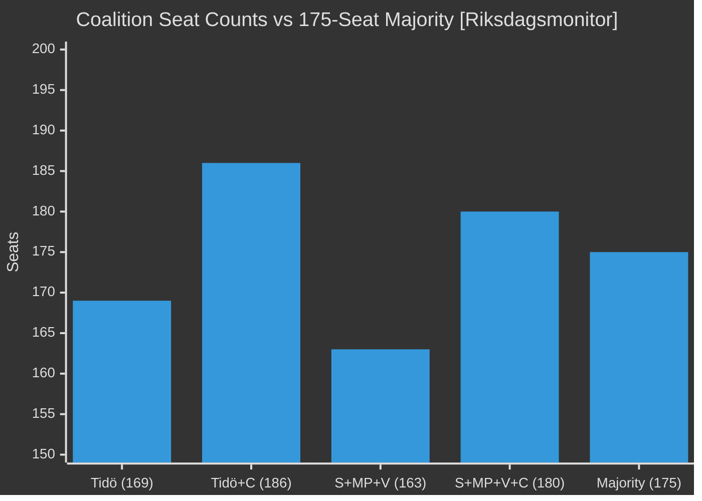

# Coalition Mathematics — May 2026 Month Ahead

**Author**: James Pether Sörling  
**Date**: 2026-04-29  
**Framework**: Seat Count Analysis, Key Vote Mechanics

## Current Riksdag Composition (349 seats)

| Party | Seats | Block | Ja | Nej | Avstår |
|-------|-------|-------|----|-----|--------|
| S | 119 | Opposition | Variable | Variable | Variable |
| SD | 74 | Tidö | 74 | — | — |
| M | 65 | Tidö | 65 | — | — |
| V | 26 | Opposition | — | 26 | — |
| MP | 18 | Opposition | — | 18 | — |
| KD | 17 | Tidö | 17 | — | — |
| C | 17 | Ambiguous | Variable | Variable | Variable |
| L | 13 | Tidö | 13 | — | — |

**Simple majority**: 175/349

## Key Vote Scenarios

### HC01FiU20 Spring Fiscal Bill Vote

| Scenario | Ja | Nej | Avstår | Outcome |
|----------|-----|-----|--------|---------|
| A: L supports | 169 (Tidö) + L=13 = 169 | 163 (opp) | 17 (C) | PASSES if C abstains |
| B: L abstains | 156 | 163 | 30 (C+L) | DEFEATS if S+V+MP vote Nej |
| C: C+L support | 186 | 163 | — | PASSES comfortably |
| D: L defects | 156 | 176 | — | DEFEATS — government falls |

**Minimum for passage**: Tidö (without L) = 156; needs C abstention OR L support to reach 175.

**Gate interpretation**: L is the decisive veto player. C abstention alone is insufficient — 156 Tidö + 17 C-abstain = 156 Ja vs 163 Nej = DEFEAT. Tidö MUST retain L.

### HD01JuU10 Weapons Law Vote

| Scenario | Ja | Nej | Expected |
|----------|-----|-----|----------|
| Standard Tidö + C | 186 | 163 | PASSES — cross-party crime support |
| Tidö only | 169 | 163+17=180 | Could fail if C votes Nej |

**Assessment**: Cross-party support for weapons law is high based on prior cycle analysis. HD01JuU10 should pass with SD+M+KD+L+C at minimum.

## Confidence and Supply Arithmetic

**Tidö formal coalition**: M(65) + SD(74) + KD(17) + L(13) = 169 seats — 6 short of majority  
**SD support rationale**: First-time governing role; highest historical seat count; strong incentive to maintain  
**L veto arithmetic**: 13 seats is exactly the deficit between Tidö (169) and majority (175). L has maximum leverage.  
**C swing potential**: 17 seats. If C moves to "constructive opposition" or formal support → 186 seats, comfortable majority.

## Coalition Formation Probability Matrix

| Coalition | Seats | Majority? | Probability |
|-----------|-------|-----------|-------------|
| M+SD+KD+L (Tidö as is) | 169 | No — needs C or others | 35% if C abstains |
| M+SD+KD+L+C | 186 | Yes | 15% |
| S+MP+V (minority) | 163 | No — needs C or MPs | 25% |
| S+MP+V+C | 180 | Yes | 20% |
| S+MP+V+L (cross-bloc) | 176 | Yes | 5% |

