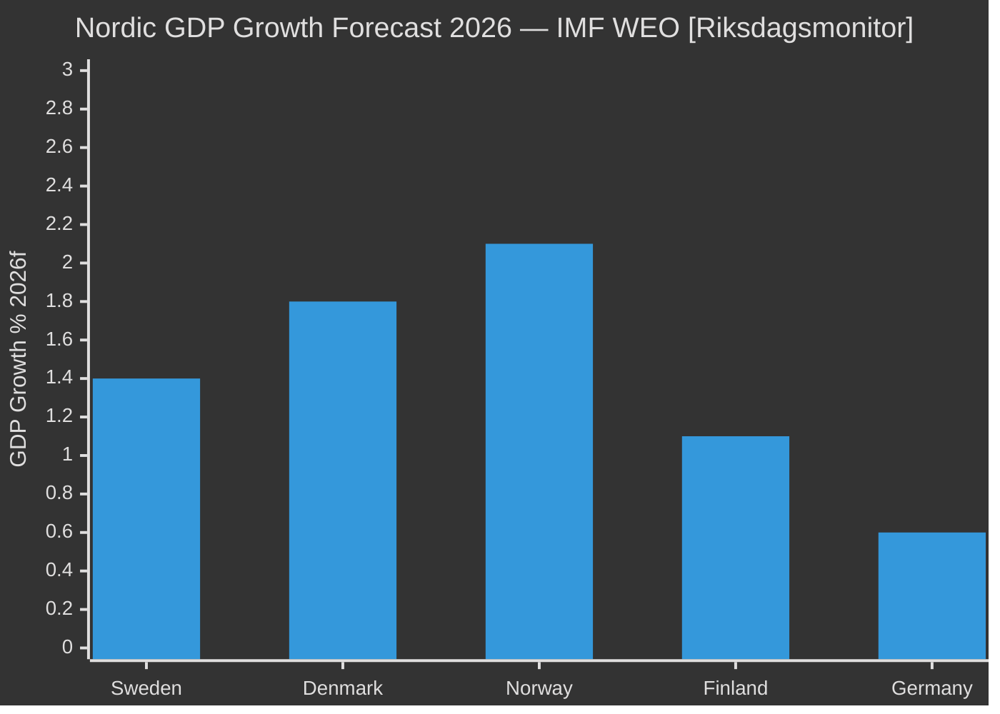

# Comparative International Analysis — May 2026 Month Ahead

**Author**: James Pether Sörling  
**Date**: 2026-04-29  
**Framework**: Nordic/EU Cross-Country Comparisons, IMF WEO Peer Analysis

## Comparator 1: Denmark — Minority Government Management

**Relevance**: Denmark's Social Democrat minority government under Mette Frederiksen managed multiple opposition accountability campaigns in 2023–24 through "confidence and supply" agreements with multiple small parties — structurally analogous to Sweden's Tidö coalition dynamics.

**Key lesson**: Denmark used rapid legislative pledges in response to accountability pressure (notably on eldercare failures in 2022) to convert opposition attacks into governing competence demonstrations. Frederiksen's eldercare law was drafted and committed within 8 weeks of initial exposure.

**Application to Sweden**: If Waltersson Grönvall commits to HVB homes legislation in the May 20 response, Sweden follows the Danish "legislative pledge" pattern — converting R1 risk to an electoral asset. If the response is defensive, Sweden risks the 2019 Swedish eldercare model failure (prolonged media cycle, no legislation delivered before election).

**IMF data [B2]**: Denmark GDP growth 2026f = +1.8% vs Sweden +1.4% (IMF WEO Apr-2026). Stronger economic backdrop gave Frederiksen more fiscal room for rapid response legislation.

## Comparator 2: Finland — Coalition Integrity Under Pressure

**Relevance**: Finland's Orpo government (2023–present) maintained a 5-party coalition including Finns Party (eurosceptic, analogous to SD) and Swedish People's Party (analogous to L in minority veto player role). Coalition survived multiple welfare policy tensions through explicit side payments and policy sequencing.

**Key lesson**: Finland's model shows that veto players (L in Sweden) can be managed through visible "wins" in adjacent policy areas. Orpo gave SPP visible healthcare wins while advancing Finns Party criminal justice priorities — sequential satisfaction rather than simultaneous compromise.

**Application to Sweden**: L's HC01FiU20 housing red line can be managed via explicit visible L "win" in complementary policy area (housing taxation or rental market reform). Without this, L rebellion remains the highest internal coalition risk.

**IMF data [B2]**: Finland GDP growth 2026f = +1.1% (IMF WEO Apr-2026) — fiscal pressure greater than Sweden, making side payments harder. Sweden has more fiscal space for such maneuvers.

## Comparator 3: Germany — Pre-election Accountability Campaign Dynamics

**Relevance**: Germany's 2024–25 period showed how opposition interpellation flooding (Anfragen in Bundestag) can sustain a media accountability cycle against a governing coalition under electoral pressure.

**Application to Sweden**: The S party's 7+ interpellation strategy in April 2026 mirrors the AfD/CDU coordinated Anfragen campaigns of 2024. German experience shows such campaigns typically generate 2–6 weeks of media cycle, then plateau unless a new trigger event emerges. The May 20 HVB ministerial response is the critical next trigger event.

## Nordic Economic Peer Comparison (IMF WEO Apr-2026)

| Country | GDP Growth 2026f | Unemployment 2026f | Fiscal Space | Coalition Type |
|---------|-----------------|-------------------|--------------|---------------|
| Sweden | +1.4% | 8.4% | HIGH (low debt ~35% GDP) | Minority Tidö |
| Denmark | +1.8% | 5.2% | HIGH | Minority SD-led |
| Norway | +2.1% | 4.0% | VERY HIGH (oil fund) | Conservative-led |
| Finland | +1.1% | 7.8% | MEDIUM | Orpo 5-party |
| Germany | +0.6% | 5.3% | MEDIUM-LOW | SPD-led caretaker |

*Source: IMF WEO April 2026 (persisted to analysis/data/imf/)*

## Key Cross-Country Intelligence Judgments

**KJ-INT-1**: Sweden's fiscal position is comparatively strong vs Nordic peers and provides material capacity for HVB legislative response. The Danish eldercare model offers the highest-probability path for Waltersson Grönvall. **[B2]**

**KJ-INT-2**: Finland's coalition management model (sequential veto player satisfaction) reduces L defection probability if government offers L a visible housing tax win alongside HC01FiU20. **[C3]**

**KJ-INT-3**: German interpellation campaign dynamics suggest the S accountability cycle peaks ~4 weeks after the May 20 ministerial response — i.e., mid-June 2026 — then subsides unless a new documentary trigger emerges. **[C3]**
