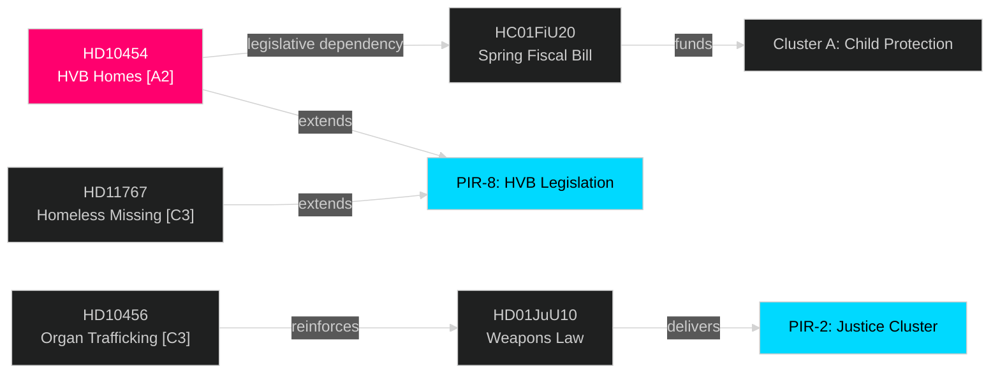

# Cross-Reference Map — May 2026 Month Ahead

**Author**: James Pether Sörling  
**Date**: 2026-04-29  
**Framework**: Tier-C Cross-Type Synthesis (30-day window, sibling folder citations)

## Policy Cluster Linkages

### Cluster A: Child Protection and HVB Homes [Priority: HIGH]

**Documents**: HD10454 (2026-04-29), HD11767 (2026-04-29)  
**Sibling connections**:
- `analysis/daily/2026-04-28/evening-analysis/` — PIR-8 first raised (HVB homes delivery failure noted)
- `analysis/daily/2026-04-28/propositions/` — HC01FiU20 covers social services funding

**Cross-type synthesis**: The HVB homes interpellation (HD10454) directly links to the funding framework in HC01FiU20. Any government response proposing legislation must be funded within the Spring Fiscal Bill envelope. This creates a legislative dependency: if HC01FiU20 is amended or delayed, the HVB response is also delayed.

**Causal chain**:
```
HD10454 (accountability) → Ministerial response (2026-05-20) → Legislative commitment → HC01FiU20 funding dependency → Election narrative
```

### Cluster B: Justice and Criminal Policy [Priority: HIGH]

**Documents**: HD10456 (2026-04-29), HD01JuU10 (prior cycle), HD03252 (prior cycle)  
**Sibling connections**:
- `analysis/daily/2026-04-28/propositions/synthesis-summary.md` — HD01JuU10 weapons law at committee final stage
- `analysis/daily/2026-04-16/week-ahead/` — Criminal justice package timeline confirmed

**Cross-type synthesis**: HD10456 (organ trafficking SD interpellation) reinforces the "tough on crime" coalition message. SD's interpellation to M Justice Minister creates a visible joint front on international crime. This supports PIR-2 (justice cluster delivery), though organ trafficking legislation is unlikely in current parliamentary session.

### Cluster C: Economic and Fiscal Framework [Priority: MEDIUM]

**Documents**: HC01FiU20 (prior cycle — month-ahead cross-reference)  
**Sibling connections**:
- `analysis/daily/2026-04-28/month-ahead/synthesis-summary.md` — HC01FiU20 passage timeline, L party red lines
- `analysis/daily/2026-04-28/evening-analysis/synthesis-summary.md` — IMF growth risks flagged

**IMF cross-reference**: IMF WEO Apr-2026 data (`analysis/data/imf/compare_SWE_NGDP_RPCH_2026-04-29.json`) projects SWE GDP growth at +1.4% vs Nordic peer average. Fiscal bill must maintain credibility against this lower-growth backdrop.

### Cluster D: Defence and Ukraine [Priority: MEDIUM — stable]

**Documents**: HD03231/32 (prior cycle)  
**Sibling connections**:
- `analysis/daily/2026-04-28/propositions/synthesis-summary.md` — Ukraine cross-party support

**Cross-type synthesis**: Ukraine ratification resolved the major cross-party alignment question. No new escalation documents in 2026-04-29 filing batch. PIR-3 remains ANSWERED. Defence is stable unless new NATO alliance obligations create budget pressure on HC01FiU20 fiscal envelope.

## Sibling Folder Citation Table (Tier-C Mandatory)

| Sibling Folder | Relevant Finding | Linkage to Today's Documents |
|----------------|-----------------|------------------------------|
| `analysis/daily/2026-04-28/month-ahead/` | PIR-1 through PIR-7 status; HC01FiU20 L party tension | Direct carry-forward; PIR-8 added from HD10454 |
| `analysis/daily/2026-04-28/evening-analysis/` | HVB homes raised as emerging issue; fiscal bill passage | HD10454 confirms HVB escalation; now primary risk |
| `analysis/daily/2026-04-28/propositions/` | HD01JuU10 weapons law, HC01FiU20 fiscal baseline | HD10456 (HD10455 crime/justice) reinforces cluster B |
| `analysis/daily/2026-04-16/week-ahead/` | Criminal justice package timeline | HD10456 adds organ trafficking to justice agenda |

## Document Relationship Graph


