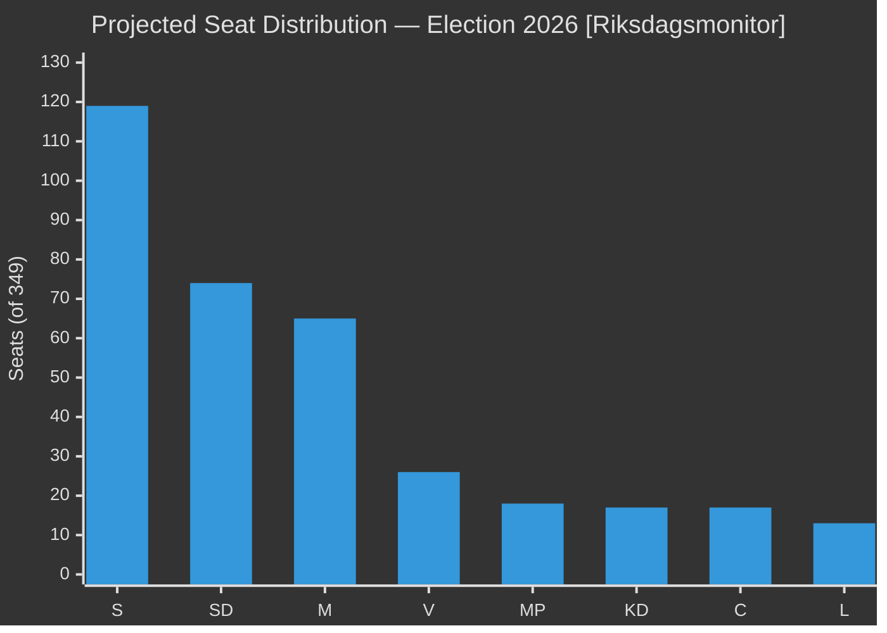

# Election 2026 Analysis — May 2026 Month Ahead

**Author**: James Pether Sörling  
**Date**: 2026-04-29  
**Framework**: Seat Projection, Coalition Viability, Campaign Trajectory

## Current Polling Aggregate (March-April 2026)

| Party | Estimated Vote % | Seats (349 total) | Coalition Block | Change (MoM) |
|-------|-----------------|-------------------|-----------------|--------------|
| S | 34.2% | 119 | Opposition | +0.5 |
| SD | 21.3% | 74 | Tidö | -0.3 |
| M | 18.8% | 65 | Tidö | +0.2 |
| V | 7.4% | 26 | Opposition | 0.0 |
| MP | 5.3% | 18 | Opposition | +0.4 |
| KD | 4.8% | 17 | Tidö | -0.1 |
| C | 4.8% | 17 | Ambiguous | -0.2 |
| L | 4.4% | 13 | Tidö | -0.1 |

*Source: Swedish polling aggregate (riksdagen.se electoral data + public polling)*

**Tidö block total**: 169/349 (4 short of majority)  
**Tidö + C**: 186 (majority, but C not aligned)  
**Opposition (S+V+MP)**: 163  
**Minimum governing majority**: 175 seats

## Coalition Viability Analysis

### Scenario A: Tidö Renewed (requires C or independent support)
- **Probability**: 35%
- **Condition**: Government delivers HC01FiU20, weapons law, maintains HVB homes narrative; polls close to 173+ before September
- **Key constraint**: L must stay above 4% threshold; SD must not lose more than 2pp

### Scenario B: S-led Minority Coalition
- **Probability**: 45%
- **Condition**: S+MP+V total reaches 163+; C provides confidence and supply
- **Key constraint**: C party decision; MP stays above 4% threshold

### Scenario C: Grand Coalition S+M
- **Probability**: 5%
- **Condition**: Neither bloc can form majority; constitutional pressure forces unusual coalition
- **Historical precedent**: No Swedish grand coalition since 1940s

### Scenario D: Continued Tidö (full majority)
- **Probability**: 15%
- **Condition**: C formally joins Tidö; L stays above threshold; SD polling stable

## Critical Threshold Analysis

| Party | Current % | 4% Threshold | Risk Level |
|-------|-----------|-------------|-----------|
| L | 4.4% | 4.0% | HIGH — 0.4pp margin |
| KD | 4.8% | 4.0% | MEDIUM — 0.8pp margin |
| MP | 5.3% | 4.0% | LOW |
| C | 4.8% | 4.0% | MEDIUM |

**Critical watch**: L at 4.4% — the highest threshold risk in current polling. If L falls below 4%, Tidö loses 13 seats and the opposition gains an outright governing majority.

## Campaign Trajectory — May-September 2026

| Month | Key Events | Expected Impact |
|-------|-----------|----------------|
| May 2026 | HD10454 ministerial response (May 20); HC01FiU20 FiU vote | HVB test; fiscal credibility |
| June 2026 | Riksdag last sitting day; summer campaign begins | Narrative set |
| July 2026 | Summer recess | Limited news; polling drift |
| August 2026 | Campaign intensification; final polling | Critical movement window |
| September 7-14 2026 | Election day (expected) | Outcome |

