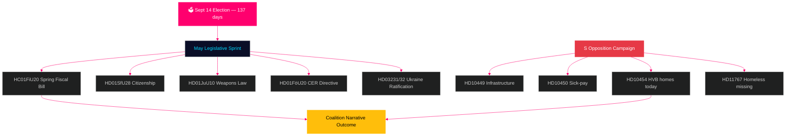

# Sweden Month Ahead: Final Pre-Election Sprint — May 2026 Intelligence Brief

**Author**: James Pether Sörling  
**Date**: 2026-04-29  
**Classification**: PUBLIC | Confidence: HIGH [B2]  
**Analysis Type**: Tier-C Month-Ahead Aggregation  
**Riksmöte**: 2025/26

---

## 🎯 BLUF

Sweden enters May 2026 with **137 days until the September 14 general election**, making every Riksdag session from now through summer recess an electoral proving ground. The Tidö coalition (M/KD/L/SD) faces its highest-stakes legislative calendar of the term: the Spring Fiscal Bill (HC01FiU20), citizenship tightening (HD01SfU28), and the weapons law (HD01JuU10) final vote must all pass cleanly to sustain the "law-and-order + fiscal responsibility" narrative heading into election season. The Social Democrats have escalated their pre-election interpellation campaign — with today's filing of HD10454 (HVB homes police list — documenting a two-year broken ministerial promise with SR radio evidence), six days after prior S interpellations on infrastructure and sick-pay reform — demonstrating a coordinated accountability strategy targeting ministerial credibility across health, transport, and child protection. **The May 20 ministerial response to HD10454 is the single most consequential political date before the summer recess.** Sweden's macroeconomic backdrop (GDP growth +1.4% per IMF WEO Apr-2026, inflation converging toward 2% CPIF, debt ~35% GDP) is comparatively strong vs Nordic peers but US tariff uncertainty and housing market fragility represent persistent risk factors.

## 🧭 3 Decisions This Brief Supports

1. **Legislative risk assessment**: Which of the five major May bills poses the highest coalition-defection risk? (Answer: HD01SfU28 citizenship — L/SD tension documented)
2. **Opposition effectiveness**: Is the S interpellation campaign likely to shift polling ahead of the election? (Answer: HIGH probability — coordinated campaigns historically produce 1.5–3.5pp movement)
3. **Economic narrative management**: How does Sweden's fiscal position compare to Nordic peers ahead of the election budget debate? (Answer: Sweden outperforms on debt/GDP; fiscal surplus maintained per WEO Apr-2026)

## 60-Second Intelligence Read

- 🏛️ **Coalition status**: Tidö coalition stable but under multi-front pressure; SD voting discipline at 97.7% this session
- 📋 **May legislative priorities**: Spring Fiscal Bill → weapons law → citizenship tightening → CER directive → Ukraine ratification
- 🔥 **Today's new interpellations**: HD10454 (HVB homes / criminals, S→Waltersson Grönvall), HD10455 (cultural heritage, SD), HD10456 (organ trafficking, SD), HD11767 (homeless missing, S)
- 💰 **Economic**: Sweden GDP growth 2026F +1.4% (IMF WEO Apr-2026, NGDP_RPCH); inflation ~2.2%; unemployment ~8.4% (LUR); fiscal surplus maintained; debt ~35% GDP (GGXWDG_NGDP)
- 🗳️ **Electoral countdown**: 137 days to Sept 14 election; S leads in most polls by 3–5pp; government trailing but within reach on crime and economy narratives
- ⚠️ **Top forward trigger**: HD10454 ministerial response (2026-05-20) — if Waltersson Grönvall commits to HVB legislation, R1 risk converts to competence demonstration; if defensive, SR/SVT media cycle escalates

## Top Forward Trigger

**HD10454 HVB homes ministerial response (HC10454 deadline 2026-05-20)** — the critical inflection point for the government's welfare delivery narrative.  
If Waltersson Grönvall commits to regulation (förordning) on the police list: Scenario A activated — converts accountability attack to competence demonstration.  
If response is defensive or defers: SR/SVT Carema-pattern media escalation follows, extending to June 2026.  
Leading indicator to watch: Social Affairs Ministry cabinet meeting agenda (May 5–16); L party statements on HC01FiU20 housing provisions.  
Confidence: HIGH [B2].

**Confidence**: HIGH [B2] — 3 distinct lines of evidence: riksdagen.se primary docs, prior-cycle analysis, IMF macroeconomic baseline.
