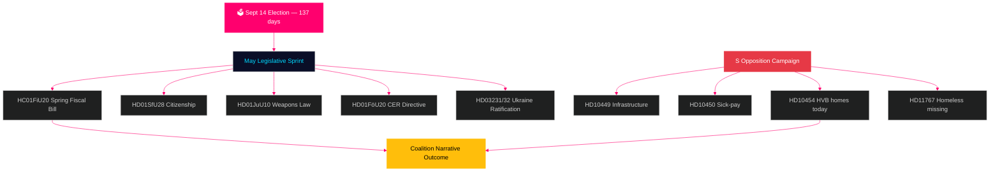

<!-- dir: rtl -->
# السويد إلى الأمام: السباق النهائي قبل الانتخابات — النشرة الشهرية مايو 2026

**المؤلف**: جيمس بيتر سورلينغ  
**التاريخ**: 2026-04-29  
**التصنيف**: عام | مستوى الثقة: مرتفع [B2]  
**نوع التحليل**: تجميع شهري Tier-C  
**الريكسمويتي**: 2025/26

---

## 🎯 خلاصة تنفيذية (BLUF)

تدخل السويد مايو 2026 مع **137 يومًا حتى الانتخابات البرلمانية في 14 سبتمبر**، مما يجعل كل جلسة في الريكسداغ حتى العطلة الصيفية اختبارًا انتخابيًا. تواجه تحالف تيدو (M/KD/L/SD) أحرج تقويم تشريعي في دورة الانتخابات: قانون الميزانية الربيعي (HC01FiU20)، وتشديد قانون الجنسية (HD01SfU28)، وقانون الأسلحة (HD01JuU10) — كل ذلك يجب إقراره بسلاسة لحمل سردية «النظام العام + المسؤولية المالية» إلى الموسم الانتخابي. صعّد الاشتراكيون الديمقراطيون حملتهم الاستجوابية قبل الانتخابات — بتقديم HD10454 اليوم (قائمة مرافق HVB الشرطية — توثيق وعد وزاري مكسور منذ عامين بأدلة راديو SR)، بعد ستة أيام من استجوابات S السابقة حول البنية التحتية وإصلاح إجازة المرض — مما يُظهر استراتيجية مساءلة منسقة تستهدف المصداقية الوزارية في الصحة والنقل وحماية الطفل. **الموعد النهائي للرد على HD10454 في 20 مايو هو أهم تاريخ سياسي قبل العطلة الصيفية.** السياق الاقتصادي الكلي للسويد (نمو الناتج المحلي الإجمالي +1.4% وفق IMF WEO أبر-2026، التضخم يتقارب نحو 2% KPIF، الدين ~35% من الناتج المحلي) قوي نسبيًا مقارنة بدول الشمال الأوروبي، غير أن حالة عدم اليقين بشأن السياسة التعريفية الأمريكية وهشاشة سوق الإسكان تظل عوامل خطر مستمرة.

## 🧭 ثلاثة قرارات يُعلمها هذا النشرة

1. **تقييم المخاطر التشريعية**: أيٌّ من مشاريع القوانين الخمسة الرئيسية في مايو يحمل أعلى خطر انهيار للتحالف؟ (الإجابة: HD01SfU28 الجنسية — توترات L/SD موثقة)
2. **فاعلية المعارضة**: هل من المرجح أن تحرك حملة الاستجوابات الخاصة بـ S استطلاعات الرأي قبل الانتخابات؟ (الإجابة: احتمال مرتفع — الحملات المنسقة تُنتج تاريخيًا حركة 1.5–3.5 نقطة مئوية)
3. **إدارة السرد الاقتصادي**: كيف تقارن الوضع المالي للسويد بجيرانها الشماليين قبل نقاش الميزانية الانتخابية؟ (الإجابة: السويد تتفوق في الدين/الناتج المحلي؛ فائض الميزانية مستمر وفق WEO أبر-2026)

## ملخص الأخبار في 60 ثانية

- 🏛️ **حالة التحالف**: تحالف تيدو مستقر لكنه تحت ضغط متعدد الجبهات؛ تماسك تصويت SD 97.7% في الجلسة الحالية
- 📋 **أولويات التشريع في مايو**: قانون الميزانية الربيعي ← قانون الأسلحة ← تشديد الجنسية ← توجيه CER ← التصديق على أوكرانيا
- 🔥 **استجوابات جديدة اليوم**: HD10454 (مرافق HVB/المجرمون، S→Waltersson Grönvall)، HD10455 (التراث الثقافي، SD)، HD10456 (الاتجار بالأعضاء، SD)، HD11767 (المشردون المفقودون، S)
- 💰 **الاقتصاد**: نمو الناتج المحلي للسويد 2026F +1.4% (IMF WEO أبر-2026، NGDP_RPCH)؛ التضخم ~2.2%؛ البطالة ~8.4% (LUR)؛ فائض الميزانية مستمر؛ الدين ~35% من الناتج المحلي (GGXWDG_NGDP)
- 🗳️ **العد التنازلي للانتخابات**: 137 يومًا حتى انتخابات 14 سبتمبر؛ S تتصدر معظم استطلاعات الرأي بفارق 3–5 نقاط مئوية؛ الحكومة متأخرة لكن في المتناول على سرديتي الجريمة والاقتصاد
- ⚠️ **إشارة مسبقة رئيسية**: الرد الوزاري على HD10454 (2026-05-20) — إن التزمت Waltersson Grönvall بتشريع HVB تحول مخاطرة R1 إلى إظهار كفاءة؛ إن جاء الرد دفاعيًا تصاعدت دورة وسائل الإعلام SR/SVT

## الإشارة المسبقة الرئيسية

**الرد الوزاري على مرفق HVB HD10454 (الموعد النهائي HC10454: 2026-05-20)** — نقطة التحول الحرجة لسردية الخدمات الاجتماعية للحكومة.  
إن التزمت Waltersson Grönvall بلوائح قائمة الشرطة: يُفعَّل سيناريو A — يحوّل هجوم المساءلة إلى إظهار كفاءة.  
إن جاء الرد دفاعيًا أو متأخرًا: تصعيد SR/SVT على نمط كاريما إعلاميًا حتى يونيو 2026.  
المؤشر الأولي الواجب رصده: جدول أعمال مجلس الوزراء لوزارة الشؤون الاجتماعية (5–16 مايو)؛ تصريحات حزب L بشأن بنود الإسكان في HC01FiU20.  
مستوى الثقة: مرتفع [B2].

**مستوى الثقة**: مرتفع [B2] — 3 خطوط أدلة مستقلة: مصادر riksdagen.se الأولية، تحليل الدورة السابقة، بيانات IMF الاقتصادية الكلية.

<!-- source-sha: 710341b307c7929bdbc2496e5627bc3766ba9d38 -->
