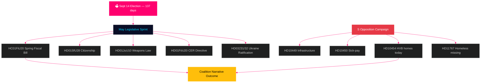

# Sverige måneden forude: Afsluttende valgspurt — maj 2026 efterretningsbrief

**Forfatter**: James Pether Sörling  
**Dato**: 2026-04-29  
**Klassificering**: OFFENTLIG | Konfidens: HØJ [B2]  
**Analysetype**: Tier-C månedlig aggregering  
**Riksmöte**: 2025/26

---

## 🎯 BLUF

Sverige træder ind i maj 2026 med **137 dage til det parlamentariske valg den 14. september**, hvilket gør enhver Riksdag-session fra nu og frem til sommerferien til en valgkampsprøve. Tidö-koalitionen (M/KD/L/SD) står over for sin mest afgørende lovgivningskalender i valgperioden: forårsskattebudgettet (HC01FiU20), stramning af statsborgerskabslovgivning (HD01SfU28) og våbenloven (HD01JuU10) skal alle vedtages rent for at opretholde "lov og orden + finansiel ansvarlighed"-fortællingen frem mod valgkampen. Socialdemokraterne har intensiveret deres forvalgskampagne med interpellationer — med dagens indgivelse af HD10454 (HVB-hjem-polisliste — der dokumenterer et to-årigt brudt ministerielt løfte med SR-radiobevis) seks dage efter S's tidligere interpellationer om infrastruktur og sygelønsreform — og demonstrerer dermed en koordineret ansvarsstrategien rettet mod ministeriernes troværdighed inden for sundhed, transport og børnebeskyttelse. **Ministersvaret den 20. maj for HD10454 er den eneste mest afgørende politiske dato inden sommerferien.** Sveriges makroøkonomiske baggrund (BNP-vækst +1,4 % ifølge IMF WEO Apr-2026, inflation konvergerer mod 2 % CPIF, gæld ~35 % af BNP) er relativt stærk sammenlignet med nordiske jævnaldrende, men usikkerhed om amerikanske toldsatser og boligmarkedets skrøbelighed udgør vedvarende risikofaktorer.

## 🧭 3 beslutninger dette notat understøtter

1. **Lovgivningsrisikovurdering**: Hvilken af de fem store majforslag indebærer den højeste risiko for koalitionsfrafald? (Svar: HD01SfU28 statsborgerskab — L/SD-spænding dokumenteret)
2. **Oppositionens effektivitet**: Er S' interpellationskampagne sandsynligvis til at flytte meningsmålingerne inden valget? (Svar: HØJ sandsynlighed — koordinerede kampagner producerer historisk 1,5–3,5 pp bevægelse)
3. **Styring af den økonomiske fortælling**: Hvordan er Sveriges finanspolitiske stilling sammenlignet med nordiske jævnaldrende inden valgets budgetdebat? (Svar: Sverige overpræsterer på gæld/BNP; finanspolitisk overskud opretholdt ifølge WEO Apr-2026)

## 60-sekunders efterretningsoversigt

- 🏛️ **Koalitionsstatus**: Tidö-koalitionen stabil men under pres på flere fronter; SD's stemmekohæsion på 97,7 % i indeværende session
- 📋 **Majmånedens lovgivningsprioriteter**: Forårsskattebudget → våbenlov → statsborgerskabsstramning → CER-direktivet → Ukraine-ratificering
- 🔥 **Dagens nye interpellationer**: HD10454 (HVB-hjem/kriminelle, S→Waltersson Grönvall), HD10455 (kulturarv, SD), HD10456 (organhandel, SD), HD11767 (hjemløse forsvundne, S)
- 💰 **Økonomi**: Sveriges BNP-vækst 2026F +1,4 % (IMF WEO Apr-2026, NGDP_RPCH); inflation ~2,2 %; ledighed ~8,4 % (LUR); finanspolitisk overskud opretholdt; gæld ~35 % af BNP (GGXWDG_NGDP)
- 🗳️ **Valnedtælling**: 137 dage til valg den 14. september; S fører i de fleste meningsmålinger med 3–5 pp; regering bagud men inden rækkevidde på kriminalitets- og økonomifortællingerne
- ⚠️ **Vigtigste fremadrettede signal**: HD10454 ministerielt svar (2026-05-20) — hvis Waltersson Grönvall forpligter sig til HVB-lovgivning, konverteres R1-risiko til kompetencedemonstration; hvis svaret er defensivt, eskalerer SR/SVT-mediecyklus

## Vigtigste fremadrettede signal

**HD10454 HVB-hjem ministerielt svar (HC10454 svarsfrist 2026-05-20)** — det kritiske vendepunkt for regeringens velfærdsleverings-fortælling.  
Hvis Waltersson Grönvall forpligter sig til bekendtgørelse om polislisten: Scenarie A aktiveres — konverterer ansvarlighedsangreb til kompetencedemonstration.  
Hvis svaret er defensivt eller udsættes: SR/SVT Carema-mønstrets medieeskalering følger og strækker sig ind i juni 2026.  
Ledende indikator at følge: Socialdepartementets kabinetsdagsorden (5.–16. maj); L-partiets udtalelser om HC01FiU20 boligbestemmelser.  
Konfidens: HØJ [B2].

**Konfidens**: HØJ [B2] — 3 adskilte bevisllinjer: riksdagen.se primærkilder, analyse fra tidligere cyklus, IMF makroøkonomisk baseline.

<!-- source-sha: 710341b307c7929bdbc2496e5627bc3766ba9d38 -->
