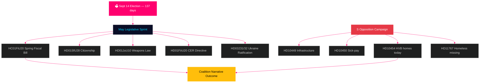

# Schweden im kommenden Monat: Letzter Wahlendspurt — Nachrichtenbrief Mai 2026

**Autor**: James Pether Sörling  
**Datum**: 2026-04-29  
**Einstufung**: ÖFFENTLICH | Vertrauensniveau: HOCH [B2]  
**Analysetyp**: Tier-C Monatsaggregation  
**Riksmöte**: 2025/26

---

## 🎯 BLUF

Schweden tritt in den Mai 2026 mit **137 Tagen bis zur Parlamentswahl am 14. September** ein, was jede Riksdag-Sitzung von jetzt bis zur Sommerpause zu einem Wahlkampftest macht. Die Tidö-Koalition (M/KD/L/SD) steht vor ihrem kritischsten Gesetzgebungskalender des Wahlzyklus: das Frühjahrssteuergesetz (HC01FiU20), die Verschärfung der Staatsbürgerschaftsgesetzgebung (HD01SfU28) und das Waffengesetz (HD01JuU10) müssen allesamt sauber verabschiedet werden, um die Erzählung „Recht und Ordnung + finanzielle Verantwortung" in die Wahlsaison zu tragen. Die Sozialdemokraten haben ihre Interpellationskampagne vor der Wahl intensiviert — mit der heutigen Einreichung von HD10454 (HVB-Heimliste der Polizei — das ein zweijähriges gebrochenes Ministerversprechen mit SR-Radiobeweisen dokumentiert), sechs Tage nach S' früheren Interpellationen zu Infrastruktur und Lohnfortzahlungsreform — und damit eine koordinierte Rechenschaftsstrategie demonstriert, die die ministerielle Glaubwürdigkeit in den Bereichen Gesundheit, Verkehr und Kinderschutz ins Visier nimmt. **Der 20. Mai als Antwortfrist für HD10454 ist das einzeln bedeutendste politische Datum vor der Sommerpause.** Der makroökonomische Hintergrund Schwedens (BIP-Wachstum +1,4 % laut IWF WEO Apr-2026, Inflation konvergiert auf 2 % KPIF, Schulden ~35 % des BIP) ist im Vergleich zu nordischen Nachbarländern vergleichsweise stark, doch Unsicherheit bezüglich US-amerikanischer Zollpolitik und die Fragilität des Wohnungsmarkts bleiben anhaltende Risikofaktoren.

## 🧭 3 Entscheidungen, die dieses Briefing unterstützt

1. **Gesetzgebungsrisikobewertung**: Welches der fünf wichtigen Maigesetze birgt das höchste Risiko eines Koalitionszerfalls? (Antwort: HD01SfU28 Staatsbürgerschaft — L/SD-Spannungen dokumentiert)
2. **Wirksamkeit der Opposition**: Wird die Interpellationskampagne von S die Umfragen vor der Wahl wahrscheinlich verschieben? (Antwort: HOHE Wahrscheinlichkeit — koordinierte Kampagnen erzeugen historisch 1,5–3,5 pp Bewegung)
3. **Wirtschaftliche Narrativführung**: Wie schneidet Schwedens Haushaltslage im Vergleich zu nordischen Nachbarländern vor der Wahlbudgetdebatte ab? (Antwort: Schweden übertrifft bei Schulden/BIP; Haushaltsüberschuss gemäß WEO Apr-2026 aufrechterhalten)

## 60-Sekunden-Nachrichtenüberblick

- 🏛️ **Koalitionsstatus**: Tidö-Koalition stabil, aber unter mehrfrontigem Druck; SD-Abstimmungskohäsion bei 97,7 % in der laufenden Sitzung
- 📋 **Gesetzgebungsprioritäten im Mai**: Frühjahrssteuergesetz → Waffengesetz → Staatsbürgerschaftsverschärfung → CER-Richtlinie → Ukraine-Ratifizierung
- 🔥 **Heutige neue Interpellationen**: HD10454 (HVB-Heime/Kriminelle, S→Waltersson Grönvall), HD10455 (Kulturerbe, SD), HD10456 (Organhandel, SD), HD11767 (Wohnungslose Vermisste, S)
- 💰 **Wirtschaft**: Schwedens BIP-Wachstum 2026F +1,4 % (IWF WEO Apr-2026, NGDP_RPCH); Inflation ~2,2 %; Arbeitslosigkeit ~8,4 % (LUR); Haushaltsüberschuss aufrechterhalten; Schulden ~35 % des BIP (GGXWDG_NGDP)
- 🗳️ **Wahlabwärts**: 137 Tage bis zur Wahl am 14. September; S führt in den meisten Umfragen mit 3–5 pp; Regierung im Rückstand, aber in Reichweite bei Kriminalitäts- und Wirtschaftsnarrativen
- ⚠️ **Wichtigstes Vorwärtssignal**: HD10454 Ministerantwort (2026-05-20) — wenn Waltersson Grönvall HVB-Gesetzgebung zusichert, wird R1-Risiko zur Kompetenzdemonstration; wenn defensiv, eskaliert SR/SVT-Medienzyklus

## Wichtigstes Vorwärtssignal

**HD10454 HVB-Heim Ministerantwort (HC10454 Frist 2026-05-20)** — der kritische Wendepunkt für die Wohlfahrtsleistungserzählung der Regierung.  
Wenn Waltersson Grönvall die Verordnung zur Polizeiliste zusichert: Szenario A wird aktiviert — konvertiert Rechenschaftsangriff in Kompetenzdemonstration.  
Wenn die Antwort defensiv oder verzögert: SR/SVT Carema-Muster-Medieneskalation folgt bis in den Juni 2026.  
Führender Indikator zum Beobachten: Kabinettsagenda des Sozialministeriums (5.–16. Mai); L-Parteistatements zu HC01FiU20-Wohnungsbestimmungen.  
Vertrauensniveau: HOCH [B2].

**Vertrauensniveau**: HOCH [B2] — 3 distinkte Beweislinien: riksdagen.se Primärquellen, vorheriger Zyklus-Analyse, IWF-makroökonomische Ausgangslage.

<!-- source-sha: 710341b307c7929bdbc2496e5627bc3766ba9d38 -->
