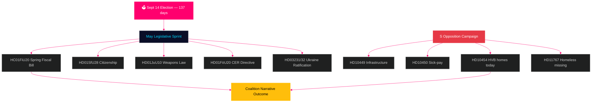

# Suecia por delante: Recta final preelectoral — Boletín mensual mayo 2026

**Autor**: James Pether Sörling  
**Fecha**: 2026-04-29  
**Clasificación**: PÚBLICO | Nivel de confianza: ALTO [B2]  
**Tipo de análisis**: Agregación mensual Tier-C  
**Riksmöte**: 2025/26

---

## 🎯 BLUF

Suecia entra en mayo de 2026 con **137 días hasta las elecciones parlamentarias del 14 de septiembre**, convirtiendo cada sesión del Riksdag hasta el receso de verano en un ensayo de campaña. La coalición Tidö (M/KD/L/SD) afronta su calendario legislativo más crítico del ciclo electoral: la ley de presupuestos de primavera (HC01FiU20), el endurecimiento de la legislación de ciudadanía (HD01SfU28) y la ley de armas (HD01JuU10) deben aprobarse limpiamente para trasladar el relato «orden público + responsabilidad fiscal» a la temporada electoral. Los socialdemócratas han intensificado su campaña de interpelaciones preelectoral —presentando hoy HD10454 (lista de centros HVB de la policía —que documenta una promesa ministerial rota de dos años con pruebas de Radio SR), seis días después de las anteriores interpelaciones de S sobre infraestructura y reforma de la prestación por enfermedad— demostrando una estrategia de rendición de cuentas coordinada que apunta a la credibilidad ministerial en salud, transporte y protección de menores. **El 20 de mayo, fecha límite de respuesta a HD10454, es la fecha política más importante antes del receso de verano.** El contexto macroeconómico de Suecia (crecimiento del PIB +1,4 % según el FMI WEO abr-2026, inflación convergente al 2 % KPIF, deuda ~35 % del PIB) es comparativamente sólido frente a los vecinos nórdicos, aunque la incertidumbre sobre la política arancelaria estadounidense y la fragilidad del mercado inmobiliario siguen siendo factores de riesgo persistentes.

## 🧭 3 decisiones que informa este boletín

1. **Evaluación del riesgo legislativo**: ¿Cuál de los cinco proyectos de ley clave de mayo presenta mayor riesgo de ruptura de la coalición? (Respuesta: HD01SfU28 ciudadanía — tensiones L/SD documentadas)
2. **Eficacia de la oposición**: ¿Es probable que la campaña de interpelaciones de S mueva encuestas antes de las elecciones? (Respuesta: PROBABILIDAD ALTA — las campañas coordinadas producen históricamente un movimiento de 1,5–3,5 pp)
3. **Control del relato económico**: ¿Cómo se compara la posición presupuestaria de Suecia con los vecinos nórdicos antes del debate presupuestario electoral? (Respuesta: Suecia supera en deuda/PIB; superávit presupuestario mantenido según WEO abr-2026)

## Resumen informativo en 60 segundos

- 🏛️ **Estado de la coalición**: Coalición Tidö estable pero bajo presión en múltiples frentes; cohesión de voto de SD al 97,7 % en la sesión en curso
- 📋 **Prioridades legislativas de mayo**: Ley de presupuestos de primavera → Ley de armas → Endurecimiento ciudadanía → Directiva CER → Ratificación Ucrania
- 🔥 **Nuevas interpelaciones hoy**: HD10454 (centros HVB/criminales, S→Waltersson Grönvall), HD10455 (patrimonio cultural, SD), HD10456 (tráfico de órganos, SD), HD11767 (personas sin hogar desaparecidas, S)
- 💰 **Economía**: Crecimiento del PIB de Suecia 2026P +1,4 % (FMI WEO abr-2026, NGDP_RPCH); inflación ~2,2 %; desempleo ~8,4 % (LUR); superávit presupuestario mantenido; deuda ~35 % del PIB (GGXWDG_NGDP)
- 🗳️ **Cuenta atrás electoral**: 137 días hasta las elecciones del 14 de septiembre; S lidera en la mayoría de encuestas por 3–5 pp; gobierno rezagado pero al alcance en los relatos de criminalidad y economía
- ⚠️ **Señal adelantada clave**: Respuesta ministerial a HD10454 (2026-05-20) — si Waltersson Grönvall compromete legislación HVB, el riesgo R1 se convierte en demostración de competencia; si es defensiva, escala ciclo mediático SR/SVT

## Señal adelantada principal

**Respuesta ministerial sobre centros HVB HD10454 (fecha límite HC10454: 2026-05-20)** — el punto de inflexión crítico para el relato de prestación social del Gobierno.  
Si Waltersson Grönvall compromete regulación de lista policial: el escenario A se activa — convierte el ataque de rendición de cuentas en demostración de competencia.  
Si la respuesta es defensiva o retrasada: escalada mediática SR/SVT según el patrón Carema hasta junio de 2026.  
Indicador adelantado a vigilar: agenda del gabinete del Ministerio de Asuntos Sociales (5–16 de mayo); declaraciones del partido L sobre disposiciones de vivienda de HC01FiU20.  
Nivel de confianza: ALTO [B2].

**Nivel de confianza**: ALTO [B2] — 3 líneas de evidencia distintas: fuentes primarias riksdagen.se, análisis del ciclo anterior, datos macroeconómicos del FMI.

<!-- source-sha: 710341b307c7929bdbc2496e5627bc3766ba9d38 -->
