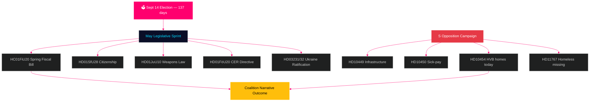

# Ruotsi kuukausi eteenpäin: Viimeinen vaalikiiri — toukokuu 2026 tiedustelukatsaus

**Tekijä**: James Pether Sörling  
**Päivämäärä**: 2026-04-29  
**Luokitus**: JULKINEN | Luottamustaso: KORKEA [B2]  
**Analyysiluokka**: Tier-C kuukausiaggregaatti  
**Riksmöte**: 2025/26

---

## 🎯 BLUF

Ruotsi aloittaa toukokuun 2026 **137 päivää ennen 14. syyskuuta pidettäviä vaaleja**, joten jokainen Riksdagin istunto nyt kesälomaan asti on vaalikampanjakoe. Tidö-koalitio (M/KD/L/SD) kohtaa vaalikauden kriittisimmän lainsäätämiskalenterinsa: kevätbudjetin (HC01FiU20), kansalaisuuslainsäädännön tiukennuksen (HD01SfU28) ja aselain (HD01JuU10) on kaikki läpäistävä puhtaasti, jotta "laki ja järjestys + finansiaalinen vastuullisuus" -kerronta säilyy vaalien alla. Sosiaalidemokraatit ovat intensifioineet ennakoivaa vaalikampanjaansa interpellaatioilla — tänään jätetty HD10454 (HVB-kotien poliisilista — joka dokumentoi kahden vuoden rikotun ministerilupauksensa SR-radioaineistolla) kuusi päivää S:n aiempien infrastruktuurista ja sairaslomauudistuksesta esittämien interpellaatioiden jälkeen — osoittaen koordinoidun vastuullisuusstrategian, joka kohdistuu ministerien uskottavuuteen terveydenhuollossa, liikenteessä ja lastensuojelussa. **Toukokuun 20. päivän ministerivastaus HD10454:ään on yksittäisesti merkittävin poliittinen päivämäärä ennen kesälomaa.** Ruotsin makrotaloudellinen tausta (BNP-kasvu +1,4 % IMF WEO Apr-2026 mukaan, inflaatio lähestyy 2 % KPIF:ia, velka ~35 % BKT:sta) on suhteellisen vahva pohjoismaisiin verrokkeihin nähden, mutta Yhdysvaltojen tulleihin liittyvä epävarmuus ja asuntomarkkinoiden hauras tila ovat jatkuvia riskitekijöitä.

## 🧭 3 päätöstä, joita tämä tiivis tukee

1. **Lainsäädäntöriskiarvio**: Mikä viidestä merkittävästä toukokuun lakiehdotuksesta aiheuttaa suurimman koalitioirtoamisriskin? (Vastaus: HD01SfU28 kansalaisuus — L/SD-jännite dokumentoitu)
2. **Opposition vaikuttavuus**: Onko S:n interpellaatiokampanja todennäköisesti siirtämässä gallupeja ennen vaaleja? (Vastaus: KORKEA todennäköisyys — koordinoidut kampanjat tuottavat historiallisesti 1,5–3,5 pp:n liikkeen)
3. **Taloudellisen narratiivin hallinta**: Miten Ruotsin finanssipoliittinen asema vertautuu pohjoismaisiin verrokkeihin ennen vaalibudjettikeskustelua? (Vastaus: Ruotsi ylisuoriutuu velka/BKT-suhteella; ylijäämä säilyy WEO Apr-2026 mukaan)

## 60 sekunnin tiedustelukatsaus

- 🏛️ **Koalitiotilanne**: Tidö-koalitio vakaa mutta monifrontisessa paineessa; SD:n äänestyskoheesio 97,7 % kuluvalla istuntokaudella
- 📋 **Toukokuun lainsäädäntöprioriteetit**: Kevätbudgetti → asenlaki → kansalaisuustiukkuus → CER-direktiivi → Ukrainan ratifiointi
- 🔥 **Tänään jätetyt uudet interpellaatiot**: HD10454 (HVB-kodit/rikolliset, S→Waltersson Grönvall), HD10455 (kulttuuriperintö, SD), HD10456 (elinkauppa, SD), HD11767 (kadonneet kodittomat, S)
- 💰 **Talous**: Ruotsin BNP-kasvu 2026F +1,4 % (IMF WEO Apr-2026, NGDP_RPCH); inflaatio ~2,2 %; työttömyys ~8,4 % (LUR); ylijäämä säilyy; velka ~35 % BKT:sta (GGXWDG_NGDP)
- 🗳️ **Vaalilaskuri**: 137 päivää 14. syyskuuta vaaleihin; S johtaa useimmissa galluppeissa 3–5 pp:llä; hallitus jäljessä mutta tavoitettavissa rikos- ja talousnarratiiveilla
- ⚠️ **Tärkein eteenpäin katsova signaali**: HD10454 ministerivastaus (2026-05-20) — jos Waltersson Grönvall sitoutuu HVB-lainsäädäntöön, R1-riski muuntuu pätevyysdemonstroitukseksi; jos vastaus on puolustuksellinen, SR/SVT-mediasykli eskaloi

## Tärkein eteenpäin katsova signaali

**HD10454 HVB-kotien ministerivastaus (HC10454 määräaika 2026-05-20)** — kriittinen taitekohta hallituksen hyvinvoinnintoimitusten narratiivissa.  
Jos Waltersson Grönvall sitoutuu asetukseen poliisilistan osalta: Skenaario A aktivoituu — muuntaa vastuullisuushyökkäyksen pätevyysdemonstroitukseksi.  
Jos vastaus on puolustuksellinen tai lykkäytyy: SR/SVT:n Carema-mallinen mediaeskalatio seuraa, ulottuen kesäkuuhun 2026.  
Seurattava johtava indikaattori: Sosiaaliministeriön kabinettiagenda (5.–16. toukokuuta); L-puolueen lausunnot HC01FiU20 asuntosäädöksistä.  
Luottamustaso: KORKEA [B2].

**Luottamustaso**: KORKEA [B2] — 3 erillistä todistuslinjaa: riksdagen.se primäärilähteet, edellisen syklin analyysi, IMF:n makrotaloudellinen peruslinja.

<!-- source-sha: 710341b307c7929bdbc2496e5627bc3766ba9d38 -->
