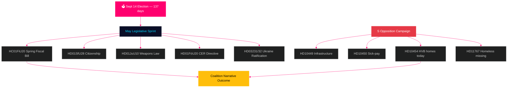

# Suède en avance : Sprint final pré-électoral — Bulletin mensuel mai 2026

**Auteur** : James Pether Sörling  
**Date** : 2026-04-29  
**Classification** : PUBLIC | Niveau de confiance : ÉLEVÉ [B2]  
**Type d'analyse** : Agrégation mensuelle Tier-C  
**Riksmöte** : 2025/26

---

## 🎯 BLUF

La Suède entre en mai 2026 avec **137 jours avant les élections parlementaires du 14 septembre**, faisant de chaque séance du Riksdag jusqu'à la pause estivale un test de campagne. La coalition Tidö (M/KD/L/SD) fait face à son calendrier législatif le plus critique du cycle électoral : la loi de finances de printemps (HC01FiU20), le durcissement de la législation sur la nationalité (HD01SfU28) et la loi sur les armes (HD01JuU10) doivent être adoptées proprement pour porter le récit « ordre public + responsabilité financière » dans la saison électorale. Les sociaux-démocrates ont intensifié leur campagne d'interpellations pré-électorale — en déposant aujourd'hui HD10454 (liste d'établissements HVB de la police — documentant une promesse ministérielle brisée sur deux ans avec des preuves radio SR), six jours après les précédentes interpellations de S sur l'infrastructure et la réforme des indemnités maladie — démontrant une stratégie de responsabilisation coordonnée ciblant la crédibilité ministérielle dans les domaines de la santé, des transports et de la protection de l'enfance. **Le 20 mai, date limite de réponse à HD10454, est la date politique la plus importante avant la pause estivale.** Le contexte macroéconomique suédois (croissance du PIB +1,4 % selon le FMI WEO avr-2026, inflation convergente à 2 % KPIF, dette ~35 % du PIB) est comparativement solide par rapport aux voisins nordiques, mais l'incertitude sur la politique tarifaire américaine et la fragilité du marché du logement restent des facteurs de risque persistants.

## 🧭 3 décisions que ce bulletin éclaire

1. **Évaluation des risques législatifs** : Lequel des cinq projets de loi majeurs de mai présente le risque le plus élevé d'effondrement de la coalition ? (Réponse : HD01SfU28 nationalité — tensions L/SD documentées)
2. **Efficacité de l'opposition** : La campagne d'interpellations de S est-elle susceptible de faire bouger les sondages avant l'élection ? (Réponse : PROBABILITÉ ÉLEVÉE — les campagnes coordonnées produisent historiquement un mouvement de 1,5–3,5 pp)
3. **Pilotage du récit économique** : Comment la position budgétaire de la Suède se compare-t-elle aux voisins nordiques avant le débat sur le budget électoral ? (Réponse : La Suède surperforme sur dette/PIB ; excédent budgétaire maintenu selon WEO avr-2026)

## Aperçu de l'actualité en 60 secondes

- 🏛️ **Statut de la coalition** : Coalition Tidö stable mais sous pression sur plusieurs fronts ; cohésion de vote SD à 97,7 % lors de la session en cours
- 📋 **Priorités législatives de mai** : Loi de finances de printemps → Loi sur les armes → Durcissement nationalité → Directive CER → Ratification Ukraine
- 🔥 **Nouvelles interpellations aujourd'hui** : HD10454 (établissements HVB/criminels, S→Waltersson Grönvall), HD10455 (patrimoine culturel, SD), HD10456 (trafic d'organes, SD), HD11767 (sans-abri disparus, S)
- 💰 **Économie** : Croissance PIB Suède 2026P +1,4 % (FMI WEO avr-2026, NGDP_RPCH) ; inflation ~2,2 % ; chômage ~8,4 % (LUR) ; excédent budgétaire maintenu ; dette ~35 % du PIB (GGXWDG_NGDP)
- 🗳️ **Compte à rebours électoral** : 137 jours avant l'élection du 14 septembre ; S en tête dans la plupart des sondages de 3–5 pp ; gouvernement en retard mais à portée sur les récits criminalité et économie
- ⚠️ **Signal avancé clé** : Réponse ministérielle à HD10454 (2026-05-20) — si Waltersson Grönvall s'engage sur la législation HVB, R1 devient démonstration de compétence ; si défensif, escalade du cycle médiatique SR/SVT

## Signal avancé principal

**Réponse ministérielle à l'établissement HVB HD10454 (délai HC10454 : 2026-05-20)** — le point d'inflexion critique pour le récit de prestation sociale du gouvernement.  
Si Waltersson Grönvall s'engage sur le règlement relatif à la liste policière : le scénario A s'active — convertit l'attaque en responsabilisation en démonstration de compétence.  
Si la réponse est défensive ou retardée : escalade médiatique SR/SVT selon le schéma Carema jusqu'en juin 2026.  
Indicateur avancé à surveiller : agenda du cabinet du ministère des Affaires sociales (5–16 mai) ; déclarations du parti L sur les dispositions logement de HC01FiU20.  
Niveau de confiance : ÉLEVÉ [B2].

**Niveau de confiance** : ÉLEVÉ [B2] — 3 lignes de preuve distinctes : sources primaires riksdagen.se, analyse du cycle précédent, données macroéconomiques FMI.

<!-- source-sha: 710341b307c7929bdbc2496e5627bc3766ba9d38 -->
