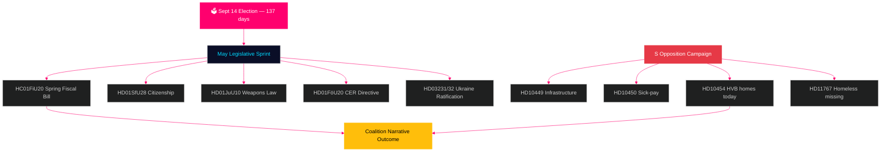

<!-- dir: rtl -->
# שוודיה מסתכלת קדימה: ספרינט הגמר לפני הבחירות — עלון חודשי מאי 2026

**מחבר**: ג'יימס פת'ר סורלינג  
**תאריך**: 2026-04-29  
**סיווג**: ציבורי | רמת ביטחון: גבוהה [B2]  
**סוג ניתוח**: צבירה חודשית Tier-C  
**ריקסמויטה**: 2025/26

---

## 🎯 BLUF

שוודיה נכנסת למאי 2026 עם **137 ימים לבחירות הפרלמנטריות ב-14 בספטמבר**, מה שהופך כל ישיבה בריקסדאג עד לפגרת הקיץ לבחינה קמפיינית. קואליציית טידו (M/KD/L/SD) ניצבת בפני לוח הזמנים החקיקתי הקריטי ביותר במחזור הבחירות: חוק התקציב האביבי (HC01FiU20), הידוק חקיקת האזרחות (HD01SfU28) וחוק הנשק (HD01JuU10) — כולם חייבים לעבור בצורה נקייה כדי לשאת את הנרטיב «שלטון חוק + אחריות פיסקלית» לעונת הבחירות. הסוציאל-דמוקרטים הגבירו את מסע הבחירות הקדם-בחירות שלהם — עם הגשת HD10454 היום (רשימת מתקני HVB של המשטרה — מתעדת הבטחה שבורה של שר מזה שנתיים עם ראיות רדיו SR), שישה ימים אחרי בקשות S הקודמות על תשתיות ורפורמת חופשת מחלה — ומפגינים אסטרטגיית אחריות מתואמת הכוונת את האמינות הממשלתית בתחומי הבריאות, התחבורה והגנת הילד. **20 במאי כמועד אחרון לתשובה ל-HD10454 הוא התאריך הפוליטי החשוב ביותר לפני פגרת הקיץ.** ההקשר המאקרו-כלכלי של שוודיה (צמיחת תוצר +1.4% לפי IMF WEO אפר-2026, אינפלציה מתכנסת ל-2% KPIF, חוב ~35% מהתוצר) חזק יחסית בהשוואה לשכנות הסקנדינביות, אולם אי-הוודאות לגבי מדיניות המכסים האמריקאית ורגישות שוק הדיור ממשיכות להוות גורמי סיכון.

## 🧭 שלוש החלטות שהעלון הזה מיידע

1. **הערכת סיכוני חקיקה**: איזה מחמשת הצעות החוק המרכזיות במאי טומן בחובו את הסיכון הגבוה ביותר לקריסת הקואליציה? (תשובה: HD01SfU28 אזרחות — מתחים L/SD מתועדים)
2. **יעילות האופוזיציה**: האם מסע הביקורת של S צפוי להזיז סקרים לפני הבחירות? (תשובה: סבירות גבוהה — מסעות מתואמים מייצרים היסטורית תנועה של 1.5–3.5 נקודות אחוז)
3. **שליטה בנרטיב הכלכלי**: כיצד מתייחסת עמדת התקציב של שוודיה לשכנותיה הסקנדינביות לפני ויכוח תקציב הבחירות? (תשובה: שוודיה עולה בחוב/תוצר; עודף תקציבי נשמר לפי WEO אפר-2026)

## סקירת חדשות ב-60 שניות

- 🏛️ **מצב הקואליציה**: קואליציית טידו יציבה אך תחת לחץ רב-חזיתי; לכידות הצבעה SD 97.7% בהפגישה הנוכחית
- 📋 **סדרי עדיפויות חקיקתיים במאי**: חוק תקציב אביב → חוק נשק → הידוק אזרחות → הנחיית CER → אישרור אוקראינה
- 🔥 **בקשות ביקורת חדשות היום**: HD10454 (מתקני HVB/פושעים, S→Waltersson Grönvall), HD10455 (מורשת תרבותית, SD), HD10456 (סחר באיברים, SD), HD11767 (חסרי בית נעדרים, S)
- 💰 **כלכלה**: צמיחת תוצר שוודיה 2026F +1.4% (IMF WEO אפר-2026, NGDP_RPCH); אינפלציה ~2.2%; אבטלה ~8.4% (LUR); עודף תקציבי נשמר; חוב ~35% תוצר (GGXWDG_NGDP)
- 🗳️ **ספירה לאחור לבחירות**: 137 ימים עד הבחירות ב-14 בספטמבר; S מוביל ברוב הסקרים ב-3–5 נ"א; ממשלה מפגרת אך בטווח בנרטיבי פשע וכלכלה
- ⚠️ **אות מוקדם מרכזי**: תגובה שרית ל-HD10454 (2026-05-20) — אם Waltersson Grönvall מתחייבת לחקיקת HVB, סיכון R1 הופך להפגנת כישורים; אם הגנתי, מחזור תקשורת SR/SVT מסלים

## האות המוקדם המרכזי

**תגובה שרית למתקן HVB HD10454 (מועד אחרון HC10454: 2026-05-20)** — נקודת המפנה הקריטית לנרטיב שירותי הרווחה של הממשלה.  
אם Waltersson Grönvall מתחייבת לתקנת רשימת משטרה: תרחיש A מופעל — ממיר התקפת אחריות להפגנת כישורים.  
אם התגובה הגנתית או מאוחרת: הסלמת מדיה SR/SVT על דפוס קארמה עד יוני 2026.  
מחוון מוקדם לעקוב אחריו: סדר יום קבינט משרד הרווחה (5–16 במאי); הצהרות מפלגת L על הוראות דיור ב-HC01FiU20.  
רמת ביטחון: גבוהה [B2].

**רמת ביטחון**: גבוהה [B2] — 3 קווי ראיות נפרדים: מקורות ראשוניים riksdagen.se, ניתוח מחזור קודם, נתוני IMF מאקרו-כלכליים.

<!-- source-sha: 710341b307c7929bdbc2496e5627bc3766ba9d38 -->
