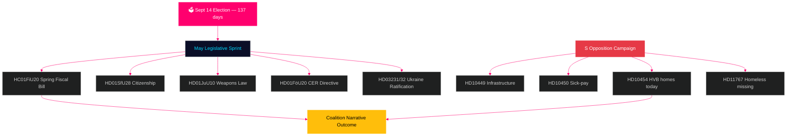

# スウェーデン展望：選挙直前の最終スプリント — 月次ブリーフィング 2026年5月

**著者**: ジェームズ・ペーター・ソーリング  
**日付**: 2026-04-29  
**分類**: 公開 | 信頼水準: 高 [B2]  
**分析タイプ**: Tier-C 月次集計  
**Riksmöte**: 2025/26

---

## 🎯 BLUF（要旨）

スウェーデンは**9月14日の議会選挙まで残り137日**という状況で2026年5月に突入し、夏季休会までの全リクスダーグ審議が選挙キャンペーンの試練となっている。ティドー連立政権（M/KD/L/SD）は選挙サイクル最大のヤマ場を迎えている：春季財政法案（HC01FiU20）、市民権法強化（HD01SfU28）、武器法（HD01JuU10）をすべて無事に可決し、「法と秩序＋財政責任」のナラティブを選挙シーズンに持ち込まなければならない。社会民主党は選挙前の質問攻勢を強化し、本日HD10454（警察のHVB施設リスト——SRラジオの証拠で2年間の大臣公約違反を文書化）を提出した。これはインフラと傷病手当改革に関するSの以前の質問提出から6日後のことであり、保健、交通、児童保護の分野での大臣信頼性を標的とした協調的な説明責任戦略を示している。**HD10454への回答期限である5月20日は、夏季休会前の最も重要な政治日程である。**スウェーデンのマクロ経済環境（IMF WEO 2026年4月版ではGDP成長率+1.4%、インフレはKPIF2%に収束、財政赤字~35%）は北欧諸国と比較して相対的に安定しているが、米国の関税政策を巡る不確実性と住宅市場の脆弱性は持続的なリスク要因として残っている。

## 🧭 このブリーフィングが支援する3つの意思決定

1. **立法リスク評価**: 5月の5大法案のうち、連立崩壊リスクが最も高いのはどれか？（回答: HD01SfU28市民権法——L/SDの緊張が文書化済み）
2. **野党の有効性**: SによるHD10454の質問キャンペーンは選挙前に世論調査を動かす可能性があるか？（回答: 確率高——協調キャンペーンは歴史的に1.5〜3.5ポイントの変動をもたらす）
3. **経済的ナラティブのコントロール**: 選挙予算論争前のスウェーデンの財政状況は北欧諸国と比較してどうか？（回答: 債務/GDPで優位；WEO 2026年4月版では財政黒字を維持）

## 60秒ニュース概要

- 🏛️ **連立の状況**: ティドー連立は安定しているが複数戦線で圧力下；SDの投票結束率は現会期中97.7%
- 📋 **5月の立法優先事項**: 春季財政法案 → 武器法 → 市民権強化 → CER指令 → ウクライナ批准
- 🔥 **本日の新規質問**: HD10454（HVB施設/犯罪者、S→Waltersson Grönvall）、HD10455（文化遺産、SD）、HD10456（臓器売買、SD）、HD11767（ホームレス行方不明者、S）
- 💰 **経済**: スウェーデンGDP成長率2026F +1.4%（IMF WEO 2026年4月版、NGDP_RPCH）；インフレ ~2.2%；失業率 ~8.4%（LUR）；財政黒字維持；債務 ~35%（GGXWDG_NGDP）
- 🗳️ **選挙カウントダウン**: 9月14日の選挙まで137日；Sは大半の世論調査で3〜5ポイントリード；政府は犯罪・経済ナラティブで追撃圏内
- ⚠️ **主要先行シグナル**: HD10454大臣回答（2026-05-20）——Waltersson GrönvallがHVB立法を約束すればR1リスクが能力実証に転化；防衛的な回答ならSR/SVTメディアサイクルが激化

## 主要先行シグナル

**HVB施設大臣回答 HD10454（HC10454期限 2026-05-20）** — 政府の社会給付ナラティブの決定的な転換点。  
Waltersson Grönvallが警察リスト規制を約束した場合：シナリオAが発動——説明責任攻撃を能力実証に転化。  
回答が防衛的または遅延した場合：SR/SVTカレーマパターンのメディア激化が2026年6月まで続く。  
追うべき先行指標：社会省内閣アジェンダ（5月5〜16日）；HC01FiU20の住宅規定に関するL党声明。  
信頼水準: 高 [B2]。

**信頼水準**: 高 [B2] — 3つの独立した証拠ライン：riksdagen.se一次資料、前サイクル分析、IMFマクロ経済データ。

<!-- source-sha: 710341b307c7929bdbc2496e5627bc3766ba9d38 -->
