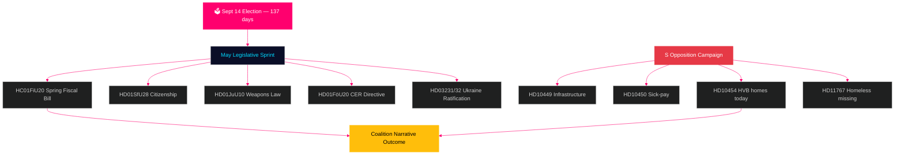

# 스웨덴 전망: 선거 전 최종 스프린트 — 월간 브리핑 2026년 5월

**저자**: 제임스 페테르 소를링  
**날짜**: 2026-04-29  
**분류**: 공개 | 신뢰 수준: 높음 [B2]  
**분석 유형**: Tier-C 월간 집계  
**Riksmöte**: 2025/26

---

## 🎯 BLUF(핵심 요약)

스웨덴은 **9월 14일 의회 선거까지 137일**이 남은 2026년 5월에 돌입했으며, 여름 휴회까지의 모든 릭스다그 회의가 선거 캠페인 시험대가 되고 있다. 티도 연립정부(M/KD/L/SD)는 선거 주기에서 가장 중요한 입법 일정을 맞이하고 있다: 봄철 재정법안(HC01FiU20), 시민권법 강화(HD01SfU28), 무기법(HD01JuU10)이 모두 깔끔하게 통과되어 '법과 질서 + 재정 책임' 서사를 선거 시즌으로 이어가야 한다. 사회민주당은 사전 선거 질문 캠페인을 강화했다 — 오늘 HD10454(경찰 HVB 시설 목록 — SR 라디오 증거로 2년된 장관 공약 위반을 문서화)를 제출하며, 6일 전 인프라와 병가급여 개혁에 관한 S의 이전 질문들에 이어 — 보건, 교통, 아동 보호 분야에서 장관 신뢰성을 겨냥한 조율된 책임 전략을 보여주고 있다. **HD10454 답변 기한인 5월 20일은 여름 휴회 전 가장 중요한 정치 일정이다.** 스웨덴의 거시경제 환경(IMF WEO 2026년 4월판 GDP 성장률 +1.4%, 인플레이션 KPIF 2% 수렴, 채무 ~GDP의 35%)은 북유럽 이웃 국가들에 비해 상대적으로 탄탄하지만, 미국 관세 정책 불확실성과 주택 시장 취약성은 지속적인 위험 요인으로 남아 있다.

## 🧭 이 브리핑이 지원하는 3가지 의사결정

1. **입법 리스크 평가**: 5월의 다섯 가지 주요 법안 중 연립 붕괴 위험이 가장 높은 것은? (답변: HD01SfU28 시민권법 — L/SD 긴장 문서화됨)
2. **야당 효과성**: S의 질문 캠페인이 선거 전 여론조사를 움직일 가능성은? (답변: 높은 확률 — 조율된 캠페인은 역사적으로 1.5~3.5포인트 움직임 발생)
3. **경제 서사 제어**: 선거 예산 토론 전 스웨덴의 재정 상황은 북유럽 이웃 국가들과 비교해 어떠한가? (답변: 채무/GDP에서 우위; WEO 2026년 4월판 기준 재정 흑자 유지)

## 60초 뉴스 개요

- 🏛️ **연립 현황**: 티도 연립정부 안정적이나 다중 전선에서 압박; SD 투표 결집도 현 회기 97.7%
- 📋 **5월 입법 우선순위**: 봄철 재정법안 → 무기법 → 시민권 강화 → CER 지침 → 우크라이나 비준
- 🔥 **오늘 새 질문**: HD10454(HVB 시설/범죄자, S→Waltersson Grönvall), HD10455(문화유산, SD), HD10456(장기 매매, SD), HD11767(노숙자 실종자, S)
- 💰 **경제**: 스웨덴 GDP 성장률 2026F +1.4%(IMF WEO 2026년 4월판, NGDP_RPCH); 인플레이션 ~2.2%; 실업률 ~8.4%(LUR); 재정 흑자 유지; 채무 ~GDP의 35%(GGXWDG_NGDP)
- 🗳️ **선거 카운트다운**: 9월 14일 선거까지 137일; S가 대부분의 여론조사에서 3~5포인트 앞서; 정부는 범죄·경제 서사에서 추격 가능 범위 내
- ⚠️ **핵심 선행 신호**: HD10454 장관 답변(2026-05-20) — Waltersson Grönvall이 HVB 입법 공약 시 R1 위험이 역량 시범으로 전환; 방어적 답변 시 SR/SVT 미디어 사이클 격화

## 주요 선행 신호

**HVB 시설 장관 답변 HD10454(HC10454 기한 2026-05-20)** — 정부 사회 서비스 서사의 결정적 전환점.  
Waltersson Grönvall이 경찰 목록 규정 약속 시: 시나리오 A 발동 — 책임 공격을 역량 시범으로 전환.  
답변이 방어적이거나 지연될 경우: SR/SVT 카레마 패턴 미디어 격화가 2026년 6월까지 지속.  
추적할 선행 지표: 사회부 내각 의제(5월 5~16일); HC01FiU20 주택 조항에 관한 L당 성명.  
신뢰 수준: 높음 [B2].

**신뢰 수준**: 높음 [B2] — 3개의 독립적인 증거 라인: riksdagen.se 1차 자료, 이전 주기 분석, IMF 거시경제 데이터.

<!-- source-sha: 710341b307c7929bdbc2496e5627bc3766ba9d38 -->
