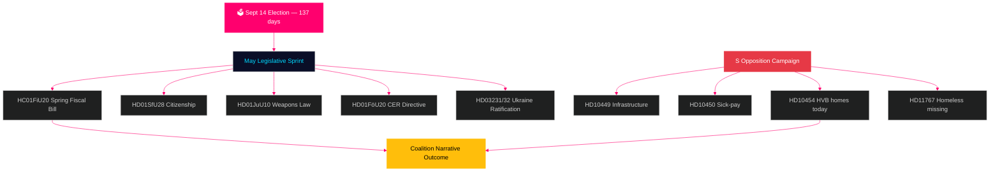

# Zweden vooruit: Finale pre-verkiezingssprint — Maandbulletin mei 2026

**Auteur**: James Pether Sörling  
**Datum**: 2026-04-29  
**Classificatie**: OPENBAAR | Betrouwbaarheidsniveau: HOOG [B2]  
**Analysetype**: Tier-C maandaggregatie  
**Riksmöte**: 2025/26

---

## 🎯 BLUF

Zweden treedt mei 2026 in met **137 dagen tot de parlementsverkiezingen op 14 september**, waardoor elke Riksdag-vergadering tot aan het zomerreces een campagnetest wordt. De Tidö-coalitie (M/KD/L/SD) staat voor haar meest kritische wetgevingskalender van de verkiezingscyclus: de lente-begrotingswet (HC01FiU20), de aanscherping van de nationaliteitswetgeving (HD01SfU28) en de wapenwet (HD01JuU10) moeten allemaal vlot worden aangenomen om het verhaal «openbare orde + fiscale verantwoordelijkheid» de verkiezingsperiode in te dragen. De sociaaldemocraten hebben hun pre-electorale interpellatiecampagne geïntensiveerd — met de indiening vandaag van HD10454 (politielijst HVB-instellingen — documenteert een twee jaar oud gebroken ministerbelofte met SR-radiobewijzen), zes dagen na S' eerdere interpellaties over infrastructuur en ziekengeldhervorming — en daarmee een gecoördineerde verantwoordingsstrategie gedemonstreerd gericht op ministeriële geloofwaardigheid op het gebied van gezondheid, transport en kinderbescherming. **20 mei als antwoorddeadline voor HD10454 is de meest significante politieke datum vóór het zomerreces.** De macro-economische context van Zweden (bbp-groei +1,4% volgens IMF WEO apr-2026, inflatie convergeert naar 2% KPIF, schuld ~35% van het bbp) is comparatief sterk ten opzichte van de Scandinavische buren, maar onzekerheid over het Amerikaanse tarievenbeleid en de kwetsbaarheid van de woningmarkt blijven aanhoudende risicofactoren.

## 🧭 3 beslissingen die dit bulletin informeert

1. **Wetgevingsrisicobeoordeling**: Welk van de vijf grote meiwetsvoorstellen heeft het hoogste risico op coalitiebreuk? (Antwoord: HD01SfU28 nationaliteit — L/SD-spanningen gedocumenteerd)
2. **Effectiviteit van de oppositie**: Is het waarschijnlijk dat S' interpellatiecampagne de peilingen voor de verkiezingen verschuift? (Antwoord: GROTE KANS — gecoördineerde campagnes produceren historisch gezien 1,5–3,5 pp beweging)
3. **Economisch narratief sturen**: Hoe verhoudt de begrotingspositie van Zweden zich tot die van de Scandinavische buren voor het verkiezingsbudgetdebat? (Antwoord: Zweden overtreft op schuld/bbp; begrotingsoverschot gehandhaafd volgens WEO apr-2026)

## Nieuwsoverzicht in 60 seconden

- 🏛️ **Coalitiestatuts**: Tidö-coalitie stabiel maar onder druk op meerdere fronten; SD-stemcohesie 97,7% in de lopende sessie
- 📋 **Wetgevingsprioriteiten mei**: Lente-begrotingswet → Wapenwet → Nationaliteitsverscherping → CER-richtlijn → Oekraïne-ratificatie
- 🔥 **Nieuwe interpellaties vandaag**: HD10454 (HVB-instellingen/criminelen, S→Waltersson Grönvall), HD10455 (cultureel erfgoed, SD), HD10456 (orgaanhandel, SD), HD11767 (dakloze vermisten, S)
- 💰 **Economie**: Zweden bbp-groei 2026V +1,4% (IMF WEO apr-2026, NGDP_RPCH); inflatie ~2,2%; werkloosheid ~8,4% (LUR); begrotingsoverschot gehandhaafd; schuld ~35% van bbp (GGXWDG_NGDP)
- 🗳️ **Verkiezingsaftelling**: 137 dagen tot verkiezingen 14 september; S leidt in de meeste peilingen met 3–5 pp; regering achter maar in bereik op criminaliteits- en economienarratief
- ⚠️ **Kernsignaal vooruit**: Ministerieel antwoord op HD10454 (2026-05-20) — als Waltersson Grönvall HVB-wetgeving toezegt, wordt R1-risico competentiedemonstratie; als defensief, escaleert SR/SVT-mediacyclus

## Voornaamste vooruitsignaal

**HD10454 HVB-instelling ministerieel antwoord (HC10454 deadline 2026-05-20)** — het kritieke kantelpunt voor het sociale-voorzieningsnarratief van de regering.  
Als Waltersson Grönvall verordening politielijst toezegt: Scenario A activeert — converteert verantwoordingsaanval naar competentiedemonstratie.  
Als het antwoord defensief of vertraagd is: SR/SVT Carema-patroon media-escalatie volgt tot juni 2026.  
Te volgen vroegtijdig indicatoor: Kabinetsagenda Ministerie van Sociale Zaken (5–16 mei); L-partiijverklaringen over woningbepalingen HC01FiU20.  
Betrouwbaarheidsniveau: HOOG [B2].

**Betrouwbaarheidsniveau**: HOOG [B2] — 3 afzonderlijke bewijslijnen: primaire bronnen riksdagen.se, analyse vorige cyclus, IMF macro-economische gegevens.

<!-- source-sha: 710341b307c7929bdbc2496e5627bc3766ba9d38 -->
