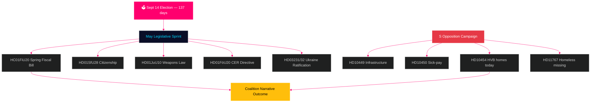

# Sverige måneden fremover: Siste valgspurt — mai 2026 etterretningsbrief

**Forfatter**: James Pether Sörling  
**Dato**: 2026-04-29  
**Klassifisering**: OFFENTLIG | Konfidens: HØY [B2]  
**Analysetype**: Tier-C månedlig aggregering  
**Riksmöte**: 2025/26

---

## 🎯 BLUF

Sverige går inn i mai 2026 med **137 dager til stortingsvalget 14. september**, noe som gjør hver Riksdag-sesjon fra nå til sommerferien til en valgkamprøve. Tidö-koalisjonen (M/KD/L/SD) møter sin mest kritiske lovgivningskalender i valgperioden: vårbudsjettet (HC01FiU20), stramning av statsborgerlovgivning (HD01SfU28) og våpenloven (HD01JuU10) må alle vedtas rent for å opprettholde "lov og orden + finansielt ansvar"-fortellingen inn i valgsesongen. Sosialdemokratene har intensivert sin forvalgskampanje med interpellasjoner — med dagens innlevering av HD10454 (HVB-hjem politiliste — som dokumenterer et to-årig brutt ministerielt løfte med SR-radiobevis) seks dager etter S's tidligere interpellasjoner om infrastruktur og sykelønnsreform — og demonstrerer dermed en koordinert ansvarlighetsstrategi rettet mot ministerienes troverdighet innen helse, transport og barnebeskyttelse. **Ministersvaret 20. mai for HD10454 er den eneste viktigste politiske datoen før sommerferien.** Sveriges makroøkonomiske bakteppe (BNP-vekst +1,4 % ifølge IMF WEO Apr-2026, inflasjon konvergerer mot 2 % KPIF, gjeld ~35 % av BNP) er relativt sterkt sammenlignet med nordiske jevnaldrende, men usikkerhet rundt amerikanske tolltariffer og boligmarkedets skjørhet utgjør vedvarende risikofaktorer.

## 🧭 3 beslutninger dette notatet støtter

1. **Lovgivningsrisikovurdering**: Hvilken av de fem store mailovene innebærer høyest risiko for koalisjonsavhopp? (Svar: HD01SfU28 statsborgerskap — L/SD-spenning dokumentert)
2. **Opposisjonens effektivitet**: Er S' interpellasjonskampanje sannsynlig til å flytte meningsmålingene før valget? (Svar: HØY sannsynlighet — koordinerte kampanjer produserer historisk 1,5–3,5 pp bevegelse)
3. **Styring av det økonomiske narrativet**: Hvordan er Sveriges finanspolitiske stilling sammenlignet med nordiske jevnaldrende foran valgets budsjettdebatt? (Svar: Sverige overpresterer på gjeld/BNP; finanspolitisk overskudd opprettholdt ifølge WEO Apr-2026)

## 60-sekunders etterretningsoversikt

- 🏛️ **Koalisjonsstatus**: Tidö-koalisjonen stabil men under press på flere fronter; SD's stemmekohesjonen på 97,7 % i inneværende sesjon
- 📋 **Mailovgivningsprioriteter**: Vårbudsjett → våpenlov → statsborgerskapsstramning → CER-direktivet → Ukraina-ratifisering
- 🔥 **Dagens nye interpellasjoner**: HD10454 (HVB-hjem/kriminelle, S→Waltersson Grönvall), HD10455 (kulturarv, SD), HD10456 (organhandel, SD), HD11767 (hjemløse savnede, S)
- 💰 **Økonomi**: Sveriges BNP-vekst 2026F +1,4 % (IMF WEO Apr-2026, NGDP_RPCH); inflasjon ~2,2 %; arbeidsledighet ~8,4 % (LUR); finanspolitisk overskudd opprettholdt; gjeld ~35 % av BNP (GGXWDG_NGDP)
- 🗳️ **Valnedtelling**: 137 dager til valg 14. september; S leder i de fleste meningsmålinger med 3–5 pp; regjering bak men innen rekkevidde på kriminalitets- og økonomifortellingene
- ⚠️ **Viktigste fremadrettede signal**: HD10454 ministerielt svar (2026-05-20) — hvis Waltersson Grönvall forplikter seg til HVB-lovgivning, konverteres R1-risiko til kompetansedemonstrasjon; hvis svaret er defensivt, eskalerer SR/SVT-mediesyklus

## Viktigste fremadrettede signal

**HD10454 HVB-hjem ministerielt svar (HC10454 svarsfrist 2026-05-20)** — det kritiske vendepunktet for regjeringens velferdsleverings-fortelling.  
Hvis Waltersson Grönvall forplikter seg til forskrift om politilisten: Scenario A aktiveres — konverterer ansvarlighedsangrep til kompetansedemonstrasjon.  
Hvis svaret er defensivt eller utsettes: SR/SVT Carema-mønstrets medieeskalering følger og strekker seg inn i juni 2026.  
Ledende indikator å følge: Sosialdepartementets kabinettsagenda (5.–16. mai); L-partiets uttalelser om HC01FiU20 boligbestemmelser.  
Konfidens: HØY [B2].

**Konfidens**: HØY [B2] — 3 distinkte bevislinjer: riksdagen.se primærkilder, analyse fra forrige syklus, IMF makroøkonomisk basislinje.

<!-- source-sha: 710341b307c7929bdbc2496e5627bc3766ba9d38 -->
