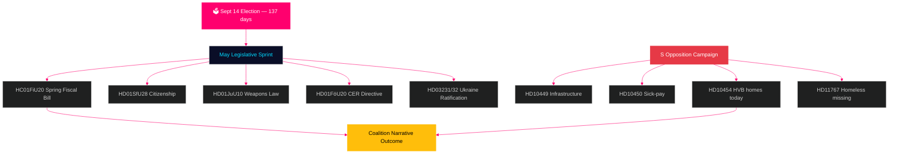

# Sverige månaden framåt: Slutspurt inför valet — underrättelsebrief för maj 2026

**Författare**: James Pether Sörling  
**Datum**: 2026-04-29  
**Klassificering**: OFFENTLIG | Konfidensgrad: HÖG [B2]  
**Analystyp**: Tier-C månadsaggregering  
**Riksmöte**: 2025/26

---

## 🎯 BLUF

Sverige inleder maj 2026 med **137 dagar kvar till riksdagsvalet den 14 september**, vilket gör varje riksdagssession från nu till sommaruppehållet till en valrörelseprövning. Tidökoalitionen (M/KD/L/SD) möter sin mest kritiska lagstiftningskalender under mandatperioden: vårbudgeten (HC01FiU20), skärpning av medborgarskapslagstiftning (HD01SfU28) och vapenlagen (HD01JuU10) måste samtliga passera rent för att upprätthålla berättelsen om "lag och ordning + finansiell ansvarstagande" inför valet. Socialdemokraterna har intensifierat sin förvalsinterpellationskampanj — med dagens inlämning av HD10454 (polislistan om HVB-hem — som dokumenterar ett brutet ministerlefte med SR-radiobevis), sex dagar efter S:s tidigare interpellationer om infrastruktur och sjuklönesreform — och visar därmed en samordnad ansvarighetsstrategi som riktar sig mot ministerias trovärdighet inom hälsa, transport och barnsskyd. **Svarstiden den 20 maj för HD10454 är det enskilt viktigaste politiska datumet inför sommaruppehållet.** Makroekonomin (BNP-tillväxt +1,4 % enligt IMF WEO Apr-2026, inflation konvergerar mot 2 % KPIF, skuld ~35 % av BNP) är relativt stark jämfört med de nordiska grannländerna, men osäkerhet kring amerikanska tullar och skörhet på bostadsmarknaden utgör bestående riskfaktorer.

## 🧭 3 Beslut detta underlag stöder

1. **Lagstiftningsriskbedömning**: Vilket av de fem stora lagförslagen i maj innebär störst risk för koalitionsavhopp? (Svar: HD01SfU28 medborgarskap — L/SD-spänning dokumenterad)
2. **Oppositionens effektivitet**: Kan S:s interpellationskampanj flytta opinionen inför valet? (Svar: HÖG sannolikhet — samordnade kampanjer genererar historiskt 1,5–3,5 procentenheters rörelse)
3. **Hantering av det ekonomiska narrativet**: Hur jämförs Sveriges finanspolitiska ställning med nordiska jämförelsekandidater inför valbudgetdebatten? (Svar: Sverige överpresterar på skuld/BNP; budgetöverskott upprätthålls enligt WEO Apr-2026)

## 60-sekunders underrättelseöversikt

- 🏛️ **Koalitionsstatus**: Tidökoalitionen stabil men under tryck på flera fronter; SD:s röstkohesion på 97,7 % under innevarande riksmöte
- 📋 **Majmånadens lagstiftningsprioriteringar**: Vårbudget → vapenlag → medborgarskapsskärpning → CER-direktivet → Ukrainaratificeringen
- 🔥 **Dagens nya interpellationer**: HD10454 (HVB-hem/kriminella, S→Waltersson Grönvall), HD10455 (kulturarv, SD), HD10456 (organhandel, SD), HD11767 (hemlösa försvunna, S)
- 💰 **Ekonomi**: Sveriges BNP-tillväxt 2026F +1,4 % (IMF WEO Apr-2026, NGDP_RPCH); inflation ~2,2 %; arbetslöshet ~8,4 % (LUR); budgetöverskott upprätthålls; skuld ~35 % av BNP (GGXWDG_NGDP)
- 🗳️ **Valnedräkning**: 137 dagar till valet den 14 september; S leder i de flesta opinionsundersökningar med 3–5 procentenheter; regeringen ligger efter men kan hämta in på brotts- och ekonominarrativen
- ⚠️ **Viktigaste framåtblickande signal**: HD10454 ministeriankt svar (2026-05-20) — om Waltersson Grönvall förbinder sig till HVB-lagstiftning konverteras R1-risk till kompetensdemonstration; om svaret är defensivt eskalerar SR/SVT:s mediecykel

## Viktigaste framåtblickande signal

**HD10454 HVB-hems ministeriellt svar (HC10454 svarsfrist 2026-05-20)** — den kritiska inflektionspunkten för regeringens välfärdsleveransberättelse.  
Om Waltersson Grönvall förbinder sig till förordning om polislistan: Scenario A aktiveras — omvandlar ansvarsskyldighetsattack till kompetensdemonstration.  
Om svaret är defensivt eller uppskjutet: SR/SVT Carema-mönstrets medieeskalering följer, sträcker sig in i juni 2026.  
Ledande indikator att bevaka: Socialdepartementets kabinettsagenda (5–16 maj); L-partiets uttalanden om HC01FiU20 bostadsbestämmelser.  
Konfidensgrad: HÖG [B2].

**Konfidensgrad**: HÖG [B2] — 3 distinkta bevislinjer: riksdagen.se primärkällor, analyser från föregående cykel, makroekonomisk IMF-baslinje.

<!-- source-sha: 710341b307c7929bdbc2496e5627bc3766ba9d38 -->
