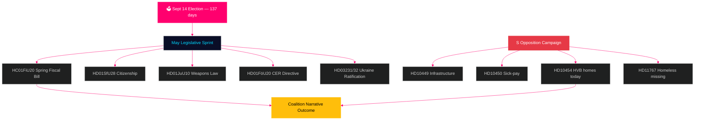

# 瑞典展望：大选前最后冲刺 — 月度简报 2026年5月

**作者**: 詹姆斯·佩特尔·索林  
**日期**: 2026-04-29  
**分类**: 公开 | 可信度：高 [B2]  
**分析类型**: Tier-C 月度汇总  
**Riksmöte**: 2025/26

---

## 🎯 BLUF（核心摘要）

瑞典以**距9月14日议会选举还有137天**的状态进入2026年5月，使得每一次里克斯达格会议直至夏季休会都成为竞选考验。蒂德联合政府（M/KD/L/SD）面临选举周期中最关键的立法日历：春季财政法案（HC01FiU20）、公民身份立法收紧（HD01SfU28）和武器法（HD01JuU10）都必须顺利通过，以将"法律秩序+财政责任"叙事带入选举季。社会民主党强化了选前质询攻势——今日提交HD10454（警察HVB设施名单——附SR广播证据记录两年未兑现的部长承诺），距S此前就基础设施和病假金改革提交质询仅6天——展示了针对卫生、交通和儿童保护领域部长公信力的协调问责战略。**HD10454的5月20日答复截止日是夏季休会前最重要的政治日期。** 瑞典的宏观经济背景（IMF WEO 2026年4月版GDP增长率+1.4%，通胀收敛至2% KPIF，债务约占GDP的35%）与北欧邻国相比相对稳健，但美国关税政策不确定性和住房市场脆弱性仍是持续风险因素。

## 🧭 本简报所服务的三项决策

1. **立法风险评估**：5月五项重要法案中，联合政府瓦解风险最高的是哪一项？（答案：HD01SfU28公民身份——L/SD紧张关系有据可查）
2. **反对党效力**：S的质询攻势是否可能在选前撼动民调？（答案：可能性较高——协调性攻势历史上产生1.5~3.5个百分点的波动）
3. **经济叙事管控**：选举预算辩论前，瑞典财政立场与北欧邻国相比如何？（答案：瑞典在债务/GDP方面领先；WEO 2026年4月版显示维持财政盈余）

## 60秒新闻速览

- 🏛️ **联合政府现状**：蒂德联合政府稳定，但面临多条战线压力；SD本届会期投票凝聚度97.7%
- 📋 **5月立法优先事项**：春季财政法案 → 武器法 → 公民身份收紧 → CER指令 → 乌克兰批准
- 🔥 **今日新质询**：HD10454（HVB设施/犯罪分子，S→Waltersson Grönvall）、HD10455（文化遗产，SD）、HD10456（器官贩卖，SD）、HD11767（无家可归失踪者，S）
- 💰 **经济**：瑞典GDP增长率2026F +1.4%（IMF WEO 2026年4月版，NGDP_RPCH）；通胀~2.2%；失业率~8.4%（LUR）；维持财政盈余；债务~GDP的35%（GGXWDG_NGDP）
- 🗳️ **选举倒计时**：距9月14日选举还有137天；S在大多数民调中领先3~5个百分点；政府在犯罪和经济叙事上仍在追赶范围内
- ⚠️ **关键前瞻信号**：HD10454部长答复（2026-05-20）——若Waltersson Grönvall承诺HVB立法，R1风险转化为能力展示；若为防御性答复，SR/SVT媒体循环升级

## 核心前瞻信号

**HVB设施部长答复HD10454（HC10454截止日：2026-05-20）**——政府社会服务叙事的关键转折点。  
若Waltersson Grönvall承诺警察名单法规：方案A启动——将问责攻击转化为能力展示。  
若答复为防御性或延迟：SR/SVT卡雷马模式媒体升级至2026年6月。  
须追踪的领先指标：社会部内阁议程（5月5~16日）；L党就HC01FiU20住房条款的声明。  
可信度：高 [B2]。

**可信度**：高 [B2] — 3条独立证据线：riksdagen.se一手资料、前一周期分析、IMF宏观经济数据。

<!-- source-sha: 710341b307c7929bdbc2496e5627bc3766ba9d38 -->
