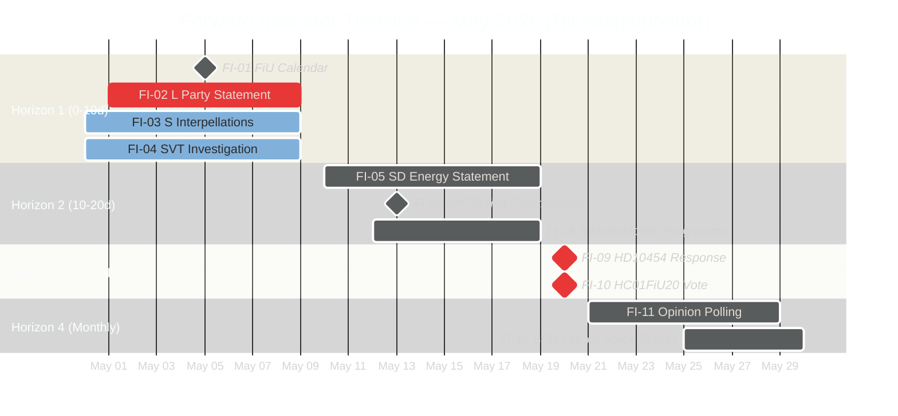

# Forward Indicators — May 2026 Month Ahead

**Author**: James Pether Sörling  
**Date**: 2026-04-29  
**Framework**: Horizon-Dated Indicators, Decision Trigger Matrix

## Horizon 1: Immediate (0–10 days, by 2026-05-09)

| # | Indicator | Institution | Signal | Direction |
|---|-----------|------------|--------|-----------|
| FI-01 | FiU committee agenda includes HC01FiU20 vote scheduling | riksdagen.se/kalendarium | Confirms timeline; watch for delay | Neutral→Watch |
| FI-02 | L party press statement on HC01FiU20 position | L party website / riksdagen.se | If L signals support → Scenario A; if ambiguous → Scenario B | Critical |
| FI-03 | New S interpellations filed (beyond HD10454/11767) | riksdagen.se/dokument | >2 new filings = escalation campaign confirmed | Negative |
| FI-04 | SVT Uppdrag granskning announces HVB investigation | SVT press | Confirms media escalation to national Tier-1 | Negative |

## Horizon 2: Near-term (10–20 days, by 2026-05-19)

| # | Indicator | Institution | Signal | Direction |
|---|-----------|------------|--------|-----------|
| FI-05 | SD party council statement on energy policy | riksdagen.se/dokument | SD energy resolution filed = coalition friction | Negative |
| FI-06 | IMF Spring Meetings final communiqué (expected May 2026) | imf.org | Growth downgrade for SWE = headwind | Negative |
| FI-07 | Police Authority public statement on police list status | Polisen.se | Statement confirming no progress = R1 amplification | Negative |
| FI-08 | Riksrevisionen annual programme announcement | riksrevisionen.se | If HVB homes named as 2026 audit topic = major risk | Very Negative |

## Horizon 3: Critical window (Day 20, 2026-05-20)

| # | Indicator | Institution | Signal | Direction |
|---|-----------|------------|--------|-----------|
| FI-09 | Ministerial response to HD10454 by Waltersson Grönvall | riksdagen.se (document registration) | If includes legislative/regulatory commitment → Scenario A; if defensive → Scenario B | Decisive |
| FI-10 | HC01FiU20 FiU committee vote result | riksdagen.se | Pass with full Tidö+L = Scenario A; amended or delayed = Scenario B/C | Decisive |

## Horizon 4: Monthly (21–30 days, by 2026-05-29)

| # | Indicator | Institution | Signal | Direction |
|---|-----------|------------|--------|-----------|
| FI-11 | Opinion polling release (major institutes: Sifo, Demoskop) | Public media | S +3pp vs prior month = Scenario B confirmed; stable = Scenario A | Electoral |
| FI-12 | SCB Labour Force Survey April 2026 release | scb.se (expected late May) | Unemployment above 8.5% = economic headwind narrative | Economic |

## Decision Trigger Summary

