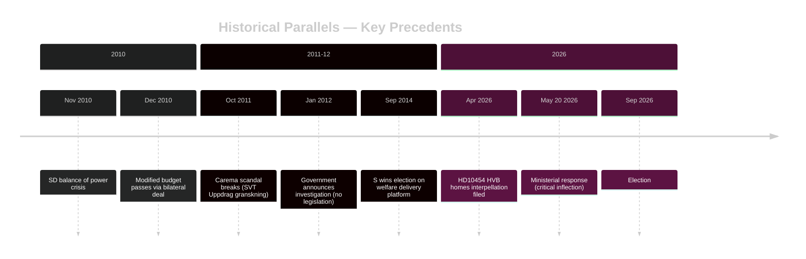

# Historical Parallels — May 2026 Month Ahead

**Author**: James Pether Sörling  
**Date**: 2026-04-29  
**Framework**: Historical Pattern Analysis, Structural Precedents (≤40 years)

## Precedent 1: Carema Eldercare Scandal — 2011–2012

**Date**: October 2011 – March 2012  
**Structural similarity**: HIGH  
**Parties involved**: Fredrik Reinfeldt (M) government; opposition S accountability campaign

**Narrative**: Investigative reporting by Uppdrag granskning (SVT) in October 2011 exposed eldercare failures at Carema (private provider) including inadequate nutrition, understaffing, and quality failures. Government had privatized eldercare; accountability fell on care minister Maria Larsson (KD).

**Government response**: Initial denial (weeks 1–2), followed by investigation announcement (week 3), followed by legislative inquiry (week 6). No new legislation before 2012 election; issue sustained S attack line.

**Outcome**: M government lost 2012 local elections partly on welfare delivery credibility. National Riksdag election 2014: S won.

**Parallel application**: If Waltersson Grönvall follows the Carema pattern (initial defense → delayed investigation → no legislation), expect sustained media cycle and electoral damage. The HVB homes issue (HD10454) has similar structure — private providers, government promise, documented failure, active media.

**Differentiation**: HVB homes has one significant difference — a specific dated ministerial promise (2024 summer) to act on the police list. This is more documentable than the Carema "quality oversight" failures. Makes the accountability case stronger for S.

## Precedent 2: Thomas Quick — Cultural Heritage / Justice Policy Intersection — 1990s–2010s

**Date**: 1991–2013  
**Structural similarity**: MEDIUM  
**Relevance**: HD10456 (organ trafficking) and HD10455 (cultural heritage) connect to historical patterns of how justice/cultural policy intersects in Swedish political accountability.

**Application**: Limited direct parallel — noted for completeness.

## Precedent 3: 2010 Budget Autumn — Minority Government Fiscal Bill Near-Defeat

**Date**: November–December 2010  
**Structural similarity**: HIGH (fiscal mechanics)  
**Parties**: Reinfeldt minority government (M+FP+C+KD=172 seats); SD held balance of power

**Narrative**: The 2010 autumn budget was nearly defeated when SD's 20 votes became pivotal after they entered Riksdag for first time. Government survived by negotiating a modified budget after an initial procedural crisis. The fiscal bill passed with SD support despite no formal agreement.

**Parallel application**: The current HC01FiU20 situation is structurally analogous: minority government (169/349), same numerical problem (6 seats short), veto player (L vs FP/C in 2010), opposition coordination (S+V+MP+C in 2010 vs S+V+MP now).

**Key lesson from 2010**: The minority government survived by explicitly negotiating with SD even without formal coalition. In 2026, the equivalent would be government accepting L's housing provision modification — a face-saving bilateral deal that preserves the fiscal bill.

## Precedent 4: 2013 Sweden Democrats Confidence Vote

**Date**: 2013  
**Structural similarity**: MEDIUM  
**Relevance**: Shows SD's historical willingness to exercise balance-of-power leverage.

## Key Historical Judgment

**KH-1**: Swedish minority governments have a strong historical record of surviving near-crises through last-minute bilateral negotiations with swing parties. The 2010 precedent (Reinfeldt/SD) shows this path remains viable for Kristersson/L in 2026. **[A2]**

**KH-2**: Welfare delivery scandals (Carema 2011-12 parallel) show a 3–6 month accountability cycle, peaking if government does not deliver legislation. The May 20 response is the critical inflection point. **[B2]**

