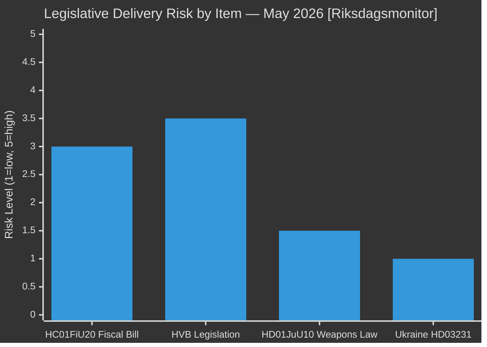

# Implementation Feasibility — May 2026 Month Ahead

**Author**: James Pether Sörling  
**Date**: 2026-04-29  
**Framework**: Delivery Risk Assessment, Statskontoret Integration

## Legislative Delivery Risk Assessment

### HC01FiU20 Spring Fiscal Bill

| Dimension | Assessment | Risk Level |
|-----------|-----------|-----------|
| Technical feasibility | Bill fully drafted, FiU process ongoing | LOW |
| Political feasibility | L veto player risk — 4 short of majority | MEDIUM-HIGH |
| Timeline | FiU vote expected May 2026; Riksdag last day June 2026 | ON TRACK |
| Statskontoret relevance | Fiscal spending efficiency review applicable to HC01FiU20 | MEDIUM |
| IMF fiscal sustainability | Sweden GGXWDG_NGDP ~35% — well within safe limits | LOW (fiscal) |

### HVB Homes Legislation (if committed in May 20 response)

| Dimension | Assessment | Risk Level |
|-----------|-----------|-----------|
| Technical feasibility | Police list mechanism requires coordination between Social Affairs + Police Authority | MEDIUM |
| Political feasibility | Cross-party support expected (child protection is high-consensus) | LOW |
| Timeline | Must be delivered before September 2026 election to count | HIGH — 4 months |
| Statskontoret relevance | Statskontoret has existing analytical capacity on placement system efficiency | HIGH |
| IMF relevance | Welfare delivery quality — not IMF domain; SCB social statistics applicable | N/A |

**Fast-track assessment**: A technical regulation (förordning) on the police list could be issued without Riksdag vote, via Cabinet decision. This would be the fastest path. Estimated timeline: 6–8 weeks from commitment to implementation. **Feasible within election window.** [B3]

### HD01JuU10 Weapons Law

| Dimension | Assessment | Risk Level |
|-----------|-----------|-----------|
| Technical feasibility | Bill at committee stage; drafting complete | LOW |
| Political feasibility | Cross-party support expected | LOW |
| Timeline | JuU committee report expected May-June 2026 | ON TRACK |
| Implementation complexity | Police enforcement, registry systems | MEDIUM |

## Statskontoret Integration Row

| Policy Area | Statskontoret Capacity | Recommendation |
|-------------|----------------------|----------------|
| HVB homes placement efficiency | HIGH — prior analysis of placement system exists | Commission rapid evaluation of police list mechanism |
| Fiscal bill spending efficiency | HIGH | Pre-implementation review of major HC01FiU20 spending items |
| Criminal justice delivery | MEDIUM | Post-legislation review of HD01JuU10 implementation |

## Delivery Feasibility Summary

## Administrative Capacity Constraints

1. **Social Affairs Ministry**: HVB homes response requires inter-ministerial coordination (Social + Justice + Police). The response by May 20 from Waltersson Grönvall (Schools Minister) may indicate a cross-ministerial working group — which is slower than a direct regulatory fix.

2. **Police Authority**: The "police list" (register of persons unsuitable for working with children) involves Police Authority administrative systems. Technical implementation of expanded access requires 3–6 months even after regulatory decision.

3. **Procurement risk**: If government commits to new legislation rather than regulatory fix, procurement of IT system upgrades required — 12–18 month timeline, beyond election.

**Recommendation**: Fastest credible path = Cabinet regulation (förordning) committing to expanded police list access within 60 days + independent evaluation commission (SOU) for longer-term HVB quality reform. This is administratively feasible within election window.
