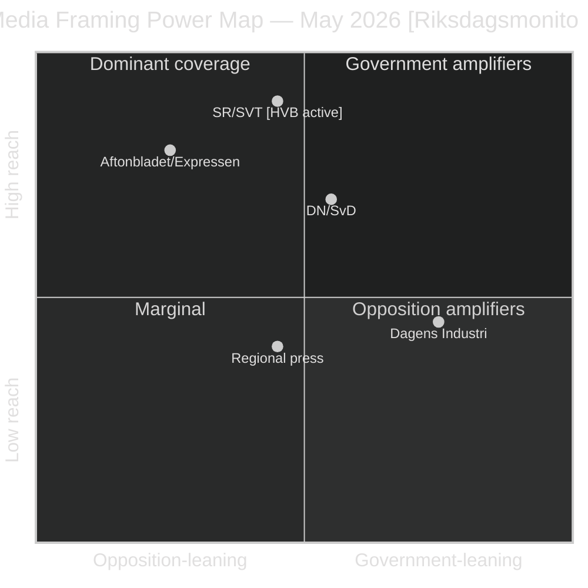

# Media Framing Analysis — May 2026 Month Ahead

**Author**: James Pether Sörling  
**Date**: 2026-04-29  
**Framework**: Per-Party Framing + Press Quadrant Analysis

## Per-Party Framing Matrix

### Government Parties

| Party | Primary Frame | Secondary Frame | Vulnerability |
|-------|--------------|-----------------|--------------|
| M | "Responsible government delivers fiscal stability and crime reduction" | HC01FiU20 passage as economic stewardship | HVB homes delivery failure if unchallenged |
| SD | "Sweden's security — crime, borders, order" | Energy sovereignty | Cultural heritage SD interpellation (HD10455) as base mobilization |
| KD | "Family and social responsibility" | HVB homes — trying to defend AND attack simultaneously | HD10454 makes KD's social responsibility frame vulnerable |
| L | "Liberal reform, housing markets, individual rights" | Balancing coalition loyalty vs housing red lines | Below-threshold polling existential risk |

### Opposition Parties

| Party | Primary Frame | Secondary Frame | Opportunity |
|-------|--------------|-----------------|-------------|
| S | "Government broken its promises to the most vulnerable" | Economic competence via HC01FiU20 attacks | HD10454 HVB homes; HD11767 homeless missing |
| V | "Class analysis — welfare cuts, privatization failure" | Sick-pay reform rollback (HD10450) | Health and welfare delivery failures |
| MP | "Green competence — environmental and welfare" | HVB homes (children, social responsibility) | Growing on welfare narrative |
| C | "Competent responsible center politics" | Strategic ambiguity on coalition | Maximum leverage point before election |

## Press Quadrant Analysis

| Outlet | Leaning | Expected HVB Frame | Expected HC01FiU20 Frame |
|--------|---------|-------------------|--------------------------|
| SVT/SR (public) | Neutral-critical | Investigative — SR already active (HD10454) | Balanced process coverage |
| Aftonbladet/Expressen (tabloid) | Left-leaning / populist | STRONG HVB amplification | Fiscal cuts narrative |
| DN/SvD (broadsheet) | Center-liberal | Moderate — HVB as governance failure | Fiscal stability, L veto dynamic |
| Dagens Industri | Business/center-right | LOW HVB interest | HC01FiU20 economic credibility |
| Sydsvenskan/regional | Regional variation | Variable | Infrastructure deficit (Södra stambanan) |

## Narrative Battleground Analysis

### Battleground 1: HVB Homes (ACTIVE)

**S frame**: "Two years of broken promises to children in dangerous homes. The government knew and did nothing." (Evidence: HD10454 dated ministerial promise)

**Government counter-frame**: "We are working on comprehensive reform. The police list is one element of a complex system." (Defensive — confirms the narrative without rebuttal)

**Media amplification risk**: SR is already active (confirmed by HD10454 citation). If SVT Uppdrag granskning files an investigation request (analogous to Carema 2011), the story becomes Tier-1 national coverage.

**Government winning frame** (if used): "We are delivering legislation in May — here is the specific reform with a timeline." This converts the vulnerability into a competence demonstration.

### Battleground 2: Spring Fiscal Bill (UPCOMING)

**S frame**: "Cuts to welfare while protecting corporate tax breaks."  
**Government frame**: "Responsible fiscal management in uncertain global conditions."  
**L frame**: "We secured housing market protections for ordinary Swedes."

**Media amplification**: DN/SvD likely to frame HC01FiU20 as "will L break the coalition?" — the FiU vote becomes a process story about coalition management.

## Social Media Monitoring Indicators

Key indicators to watch in May 2026:
- `#HVBhemmen` hashtag volume on X/Twitter — surge indicates SR story breaking
- `#Riksdagen` mentions of HD10454 document number — public engagement with parliamentary process
- Aftonbladet "top articles by share" — HVB appearing in top 10 confirms media escalation

