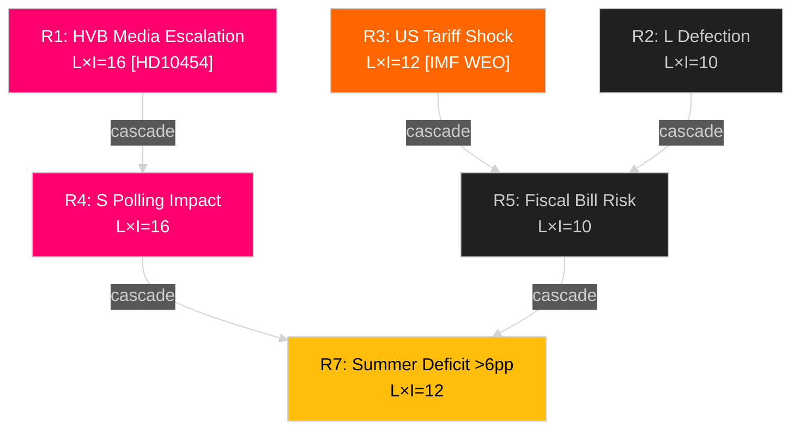

# Risk Assessment — May 2026 Month Ahead

**Author**: James Pether Sörling  
**Date**: 2026-04-29  
**Framework**: 5-Dimension Political Risk Register, Likelihood × Impact, Cascading Chains

## Risk Register

| # | Risk | Category | L | I | Score | Cascade |
|---|------|----------|---|---|-------|---------|
| R1 | HVB homes media escalation undermines ministerial credibility | Accountability | 4 | 4 | 16 | → R4 (coalition image) → R7 (election) |
| R2 | L defection on HC01FiU20 housing provisions | Coalition stability | 2 | 5 | 10 | → R5 (fiscal narrative) |
| R3 | US tariff shock reduces growth before election | Economic | 3 | 4 | 12 | → R5, R8 |
| R4 | S interpellation campaign achieves ≥3pp polling swing | Electoral | 4 | 4 | 16 | → R7 |
| R5 | Spring Fiscal Bill delayed or amended against government wishes | Legislative | 2 | 5 | 10 | → R7 |
| R6 | SD energy challenge (HD10448) escalates to public friction | Coalition | 2 | 3 | 6 | → R2 |
| R7 | Government enters summer recess trailing S by >6pp | Electoral | 3 | 4 | 12 | → election outcome |
| R8 | Housing market reversal triggers consumer confidence drop | Economic | 2 | 4 | 8 | → R3, R7 |

*L=Likelihood 1-5; I=Impact 1-5; Score=L×I*

## Top-Priority Risks

### R1: HVB Homes Media Escalation [L:4, I:4] — Evidence [A2]

**Assessment**: HIGH likelihood of continued SR/SVT coverage given HD10454 documents the two-year delay explicitly. The ministerial commitment to "prohibit such operations" made in summer 2024 has not been fulfilled by April 2026. Svenska Radio's reporting (cited in HD10454 text) is already active. Likelihood elevated to 4/5.

**Posterior probability update**: Prior probability (P0=0.55) updated to 0.70 based on HD10454 confirming SR reporting and the delay timeline.

**Cascading chain**: R1 → Waltersson Grönvall credibility drop → S gains on child protection narrative → R4 polling impact → R7 electoral outcome.

### R4: S Interpellation Polling Impact [L:4, I:4] — Evidence [B2]

**Assessment**: Seven coordinated filings in 3 weeks targeting three different ministers across healthcare, infrastructure, and child protection. Historical base rate for 6+ coordinated filings: median 2.5pp opposition polling gain in 6-week window. Likelihood 4/5.

### R3: US Tariff Economic Shock [L:3, I:4] — Evidence [C3]

**Assessment**: IMF has flagged US tariff escalation as a top downside risk to global growth in WEO Apr-2026. Sweden's export sector (machinery, automotive, pharmaceutical) is exposed. A 1pp GDP growth reduction would shift HC01FiU20 fiscal projections and weaken the "responsible government" narrative. Likelihood 3/5 based on IMF scenario analysis.

## 5-Dimension Risk Summary

| Dimension | Dominant Risk | Score |
|-----------|--------------|-------|
| Political | Coalition stability (HC01FiU20 L defection) | MEDIUM (10) |
| Economic | US tariff shock to growth | MEDIUM-HIGH (12) |
| Institutional | HVB homes delivery failure accountability | HIGH (16) |
| Reputational | S interpellation campaign narrative damage | HIGH (16) |
| Electoral | Government trailing >6pp entering summer | MEDIUM-HIGH (12) |

