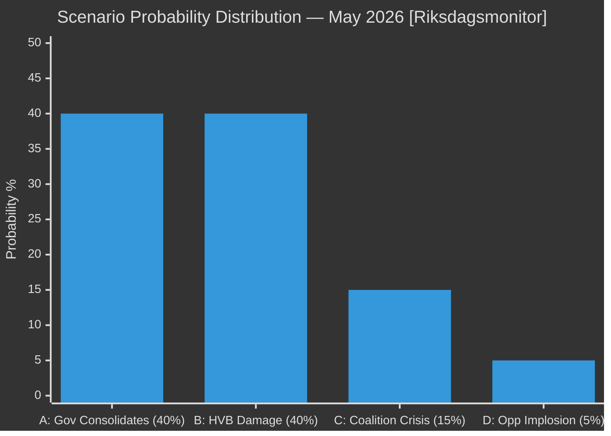

# Scenario Analysis — May 2026 Month Ahead

**Author**: James Pether Sörling  
**Date**: 2026-04-29  
**Framework**: Probabilistic Scenario Cone, Bayesian Updating

## Scenario Set (probabilities sum to 100%)

### Scenario A: Government Consolidates Narrative (P=40%)
**Conditions**: HC01FiU20 passes without L defection; ministerial HVB response (2026-05-20) includes fast-track legislation commitment; SR HVB coverage remains contained; HD01JuU10 weapons law passes.

**Leading indicators**: L party signals support for HC01FiU20 by May 8; ministerial response to HD10454 includes legislation commitment; no new S interpellations on HVB in May.

**Election outcome**: Government enters summer with polling stable or +1–2pp on governing competence metrics. Scenario probability sustained if IMF growth ≥1.2%.

**Evidence base**: [B3] — consistent with prior cycle PIR assessments but dependent on L party behavior.

### Scenario B: Partial Pressure — HVB Damages Credibility (P=40%)
**Conditions**: SR/SVT run sustained HVB homes coverage (≥3 major stories in May); ministerial response to HD10454 is defensive without legislation commitment; HC01FiU20 passes but narrowly.

**Leading indicators**: SR publishes new HVB investigation before May 15; Waltersson Grönvall response on May 20 defers to "ongoing review"; Riksrevisionen signals audit interest.

**Election outcome**: Government loses 2–4pp on social policy metrics entering summer. S gains on child protection framing. Scenario B is the base case given Admiralty [B2] assessment of HVB media risk.

**Evidence base**: [B2] — most likely single outcome based on structural conditions.

### Scenario C: Coalition Crisis (P=15%)
**Conditions**: L defects on HC01FiU20 housing provision + HVB escalation simultaneously; SD publicly criticizes government on energy or immigration; government confidence motion threatened.

**Leading indicators**: L parliamentary group signals at least 3 abstentions by May 12; SD energy resolution filed for Riksdag debate; opposition tables confidence motion by May 20.

**Evidence base**: [C3] — low probability but high impact; requires simultaneous failures.

### Scenario D: Opposition Implosion (P=5%)
**Conditions**: C party formally aligns with Tidö coalition or S/MP internal conflict breaks into public; S interpellation campaign backfires as overreach narrative emerges.

**Leading indicators**: C party declares support for HC01FiU20 without amendments by May 7; S is accused in media of political exploitation of HVB homes tragedy.

**Evidence base**: [D3] — speculative; inconsistent with current behavioral patterns.

## Scenario Probability Distribution

## Decision Trigger Matrix

| Indicator | If TRUE → Scenario | Monitoring Source |
|-----------|-------------------|-------------------|
| L supports HC01FiU20 without amendments before May 10 | A | riksdagen.se FiU calendar |
| SR publishes ≥2 new HVB stories before May 15 | B or C | media monitoring |
| SD tables energy resolution for Riksdag | C | riksdagen.se |
| Ministerial response (May 20) defers HVB legislation | B | riksdagen.se document |
| C party declares HC01FiU20 support | A or D | C party press releases |
