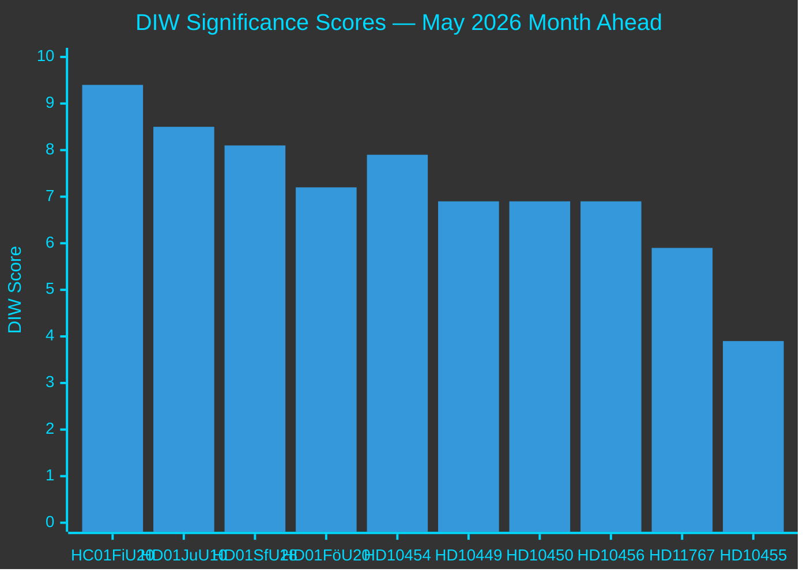
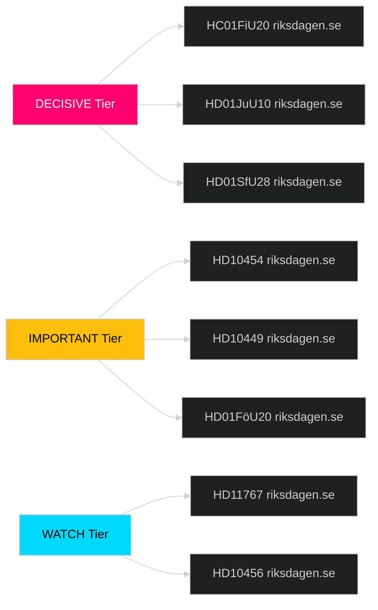

# Significance Scoring — May 2026 Month Ahead

**Author**: James Pether Sörling  
**Date**: 2026-04-29  
**Framework**: DIW (Depth × Impact × Watchability) composite scoring

## DIW Scoring Method

Each document scored on three dimensions (0–10 each), then weighted:
- **Depth (D)**: Analytical complexity and evidence richness
- **Impact (I)**: Parliamentary consequence and civic effect
- **Watchability (W)**: Media salience and public interest

DIW score = (0.4×I) + (0.35×D) + (0.25×W)

## Today's Documents (2026-04-29)

| dok_id | D | I | W | DIW | Tier | Rationale |
|--------|---|---|---|-----|------|-----------|
| HD10454 | 7 | 8 | 9 | 7.9 | L2+ Priority | Child protection failure + organized crime + ministerial accountability; high salience |
| HD10456 | 6 | 7 | 8 | 6.9 | L2 Strategic | Organ trafficking is low-frequency high-severity; SD filing signals justice priority |
| HD11767 | 5 | 6 | 7 | 5.9 | L2 Strategic | Vulnerable persons policy; S filing; administrative failure argument |
| HD10455 | 3 | 4 | 5 | 3.9 | L1 Surface | Cultural heritage niche issue; SD coalition partner loyalty signal |

## May 2026 Pipeline Documents (Prior Analysis — Carried Forward)

| dok_id | D | I | W | DIW | Tier | Source |
|--------|---|---|---|-----|------|--------|
| HC01FiU20 | 9 | 10 | 9 | 9.4 | DECISIVE | Spring Fiscal Bill — government survival vote |
| HD01JuU10 | 8 | 9 | 8 | 8.5 | DECISIVE | Weapons law — Tidö coalition centrepiece |
| HD01SfU28 | 8 | 9 | 7 | 8.1 | DECISIVE | Citizenship tightening — L/SD tension focal point |
| HD01FöU20 | 7 | 8 | 6 | 7.2 | IMPORTANT | CER Critical Infrastructure Directive |
| HD03231 | 7 | 8 | 6 | 7.2 | IMPORTANT | Ukraine reparations commission |
| HD10449 | 6 | 7 | 8 | 6.9 | IMPORTANT | Södra stambanan infrastructure interpellation |
| HD10450 | 6 | 7 | 8 | 6.9 | IMPORTANT | Sick-pay day-180 interpellation |

## Sensitivity Analysis

Highest-volatility scoring: HD10454 (±1.5 DIW depending on media pick-up of "two-year delay" angle).  
If SR/SVT run the HVB homes story as a lead story, HD10454 could move from L2+ to DECISIVE tier for electoral narrative.

