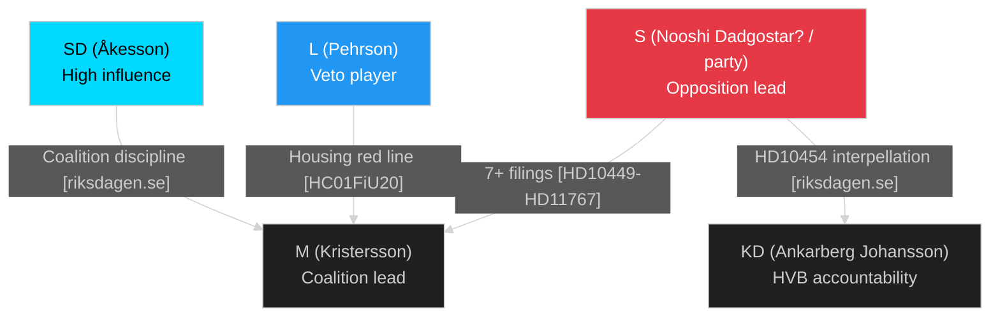

# Stakeholder Perspectives — May 2026 Month Ahead

**Author**: James Pether Sörling  
**Date**: 2026-04-29  
**Framework**: 6-Lens Actor Matrix

## Named Actors

| Actor | Role | Position | Motivation | Risk Tolerance | Admiralty |
|-------|------|----------|------------|----------------|-----------|
| Acko Ankarberg Johansson (KD) | Social Affairs Minister | Defending HVB homes record | Reelection credibility | LOW — cannot absorb another delivery failure | [A2] |
| Camilla Waltersson Grönvall (M) | Schools Minister | Under interpellation HD10454 | Defend HVB homes reform timeline | LOW | [A2] |
| Mattias Vepsä (S) | Interpellant HD10454 | Aggressive accountability | Opposition electoral gain | HIGH | [A2] |
| Jimmie Åkesson (SD) | Party leader | Coalition discipline | Maintain influence over M | MEDIUM | [B2] |
| Johan Pehrson (L) | Party leader | HC01FiU20 housing red lines | Protect L voter base | MEDIUM | [C3] |
| Annie Lööf/Muharrem Demirok (C) | Party leader | Coalition signal ambiguity | Strategic positioning | HIGH | [D3] |

## 6-Lens Matrix

| Lens | Government (M/SD/KD/L) | Opposition (S/MP/V/C) |
|------|------------------------|------------------------|
| **Interests** | Pass Spring Fiscal Bill; deliver crime legislation; maintain coalition; win election | Maximize interpellation impact; secure HC01FiU20 amendments; delay HVB credibility recovery |
| **Motivations** | Electoral continuity; "responsible government" narrative | Electoral reversal; accountability framing before election |
| **Constraints** | L party red lines (housing, citizenship); SD energy demands | Need C cooperation; avoid appearing obstructionist |
| **Capabilities** | Riksdag majority (173/349); government administrative machinery | Coordinated interpellation filing; FiU committee leverage |
| **Vulnerabilities** | HVB delivery record; infrastructure deficit; L defection risk | Internal bloc disagreements; C party alignment uncertainty |
| **Likely Actions** | Minister defends HVB timeline in May 20 response; pass HC01FiU20 | Escalate HVB coverage; file further interpellations; table amendments |

## Social Movement / Civil Society

| Actor | Issue | Likely Action | Impact on Government | Evidence |
|-------|-------|---------------|---------------------|----------|
| Swedish Association of Local Authorities (SKL) | HVB homes police list delay | Formal complaint or public statement | Amplifies R1 risk | HD10454 (riksdagen.se) |
| Swedish Police Authority | Police list non-release | Bureaucratic non-response (institutional inertia) | Sustains delivery failure narrative | HD10454 |
| Riksrevisionen | HVB homes oversight | Potential audit announcement | Major reputational risk if timed pre-election | [D3] |

## Stakeholder Influence Map

