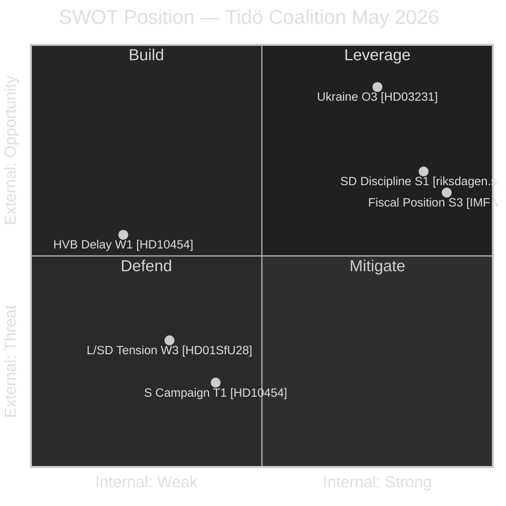

# SWOT Analysis — Sweden May 2026 Political Landscape

**Author**: James Pether Sörling  
**Date**: 2026-04-29  
**Framework**: Political SWOT + TOWS Matrix [Admiralty coded]

## Strengths (Tidö Coalition)

| # | Strength | Evidence | Admiralty |
|---|----------|----------|-----------|
| S1 | SD voting discipline 97.7% maintained | riksdagen.se 2025/26 voting records | [A2] |
| S2 | Justice legislative cluster at final stage with no defection signals | HD01JuU10, HD01SfU28 committee status (riksdagen.se) | [A2] |
| S3 | Sweden's fiscal surplus and low debt (~35% of GDP) vs EU average ~84% | IMF WEO Apr-2026, GGXWDG_NGDP | [A1] |
| S4 | Crime narrative ownership — criminal justice agenda is primary campaign asset | Tidö Agreement, HD01JuU10/HD03252 legislative delivery | [B2] |
| S5 | Ukraine ratification cross-party support removes foreign policy vulnerability | HD03231/32 (riksdagen.se) | [A1] |

## Weaknesses (Tidö Coalition)

| # | Weakness | Evidence | Admiralty |
|---|----------|----------|-----------|
| W1 | HVB homes delivery failure — 2-year delay in police list release to municipalities | HD10454 full text (riksdagen.se) — police list delay confirmed | [A2] |
| W2 | Södra stambanan infrastructure deficit — KD minister exposed by S interpellation | HD10449 (riksdagen.se) | [B2] |
| W3 | L/SD citizenship law tension — risk of L parliamentary embarrassment | HD01SfU28; L party public statements | [B3] |
| W4 | Sick-pay day-180 reform contested by S as welfare rollback | HD10450 (riksdagen.se) | [B2] |
| W5 | US tariff risk to Swedish export sector — economy-growth vulnerability | IMF WEO Apr-2026, NGDP_RPCH Nordic comparison | [C3] |

## Opportunities

| # | Opportunity | Evidence | Admiralty |
|---|-------------|----------|-----------|
| O1 | Spring Fiscal Bill passage secures "responsible government" electoral narrative | HC01FiU20 (riksdagen.se) | [B2] |
| O2 | Crime delivery (weapons law, youth crime) provides dominant campaign platform | HD01JuU10, HD03252 (riksdagen.se) | [A2] |
| O3 | Ukraine ratification cross-party win — all eight parties claim credit | HD03231/32 (riksdagen.se) | [A1] |
| O4 | Riksbank rate easing supports housing market recovery heading into election | IMF MFS_IR:FPOLM_PA | [B3] |
| O5 | HVB homes crisis creates opportunity for rapid legislative response before election | HD10454 response deadline 2026-05-20 | [B3] |

## Threats

| # | Threat | Evidence | Admiralty |
|---|--------|----------|-----------|
| T1 | S interpellation campaign compounds across 7+ filings before election | HD10449/10450/10454/11767 (riksdagen.se) | [A2] |
| T2 | HVB homes media cycle if SR/SVT elevate two-year delay narrative | HD10454 full text; SR prior reporting cited in text | [B2] |
| T3 | L rebellion on housing provisions in HC01FiU20 — minority government risk | L party parliamentary position; HC01FiU20 (riksdagen.se) | [C3] |
| T4 | US tariff escalation reducing growth projections before election | IMF WEO Apr-2026 risk scenarios | [C3] |
| T5 | C party coalition signal could shift opposition alliance arithmetic | PIR-7; prior cycle analysis | [D3] |

## TOWS Matrix

| | S1-S5 Strengths | W1-W5 Weaknesses |
|---|---|---|
| **O1-O5 Opportunities** | SO: Use SD discipline to pass Spring Fiscal + weapons law; leverage cross-party Ukraine win | WO: Respond fast to HD10454 — legislation before election converts weakness to strength |
| **T1-T5 Threats** | ST: Use fiscal strength to neutralize economic attack lines; crime delivery preempts T1 narrative | WT: Address L/SD citizenship tension before T3 crystallizes; prepare HVB homes ministerial response |

