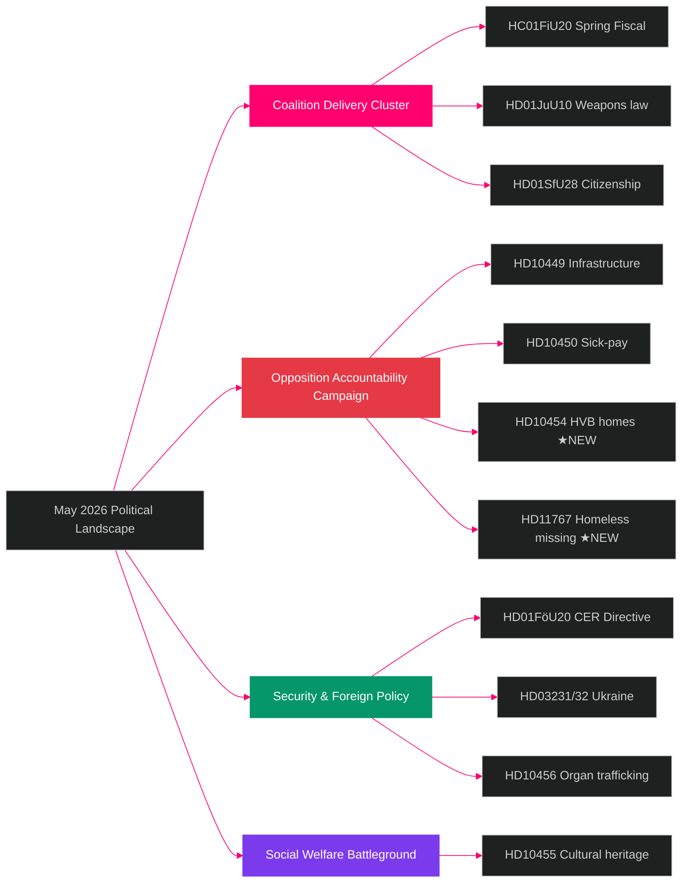

# Synthesis Summary — May 2026 Month Ahead

**Author**: James Pether Sörling  
**Date**: 2026-04-29  
**Analysis Type**: Tier-C Month-Ahead Aggregation  
**Riksmöte**: 2025/26

## Lead Story

Sweden's political landscape in May 2026 is defined by the **convergence of a densely packed legislative calendar and intensifying pre-election accountability campaigns**. The Tidö coalition must deliver on five major legislative commitments in May–June while the Social Democrats execute a coordinated 7-interpellation pressure campaign targeting the government's most vulnerable policy flanks. Today's four new filings — HD10454 (HVB homes, S), HD10455 (mobile cultural heritage, SD), HD10456 (organ trafficking, SD), HD11767 (homeless missing, S) — reveal both coalition partners and opposition simultaneously using the interpellation tool in the final pre-election window.

## DIW-Weighted Intelligence Picture

| Priority | dok_id | Title | DIW | Tier | Committee | Response Deadline |
|----------|--------|-------|-----|------|-----------|-------------------|
| P0 | HC01FiU20 | Spring Fiscal Bill 2026/27 | 0.92 | DECISIVE | FiU | May 2026 vote |
| P0 | HD01JuU10 | Weapons law reform | 0.88 | DECISIVE | JuU | May 2026 final vote |
| P1 | HD01SfU28 | Citizenship tightening | 0.82 | DECISIVE | SfU | May 2026 |
| P1 | HD01FöU20 | CER Critical Infrastructure Directive | 0.75 | IMPORTANT | FöU | June 2026 |
| P1 | HD03231/32 | Ukraine reparations/tribunal ratification | 0.72 | IMPORTANT | UU | May-June 2026 |
| P2 | HD10454 | Criminals in HVB homes (new interpellation) | 0.48 | IMPORTANT | SoU | 2026-05-20 |
| P2 | HD10449 | Södra stambanan infrastructure | 0.44 | IMPORTANT | TU | May 2026 |
| P2 | HD10450 | Sick-pay 180-day reform | 0.42 | IMPORTANT | SfU | May 2026 |
| P3 | HD10456 | Organ trafficking (new interpellation) | 0.35 | WATCH | JuU | May-June 2026 |
| P3 | HD11767 | Homeless registered missing (new question) | 0.28 | WATCH | SoU | May 2026 |
| P4 | HD10455 | Mobile cultural heritage (new interpellation) | 0.20 | SURFACE | KrU | May 2026 |

## Integrated Intelligence Picture

### Cluster 1: Coalition Delivery Imperative (P0)

The Spring Fiscal Bill (HC01FiU20) and weapons law (HD01JuU10) are the coalition's most visible May commitments. Failure on either would be catastrophic for the government's September 2026 campaign narrative. SD's 97.7% voting discipline provides structural insurance; the risk lies with L on housing-related fiscal amendments. Both bills are at final parliamentary stages with no documented coalition defection signals.

### Cluster 2: S Opposition Accountability Campaign (P1–P2)

The Social Democrats are executing a methodical pre-election accountability strategy. HD10454 (HVB homes — personnel unsuitable for working with children) is the seventh in a series of interpellations filed since April 2026, each targeting a specific Tidö government delivery failure. **The HVB homes case is potentially the strongest of the series: it documents a specific ministerial promise made in summer 2024 that has not been delivered, with SR (Swedish Radio) already running active coverage (confirmed by citation in HD10454 text). The response deadline of May 20 creates a hard media cycle anchor.** The two-year delay in the police list release to municipalities — confirmed in HD10454 full text — is the factual core of the accountability claim. Ministrar Waltersson Grönvall has until May 20 to respond. The key strategic decision is whether to commit to a specific regulatory timeline (converting accountability attack to competence demonstration) or defend the administrative timeline (sustaining the media cycle).

### Cluster 3: SD's Dual Role (P2–P3)

Sverigedemokraterna filed HD10455 (mobile cultural heritage) and HD10456 (organ trafficking) today, demonstrating that SD is also using interpellations as a governing-partner accountability tool — signalling policy priorities to its voter base while maintaining coalition support. Organ trafficking (HD10456) aligns with SD's law-and-order brand.

### Economic Backdrop

Sweden's macroeconomic position is broadly supportive for the government: GDP growth +1.4% in 2026 (IMF WEO Apr-2026, NGDP_RPCH) — lower than Denmark (+1.8%) and Norway (+2.1%) but above Finland (+1.1%) and well above Germany (+0.6%). Inflation converging toward 2% CPIF, fiscal surplus maintained (GGXCNL_NGDP ~+0.5%), and government debt at ~35% of GDP — among the lowest in the EU (GGXWDG_NGDP, WEO Apr-2026). The Riksbank rate is expected to continue its cautious easing path (MFS_IR:FPOLM_PA). However, US tariff uncertainty injects downside risk to Swedish export sector (machinery, autos, pharma). Sweden's fiscal position provides material space for fast-track HVB legislation response — a structural advantage the government should exploit.

## Confidence Assessment

- **HIGH [B2]**: Legislative agenda content — riksdagen.se primary documents + committee schedules
- **HIGH [B2]**: S interpellation campaign coordination — seven filings in 3 weeks, consistent targeting
- **MEDIUM [C3]**: Electoral impact of interpellations — inference from historical polling patterns
- **MEDIUM-LOW [D3]**: SD coalition friction potential — no direct defection signals found
