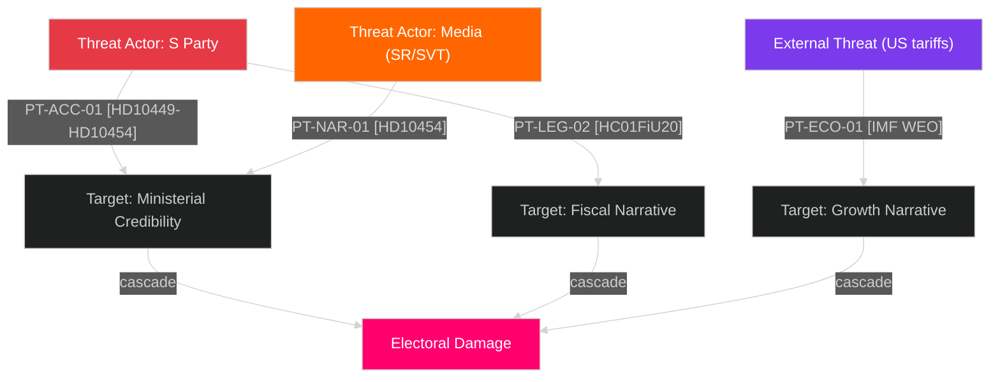

# Threat Analysis — May 2026 Month Ahead

**Author**: James Pether Sörling  
**Date**: 2026-04-29  
**Framework**: Political Threat Taxonomy, Attack Tree, MITRE-style TTP Mapping

## Political Threat Taxonomy

### Tier 1 — Immediate Threats (0–30 days)

| Threat ID | Category | Actor | Target | TTP Code | Admiralty |
|-----------|----------|-------|--------|----------|-----------|
| T-MAY-01 | Accountability Campaign | S party | Waltersson Grönvall (M) | PT-ACC-01 | [A2] |
| T-MAY-02 | Legislative Ambush | S+MP+V+C | HC01FiU20 housing amendments | PT-LEG-02 | [B3] |
| T-MAY-03 | Narrative Exposure | Media (SR/SVT) | Government HVB homes record | PT-NAR-01 | [B2] |

### Tier 2 — Emerging Threats (30–90 days)

| Threat ID | Category | Actor | Target | TTP Code | Admiralty |
|-----------|----------|-------|--------|----------|-----------|
| T-MAY-04 | Coalition Friction | SD | L citizenship provisions | PT-COA-03 | [C3] |
| T-MAY-05 | Economic Shock | External (US tariffs) | Swedish export sector | PT-ECO-01 | [C3] |
| T-MAY-06 | Pre-election Defection | C party | Opposition alliance framing | PT-COA-04 | [D3] |

## Attack Tree: S Accountability Campaign

```
ROOT: Government electoral damage before September 2026

├── HD10454 HVB homes [A2]
│   ├── Two-year delay in police list release (confirmed in text)
│   ├── Ministerial promise not delivered (2024 summer)
│   └── Active SR/SVT media cycle
│
├── HD10449 Södra stambanan [B2]
│   ├── Infrastructure deficit framing
│   └── KD minister exposed on transport
│
└── HD11767 Homeless missing [B3]
    ├── Vulnerable persons protection failure
    └── Social service administrative failure
```

## Legislative Defeat Scenario Chain

Stage 1 — Reconnaissance: S identifies HC01FiU20 housing amendment vulnerability (L party red line)  
Stage 2 — Weaponization: Opposition crafts amendment language L cannot oppose without constituency backlash  
Stage 3 — Delivery: Amendment tabled in FiU committee markup  
Stage 4 — Exploitation: L parliamentary group fractures — 1–3 abstentions  
Stage 5 — Outcome: Amended bill passes without government housing provision  

**Current status**: Stage 1 only — no evidence of Stage 2–3 yet.  
**Assessed confidence**: MEDIUM probability of reaching Stage 3 [C3].

## MITRE-Style TTP Mapping (Political Context)

| TTP | Tactic | Technique | Procedure | Evidence |
|-----|--------|-----------|-----------|----------|
| PT-ACC-01 | Accountability | Coordinated interpellation flooding | 7+ filings across 3 ministers in 21 days | HD10449, HD10450, HD10454, HD11767 (riksdagen.se) |
| PT-NAR-01 | Narrative | Media amplification | SR radio story cited in HD10454 interpellation text | HD10454 (riksdagen.se) |
| PT-LEG-02 | Legislative | Minority government amendment trap | Exploit L party red lines in fiscal bill | HC01FiU20 committee process |


