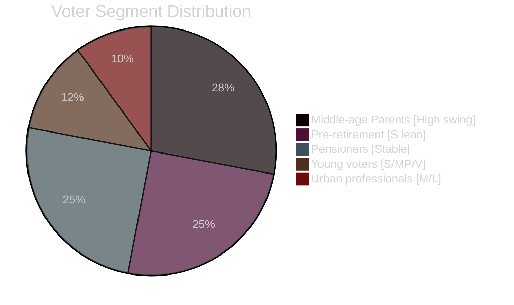

# Voter Segmentation — May 2026 Month Ahead

**Author**: James Pether Sörling  
**Date**: 2026-04-29  
**Framework**: Demographic / Regional / Ideological Segmentation

## Demographic Segments

| Segment | Size (approx) | Primary Issue | Current Alignment | Impact of HVB homes |
|---------|--------------|---------------|-------------------|---------------------|
| Young voters (18–29) | 12% of electorate | Housing costs, climate | S/MP/V lean | MEDIUM — housing policy; HVB residual |
| Middle-age parents (30–50) | 28% | School quality, HVB homes, crime | Swing — Tidö competitive | HIGH — HVB homes directly affects this segment |
| Pre-retirement (50–65) | 25% | Welfare, healthcare, pensions | S traditional base | MEDIUM — sick-pay day-180 reform (HD10450) |
| Pensioners (65+) | 25% | Healthcare, pensions | Stable SD/KD | LOW for HVB; HIGH for healthcare delivery |
| Urban professionals | 18% | Economy, housing | L/C/M lean | MEDIUM — fiscal competence |

## Regional Segments

| Region | Dominant Party | Key Local Issues | Swing Potential |
|--------|---------------|-----------------|----------------|
| Norrland | S | Jobs, regional services | LOW — safe S |
| Stockholm metro | M/L | Housing, economy | HIGH — critical swing |
| Malmö/Skåne | SD | Crime, immigration | MEDIUM |
| Gothenburg | S/V | Labour, welfare | LOW-MEDIUM |
| Rural south/center | SD/C | Agriculture, infrastructure | MEDIUM |

## Ideological Segments

| Segment | Est. Size | Identity | HVB Homes Relevance | HC01FiU20 Relevance |
|---------|----------|----------|---------------------|---------------------|
| Welfare state defenders | 30% | S/V/MP | HIGH — HVB failures confirm welfare decline narrative | HIGH — fiscal cuts |
| Security-first voters | 22% | SD | LOW for HVB; HIGH for crime | MEDIUM |
| Economic liberals | 15% | M/L | LOW for HVB | HIGH — fiscal discipline |
| Christian-social | 8% | KD | HIGH for HVB (child protection, family policy) | MEDIUM |
| Green/post-materialist | 8% | MP/V | MEDIUM | MEDIUM |
| Center/agrarian | 6% | C | MEDIUM for HVB | MEDIUM for housing |

## Key Swing Segment: Middle-age Parents (30–50)

**Significance**: This 28% segment is the decisive swing group. They are exposed to HVB homes issues (school-age children, awareness of placement system), care about crime delivery (weapons law, youth crime), and are sensitive to both housing costs (HC01FiU20) and child protection quality (HD10454).

**2022 performance**: S won this segment narrowly (+2pp vs Tidö parties combined). If S gains +4pp in this segment from HVB homes accountability, it translates to approximately +1.1pp in overall vote share — potentially decisive.

**Government counter-strategy**: A fast-track HVB homes legislation commitment in the May 20 ministerial response directly addresses this segment's primary concern. Failure to do so cedes this segment to S.

