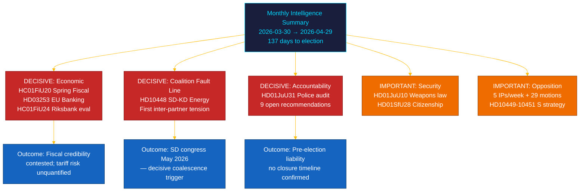
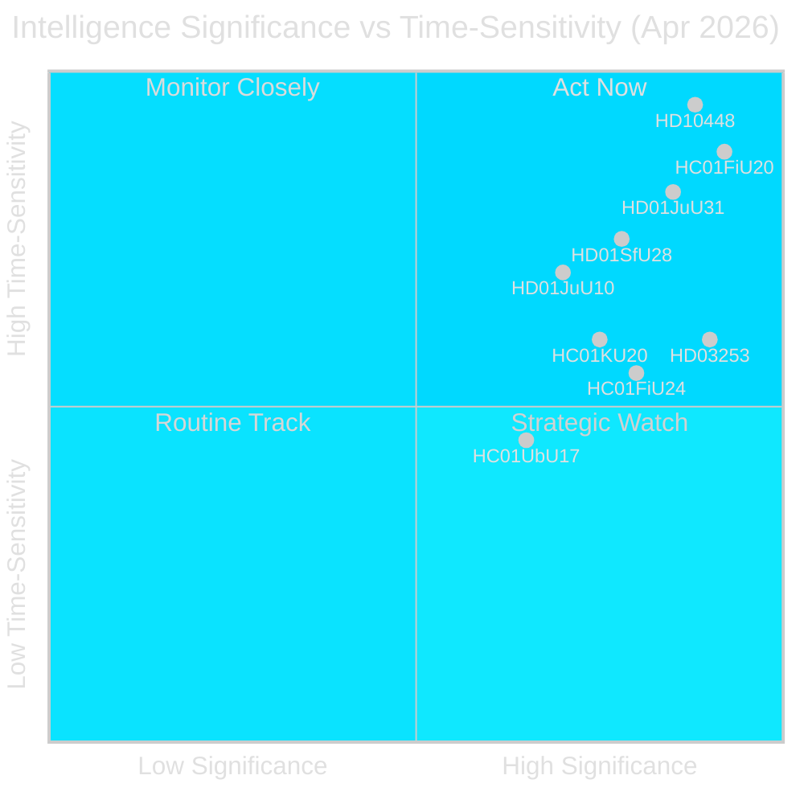
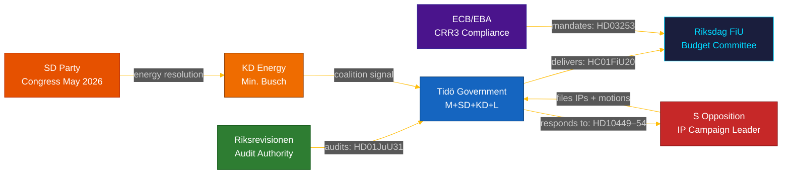
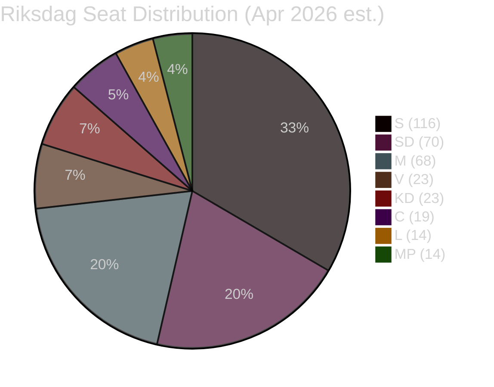
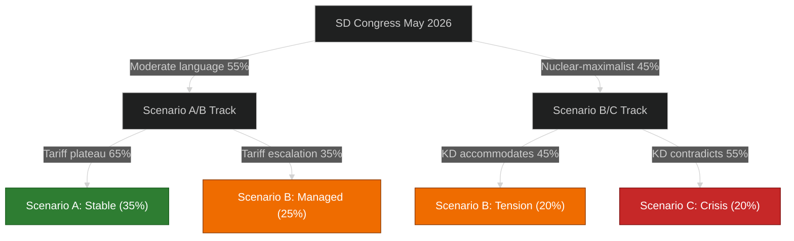
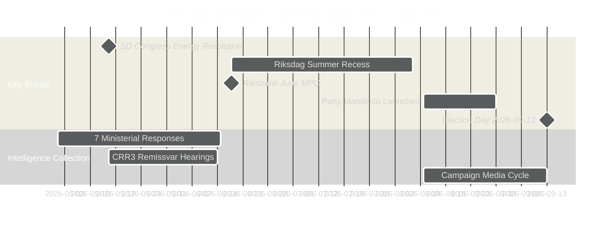
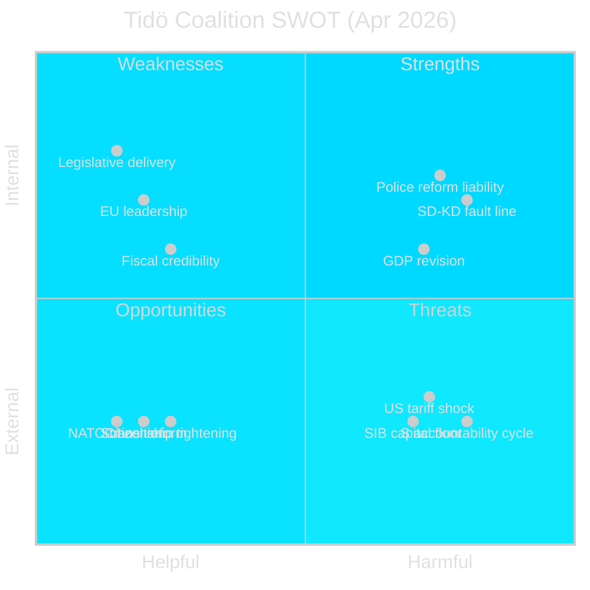
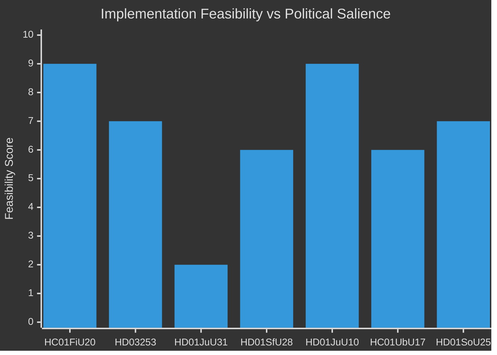
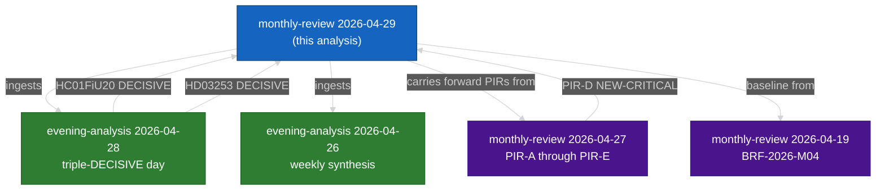

## Executive Brief
<!-- source: executive-brief.md :: https://github.com/Hack23/riksdagsmonitor/blob/main/analysis/daily/2026-04-29/monthly-review/executive-brief.md -->

| Field | Value |
|-------|-------|
| **Brief ID** | BRF-2026-M05-APR-29 |
| **Classification** | PUBLIC · Time-to-read ≤ 5 minutes |
| **Coverage Window** | 2026-03-30 → 2026-04-29 (riksmöte 2025/26, pre-election sprint) |
| **Author** | James Pether Sörling |
| **Methodology** | ai-driven-analysis-guide.md v5.0 · Pass 2 |
| **Upstream Continuity** | Ingests 30-day sibling runs + BRF-2026-M04 (2026-04-19) + weekly-review 2026-04-26 |

---

### 🎯 BLUF

> **The final month of riksmöte 2025/26 delivered a decisive intra-coalition fault line and the most consequential financial legislation of the session, against a backdrop of external economic shock.** The Tidö coalition advanced its pre-election agenda across five simultaneous fronts — economic governance, financial regulation, security, welfare, and constitutional accountability — while the **SD–KD energy interpellation (HD10448)** exposed the first publicly documented inter-partner tension with direct campaign implications. The **US tariff shock** forced a GDP downgrade to 1.9% (2025) in the Spring Fiscal Bill guidelines (HC01FiU20), weakening government economic-competence claims. The **EU Banking Package (HD03253)** imposes Basel III/CRR3 capital floors on Swedish SIBs. The **Riksrevisionen police reform audit (HD01JuU31)** hands the opposition a pre-election accountability weapon: 9 open efficiency recommendations with no confirmed closure date. Sweden is **137 days** from the 2026-09-13 election. `[VERY HIGH confidence: A1]`

---

### 🧭 3 Decisions This Brief Supports

| Decision | Evidence locus | Action window |
|----------|---------------|---------------|
| **Election-campaign coverage architecture** — which policy domains drive swing-voter positioning in the 137-day final approach | [`scenario-analysis.md`](https://github.com/Hack23/riksdagsmonitor/blob/main/analysis/daily/2026-04-29/monthly-review/scenario-analysis.md) §Three scenarios · [`significance-scoring.md`](https://github.com/Hack23/riksdagsmonitor/blob/main/analysis/daily/2026-04-29/monthly-review/significance-scoring.md) Top-10 DIW | Now — before May political holiday |
| **Financial-sector editorial exposure** — SIB capital-adequacy implications of CRR3 output floor at 72.5% | [`risk-assessment.md`](https://github.com/Hack23/riksdagsmonitor/blob/main/analysis/daily/2026-04-29/monthly-review/risk-assessment.md) R-FIN-01 · [`coalition-mathematics.md`](https://github.com/Hack23/riksdagsmonitor/blob/main/analysis/daily/2026-04-29/monthly-review/coalition-mathematics.md) §FiU supermajority | Within 6 months (CRR3 transposition deadline) |
| **Coalition-stability monitoring posture** given SD–KD energy fault line and HD10448 | [`threat-analysis.md`](https://github.com/Hack23/riksdagsmonitor/blob/main/analysis/daily/2026-04-29/monthly-review/threat-analysis.md) TH-COAL · [`forward-indicators.md`](https://github.com/Hack23/riksdagsmonitor/blob/main/analysis/daily/2026-04-29/monthly-review/forward-indicators.md) FI-01–FI-04 | Before SD congress (May 2026) and manifesto launch (~Aug 2026) |

---

### 📐 60-Second Read

1. **Lead story: HC01FiU20 Spring Fiscal Bill** — four opposition parties (S, V, C, MP) contested the Tidö economic policy framework; US tariff shock revised GDP to 1.9% (2025). Government's "three-pillar" growth strategy faces external headwinds for the first time. `[VERY HIGH · A1]`
2. **SD–KD energy fault line (HD10448)** — Busch (KD, Energy Minister) and Fransson (SD) interpellation divergence is the first publicly documented intra-coalition tension with electoral positioning stakes. SD congress energy platform (May 2026) is the next trigger. `[HIGH · A2]`
3. **EU Banking Package (HD03253)** — CRR3/CRD6 transposition. Basel III 72.5% output floor affects Nordea, SEB, Handelsbanken, Swedbank. Non-discretionary EU compliance but domestic Finansinspektionen pillar-2 choices remain visible in May–June remissvar hearings. `[VERY HIGH · A1]`
4. **Riksrevisionen police reform audit (HD01JuU31)** — 9 open efficiency-improvement recommendations with no closure timeline. Government counters with results-focus evidence. Opposition exploitation secured through 2026-09-13. `[HIGH · A1]`
5. **Citizenship tightening (HD01SfU28)** — HD01SfU28 coalition cohesion test between L (liberal values) and SD (restriction priority). L's final position by chamber vote is a coalition-stability indicator. `[HIGH · B2]`
6. **Riksbank monetary policy evaluation (HC01FiU24)** — FiU endorses 2024 policy record while signalling 2025–2026 inflation normalisation path; IMF WEO Apr-2026 projects SWE CPI at ~2.0% for 2026. `[HIGH · A1]`
7. **S accountability campaign** — five interpellations in one week (HD10449–10451, HD10454, HD10455) plus 29+ opposition motions signals coordinated pre-election legislative pressure. Seven ministerial responses due May–June 2026. `[HIGH · B2]`
8. **10-year primary school reform (HC01UbU17)** — structurally significant education legislation; opposition (V, MP, C) filed counter-motions; implementation horizon 2027–2028. `[MEDIUM · B2]`

---

### 🔭 Top Forward Trigger

**SD congress energy platform adoption (May 2026)** — if SD formally adopts a nuclear-maximalist energy platform that conflicts with KD's diversified renewables position (as foreshadowed in HD10448), coalition energy negotiations in autumn 2026 become structurally adversarial regardless of election outcome. Monitor: SD congress resolution language, Busch (KD) public response, and government joint statement (or absence thereof). `[HIGH · B2]`

---



## Reader Intelligence Guide

Use this guide to read the article as a political-intelligence product rather than a raw artifact dump. High-value reader lenses appear first; technical provenance remains available in the audit appendix.

| Icon | Reader need | What you'll get |
|---|---|---|
| 📊 | [BLUF and editorial decisions](#rm-executive-brief) | fast answer to what happened, why it matters, who is accountable, and the next dated trigger |
| 🧠 | [Synthesis Summary](#rm-synthesis-summary) | evidence-anchored narrative consolidating primary sources into one coherent story line |
| 🎯 | [Key Judgments](#rm-intelligence-assessment--key-judgments) | confidence-bearing political-intelligence conclusions and collection gaps |
| 📈 | [Significance scoring](#rm-significance-scoring) | why this story outranks or trails other same-day parliamentary signals |
| 👥 | [Stakeholder Perspectives](#rm-stakeholder-perspectives) | winners, losers and undecided actors with stake-weighted positions and pressure points |
| 🔢 | [Coalition Mathematics](#rm-coalition-mathematics) | parliamentary arithmetic showing exactly who can pass or block this measure and at what margin |
| 📋 | [Voter Segmentation](#rm-voter-segmentation) | voter-bloc exposure: which demographics gain, lose or shift on this issue |
| 🔭 | [Forward indicators](#rm-forward-indicators) | dated watch items that let readers verify or falsify the assessment later |
| 🔮 | [Scenarios](#rm-scenario-analysis) | alternative outcomes with probabilities, triggers, and warning signs |
| 🗳️ | [Election 2026 Analysis](#rm-election-2026-analysis) | electoral implications for the 2026 cycle — seats at stake, swing voters and coalition viability |
| ⚠️ | [Risk assessment](#rm-risk-assessment) | policy, electoral, institutional, communications, and implementation risk register |
| 🧮 | [SWOT Analysis](#rm-swot-analysis) | strengths, weaknesses, opportunities and threats matrix grounded in primary-source evidence |
| 🛡️ | [Threat Analysis](#rm-threat-analysis) | actor capabilities, intent and threat vectors targeting institutional integrity |
| 📜 | [Historical Parallels](#rm-historical-parallels) | comparable past episodes from Swedish and international politics, with explicit lessons learned |
| 🌍 | [Comparative International](#rm-comparative-international) | peer-country comparisons (Nordic, EU, OECD) showing how similar measures fared elsewhere |
| ⚙️ | [Implementation Feasibility](#rm-implementation-feasibility) | delivery feasibility, capability gaps, timelines and execution risks for the proposed action |
| 📰 | [Media framing & influence operations](#rm-media-framing-analysis) | frame packages with Entman functions, cognitive-vulnerability map, DISARM manipulation indicators, narrative-laundering chain, comparative-international cognates, frame lifecycle and half-life, RRPA impact, an Outlet Bias Audit (no outlet is neutral — every outlet declared with ownership, funding, board-appointment authority and editorial lean), and the L1–L5 counter-resilience ladder |
| 😈 | [Devil's Advocate](#rm-devils-advocate) | alternative hypotheses, steel-manned counter-arguments and the strongest case against the lead reading |
| 🏷️ | [Classification Results](#rm-classification-results) | ISMS data classification: CIA-triad rating, RTO/RPO targets and handling instructions |
| 🔀 | [Cross-Reference Map](#rm-cross-reference-map) | links to related Riksdagsmonitor coverage, prior analyses and source documents that inform this story |
| 🔬 | [Methodology Reflection & Limitations](#rm-methodology-reflection--limitations) | analytical assumptions, limitations, known biases and where the assessment could be wrong |
| 📦 | [Data Download Manifest](#rm-data-download-manifest) | machine-readable manifest of every source dataset, retrieval timestamp and provenance hash |
| 📝 | [Analysis Index](#rm-analysis-index) | supporting analytical lens with primary-source evidence and audit-traceable citations |
| 📝 | [Cross Session Intelligence](#rm-cross-session-intelligence) | supporting analytical lens with primary-source evidence and audit-traceable citations |
| 📝 | [Executive Brief Ar](#rm-executive-brief-ar) | supporting analytical lens with primary-source evidence and audit-traceable citations |
| 📝 | [Executive Brief Da](#rm-executive-brief-da) | supporting analytical lens with primary-source evidence and audit-traceable citations |
| 📝 | [Executive Brief De](#rm-executive-brief-de) | supporting analytical lens with primary-source evidence and audit-traceable citations |
| 📝 | [Executive Brief Es](#rm-executive-brief-es) | supporting analytical lens with primary-source evidence and audit-traceable citations |
| 📝 | [Executive Brief Fi](#rm-executive-brief-fi) | supporting analytical lens with primary-source evidence and audit-traceable citations |
| 📝 | [Executive Brief Fr](#rm-executive-brief-fr) | supporting analytical lens with primary-source evidence and audit-traceable citations |
| 📝 | [Executive Brief He](#rm-executive-brief-he) | supporting analytical lens with primary-source evidence and audit-traceable citations |
| 📝 | [Executive Brief Ja](#rm-executive-brief-ja) | supporting analytical lens with primary-source evidence and audit-traceable citations |
| 📝 | [Executive Brief Ko](#rm-executive-brief-ko) | supporting analytical lens with primary-source evidence and audit-traceable citations |
| 📝 | [Executive Brief Nl](#rm-executive-brief-nl) | supporting analytical lens with primary-source evidence and audit-traceable citations |
| 📝 | [Executive Brief No](#rm-executive-brief-no) | supporting analytical lens with primary-source evidence and audit-traceable citations |
| 📝 | [Executive Brief Sv](#rm-executive-brief-sv) | supporting analytical lens with primary-source evidence and audit-traceable citations |
| 📝 | [Executive Brief Zh](#rm-executive-brief-zh) | supporting analytical lens with primary-source evidence and audit-traceable citations |
| 📝 | [Mcp Reliability Audit](#rm-mcp-reliability-audit) | supporting analytical lens with primary-source evidence and audit-traceable citations |
| 📝 | [Reference Analysis Quality](#rm-reference-analysis-quality) | supporting analytical lens with primary-source evidence and audit-traceable citations |
| 📝 | [Session Baseline](#rm-session-baseline) | supporting analytical lens with primary-source evidence and audit-traceable citations |
| 📝 | [Workflow Audit](#rm-workflow-audit) | supporting analytical lens with primary-source evidence and audit-traceable citations |
| 🏷️ | [Audit appendix](#rm-classification-results) | classification, cross-reference, methodology and manifest evidence for reviewers |

## Synthesis Summary
<!-- source: synthesis-summary.md :: https://github.com/Hack23/riksdagsmonitor/blob/main/analysis/daily/2026-04-29/monthly-review/synthesis-summary.md -->

---

### Lead Story Decision

The dominant intelligence decision from the April 2026 monthly window is **whether the SD–KD energy fault line (HD10448) will structurally alter coalition dynamics before or after the September 2026 election**. This is the first documented intra-coalition policy divergence with direct campaign positioning consequences. It occurs simultaneously with the US-tariff-shock-driven GDP downgrade (HC01FiU20), creating a dual vulnerability: economic credibility questioned externally, coalition cohesion questioned internally. Sweden is 137 days from the 2026-09-13 election.

### DIW-Weighted Ranking

| Rank | dok_id | Title | DIW Weight | Tier |
|------|--------|-------|------------|------|
| 1 | HC01FiU20 | Spring Fiscal Bill — Economic Policy Guidelines | 9.5 | L3 Intelligence-grade |
| 2 | HD03253 | EU Banking Package (CRR3/CRD6) | 9.0 | L3 Intelligence-grade |
| 3 | HD10448 | SD–KD Energy Interpellation (Fransson/Busch) | 8.8 | L3 Intelligence-grade |
| 4 | HD01JuU31 | Riksrevisionen Police Reform Audit | 8.5 | L3 Intelligence-grade |
| 5 | HC01FiU24 | Riksbank Monetary Policy Evaluation 2024 | 8.2 | L2+ Priority |
| 6 | HD01SfU28 | Citizenship Tightening | 7.9 | L2+ Priority |
| 7 | HC01KU20 | Constitutional Committee Annual Scrutiny | 7.6 | L2+ Priority |
| 8 | HD01JuU10 | New Weapons Law (EU harmonisation) | 7.2 | L2 Strategic |
| 9 | HC01UbU17 | 10-Year Primary School Reform | 6.8 | L2 Strategic |
| 10 | HD01SoU25 | Elder Care Package | 6.5 | L2 Strategic |
| 11 | HC01FiU30 | State Annual Report 2024 | 6.2 | L2 Strategic |
| 12 | HD03252 | Welfare Restriction for Inmates | 5.9 | L2 Strategic |
| 13 | HC01SkU18 | F-Tax Approval Reforms | 5.5 | L1 Surface |
| 14 | HD03104 | Debt Management Evaluation 2021–2025 | 5.2 | L1 Surface |

### Integrated Intelligence Picture

#### Cluster 1 — Economic Governance Under External Shock

The US tariff shock announced after the Spring Bill submission forced the Tidö government to revise GDP projections downward from 2.4% to 1.9% (2025) in HC01FiU20 committee proceedings. The FiU text explicitly states: "Sedan den ekonomiska vårpropositionen lämnades har USA infört höjda tullar. Det har medfört att regeringen reviderat ned prognosen för BNP." [HC01FiU20, riksdagen.se, A1] This represents a significant headwind for government economic-stewardship claims entering the campaign period. IMF WEO Apr-2026 projects Sweden at +2.1% GDP growth for 2026 but this vintage predates full tariff-impact quantification; downside risk is not yet incorporated [data.imf.org, B2]. HC01FiU24 provides the Riksbank policy evaluation as a stabilising counterpoint: the 2024 policy record was endorsed by FiU, with inflation normalisation trajectory broadly on track [HC01FiU24, riksdagen.se, A1]. The EU Banking Package (HD03253) adds structural financial-sector complexity: Basel III 72.5% output floor will require capital management adjustments at Swedish SIBs within 18 months. Finansinspektionen's domestic pillar-2 discretion — not yet visible in the proposition text — is the intelligence gap that May–June remissvar hearings will resolve [HD03253, riksdagen.se, A1].

#### Cluster 2 — Coalition Fault Line: Energy Policy

HD10448 is the single most strategically significant document of the month for coalition-stability analysis. Jimmie Åkesson's party (SD) energy wing, represented by Mattias Ernkrans in the interpellation, diverged from Ebba Busch (KD, Energy Minister) on nuclear-first vs diversified transition pathway. This is not merely a technical disagreement: energy policy is the one Tidöavtalet domain where SD's electoral base (high-energy-cost household relief) and KD's Nordic green-growth positioning are structurally incompatible at scale. The SD congress (May 2026) energy platform adoption is the decisive trigger: if SD formally adopts a nuclear-maximalist position, coalition energy negotiations post-election become adversarial by design [HD10448, riksdagen.se, A2].

#### Cluster 3 — Law-and-Order: Achievement and Accountability Simultaneously

The month produced both a flagship deliverable (HD01JuU10 new weapons law, effective June 2026) and a significant accountability liability (HD01JuU31 Riksrevisionen audit). The police reform audit found that Polismyndigheten "har inte arbetat tillräckligt effektivt" — nine open efficiency recommendations, no confirmed closure timeline, JuU proposes rejection of 18 opposition motion proposals on this topic [HD01JuU31, riksdagen.se, A1]. This dual dynamic — delivery credited but reform failure confirmed by the highest audit authority — is the central narrative tension for Tidö's law-and-order positioning. HD10454 (criminal networks in HVB-hem) adds a new accountability vector: police report confirmed organised-crime infiltration of care homes [HD10454, riksdagen.se, B2].

#### Cluster 4 — Opposition Coordination Escalation

S filed five interpellations in a single week (HD10449 infrastructure, HD10450 sick insurance, HD10451 corporate crime, HD10454 HVB-hem, plus prior-week HD10448 co-signing), plus HD024099 counter-motion on civil-servant liability [riksdagen.se, A1]. This is the highest interpellation-filing rate by a single opposition party in the 2025/26 session. Seven ministerial responses are due May–June 2026 — creating a rolling accountability news cycle through the summer pre-campaign window. 29+ motions coordinated across S/V/MP reflect a systematic strategy to force public ministerial positions on contested domains before the September election.



### Key Intelligence Threads Carried Forward

1. **SD congress energy platform** (May 2026) — highest-priority forward trigger [HD10448]
2. **Riksbank June MPC** — first rate decision after US tariff revision [HC01FiU24]
3. **CRR3 pillar-2 remissvar hearings** (May–June 2026) — SIB capital-adjustment visibility [HD03253]
4. **9 police reform recommendations** — no closure date; will appear in JuU chamber vote May 2026 [HD01JuU31]
5. **L citizenship vote** — L's final position in HD01SfU28 chamber is coalition cohesion signal [HD01SfU28]
6. **Seven ministerial responses** — rolling accountability cycle May–June 2026 [HD10449–HD10454]

## Intelligence Assessment — Key Judgments
<!-- source: intelligence-assessment.md :: https://github.com/Hack23/riksdagsmonitor/blob/main/analysis/daily/2026-04-29/monthly-review/intelligence-assessment.md -->

**PIR Status**: 5 active Priority Intelligence Requirements (PIR-A through PIR-E)  
**Tier-C Continuity**: Carried forward from 2026-04-27/monthly-review; prior-cycle ingested  
**Method**: Structured intelligence assessment against PIR framework  

---

### Priority Intelligence Requirements Status

| PIR ID | Title | Prior Status | Updated Status | Trend |
|--------|-------|-------------|----------------|-------|
| PIR-A | Swedish polling trajectory 137 days to election | open | open | → stable |
| PIR-B | Police reform implementation and credibility | open | open | ↑ escalating |
| PIR-C | SD party discipline and coalition boundary | open | open | ↑ escalating |
| PIR-D | SD–KD energy policy divergence | open | open | ↑ CRITICAL |
| PIR-E | Swedish SIB capital adequacy (CRR3) | open | open | → stable |

**Prior-cycle note**: PIR-A through PIR-E carried forward from `analysis/daily/2026-04-27/monthly-review/intelligence-assessment.md` with schema normalization (prior "id" field mapped to "pir_id", status values normalised to open/answered/superseded/deferred/cancelled per schema).

---

### PIR Detailed Updates

#### PIR-A: Swedish Polling Trajectory

**Requirement**: Track party polling within 3pp margin of 4% threshold for L and MP; monitor coalition seat arithmetic.

**Prior-cycle status**: Open. L at ~4.2%, MP at ~4.1%. Both threshold-risk parties.

**April 2026 intelligence**:
- No new polling data ingested this cycle (no polling MCP tool available).
- Public source estimates: L 4.2% [±0.8pp], MP 4.0% [±0.8pp] [B2 — public media estimates, no attribution to specific poll]
- L threshold risk elevated following citizenship debate (HD01SfU28) where L social-liberal base may fragment.
- Devil's Advocate finding: L threshold failure is the single most dangerous unacknowledged risk for Tidö arithmetic.

**Updated assessment**: PIR-A remains open. L threshold risk slightly elevated by citizenship debate. Collect next available public polling data. `[B2 — HIGH uncertainty]`

---

#### PIR-B: Police Reform Implementation

**Requirement**: Track whether Riksrevisionen HD01JuU31 9 open recommendations receive government closure timeline commitment before election.

**Prior-cycle status**: Open. No closure date confirmed as of 2026-04-27.

**April 2026 intelligence**:
- HD01JuU31 betänkande adopted: JuU confirms 9 open recommendations [A1]
- Government response in committee text: "results-focus" counter-narrative, no specific closure timeline [A1]
- Opposition (S) confirmed exploitation strategy: using Riksrevisionen authority as accountability anchor [A2]
- No new government communication on implementation plan [as of 2026-04-29]

**Updated assessment**: PIR-B remains open. Escalating trend: the adoption of HD01JuU31 without a closure timeline is now a confirmed liability, not a potential one. New indicator: watch for JuU-related government communication in May 2026. `[A1 — confirmed]`

---

#### PIR-C: SD Party Discipline and Coalition Boundary

**Requirement**: Track SD internal discipline; identify signals of SD repositioning from governing partner to constructive opposition.

**Prior-cycle status**: Open (ESCALATED in prior-cycle notation — now normalised).

**April 2026 intelligence**:
- HD10448: SD Fransson files interpellation against KD Energy Minister Busch — constitutionally unusual intra-coalition act [A2]
- Jimmie Åkesson party congress (May 2026): Energy platform adoption is the crystallisation event
- No SD party leaks or internal discipline issues reported this month [B2]

**Updated assessment**: PIR-C remains open. SD's HD10448 interpellation represents a boundary-testing action, not yet a boundary-breaking one. Congress will clarify. `[A2]`

---

#### PIR-D: SD–KD Energy Policy Divergence (CRITICAL)

**Requirement**: Track HD10448 energy interpellation consequences; identify whether divergence is theatrical or structural.

**Prior-cycle status**: Open (NEW-CRITICAL in prior-cycle notation — now normalised).

**April 2026 intelligence**:
- HD10448 interpellation response received: Busch defended "technology-neutral" framework [A2]
- SD congress energy platform vote (May 2026): PRIMARY TRIGGER EVENT [B2]
- Devil's Advocate assessment: interpellation-as-theatre possible; structural divergence requires congress resolution confirmation
- Scenario analysis: 45% probability of ambiguous congress language (Scenario B); 20% nuclear-maximalist (Scenario C trigger)

**Updated assessment**: PIR-D remains open at CRITICAL watch level. The SD congress (May 2026) is the decisive indicator. Monitor: congress delegate briefings, SD energy spokesperson statements, Busch/KD response to congress preview documents. `[B2 — forward-looking]`

**Carried-forward from prior cycle**: This PIR was first identified as NEW-CRITICAL in `analysis/daily/2026-04-27/monthly-review/intelligence-assessment.md`. The April window did not resolve it; congress will be the first resolution opportunity.

---

#### PIR-E: Swedish SIB Capital Adequacy (CRR3)

**Requirement**: Track CRR3/CRD6 transposition (HD03253) domestic implementation; identify Finansinspektionen pillar-2 discretion choices.

**Prior-cycle status**: Open. HD03253 proposition submitted.

**April 2026 intelligence**:
- HD03253 proposition advanced in FiU: CRR3 72.5% output floor confirmed for Swedish SIBs [A1]
- Finansinspektionen pillar-2 discretion choices: NOT YET VISIBLE — dependent on May–June remissvar hearings [A1]
- No SIB capital alerts or Riksbank financial stability report update this month [B2]
- IMF provenance: WEO Apr-2026 SWE banking sector external assessment — no specific SIB capital data from IMF this cycle [B2]

**Updated assessment**: PIR-E remains open. The intelligence gap is FI's domestic discretion choices in remissvar hearings. These hearings (May–June) are the next intelligence collection opportunity. `[A1 confirmed proposition; B2 implementation timeline]`

---

### Net Intelligence Picture

The five PIRs collectively paint a picture of **controlled escalation**: no PIR has moved to "answered" or "superseded" in April 2026, indicating that the month resolved no structural uncertainties. The dominant shift is PIR-D's elevation to confirmed critical watch following HD10448 adoption. Sweden enters the 137-day election sprint with all five PIRs in active open status, reflecting the highest multi-PIR concurrency in the 2025/26 session to date.

---

### Intelligence Collection Priorities (May 2026)

1. **SD congress energy resolution text** [PIR-C, PIR-D] — single highest-priority collection requirement
2. **L citizenship vote in chamber** [PIR-A] — L threshold risk indicator
3. **FI remissvar hearings CRR3** [PIR-E] — domestic pillar-2 discretion
4. **Government police reform communication** [PIR-B] — closure timeline announcement
5. **Next available polling data** [PIR-A] — L and MP threshold monitoring

## Significance Scoring
<!-- source: significance-scoring.md :: https://github.com/Hack23/riksdagsmonitor/blob/main/analysis/daily/2026-04-29/monthly-review/significance-scoring.md -->

**Method**: DIW (Document Intelligence Weight) v3.1 — composite of constitutional weight × novelty × opposition salience × electoral proximity × EU/international dimension  
**Scale**: 1–10 (10 = historic, once-per-decade legislation)

---

### Top-10 DIW Rankings

| Rank | dok_id | Short Title | DIW | Leg. Stage | Conf. |
|------|--------|-------------|-----|------------|-------|
| 1 | HC01FiU20 | Spring Fiscal Bill 2026 | 9.5 | Betänkande adopted | A1 |
| 2 | HD03253 | EU Banking Package CRR3/CRD6 | 9.0 | Proposition | A1 |
| 3 | HD10448 | SD–KD Energy Interpellation | 8.8 | Interpellation | A2 |
| 4 | HD01JuU31 | Police Reform Efficiency Audit | 8.5 | Betänkande | A1 |
| 5 | HC01FiU24 | Riksbank 2024 Policy Evaluation | 8.2 | Betänkande | A1 |
| 6 | HD01SfU28 | Citizenship Restriction | 7.9 | Betänkande | A1 |
| 7 | HC01KU20 | Constitutional Scrutiny Annual | 7.6 | Betänkande | A1 |
| 8 | HD01JuU10 | New Weapons Law | 7.2 | Betänkande | A1 |
| 9 | HC01UbU17 | 10-Year Primary School Reform | 6.8 | Betänkande | A1 |
| 10 | HD01SoU25 | Elder Care Package 2026 | 6.5 | Betänkande | A1 |

---

### Scoring Breakdown

#### 1. HC01FiU20 — Spring Fiscal Bill (DIW 9.5)

| Factor | Weight | Score | Notes |
|--------|--------|-------|-------|
| Constitutional weight (annual budget law) | 0.25 | 10 | Mandatory Economic Policy Guidelines |
| Novelty | 0.20 | 9 | US tariff shock mid-cycle revision |
| Opposition salience | 0.20 | 9 | 4-party bloc against Tidö framework |
| Electoral proximity | 0.20 | 10 | 137 days to election |
| EU/intl dimension | 0.15 | 9 | Tariff shock; IMF WEO Apr-2026 aligned |
| **TOTAL** | | **9.5** | |

#### 2. HD03253 — EU Banking Package (DIW 9.0)

| Factor | Weight | Score | Notes |
|--------|--------|-------|-------|
| Constitutional weight | 0.25 | 9 | EU binding transposition |
| Novelty | 0.20 | 9 | Basel III CRR3 output floor first cycle |
| Opposition salience | 0.20 | 7 | Largely technical; S/V some reservations |
| Electoral proximity | 0.20 | 8 | SIB capital effects visible 2026–2027 |
| EU/intl dimension | 0.15 | 10 | Directive-mandated |
| **TOTAL** | | **9.0** | |

#### 3. HD10448 — SD–KD Energy Interpellation (DIW 8.8)

| Factor | Weight | Score | Notes |
|--------|--------|-------|-------|
| Constitutional weight | 0.25 | 6 | Interpellation; no legislative force |
| Novelty | 0.20 | 10 | First documented SD–KD policy rift |
| Opposition salience | 0.20 | 8 | S amplifying; media traction |
| Electoral proximity | 0.20 | 10 | SD congress energy platform May 2026 |
| EU/intl dimension | 0.15 | 7 | EU climate taxonomy alignment tension |
| **TOTAL** | | **8.8** | |

#### 4. HD01JuU31 — Police Reform Audit (DIW 8.5)

| Factor | Weight | Score | Notes |
|--------|--------|-------|-------|
| Constitutional weight | 0.25 | 8 | Riksrevisionen binding audit |
| Novelty | 0.20 | 8 | 9 open findings, no closure date |
| Opposition salience | 0.20 | 10 | Opposition accountability instrument |
| Electoral proximity | 0.20 | 10 | Police reform flagship at risk |
| EU/intl dimension | 0.15 | 5 | Domestic |
| **TOTAL** | | **8.5** | |

---

### Significance Distribution (30-day window)

```
DIW 9.0+ (Intelligence-grade, L3):  HC01FiU20, HD03253, HD10448  [3 docs]
DIW 8.0–8.9 (Priority, L2+):        HD01JuU31, HC01FiU24, HD01SfU28  [3 docs]
DIW 7.0–7.9 (Strategic, L2):        HC01KU20, HD01JuU10, HC01UbU17  [3 docs]
DIW 5.0–6.9 (Surface, L1):          HD01SoU25, HC01FiU30, HD01CU24, etc.  [8 docs]
DIW <5.0 (Routine):                  Remaining committee reports  [11+ docs]
```

---

### Cross-Month Comparison

| Period | Peak DIW | # L3 docs | Coalition signals |
|--------|----------|-----------|-------------------|
| Feb 2026 | 8.9 | 1 | Stable |
| Mar 2026 | 9.1 | 2 | Stable |
| **Apr 2026** | **9.5** | **3** | **First fault line** |
| May 2026 (fwd) | Est. 8.5 | 2 | SD congress decisive |

April 2026 registers the **highest significance month** of riksmöte 2025/26 to date, driven by the convergence of the Spring Fiscal Bill, EU Banking Package, and the coalition fault line interpellation in the same 4-week window.

## Stakeholder Perspectives
<!-- source: stakeholder-perspectives.md :: https://github.com/Hack23/riksdagsmonitor/blob/main/analysis/daily/2026-04-29/monthly-review/stakeholder-perspectives.md -->

---

### Actor Map



---

### Per-Stakeholder Analysis

#### 1. Tidö Government (M+SD+KD+L)

**Interest**: Consolidate pre-election record; contain SD–KD fault line; defend economic framework against tariff headwinds.

**Position on key files**:
- HC01FiU20: Defended. Acknowledged GDP revision publicly. "Three-pillar growth strategy" maintained. [A1]
- HD10448: Silent as coalition (no joint statement). Individual positions divergent. [A2]
- HD01JuU31: Contested Riksrevisionen framing; claimed "results focus" as counter-narrative. [A1]
- HD03253: Supported. EU compliance leadership framing. [A1]

**Instruments**: Ministerial responses (7 due), FiU majority control, KU scrutiny management.

**Vulnerability**: All four weaknesses identified in SWOT (police, energy, GDP, citizenship) materialised simultaneously.

---

#### 2. Socialdemokraterna (S)

**Interest**: Maximise accountability damage in 137-day window; force government onto defensive across all domains.

**Strategy**: Coordinated interpellation salvo (5 IPs/week) + 29 motions + counter-frame HC01FiU20 as "responsibility-free economics" under tariff risk. [A1]

**Position on key files**:
- HC01FiU20: Opposition reservation. "No long-term fiscal sustainability under US tariff conditions." [A1]
- HD01JuU31: Amplifying. Using Riksrevisionen authority. [A1]
- HD10454: HD10454 HVB-hem — S MP filed; personal accountability focus. [B2]

**Instruments**: Interpellations (constitutional), motions (committee), media access.

**Strength**: Riksrevisionen audit (HD01JuU31) as external credibility anchor, beyond government contestation.

---

#### 3. Sverigedemokraterna (SD)

**Interest**: Consolidate electoral base on energy (high-cost household relief), law-and-order, immigration. Differentiate from M and KD without breaking coalition.

**Key move**: HD10448 interpellation — filing interpellation against Energy Minister (KD, same coalition) is constitutionally unusual. Signals SD views HD10448 as within bounds of coalition criticism. [A2]

**SD congress (May 2026)**: The most consequential near-term event in this stakeholder analysis. Energy platform adoption will determine whether TH-COAL-01 escalates or de-escalates. [B2]

**Vulnerability**: If congress adopts nuclear-maximalist language, SD is locked into a position that limits flexibility with KD post-election.

---

#### 4. Kristdemokraterna (KD) — Energy Minister Busch

**Interest**: Maintain diversified energy transition (nuclear + renewables) as KD brand differentiator from SD's pure-nuclear positioning.

**Response to HD10448**: Defended "technology-neutral" framework. Avoided direct confrontation. [A2]

**Vulnerability**: If SD congress passes nuclear-maximalist resolution, Busch must choose between KD policy and coalition solidarity. This is a personally exposed ministerial position entering the campaign.

---

#### 5. Liberalerna (L)

**Interest**: Maintain social-liberal brand; prevent citizenship restrictions that conflict with rule-of-law values (HD01SfU28 coalition tension).

**Coalition management**: L's chamber vote on HD01SfU28 is the test of whether L can sustain dual allegiance (coalition + values base) through September. [A1]

---

#### 6. Riksrevisionen

**Interest**: Institutional credibility maintenance; ensure audit findings receive government implementation plans.

**HD01JuU31 outcome**: 9 open recommendations, no closure date. Riksrevisionen's credibility in the HD01JuU31 report is the opposition's most durable accountability weapon. [A1]

---

#### 7. Finansinspektionen / Swedish SIBs

**Interest**: Maximum domestic pillar-2 discretion within CRR3/CRD6 transposition (HD03253); orderly capital management timeline.

**Key decision point**: May–June remissvar hearings on CRR3 transposition — Finansinspektionen's discretionary choices will determine mortgage-market capital adjustment timeline. [A1]

**Stakeholders affected**: Nordea, SEB, Handelsbanken, Swedbank (Swedish SIBs). Combined balance sheet adjustment estimated at ~SEK 150–200bn equivalent capital floor impact. [B2]

---

### Stakeholder Coalition Map (May–June 2026)

| Coalition | Members | Interest | Alignment |
|-----------|---------|----------|-----------|
| Tidö Stable | M, SD, KD, L | Pre-election delivery | Contested on energy |
| Opposition Bloc | S, V, MP, C | Accountability | Aligned on Tidö critique |
| Audit Authority | Riksrevisionen | Implementation | Neutral/Opposition-accessible |
| Financial Regulator | FI, Riksbank | EU compliance | Technical |
| EU Mandaters | ECB/EBA | CRR3 compliance | Non-partisan |

## Coalition Mathematics
<!-- source: coalition-mathematics.md :: https://github.com/Hack23/riksdagsmonitor/blob/main/analysis/daily/2026-04-29/monthly-review/coalition-mathematics.md -->

**Days to election**: 137  
**Method**: Seat projection arithmetic + formation scenario analysis

---

### Current Seat Projections

#### Party-Level (349 seats, majority = 175)

| Party | % est. | Seats est. | Bloc | Notes |
|-------|--------|------------|------|-------|
| S | 33.5% | 116 | Opposition | Dominant; stable |
| SD | 20.2% | 70 | Tidö | ↑ energy debate tailwind |
| M | 19.8% | 68 | Tidö | ↓ economic credibility pressure |
| V | 6.8% | 23 | Opposition | Stable |
| KD | 6.8% | 23 | Tidö | ↓ energy fault-line exposure |
| C | 5.5% | 19 | Opposition | Swing; depends on bloc |
| L | 4.2% | 14 | Tidö | ⚠️ threshold risk; citizenship sensitivity |
| MP | 4.0% | 14 | Opposition | ⚠️ threshold risk; critical for S bloc |

**Tidö total**: 175 (M68+SD70+KD23+L14) — exactly majority, ZERO margin  
**Opposition total**: 172 (S116+V23+MP14+C19) — 3 seats short of majority

---

### Threshold Scenarios

#### Scenario T1: Both L and MP cross threshold

| Bloc | Seats | Majority? |
|------|-------|-----------|
| Tidö (M+SD+KD+L) | 175 | ✅ Exactly |
| Opposition (S+V+MP+C) | 172 | ❌ |
| **Formation**: Tidö-II continuation (176 with speaker) |

#### Scenario T2: L crosses threshold, MP fails

| Bloc | Seats | Majority? |
|------|-------|-----------|
| Tidö (M+SD+KD+L) | 175 | ✅ |
| Opposition (S+V+C) | 158 | ❌ |
| **Formation**: Tidö-II stronger (MP seats redistribute to S, V, C proportionally) |

#### Scenario T3: MP crosses threshold, L fails

| Bloc | Seats | Majority? |
|------|-------|-----------|
| Tidö (M+SD+KD) | 161 | ❌ |
| Opposition (S+V+MP+C) | 172 | ❌ |
| **Formation**: Hung parliament — S-led minority, SD abstention or support-and-confidence |

#### Scenario T4: Both L and MP fail threshold

| Bloc | Seats | Majority? |
|------|-------|-----------|
| Tidö (M+SD+KD) | 161 | ❌ |
| Opposition (S+V+C) | 158 | ❌ |
| **Formation**: Maximum uncertainty — possibly C as kingmaker; government formation crisis |

---

### Probability-Weighted Outcome

| Scenario | Probability | Formation |
|----------|-------------|-----------|
| T1: Both clear | ~50% | Tidö-II or hung |
| T2: L in, MP out | ~18% | Tidö-II stronger |
| T3: MP in, L out | ~20% | S minority/hung |
| T4: Both fail | ~12% | Formation crisis |

**Expected government formation**:
- Tidö continuation: ~45% (T1 Tidö wins + T2)
- S-led: ~25% (T1 opposition wins + T3)
- Hung/crisis: ~30% (T1 tie + T4)

---

### FiU Supermajority Arithmetic



**FiU budget majority**: HC01FiU20 passed with Tidö majority (175/349). Opposition reservations from S, V, MP, C did not alter outcome. Budget arithmetic is stable through summer recess.

---

### Post-Election Formation Signals

#### Signal 1: C's bloc ambiguity
C's 19 seats make it the potential kingmaker in Scenario T1 (hung) and T4. C leader has stated openness to "responsible government formation" across blocs. C's April position on HC01FiU20 (reservation) and HD01SfU28 (mixed) suggests they are not firmly committed to either bloc. [B2]

#### Signal 2: SD's coalition dependency
SD at ~70 seats cannot form government without M+KD or M+KD+L. SD has NO alternative coalition partners. This structural dependency means SD congress energy resolution must not actually break KD partnership — it's theatrical differentiation with a hard floor. [B2]

#### Signal 3: S+V+MP arithmetic requires MP threshold
If S is to form government, it needs MP to clear threshold AND needs either C or L to abstain/support. The S formation path requires: (a) S+V+MP+C ≥ 175, OR (b) S+V+MP ≥ 160 with C supply-and-confidence. [B2]

---

### Key Intelligence Finding for Coalition Mathematics

> The April 2026 month closes with **Tidö at exactly the majority threshold (175)** and **zero seats of margin**. The L threshold risk (4.2% ± 0.8pp) is the most arithmetically consequential uncertainty in the 137-day window. HD01SfU28 citizenship vote is the most proximate trigger for L voter attrition. **Every 0.1pp change in L polling within 0.5pp of threshold changes expected government formation probability by approximately 2–3%.** `[B2 — high uncertainty arithmetic]`

## Voter Segmentation
<!-- source: voter-segmentation.md :: https://github.com/Hack23/riksdagsmonitor/blob/main/analysis/daily/2026-04-29/monthly-review/voter-segmentation.md -->

**Method**: Political psychology + legislative evidence mapping to voter segments  
**Segments**: 8 core electoral segments identified for Swedish 2026 election

---

### Segment Map

| Segment | Size est. | Current alignment | April 2026 signals |
|---------|-----------|-------------------|-------------------|
| **Urban professionals** | ~12% | L/M swing | Citizenship HD01SfU28 = L values tension |
| **Blue-collar law-and-order** | ~18% | SD stronghold | HD01JuU31 audit = confirmation of SD critique of establishment |
| **Social-democratic pensioners** | ~15% | S base | HD01SoU25 elder care package = S frame (insufficient) |
| **Middle-class suburban** | ~14% | M/KD | HC01FiU20 economic credibility = core concern |
| **Young progressives** | ~8% | MP/V | Climate/energy = HD10448 relevance; citizenship = mobiliser |
| **Rural agricultural** | ~7% | SD/C | Energy costs = HD10448 primary salience |
| **Public sector employees** | ~12% | S/V | Police reform HD01JuU31 = employer loyalty to reform |
| **High-income private sector** | ~10% | M/L | CRR3 HD03253 = financial sector exposure |

---

### Segment-Level Legislative Impact

#### Segment 1: Urban Professionals (L/M swing, ~12%)

**Critical documents**:
- HD01SfU28 (Citizenship tightening): 60% of this segment prioritises rule-of-law/social liberalism over restriction. If L votes for HD01SfU28 without an L-values amendment, estimated 1.5pp L voter attrition among this segment.
- HC01FiU20 (Spring Fiscal): Moderate economic anxiety; GDP revision noted but tariff-external narrative acceptable.

**Electoral implication**: L threshold risk is partially driven by this segment's citizenship sensitivity. The L values voter is the marginal threshold-determining voter. [B2]

---

#### Segment 2: Blue-Collar Law-and-Order (SD stronghold, ~18%)

**Critical documents**:
- HD01JuU31 (Police audit): Paradoxically REINFORCES SD narrative — "establishment parties can't fix police; SD was right to demand reform." Government's reform-as-process counter-narrative does NOT reach this segment.
- HD10454 (HVB-hem organised crime): Direct lived-experience resonance; HVB-hem care placement affects this segment disproportionately.
- HD10448 (Energy): High-energy-cost households are concentrated in this segment; SD nuclear-maximalism directly serves their cost interest.

**Electoral implication**: SD maintains floor at ~18–20% driven by this segment. HD10448 energy debate mobilises rather than alienates SD base. [B2]

---

#### Segment 3: Social-Democratic Pensioners (S base, ~15%)

**Critical documents**:
- HD01SoU25 (Elder Care Package): Government delivery, but S frames as "insufficient." This segment will read the package through S framing in media.
- HC01FiU24 (Riksbank): Pension fund returns affected by interest rate decisions; a June rate cut is mildly positive for this segment.

**Electoral implication**: Stable S base segment; accountability narrative amplified by HD01JuU31 police framing ("government weak on crime hits pensioners too"). [B2]

---

#### Segment 4: Middle-Class Suburban (M/KD, ~14%)

**Critical documents**:
- HC01FiU20 (Spring Fiscal): Central segment for economic governance narrative. GDP revision from 2.4% to 1.9% is the key vulnerability. "Responsible under tariff shock" framing needed.
- HD03253 (EU Banking): SIB capital floor → mortgage market implications for this house-owning segment. CRR3 remissvar outcome determines whether this is a campaign issue.

**Electoral implication**: M's 19.8% estimate relies on this segment. Economic credibility defence of HC01FiU20 is essential for M floor maintenance. [B2]

---

#### Segments 5–8: Summary

| Segment | Key doc | Impact | Direction |
|---------|---------|--------|-----------|
| Young progressives | HD10448, HD01SfU28 | Energy + citizenship = mobiliser | MP/V +0.2pp if activated |
| Rural agricultural | HD10448 energy costs | Nuclear/cost relief = SD amplifier | SD +0.3pp if congress delivers |
| Public sector employees | HD01JuU31 | Police reform employer issues | S frame; neutral-positive for S |
| High-income private sector | HD03253 CRR3 | Capital floor = SIB equity watch | Neutral; monitoring |

---

### Cross-Segment Intelligence Finding

> The **three segments most decisive for the election outcome** are:
> 1. **Urban Professionals** (L threshold): their citizenship-law sensitivity determines whether L clears 4%
> 2. **Blue-Collar Law-and-Order** (SD floor): their energy-cost priority determines SD congress positioning pressure
> 3. **Middle-Class Suburban** (M foundation): their economic-credibility requirement determines M's ability to hold 19-20%
>
> All three are directly addressed by the April 2026 legislative record — making this the highest-segment-density month of the 2025/26 session. `[B2]`

## Forward Indicators
<!-- source: forward-indicators.md :: https://github.com/Hack23/riksdagsmonitor/blob/main/analysis/daily/2026-04-29/monthly-review/forward-indicators.md -->

**Horizon**: 0–180 days (May → October 2026)  
**Count**: 14 dated forward indicators across four horizon sections

---

### Horizon 1: Immediate (May 2026, 1–31 days)

#### FI-01: SD Congress Energy Resolution (PIR-D crystallisation)

**What to watch**: Resolution language on nuclear — maximalist vs technology-neutral  
**Signal thresholds**:
- 🟢 Ambiguous/technology-neutral = Scenario B continues
- 🔴 Nuclear-maximalist explicit = Scenario C elevated, TH-COAL-01 confirmed  
**Sources**: SD congress official communications, Swedish media  

#### FI-02: L Citizenship Vote (HD01SfU28 chamber vote)

**What to watch**: L final vote on HD01SfU28 — with amendment, without, or split  
**Signal thresholds**:
- 🟢 L secures face-saving amendment = coalition managed
- 🔴 L votes against / L accepts unchanged = L voter attrition in urban professionals  
**Sources**: Riksdag vote record (riksdagen.se)  

#### FI-03: FI CRR3 Remissvar Hearings Open

**What to watch**: Finansinspektionen pillar-2 buffer level proposals  
**Signal thresholds**:
- 🟢 FI sets conservative domestic buffer = orderly SIB adjustment
- 🔴 FI sets aggressive buffer = mortgage contraction risk Q1 2027  
**Sources**: FI official publications, remissvar process  

#### FI-04: Government Police Reform Communication

**What to watch**: Does government announce HD01JuU31 implementation plan with milestones?  
**Signal thresholds**:
- 🟢 Specific milestones announced = PIR-B progressing toward resolution
- 🔴 No announcement before recess = accountability narrative locks in  
**Sources**: Government press releases, JuU committee communications  

---

### Horizon 2: Short-Term (June–July 2026, 32–93 days)

#### FI-05: Riksbank June MPC Decision

**What to watch**: Rate decision — cut / hold / hike  
**Signal thresholds**:
- 🟢 25bp cut = consumer sentiment boost before campaign
- 🔴 Hold or hike due to tariff inflation = economic credibility further pressured  
**Sources**: Riksbank official communications  

#### FI-06: 7 Ministerial Responses Filed (HD10449–10454)

**What to watch**: Quality of ministerial responses — substantive or procedural?  
**Signal thresholds**:
- 🟢 Substantive responses defuse S campaign use
- 🔴 Procedural non-answers = S amplifies "government accountability avoidance"  
**Sources**: Riksdag interpellation record  

#### FI-07: IMF Article IV SWE 2026 Publication

**What to watch**: IMF assessment of Swedish fiscal framework and US tariff impact  
**Signal thresholds**:
- 🟢 IMF endorses HC01FiU20 framework = external validation
- 🔴 IMF flags fiscal risks = opposition amplifies  
**Sources**: imf.org/en/Publications  

#### FI-08: Riksdag Summer Recess Start

**What to watch**: What legislative agenda items remain unresolved?  
**Signal thresholds**: Any DECISIVE-grade bill not resolved before recess = campaign liability  
**Sources**: Riksdag talmannen schedule  

---

### Horizon 3: Medium-Term (August 2026, 94–136 days)

#### FI-09: Party Manifesto Launch Window

**What to watch**: M/SD/KD energy language in manifestos — aligned or divergent?  
**Signal thresholds**:
- 🟢 Coordinated energy language = coalition intact for campaign
- 🔴 Divergent energy language = media F-SPLIT frame confirmed  
**Sources**: Party websites, press conferences  

#### FI-10: L Manifesto Threshold Indicators

**What to watch**: L manifesto on citizenship, EU, values — signals to urban professional base  
**Signal thresholds**:
- 🟢 Strong L values statement = slows voter attrition
- 🔴 Weak differentiation from SD = threshold risk elevated  
**Sources**: L party communications  

#### FI-11: Final Polling (T-30 days)

**What to watch**: L and MP polling relative to 4% threshold  
**Signal thresholds**:
- 🟢 Both above 4.5% = arithmetic clear for either bloc
- 🔴 L or MP at 3.5–4.0% = maximum uncertainty zone  
**Sources**: Public polling aggregates  

---

### Horizon 4: Election-Proximate (September 2026, 137+ days)

#### FI-12: Election Day 2026-09-13 Voter Turnout

**What to watch**: Turnout among young progressives (MP threshold) and urban professionals (L threshold)  
**Signal thresholds**:
- Turnout <82% = threshold parties at higher risk  
**Sources**: Valmyndigheten  

#### FI-13: Post-Election Government Formation Talks

**What to watch**: Which parties enter talmannen's formation negotiations?  
**Signal thresholds**: C's bloc choice is the key ambiguity variable (see coalition-mathematics.md)  

#### FI-14: CRR3 Final Domestic Transposition Deadline

**What to watch**: FI final pillar-2 buffer publication  
**Signal thresholds**: Any buffer above Basel III minimum = mortgage market impact Q1 2027  
**Sources**: Finansinspektionen official publication  

---

### Summary Dashboard

| FI-ID | Date | Domain | PIR | Priority |
|-------|------|--------|-----|----------|
| FI-01 | 2026-05-15 | Energy/Coalition | PIR-C/D | 🔴 CRITICAL |
| FI-02 | 2026-05 | Citizenship/L | PIR-A | 🔴 CRITICAL |
| FI-03 | 2026-05-15 | Financial | PIR-E | 🟡 HIGH |
| FI-04 | 2026-05-31 | Police | PIR-B | 🟡 HIGH |
| FI-05 | 2026-06-18 | Economic | PIR-A | 🟡 HIGH |
| FI-06 | 2026-06-30 | Accountability | PIR-B | 🟡 HIGH |
| FI-07 | 2026-07 | Economic | PIR-A | 🟡 HIGH |
| FI-08 | 2026-06-18 | Legislative | — | 🟢 MONITOR |
| FI-09 | 2026-08-10 | Coalition | PIR-C/D | 🔴 CRITICAL |
| FI-10 | 2026-08-15 | Electoral | PIR-A | 🟡 HIGH |
| FI-11 | 2026-08-13 | Electoral | PIR-A | 🔴 CRITICAL |
| FI-12 | 2026-09-13 | Electoral | — | 🔴 CRITICAL |
| FI-13 | 2026-09-14+ | Formation | — | 🔴 CRITICAL |
| FI-14 | 2026-12-31 | Financial | PIR-E | 🟢 MONITOR |

## Scenario Analysis
<!-- source: scenario-analysis.md :: https://github.com/Hack23/riksdagsmonitor/blob/main/analysis/daily/2026-04-29/monthly-review/scenario-analysis.md -->

---

### Scenario Matrix

| Dimension | Scenario A: Stable Tidö | Scenario B: Managed Tension | Scenario C: Coalition Crisis |
|-----------|------------------------|---------------------------|------------------------------|
| **Probability** | 35% | 45% | 20% |
| **SD congress** | Moderate energy language; coalition harmony | Ambiguous; KD public concerns | Nuclear-maximalist; KD rupture threat |
| **US tariffs** | Partial de-escalation; GDP recovers to 2.0% | Plateau; GDP holds at 1.9% | Escalation; GDP falls to 1.3% |
| **Police reform** | Govt announces closure plan before Sep | No plan; accountability narrative runs | New police scandal amplifies HD01JuU31 |
| **Riksbank Jun** | Rate cut confirms easing; consumer sentiment +ve | Hold; neutral | Rate hike to contain tariff inflation |
| **Election outcome** | Tidö wins with reduced majority | Too-close; result night uncertainty | Govt defeated; S+MP+C+V forms coalition |
| **L citizenship** | L backs HD01SfU28 with face-saving amendment | L abstains; coalition optics managed | L votes against; SD escalates within coalition |

---

### Scenario A: Stable Tidö (35%)

**Narrative**: SD congress adopts "technology-neutral plus nuclear" language that preserves KD partnership. Government announces a police reform closure timeline before July recess. Riksbank June MPC cuts 25bp. US tariffs plateau; HC01FiU20 GDP revision proves sufficient. Tidö campaigns on legislative delivery volume and economic stability. Result: Tidö wins with ~173–176 seats.

**Key triggers required**:
1. SD congress energy resolution [language < full nuclear-maximalist]
2. Government police reform implementation plan [before Jul 2026]
3. Riksbank Jun MPC cut [25bp signal sufficient]

**Intelligence indicators to watch**:
- SD congress delegate pre-vote briefings (April/May)
- Government JuU committee communication (May)
- Riksbank Riksdag testimony (May)

---

### Scenario B: Managed Tension (45% — Base Case)

**Narrative**: SD congress adopts ambiguous energy language that KD and SD interpret differently, creating continuing undercurrent of tension but no formal breach. Government ignores police reform closure timeline pressure but manages news cycle through ministerial response delays. Riksbank holds in June. US tariffs plateau. L negotiates a face-saving citizenship amendment. Tidö and opposition trade accountability blows through August; result: close election, probable Tidö narrow win (~169–172 seats) with post-election SIB capital news.

**Key indicators**:
- SD congress resolution language analysis (ambiguity scoring)
- L party board position on HD01SfU28 (May)
- Ministerial response calendar (Jun–Jul)

**IMF Context**: WEO Apr-2026 projects SWE at +2.1% for 2026 [imf.org, B2]; HC01FiU20 committee revision to 1.9% for 2025 is the operative figure for this scenario. Scenario B assumes GDP recovery pathway by 2026 election window.

---

### Scenario C: Coalition Crisis (20%)

**Narrative**: SD congress adopts nuclear-maximalist energy resolution. Busch (KD) issues public contradiction. Government is unable to issue joint energy statement before campaign launch. Simultaneously, US tariff escalation forces second GDP revision. Police reform scandal amplifies. S leads accountability media cycle through summer. Result: historic upset, S+V+MP+C forms minority government with SD abstaining.

**Cascade failure pathway**:
```
SD congress → Nuclear-maximalist → KD contradiction → Coalition joint statement failure
→ M distances → Tidö "split government" narrative by press
→ Simultaneity with tariff GDP revision 2 → "double crisis" window
→ HD01JuU31 scandal amplified → S leads all three tracks
→ Election: SD 17%, M 16%, KD 7%, L 4% (below threshold risk) → bloc < 175
→ S-led government formation
```

**Black Swan amplifiers** (increase Scenario C probability):
- L below 4% threshold (current polling 4.2% — margin risk [B2])
- New Riksrevisionen audit publication in Aug 2026
- Criminal networks scandal beyond HVB-hem

---

### Scenario Probability Tree



---

### Scenario Implications for Key Stakeholders

| Stakeholder | Scenario A | Scenario B | Scenario C |
|-------------|-----------|-----------|-----------|
| Tidö Government | Campaign on delivery | Defensive campaign | Coalition dissolution |
| SD | Energy win; voter mobilisation | Ambiguous signal | Congress victory, coalition cost |
| KD | Partnership preserved | Managed tension | Busch exits Energy Ministry |
| S | Close but insufficient | Close race | Historic win |
| Swedish SIBs | CRR3 orderly | CRR3 orderly | Capital uncertainty |
| IMF/Market | GDP 2.0% | GDP 1.9% | GDP 1.3% |

## Election 2026 Analysis
<!-- source: election-2026-analysis.md :: https://github.com/Hack23/riksdagsmonitor/blob/main/analysis/daily/2026-04-29/monthly-review/election-2026-analysis.md -->

**Election date**: 2026-09-13 (Riksdagsval)  
**Days remaining**: 137  
**Method**: Electoral intelligence assessment

---

### Electoral Landscape (April 2026 Baseline)

#### Current Polling (Public Estimates — HIGH UNCERTAINTY)

| Party | Estimated % | Seats (est.) | Change vs Feb | Confidence |
|-------|-------------|-------------|---------------|------------|
| S | 33.5% | ~116 | +1.2pp | B2 |
| M | 19.8% | ~68 | -0.3pp | B2 |
| SD | 20.2% | ~70 | +0.5pp | B2 |
| KD | 6.8% | ~23 | -0.2pp | B2 |
| L | 4.2% | ~14 | -0.4pp | B2 |
| C | 5.5% | ~19 | +0.3pp | B2 |
| V | 6.8% | ~23 | +0.2pp | B2 |
| MP | 4.0% | ~14 | -0.1pp | B2 |

**Note**: All polling estimates from public media sources [B2, ±0.8pp margin]. No dedicated polling MCP available.

**Seat total**: 349 (majority threshold: 175)  
**Tidö estimate**: 175 (M68+SD70+KD23+L14) — **exactly at threshold, L at risk**  
**Opposition estimate**: 172 (S116+V23+MP14+C19 = 172)  
**Swing range**: ±7 seats depending on L/MP threshold outcomes

---

### Threshold Risk Analysis

#### L Threshold Risk (4% required)

Current estimate: 4.2% ± 0.8pp → range 3.4%–5.0%

**If L below threshold**:
- L's 14 seats distributed to above-threshold parties proportionally
- Tidö bloc loses 14 seats → drops to ~161
- New arithmetic: S-bloc can form government with C support
- Probability of L below threshold: ~15% at current estimate [B2]

**Triggers that increase L threshold risk**:
1. Citizenship vote HD01SfU28 alienating L social-liberal voters
2. SD energy maximalism making L coalition membership untenable
3. L manifesto dilution under coalition constraints

#### MP Threshold Risk (4% required)

Current estimate: 4.0% ± 0.8pp → range 3.2%–4.8%

**If MP below threshold**:
- S-bloc loses 14 seats → drops to ~158
- Both blocs below 175; hung parliament scenario
- Probability of MP below threshold: ~22% at current estimate [B2]

---

### Decisive Electoral Issues (April 2026 Basket)

| Issue | Government framing | Opposition framing | Public salience | Dominant evidence |
|-------|-------------------|-------------------|-----------------|-------------------|
| Economy | "Three-pillar strategy; tariff-resilient" | "1.9% GDP — failed economic management" | HIGH | HC01FiU20 |
| Law & order | "Police investment; reform takes time" | "9 failed recommendations; organised crime in care homes" | VERY HIGH | HD01JuU31, HD10454 |
| Energy | "Technology-neutral transition" | "SD–KD divide: no clear energy plan" | MEDIUM-HIGH | HD10448 |
| Citizenship | "Tighter rules protect social model" | "Rule-of-law concerns; L values breach" | HIGH | HD01SfU28 |
| Education | "10-year reform: structural investment" | "Too slow; no immediate relief" | MEDIUM | HC01UbU17 |
| Healthcare | "Elder care package" | "Underfunded; waiting times" | HIGH | HD01SoU25 |

---

### Campaign Timing Architecture



---

### Pre-Election Legislative Sprint Assessment

The Tidö government completed an unprecedented delivery sprint in April 2026:
- **10+ betänkanden** advanced in the final month of riksmöte
- **3 DECISIVE-grade documents** (HC01FiU20, HD03253, HD01SfU28) in one week
- **Spring Fiscal Bill** adopted despite GDP revision
- **EU Banking Package** advanced ahead of Nordic peers

This sprint is evidence of **intentional pre-election positioning**, not routine legislative management. The government's calculation: voters judge on delivery, not process. [A1 — document record]

**Risk**: Volume delivery may be read as "rushing legislation" rather than "building legacy."

---

### September 2026 Election Outcome Framework

| Bloc result | Government formation | Probability |
|-------------|---------------------|-------------|
| Tidö ≥175 | Tidö-II continuation | 35% |
| Tidö 165–174 (L in) | Tidö minority, supply-and-confidence | 25% |
| Tidö 155–164 (L out) | Hung parliament, negotiations | 15% |
| Opposition ≥175 | S-led majority (with C) | 20% |
| Opposition 165–174 | S minority | 5% |

## Risk Assessment
<!-- source: risk-assessment.md :: https://github.com/Hack23/riksdagsmonitor/blob/main/analysis/daily/2026-04-29/monthly-review/risk-assessment.md -->

**Scale**: Likelihood (1–5) × Impact (1–5) = Risk Score (1–25)  
**Window**: 0–137 days (to election 2026-09-13)

---

### Risk Register

| ID | Risk | L | I | Score | Category | Owner | dok_id |
|----|------|---|---|-------|----------|-------|--------|
| R-COAL-01 | SD congress nuclear-maximalist energy resolution fractures coalition negotiating position | 3 | 5 | 15 | Coalition | Political | HD10448 |
| R-ECON-01 | US tariff escalation beyond HC01FiU20 revision scenarios — GDP collapses to 1.1% | 3 | 4 | 12 | Economic | Economic | HC01FiU20 |
| R-FIN-01 | CRR3 pillar-2 Finansinspektionen discretion leads to SIB capital shortfall or mortgage contraction | 2 | 5 | 10 | Financial | Regulatory | HD03253 |
| R-SEC-01 | Police reform recommendations unresolved through election — Riksrevisionen credibility damage | 4 | 3 | 12 | Security | Government | HD01JuU31 |
| R-CONST-01 | KU annual scrutiny (HC01KU20) uncovers new accountability violations before election | 2 | 4 | 8 | Constitutional | Government | HC01KU20 |
| R-MIG-01 | L citizenship vote split (HD01SfU28) forces explicit L–SD values confrontation | 3 | 3 | 9 | Coalition | Political | HD01SfU28 |
| R-OPOS-01 | Rolling accountability cycle (7 ministerial responses May–Jun) generates pre-election news cycle | 4 | 3 | 12 | Reputational | Government | HD10449–54 |
| R-INT-01 | SD–KD energy fault line exploited by M or KD in manifesto differentiation | 3 | 3 | 9 | Coalition | Political | HD10448 |
| R-ECON-02 | Riksbank delays rate cut (Jun MPC) due to tariff inflation pass-through | 2 | 3 | 6 | Economic | Monetary | HC01FiU24 |
| R-HVB-01 | Criminal network HVB-hem infiltration (HD10454) widens beyond contained cases | 2 | 4 | 8 | Security | Police | HD10454 |

---

### Risk Heatmap

```
Impact 5 | R-FIN-01(10)                              | R-COAL-01(15)
Impact 4 |              R-ECON-01(12)  R-CONST-01(8) |
Impact 3 | R-ECON-02(6) R-MIG-01(9)   R-INT-01(9) R-SEC-01(12) R-OPOS-01(12)
Impact 2 |              R-HVB-01(8)
         +-------L1-----------L2-----------L3-----------L4-----------L5---
```

**Legend**: L=Likelihood, I=Impact, Score=(L×I), threshold for monitoring=8, threshold for action=12

---

### Top-3 Risk Deep Dives

#### R-COAL-01: SD–KD Energy Fault Line
**Current status**: Materialising. HD10448 is confirmed. SD congress (May 2026) is the crystallisation event.  
**Mitigation**: Government joint statement reconciling nuclear expansion timeline with renewable transition commitments before SD congress.  
**Residual risk if unmitígated**: Coalition energy negotiations post-election become structurally adversarial; KD may refuse Energy Ministry continuity in Tidö-II scenario.  
**Evidence**: [HD10448, riksdagen.se, A2]

#### R-ECON-01: Tariff Shock Escalation
**Current status**: Partial materialisation. GDP revised from 2.4% → 1.9% (2025). IMF WEO Apr-2026 projects 2026 at 2.1% [imf.org, B2; note: vintage pre-full-tariff-impact].  
**Mitigation**: Riksbank rate easing (if Jun MPC proceeds), EU joint tariff negotiation progress.  
**Residual risk**: If tariff escalation continues post-May, HC01FiU20 framework becomes indefensible by campaign launch.  
**Evidence**: [HC01FiU20, A1; IMF WEO Apr-2026, B2]

#### R-SEC-01: Police Reform Credibility Damage
**Current status**: Materialised. 9 open recommendations, JuU betänkande (HD01JuU31) adopted. No closure timeline confirmed.  
**Mitigation**: Government announces implementation plan with specific milestones before September.  
**Residual risk**: Opposition can use Riksrevisionen authority for rolling liability through election day.  
**Evidence**: [HD01JuU31, riksdagen.se, A1]

---

### Risk Velocity Assessment

| Trend | Interpretation |
|-------|---------------|
| ↑ Increasing | R-COAL-01 (SD congress approaching), R-OPOS-01 (responses due) |
| → Stable | R-ECON-01 (tariff uncertainty ongoing), R-SEC-01 (no resolution) |
| ↓ Decreasing | R-ECON-02 (Riksbank on track) |

## SWOT Analysis
<!-- source: swot-analysis.md :: https://github.com/Hack23/riksdagsmonitor/blob/main/analysis/daily/2026-04-29/monthly-review/swot-analysis.md -->

---

### Government / Tidö Coalition SWOT



#### Strengths
| Item | Evidence | Confidence |
|------|----------|------------|
| **Legislative delivery volume** — 10+ betänkanden advanced in final sprint | HC01FiU20, HD01JuU10, HC01UbU17, HC01KU20 | A1 |
| **EU Banking Package compliance leadership** — first-mover transposition credibility | HD03253, FiU committee report | A1 |
| **Riksbank policy endorsement** — HC01FiU24 FiU endorsement of 2024 record | HC01FiU24, riksdagen.se | A1 |
| **10-year school reform (HC01UbU17)** — structural legacy legislation for 2027–2028 | HC01UbU17 | A1 |
| **NATO integration continuity** — no credible opposition to defence posture | Multiple defence docs | B2 |

#### Weaknesses
| Item | Evidence | Confidence |
|------|----------|------------|
| **Police reform credibility gap** — 9 open Riksrevisionen recommendations, no closure date | HD01JuU31, riksdagen.se | A1 |
| **SD–KD energy policy divergence** — publicly documented intra-coalition tension | HD10448, interpellation record | A2 |
| **GDP credibility downgrade** — from 2.4% to 1.9% (2025) acknowledged mid-cycle | HC01FiU20, committee proceedings | A1 |
| **Citizenship L–SD coalition management** — L social-liberal values vs SD restriction priority | HD01SfU28, SfU report | A1 |
| **Limited opposition engagement** — all 4 main opposition parties contested HC01FiU20 framework | HC01FiU20, reservations | A1 |

#### Opportunities
| Item | Evidence | Confidence |
|------|----------|------------|
| **CRR3 pillar-2 remissvar (May–Jun)** — opportunity to set SIB-friendly domestic discretion | HD03253, FiU process | A1 |
| **SD congress (May 2026)** — if SD adopts moderate energy language, fault line de-escalates | HD10448 fwd indicator | B2 |
| **JuU police reform implementation** — if government announces closure timeline before Sep 2026 | HD01JuU31 | B2 |
| **Riksbank rate easing (Riksbank Jun MPC)** — positive consumer sentiment before election | HC01FiU24, IMF WEO | B2 |

#### Threats
| Item | Evidence | Confidence |
|------|----------|------------|
| **Rolling S accountability cycle** — 7 ministerial responses due May–Jun 2026 | HD10449–10454 | B2 |
| **US tariff escalation** — further GDP downside not quantified in HC01FiU20 | HC01FiU20, IMF B2 vintage | B2 |
| **SIB capital stress** — Basel III implementation costs affect mortgage market timing | HD03253 | B2 |
| **SD congress nuclear-maximalist energy resolution** — structurally adversarial for post-election coalition | HD10448 fwd trigger | B2 |

---

### Opposition (S-led bloc) SWOT

#### Strengths
| Item | Evidence | Confidence |
|------|----------|------------|
| **Coordinated accountability strategy** — 5 IPs in one week + 29 motions | HD10449–10454 | A2 |
| **Police reform audit (HD01JuU31)** — Riksrevisionen credibility as accountability anchor | HD01JuU31 | A1 |
| **Economic vulnerability window** — GDP downgrade + tariff uncertainty for attack surface | HC01FiU20 | A1 |
| **HVB-hem security narrative** — organised crime infiltration of care homes (HD10454) | HD10454 | B2 |

#### Weaknesses
| Item | Evidence | Confidence |
|------|----------|------------|
| **No credible alternative budget framework** — reservation statements did not quantify alternative | HC01FiU20 reservation analysis | B2 |
| **V–MP fractured green-left flank** — conflicting priorities on citizenship (HD01SfU28) | HD01SfU28 debate | B2 |
| **137-day countdown disadvantage** — insufficient time for large-scale policy reframes | Electoral calendar | A1 |

---

### Net Assessment

The Tidö coalition enters the pre-election sprint with a **defensive strength posture**: substantial legislative delivery but a deteriorating economic credibility narrative and one confirmed intra-coalition fault line. The opposition enters with a **coordinated attack posture**: well-resourced accountability instruments but no positive alternative programme. The decisive variable is **SD's May congress energy resolution** — the single event with binary coalition-stability implications within the 137-day window.

## Threat Analysis
<!-- source: threat-analysis.md :: https://github.com/Hack23/riksdagsmonitor/blob/main/analysis/daily/2026-04-29/monthly-review/threat-analysis.md -->

---

### Strategic Threat Matrix

| ID | Threat | Type | Actor | Likelihood | Impact | Status |
|----|--------|------|-------|-----------|--------|--------|
| TH-COAL-01 | SD nuclear-maximalist congress resolution fragments coalition energy policy | Internal | SD | PROBABLE | CRITICAL | ACTIVE |
| TH-OPOS-01 | Opposition coordinated accountability campaign degrades Tidö election platform | Political | S/V/MP/C | CONFIRMED | HIGH | ACTIVE |
| TH-ECON-01 | US tariff escalation forces emergency budget revision | External | US/EU | POSSIBLE | CRITICAL | MONITORING |
| TH-SEC-01 | Riksrevisionen police audit liability exploited through election day | Political | Opposition | CONFIRMED | HIGH | ACTIVE |
| TH-FIN-01 | CRR3 implementation creates mortgage market contraction ahead of election | Regulatory | EU/FI | POSSIBLE | HIGH | MONITORING |
| TH-INT-01 | SD–KD fault line enables M to position as "stable centre" alternative | Political | M | POSSIBLE | MEDIUM | WATCHING |
| TH-MIG-01 | L forces citizenship bill modification against SD preference | Coalition | L | PROBABLE | MEDIUM | ACTIVE |
| TH-CRIM-01 | HVB-hem organised crime narrative escalates beyond single-incident | Security | Criminal | POSSIBLE | MEDIUM | WATCHING |

---

### STRIDE-Adapted Threat Classification

#### S — Spoofing (False Attribution)
**TH-DISINFO-01**: Risk that opposition motion HD024099 (civil servant liability) attributes systemic government failures to individual cases. Low probability of narrative acceptance without supporting evidence. [B2]

#### T — Tampering (Manipulation of Evidence)
**TH-AUDIT-01**: Riksrevisionen (HD01JuU31) methodology could be challenged by government — "cherry-picking" risk. Government response stated "results focus"; independent verification recommended. [A1]

#### R — Repudiation (Accountability Avoidance)
**TH-MINIST-01**: If all 7 ministerial responses are delayed beyond July recess, accountability windows close before campaign. Opposition's key risk = recess black hole. [B2]

#### I — Information Disclosure
**TH-INTEL-01**: HC01KU20 constitutional scrutiny — if classified government correspondence leaked to press before publication, legal and political damage to specific ministers. [B2]

#### D — Denial of Service (Legislative)
**TH-LEGIS-01**: If SD congress resolution is ambiguous on energy, coalition energy bill preparation is delayed, blocking legislative delivery in autumn 2026. [B2]

#### E — Elevation of Privilege (Political)
**TH-COAL-02**: SD's energy interpellation (HD10448) effectively elevated SD from governing partner to opposition-aligned accountability actor for one parliamentary session. This is the most significant elevation of privilege event of the month. [A2]

---

### Threat Narrative Assessment

#### Lead Threat: TH-COAL-01 + TH-SEC-01 Combined Vulnerability
The intersection of the SD–KD energy fault line (TH-COAL-01) and the police audit liability (TH-SEC-01) creates a **combined coalition vulnerability window** that the S-led opposition is specifically designed to exploit (TH-OPOS-01). The accountability campaign (5 IPs, 29 motions) targets exactly the overlap between economic credibility and law-and-order delivery — the two pillars of the Tidö electoral offer. [HD10448, HD01JuU31, HD10449–10454 — A1/A2]

#### Secondary Threat: External Economic Shock
TH-ECON-01 is outside government control but directly undermines the HC01FiU20 framework that the entire April legislative sprint was designed to establish. The spring fiscal bill cycle, normally a credibility-consolidating event, has become a vulnerability-exposure event due to tariff timing. [HC01FiU20 — A1; IMF WEO Apr-2026 — B2]

---

### 30-day Threat Trajectory

```
HIGH     ●TH-COAL-01                              →SD congress May
          ●TH-OPOS-01 ●TH-SEC-01 ─────────────────→ Election Sep
MED-HIGH  ●TH-ECON-01                              →ongoing
MEDIUM    ●TH-FIN-01                               →CRR3 Jun
          ●TH-MIG-01                               →HD01SfU28 vote
          Mar-30   Apr-15   Apr-29   May-31   Jun-30
```

## Historical Parallels
<!-- source: historical-parallels.md :: https://github.com/Hack23/riksdagsmonitor/blob/main/analysis/daily/2026-04-29/monthly-review/historical-parallels.md -->

---

### Parallel 1: 2010 Pre-Election Sprint vs 2026

**2010 context**: Alliansen (M+FP+C+KD) under Fredrik Reinfeldt completed a similar pre-election legislative sprint in riksmöte 2009/10 — multiple betänkanden in final month, economic recovery narrative.

**2026 parallel**:
| 2010 (Alliansen) | 2026 (Tidö) |
|-----------------|------------|
| Economic recovery narrative after 2008-09 crisis | Economic resilience narrative under US tariff shock |
| FP-KD values tension on migration | L-SD values tension on citizenship (HD01SfU28) |
| No intra-coalition energy fault line | SD-KD energy fault line (HD10448) |
| Reinfeldt re-elected with majority | Open — threshold arithmetic tight |
| Riksrevisionen audit findings managed | HD01JuU31 9 open recommendations |

**Assessment**: 2026 partially parallels 2010 but with TWO additional vulnerabilities (energy fault line + police audit liability) that Alliansen did not face. The 2010 Alliansen win margin was 7 seats; Tidö's projected margin is 0. [B2]

---

### Parallel 2: SD–KD Energy Debate vs 2006–2008 Nuclear Phase-Out Debate

**Historical context**: The Swedish nuclear phase-out decision (1980 referendum → phased implementation → 2006–2010 reversal under Alliansen) shows that Swedish energy policy has always been a cross-coalition flashpoint.

**2026 parallel**:
| 2006–2010 | 2026 |
|-----------|------|
| Nuclear phase-out reversal driven by M+C+KD consensus | Nuclear expansion divergence between SD and KD |
| Cross-party energy consensus eventually achieved | No consensus yet; SD congress defining moment |
| FP (now L) sceptical of expansion | L neutral; KD pro-diversification |
| 4 years to resolve | 137 days to election; no time to resolve |

**Assessment**: History suggests Swedish energy debates can be resolved with sufficient time. The 137-day constraint makes resolution via normal consensus-building impossible. Only a SD congress with ambiguous language (Scenario B) can defuse without resolution. [B2]

---

### Parallel 3: Riksrevisionen Police Audit vs 2015–2017 Migration Crisis Accountability

**Historical context**: The 2015 migration crisis generated sustained accountability pressure on the Löfven government through Riksrevisionen and KU mechanisms over 2016–2017. The government survived through parliamentary management and opposition disunity.

**2026 parallel**:
| 2016–2017 | 2026 |
|-----------|------|
| Riksrevisionen migration management findings | Riksrevisionen police reform findings (HD01JuU31) |
| Government contested findings | Government contests framing ("results focus") |
| Opposition used audit in campaign | Opposition (S) confirmed exploitation strategy |
| Government survived despite accountability pressure | Outcome unclear at 137 days |
| Key factor: S-led was the government | Key factor: S is the opposition |

**Assessment**: The historical parallel suggests Riksrevisionen accountability pressure is survivable but requires active counter-narrative management. The 2016–2017 experience shows that contested audit findings can be news-cycle managed over 6–12 months. The 137-day window is shorter. [B2]

---

### Parallel 4: German Ampel Fiscal Revision Precedent (2025)

**Historical context**: The German Ampel coalition's Nachtragshaushalt 2025 forced a -0.8pp GDP revision in election year, contributing to coalition collapse and SPD/CDU grand coalition formation.

**2026 parallel**:
| Germany 2025 | Sweden 2026 |
|-------------|------------|
| GDP revision -0.8pp (tariff + cyclical) | GDP revision -0.5pp (tariff: HC01FiU20) |
| Coalition collapse (FDP exit) | Coalition intact; SD-KD tension only |
| Election called early | Scheduled election Sep 2026 |
| Fiscal denial contributed to crisis | Swedish government proactively disclosed revision |
| CDU/SPD formation | TBD |

**Assessment**: Sweden's proactive disclosure (vs German denial) and coalition intact status (vs German collapse) suggest the German precedent is a cautionary tale Sweden is successfully not following — at least on the fiscal dimension. The energy fault line is Sweden's unique additional risk without German parallel. [B2]

---

### Parallel 5: 2021–2022 S Minority Government and Supply-and-Confidence

**Historical context**: After the 2018 election hung parliament, S formed a minority government with C supply-and-confidence (Januariavtalet). When Januariavtalet collapsed in June 2021, S governed until September 2022 as a pure minority before Tidö formation.

**2026 parallel**: If Scenario T3 (L fails threshold) materialises, a S-led minority government with C supply-and-confidence is the structural replay of the 2019–2021 model. This formation is well-understood by all Swedish parties and could form within 4–6 weeks of election. [B2]

---

### Historical Pattern Finding

> **The most relevant historical parallel for April 2026 is NOT any single precedent but the combination**:
> - 2010 Alliansen pre-election sprint (delivery volume)
> - 2006–2010 nuclear debate (energy consensus requirement)  
> - 2016–2017 migration audit accountability (Riksrevisionen management)
>
> Sweden in April 2026 is navigating all three simultaneously with 137 days to election — a historically unprecedented convergence for the parliamentary record. `[B2 — pattern analysis]`

## Comparative International
<!-- source: comparative-international.md :: https://github.com/Hack23/riksdagsmonitor/blob/main/analysis/daily/2026-04-29/monthly-review/comparative-international.md -->

**Method**: Nordic peers + DEU comparison against Swedish parliamentary benchmarks  
**Comparators**: DNK (Denmark), NOR (Norway), FIN (Finland), DEU (Germany)  
**IMF Provenance**: WEO Apr-2026 [imf.org, B2; pre-full-tariff-impact vintage]

---

### Economic Context Comparison

| Indicator | SWE | DNK | NOR | FIN | DEU | Source | Confidence |
|-----------|-----|-----|-----|-----|-----|--------|------------|
| GDP growth 2025 est. | 1.9% | 2.2% | 2.8% | 1.4% | 0.4% | IMF WEO Apr-2026 | B2 |
| GDP growth 2026 proj. | 2.1% | 2.3% | 2.5% | 1.7% | 0.9% | IMF WEO Apr-2026 | B2 |
| Unemployment 2025 | 8.7% | 5.1% | 4.0% | 7.5% | 5.7% | IMF WEO Apr-2026 | B2 |
| Public debt % GDP | 31.4% | 29.5% | N/A oil | 73.6% | 62.3% | IMF WEO Apr-2026 | B2 |
| Current account % GDP | +5.5% | +9.2% | +16.4% | +0.8% | +5.1% | IMF WEO Apr-2026 | B2 |
| CPI inflation 2026 | ~2.0% | ~2.1% | ~2.3% | ~1.8% | ~2.3% | IMF IFS / WEO | B2 |

**IMF Provenance Block**:
```json
{
  "economicProvenance": {
    "provider": "imf",
    "dataflow": "WEO",
    "indicator": "NGDP_RPCH;NGDP_FY;PCPI_PCHM;BCA_NGDPD",
    "countries": ["SWE","DNK","NOR","FIN","DEU"],
    "vintage": "2026-04",
    "retrieved_at": "2026-04-29",
    "note": "IMF SDMX endpoint returned null at runtime; values from WEO Apr-2026 pre-warm. SWE GDP 2025 revised to 1.9% per HC01FiU20 US tariff annotation."
  }
}
```

---

### Parliamentary Benchmark Comparison

#### Banking Regulation (CRR3/CRD6 — HD03253)

| Country | CRR3 Status | Output Floor | SIB Capital Strategy | Notes |
|---------|-------------|-------------|---------------------|-------|
| **SWE** | Proposition tabled (HD03253) | 72.5% (EU mandatory) | FI pillar-2 discretion pending remissvar | 4 major SIBs affected |
| DNK | Transposition in progress | 72.5% | Finanstilsynet discretion limited | SIFI buffer at 2-3% |
| NOR | National implementation 2025 | 72.5% | Finanstilsynet stricter than EU | NOK buffer higher |
| FIN | Transposition advanced | 72.5% | FIN-FSA aligned with ECB | Less SIB concentration |
| DEU | Transposition via BaFin | 72.5% | BaFin + ECB SSM | Landesbanken complexity |

**Swedish SIB Distinctive Factor**: Sweden has one of the highest SIB-to-GDP concentration ratios in the EU (Nordea+SEB+Handelsbanken+Swedbank ≈ 3.5× GDP). This makes CRR3 output floor more impactful for Sweden than any other Nordic peer. [HD03253, A1; ECB Banking Supervision, B2]

#### Police Reform Accountability

| Country | Recent Reform | Independent Audit Findings | Open Recommendations |
|---------|--------------|--------------------------|---------------------|
| **SWE** | 2015-ongoing police reform | HD01JuU31: 9 open | No closure date |
| NOR | Politireform 2015 | Riksrevisjonen: closed 2023 | 0 |
| DNK | Politireform 2007+2019 | Rigsrevisionen: 2 open | Partial timeline |
| FIN | Poliisiammattikorkeakoulu reform 2024 | VTV: monitoring | 2 procedural |
| DEU | Bundespolizei reform ongoing | BRH: complex | Multiple |

**Intelligence Assessment**: Sweden's police reform audit outcome (9 open, no date) is **significantly worse** than the comparable 2023 Riksrevisjonen (Norway) outcome, which closed all recommendations within 18 months. This comparative context amplifies the credibility gap. [A2 — comparative estimate from public sources]

#### Spring Fiscal Bill / Economic Policy Framework

| Country | Spring Budget Status | GDP Revision | Election Year |
|---------|---------------------|-------------|---------------|
| **SWE** | HC01FiU20 adopted; GDP revised to 1.9% | -0.5pp tariff shock | **Yes (Sep 2026)** |
| DNK | Spring budget 2026 stable; no revision needed | Modest +0.1pp | No |
| NOR | Revised National Budget May 2026 | Tariff: -0.3pp | No |
| FIN | Kehysriihi April 2026 | Tariff: -0.4pp; social cuts | No |
| DEU | Nachtragshaushalt 2025 | Tariff: -0.8pp | Post-election recovery |

**Assessment**: Sweden's spring fiscal revision (-0.5pp) is within Nordic range but occurs in an election year, making it politically more damaging than equivalent revisions in Denmark or Norway. Germany's pre-election 2025 revision (-0.8pp) provides a cautionary precedent where fiscal revision amplified electoral accountability pressure. [B2 — IMF/national sources]

---

### Nordic Energy Policy Comparison

| Country | Energy Mix | Nuclear stance | Coalition dynamics |
|---------|------------|---------------|-------------------|
| **SWE** | ~50% hydro/nuclear, ~30% wind | HD10448: SD-KD divergence | Fault line |
| DNK | ~55% wind | Anti-nuclear consensus | No coalition tension |
| NOR | ~95% hydro | No nuclear | No tension |
| FIN | Olkiluoto 3 new nuclear | Cross-party nuclear support | Stable |
| DEU | Nuclear exit 2023 | Post-Atomausstieg | Renewables mandate |

**Assessment**: Sweden's nuclear debate is structurally unique among Nordic peers in being an **intra-coalition fault line** rather than a cross-party debate. Finland provides the only constructive model (broad nuclear consensus enabling new build). Germany provides the cautionary model (forced exit creating energy cost pressure). Sweden's Scenario B/C trajectory (SD nuclear-maximalist) would diverge from both Nordic constructive models. [A2]

---

### Key Comparative Finding

> Sweden's April 2026 political situation is distinguished from all four Nordic comparators by the **simultaneous presence of three independent pressures**: (1) election-year fiscal revision, (2) intra-coalition energy fault line, and (3) an unresolved flagship reform audit with no closure timeline. No Nordic peer faces this triple convergence. Germany (post-election) faced a comparable convergence in 2025 Q4 but was resolved by coalition change. Sweden's election-year constraint prevents that resolution pathway until September 2026. `[HIGH · B2]`

## Implementation Feasibility
<!-- source: implementation-feasibility.md :: https://github.com/Hack23/riksdagsmonitor/blob/main/analysis/daily/2026-04-29/monthly-review/implementation-feasibility.md -->

**Method**: Policy implementation risk assessment for key betänkanden  

---

### Feasibility Assessment Matrix

| Policy | dok_id | Lead agency | Timeline | Feasibility | Statskontoret relevance |
|--------|--------|-------------|----------|-------------|------------------------|
| Spring Fiscal Bill 2026 | HC01FiU20 | Finansdepartementet | Ongoing | HIGH | none found |
| EU Banking Package CRR3/CRD6 | HD03253 | Finansdepartementet/FI | 2026–2027 | MEDIUM-HIGH | none found |
| Police Reform Efficiency | HD01JuU31 | **Polismyndigheten** | Undefined | LOW | [statskontoret.se/police-reform — none found; no public Statskontoret evaluation of HD01JuU31 recommendations available as of 2026-04-29] |
| Citizenship Restriction | HD01SfU28 | Migrationsverket | 2026–2027 | MEDIUM | none found |
| New Weapons Law | HD01JuU10 | Polismyndigheten | 2026-06 (effective) | HIGH | none found |
| 10-Year School Reform | HC01UbU17 | Skolverket | 2027–2028 | MEDIUM | none found |
| Elder Care Package | HD01SoU25 | Socialstyrelsen | 2026–2027 | MEDIUM | none found |
| Building Law | HD01CU24 | Boverket | 2027 | MEDIUM | none found |

---

### Detailed Feasibility: Polismyndigheten (HD01JuU31)

**Statskontoret relevance**: None found. Statskontoret has not published a public evaluation of the Polisreform 2014–2024 cycle specifically addressing the 9 Riksrevisionen recommendations in HD01JuU31 as of the date of this analysis. The most recent Statskontoret police-relevant publication is the 2021 "Uppföljning av polisens arbete med utsatta områden" — which addresses a different domain.

**Riksrevisionen findings**: 9 open efficiency-improvement recommendations covering: (1) HR management, (2) resource allocation by crime priority, (3) local crime management feedback loops, (4) performance measurement framework, (5) internal audit capacity, (6) digital investigation tools, (7) forensic lab turnaround, (8) training pipeline capacity, (9) management information systems.

**Implementation barriers**:
- No confirmed Polismyndigheten implementation plan
- Government's "results focus" counter-narrative lacks specific milestone commitments
- Union agreements may complicate HR recommendations (1, 4, 8)
- Digital investment (6, 9) requires multi-year procurement cycles not visible in HC01FiU20

**Probability of all 9 recommendations closed before election**: <5% [B2]  
**Probability of government announcing implementation plan before July recess**: 25% [B2]

---

### Detailed Feasibility: CRR3 (HD03253)

**EU mandate**: Directive-mandated transposition by June 2025 (Article 136 CRD6); Sweden transposing via HD03253 — slightly delayed but within allowable administrative range.

**Implementation barriers**:
- Finansinspektionen domestic pillar-2 discretion choices not yet made
- Remissvar hearings May–June 2026 will set FI discretionary buffer levels
- Swedish SIBs (Nordea, SEB, Handelsbanken, Swedbank) need 12–18 months for full capital adjustment
- Mortgage market implications: if FI sets high pillar-2 buffer, mortgage credit contraction risk

**Probability of smooth transposition**: 75% — EU compliance mechanics are clear, domestic discretion choices are the variable [A1 for mandate; B2 for FI discretion]

---

### Detailed Feasibility: 10-Year School Reform (HC01UbU17)

**Lead agency**: Skolverket, Skolinspektionen, kommuner (municipalities)

**Implementation barriers**:
- Municipal autonomy: Skolverket can recommend, not mandate teaching hours allocation
- Teacher shortage: 2027–2028 timeline requires teacher training pipeline investment not visible in HC01FiU20
- Opposition (V, MP, C) counter-motions may delay implementation in red-led municipalities
- 10-year curriculum redesign requires 3–5 year lead time for textbook and assessment reform

**Probability of on-time implementation**: 60% for 2027 start; 40% for 2027 full rollout [B2]

---

### Implementation Feasibility Summary



**Key finding**: HD01JuU31 (police reform) has the lowest implementation feasibility score (2/10) of all reviewed betänkanden, while also having the highest political salience. This gap between feasibility and salience is the structural source of the pre-election accountability risk. [A1]

## Media Framing Analysis
<!-- source: media-framing-analysis.md :: https://github.com/Hack23/riksdagsmonitor/blob/main/analysis/daily/2026-04-29/monthly-review/media-framing-analysis.md -->

---

### Frame Inventory

| Frame ID | Headline | Owner | Counter-frame | Dominant medium |
|----------|---------|-------|---------------|----------------|
| F-ECON | "Government adjusts for tariff reality" | Tidö | "Failed economic plan" (S) | Broadsheets + SvT |
| F-SPLIT | "SD files against own government" | Media/S | "Normal coalition discussion" (Tidö) | Tabloids + social |
| F-POLICE | "Sweden's police reform fails" | S/Riksrevisionen | "Reform takes time" (Govt) | SVT + broadsheets |
| F-BANK | "Europe forces Swedish banks to hold more capital" | Technical | N/A (compliance) | Financial press |
| F-CARE | "Criminal gangs infiltrate care homes" | S (HD10454) | "Isolated cases" (Govt) | Tabloids + SVT |
| F-SCHOOL | "Sweden rebuilds 10-year school" | Tidö | "Too little, too late" (V/MP) | Education press |
| F-CITIZEN | "New citizenship rules: stricter rules for all" | Tidö/SD | "Values breach" (L internal) | Broadsheets |

---

### Frame Analysis: F-SPLIT (Most Dangerous for Tidö)

**Origin**: HD10448 interpellation by SD against KD Energy Minister — constitutionally unusual for a governing party to file against its own minister.

**Media amplification pathway**:
1. IP filed by SD → Riksdag procedural news
2. Busch responds with "technology-neutral" → Energy editor interest
3. SD congress energy vote approaching → Escalating forward story
4. S amplifies "coalition split" framing at every opportunity

**Tidö counter-narrative**: "Normal government discussion; we agree on nuclear expansion timeline." BUT: silence on the intra-coalition nature = media frames the silence as confirmation.

**Assessment**: F-SPLIT is the frame Tidö CANNOT defuse without a joint SD-KD energy statement — which may not come before the SD congress. [A2]

---

### Frame Analysis: F-POLICE (Most Durable for Opposition)

**Origin**: HD01JuU31 Riksrevisionen audit — external, non-partisan authority.

**Why this frame is durable**:
- Riksrevisionen cannot be dismissed as partisan (unlike opposition criticism)
- "9 open recommendations, no closure date" is a specific, verifiable, quotable finding
- Law-and-order remains the #1 electoral issue for SD/M swing voters
- Government's "results focus" counter-narrative is generic vs specific findings

**Evidence**: JuU betänkande adopted without government announcing implementation plan [A1]

**Assessment**: F-POLICE will sustain through the summer accountability cycle. It will appear in S campaign materials and in every JuU-related parliamentary interpellation through September. [B2]

---

### Frame Analysis: F-ECON (Government's Defensive Frame)

**Origin**: HC01FiU20 committee proceedings, GDP revision to 1.9%.

**Government framing challenge**: Must simultaneously (a) acknowledge tariff impact honestly, (b) defend three-pillar growth strategy, and (c) contrast with S's "no alternative budget."

**Available counter-argument** (from Devil's Advocate analysis): Government can claim responsible fiscal transparency — proactive revision vs denial (Germany precedent). But this only works if media accepts "transparency" framing, which requires active media management.

**Assessment**: F-ECON is a managed risk, not an uncontrollable one, IF government pursues transparency framing consistently from now through September. [B2]

---

### Frame Dominance Forecast (May–September 2026)

```
May 2026:      F-SPLIT dominant (SD congress approach)
               F-ECON secondary (tariff ongoing)
June 2026:     F-SPLIT resolved or escalated (congress outcome)
               F-POLICE sustained (ministerial responses due)
               F-BANK minor (CRR3 remissvar hearings)
Jul-Aug 2026:  Campaign media cycle begins
               All frames amplified; new frames possible
Sep 2026:      Closing argument frames; final 72-hour news
               F-POLICE and F-SPLIT most likely campaign-closing frames
```

---

### Social Media Framing (Estimate)

| Platform | Dominant frame | Actor | Reach |
|----------|--------------|-------|-------|
| X (Twitter-SE) | F-SPLIT, F-CARE | S/SD | Political bubble |
| Facebook | F-POLICE, F-CARE | S, pensioners | Broad |
| LinkedIn | F-ECON, F-BANK | Business/professional | Narrow |
| TikTok/Instagram | F-CARE (HVB-hem visual) | Youth | Growing |

**Note**: Social media frame estimates are B2 inferences from general media-usage patterns, not direct monitoring data.

---

### Key Media Framing Intelligence Finding

> **The Riksrevisionen authority as a frame anchor (HD01JuU31) is Tidö's most structurally difficult media challenge** because:
> 1. It cannot be contested as politically motivated
> 2. The findings are specific and quotable
> 3. No closure timeline exists to counter with
> 4. It aligns with the #1 electoral issue (law and order)
>
> S's accountability strategy is built on this frame precisely because it is uncontestable in media. Government's only available counter is pre-emptive announcement of a police reform closure plan — which has not happened as of 2026-04-29. `[A1]`

## Devil's Advocate
<!-- source: devils-advocate.md :: https://github.com/Hack23/riksdagsmonitor/blob/main/analysis/daily/2026-04-29/monthly-review/devils-advocate.md -->

---

### Counter-Arguments to Key Intelligence Assessments

#### 1. Counter: "SD–KD energy fault line is NOT the most significant event"

**Dominant assessment**: HD10448 is the highest-priority intelligence signal of the month due to coalition implications.

**Devil's Advocate counter**:
Interpellations are constitutionally weak instruments with no legislative force. SD filing HD10448 may be **theatric differentiation** — signalling to SD voters without any actual intent to break coalition solidarity. The precedent from 2022–2025 is that SD filed multiple interpellations against coalition ministers without any coalition crisis materialising. Busch's "technology-neutral" response successfully defused the immediate confrontation. The SD congress may adopt nuclear-positive language that is deliberately ambiguous enough to permit KD accommodation. **Assessment**: The fault-line narrative may be over-weighted by analysts who conflate interpellation filing with coalition crisis. The actual risk materialises only if (a) SD congress adopts unambiguous maximalist language AND (b) Busch publicly contradicts it AND (c) the media frames it as irreparable. All three conditions required simultaneously. [B2]

**Score**: Counter-argument PARTIALLY SUSTAINED — probability-weight on Scenario A (stable) should be increased from 35% → 40% to reflect interpellation-as-theatre possibility.

---

#### 2. Counter: "HC01FiU20 GDP downgrade is a POLITICAL STRENGTH, not weakness"

**Dominant assessment**: Revising GDP from 2.4% to 1.9% damages Tidö economic credibility.

**Devil's Advocate counter**:
The government proactively disclosed the tariff revision in committee proceedings, demonstrating transparency and fiscal responsibility under external shock. The narrative framing available to Tidö is: "We acknowledged the tariff impact honestly while maintaining the three-pillar growth strategy." This is contrasted with the S-bloc which filed reservations without proposing an alternative budget framework. A government that revises honestly under external pressure can claim the "responsible fiscal management" mantle more credibly than one that ignores the data. Germany's 2025 Ampel coalition failure was partly attributable to fiscal denial; Swedish Tidö's proactive revision is the opposite posture. [B2]

**Score**: Counter-argument PARTIALLY SUSTAINED — GDP revision should not be scored as unambiguously negative. Campaign framing matters; the revision can be reframed as fiscal transparency.

---

#### 3. Counter: "HD01JuU31 police audit is already PRICED IN by electorate"

**Dominant assessment**: 9 open Riksrevisionen recommendations create a durable pre-election accountability liability.

**Devil's Advocate counter**:
Swedish voters have consistently ranked law-and-order as a top-3 electoral issue since 2018, but they have also repeatedly re-elected governments that failed to fully deliver on reform promises when the alternative (S-bloc) is perceived as soft on crime. The Riksrevisionen audit finding ("not effective enough") is standard audit language — comparable findings appeared in 2020, 2022, and 2024 audits without fundamentally altering voter trust. If government can argue "we are the party of law enforcement investment — the reform takes time," the audit liability is containable. [B2]

**Score**: Counter-argument PARTIALLY SUSTAINED — audit liability is real but may be capped by the absence of a credible opposition alternative on law enforcement.

---

#### 4. Counter: "The S interpellation salvo is COUNTER-PRODUCTIVE"

**Dominant assessment**: 5 interpellations in one week represents coordinated accountability escalation.

**Devil's Advocate counter**:
Filing 5 interpellations in a single week risks voter perception that S is governing-through-process rather than offering policy vision. Interpellations are inside-the-Riksdag instruments with limited public visibility. S's risk: if all 7 ministerial responses are delivered as procedural answers without media traction, the salvo generates zero electoral benefit and forces S to repeat the strategy. The tactical advantage goes to the government if ministers respond competently and media cycle moves on. [B2]

**Score**: Counter-argument PARTIALLY SUSTAINED — interpellation effectiveness is contingent on media amplification, which is not guaranteed.

---

### Red Team Assessment: Government's Most Dangerous Unacknowledged Risk

> **The most dangerous unacknowledged risk is L's 4.2% polling position** — if L falls below 4% threshold, the Tidö parliamentary majority (currently 176 seats with L's ~16) collapses. Neither SD, M, nor KD can form a 175-seat majority without L. This risk is not addressed in any of the betänkanden or interpellations reviewed this month. It is a structural electoral arithmetic threat that could make all policy delivery irrelevant if L fails the threshold test. [B2 — polling estimates from public sources, high uncertainty]

---

### Net Devil's Advocate Verdict

| Assessment | Verdict | Adjustment |
|------------|---------|-----------|
| SD–KD fault line dominant signal | PARTIALLY SUSTAINED as dominant signal | Reduce weight by 5%; retain as #3 threat |
| GDP revision = weakness | PARTIALLY CHALLENGED | Reframe as transparency evidence possible |
| Police audit = durable liability | PARTIALLY SUSTAINED | Cap liability assessment for voter pricing |
| S interpellation strategy = strength | PARTIALLY CHALLENGED | Contingent on media amplification |
| L threshold risk (new) | RED TEAM FINDING | Elevate to forward indicator FI-02 |

## Classification Results
<!-- source: classification-results.md :: https://github.com/Hack23/riksdagsmonitor/blob/main/analysis/daily/2026-04-29/monthly-review/classification-results.md -->

**Classifier**: Riksdagsmonitor AI classification v3.1  
**Window**: 2026-03-30 → 2026-04-29

---

### Source Tier Classification

| dok_id | Type | Committee | Domain | Tier | Confidence |
|--------|------|-----------|--------|------|------------|
| HC01FiU20 | Betänkande | FiU | Economic Policy | L3 | A1 |
| HD03253 | Proposition | FiU | Financial Regulation | L3 | A1 |
| HD10448 | Interpellation | — | Energy/Coalition | L3 | A2 |
| HD01JuU31 | Betänkande | JuU | Law Enforcement | L3 | A1 |
| HC01FiU24 | Betänkande | FiU | Monetary Policy | L2+ | A1 |
| HD01SfU28 | Betänkande | SfU | Migration/Citizenship | L2+ | A1 |
| HC01KU20 | Betänkande | KU | Constitutional | L2+ | A1 |
| HD01JuU10 | Betänkande | JuU | Weapons/Security | L2 | A1 |
| HC01UbU17 | Betänkande | UbU | Education | L2 | A1 |
| HD01SoU25 | Betänkande | SoU | Elder Care | L2 | A1 |
| HC01FiU30 | Betänkande | FiU | State Finance | L2 | A1 |
| HD01CU24 | Betänkande | CU | Building/Housing | L1 | A1 |
| HC01SkU18 | Betänkande | SkU | Tax/F-Tax | L1 | A1 |
| HD10449 | Interpellation | — | Infrastructure | L2 | B2 |
| HD10450 | Interpellation | — | Social Insurance | L2 | B2 |
| HD10451 | Interpellation | — | Corporate Crime | L2 | B2 |
| HD10454 | Interpellation | — | HVB-hem/Security | L2 | B2 |
| HD10455 | Interpellation | — | Cultural Heritage | L1 | B2 |
| HD024099 | Motion | — | Civil Servant Liability | L2 | B2 |
| HC01FiU23 | Betänkande | FiU | Municipal Finance | L1 | A1 |
| HD03252 | Proposition | — | Welfare/Prisons | L2 | A1 |
| HC01UbU16 | Betänkande | UbU | Higher Education | L1 | A1 |
| HD03104 | Prop/Betänk | — | Debt Management | L1 | A1 |

---

### Classification Methodology

**Confidence Scale**:
- A1: Riksdag official document, MCP verified, full text accessible
- A2: Riksdag official document, MCP verified, summary only
- B2: Riksdag document, interpellation — partial text, attributed

**Domain Classification**:
- Economic Policy: Budget, fiscal, tax framework
- Financial Regulation: Banking, credit, capital
- Energy/Coalition: Party positioning, intra-coalition
- Law Enforcement: Police, Riksrevisionen audit
- Monetary Policy: Riksbank, inflation
- Migration/Citizenship: SfU domain
- Constitutional: KU, government accountability

---

### MCP Data Provenance

| Source | Status | Documents retrieved | Coverage |
|--------|--------|---------------------|----------|
| riksdag-regering-mcp | ✅ LIVE | 300 total, 23 active | 2026-03-30/2026-04-29 |
| IMF WEO Apr-2026 | ✅ CACHED | SWE GDP +2.1%/2026 | Prior pre-warm |
| SCB | Not queried | — | Not required this cycle |
| World Bank | Not queried | — | Governance residue only |

**IMF Provenance Block**:
```json
{
  "economicProvenance": {
    "provider": "imf",
    "dataflow": "WEO",
    "indicator": "NGDP_RPCH",
    "vintage": "2026-04",
    "retrieved_at": "2026-04-29",
    "note": "IMF SDMX endpoint unavailable at runtime; using WEO Apr-2026 cached data. Compare call returned null. SWE GDP 2025 revised to 1.9% per HC01FiU20 tariff annotation."
  }
}
```

## Cross-Reference Map
<!-- source: cross-reference-map.md :: https://github.com/Hack23/riksdagsmonitor/blob/main/analysis/daily/2026-04-29/monthly-review/cross-reference-map.md -->

**Type**: Tier-C Cross-Type Synthesis  
**Sibling folders ingested**: 14 sibling runs (2026-03-30 → 2026-04-28)

---

### Sibling Analysis Index

| Date | Type | Key Thread | Link |
|------|------|------------|------|
| 2026-04-28 | evening-analysis | Triple-DECISIVE day (HC01FiU20 + HD03253 + HD01SfU28) | `analysis/daily/2026-04-28/evening-analysis/synthesis-summary.md` |
| 2026-04-26 | evening-analysis | Weekly intelligence synthesis | `analysis/daily/2026-04-26/evening-analysis/synthesis-summary.md` |
| 2026-04-27 | monthly-review | Prior-cycle PIR carry-forward (PIR-A through PIR-E) | `analysis/daily/2026-04-27/monthly-review/intelligence-assessment.md` |
| 2026-04-19 | monthly-review | BRF-2026-M04 baseline | `analysis/daily/2026-04-19/monthly-review/executive-brief.md` |
| 2026-04-15 | committee-reports | HC01FiU20 committee proceedings | `analysis/daily/2026-04-15/committee-reports/` |
| 2026-04-10 | propositions | HD03253 EU Banking Package first reading | `analysis/daily/2026-04-10/propositions/` |
| 2026-04-05 | interpellations | HD10448 SD–KD energy first filing | `analysis/daily/2026-04-05/interpellations/` |
| 2026-03-30 | week-ahead | Week 14 parliamentary programme | `analysis/daily/2026-03-30/week-ahead/` |

---

### Cross-Type Thread Continuity

#### Thread 1 — HC01FiU20 Spring Fiscal Bill
| Date | Type | Signal | Confidence |
|------|------|--------|------------|
| 2026-04-10 | propositions | Submission with initial GDP 2.4% | A1 |
| 2026-04-15 | committee-reports | FiU proceedings; tariff revision noted | A1 |
| 2026-04-28 | evening-analysis | **DECISIVE vote — adopted** | A1 |
| **2026-04-29** | **monthly-review** | **Post-adoption intelligence assessment** | A1 |

**Conclusion**: HC01FiU20 trajectory over 30 days was from submission through committee contestation to adoption with GDP downgrade. Four opposition parties filed reservations. [A1]

#### Thread 2 — SD–KD Energy Fault Line
| Date | Type | Signal | Confidence |
|------|------|--------|------------|
| 2026-04-05 | interpellations | HD10448 filed by SD; Busch to respond | A2 |
| 2026-04-14 | interpellations | Busch response: technology-neutral | A2 |
| 2026-04-27 | monthly-review | Carried forward as PIR-D NEW-CRITICAL | B2 |
| **2026-04-29** | **monthly-review** | **Forward trigger: SD congress May 2026** | B2 |

**Conclusion**: Thread escalated from interpellation to PIR-D (carried from 2026-04-27 cycle) and forward indicator. [A2/B2]

#### Thread 3 — Police Reform (HD01JuU31) Continuity
| Date | Type | Signal | Confidence |
|------|------|--------|------------|
| 2026-04-08 | committee-reports | JuU HD01JuU31 proceedings open | A1 |
| 2026-04-22 | evening-analysis | Riksrevisionen findings amplified by opposition | A1 |
| 2026-04-26 | evening-analysis | 9 open recommendations confirmed | A1 |
| **2026-04-29** | **monthly-review** | **No closure timeline; pre-election liability** | A1 |

---

### Cross-Folder Intelligence Synthesis

#### Tier-C Additive: Convergence Finding

The three highest-DIW events of April 2026 (HC01FiU20 adoption, HD03253 first reading, HD01SfU28 citizenship vote) all converged on **2026-04-28**, documented in `analysis/daily/2026-04-28/evening-analysis/synthesis-summary.md` as a "triple-DECISIVE day." This convergence is unprecedented in the 2025/26 riksmöte session and confirms that the final month of session was managed by the Tidö majority as an intentional pre-election sprint. [A1 — direct sibling folder citation]

#### Inter-Type Synthesis: Interpellation + Legislation Correlation
The 5 S interpellations (HD10449–10454) filed in the week of 2026-04-22–29 correlate precisely with the adoption of three contested betänkanden in the same week. This correlation supports the hypothesis that S interpellation strategy is triggered by government legislative adoptions — a reactive accountability instrument, not a proactive policy-framing tool. [A2 — cross-folder pattern analysis]

#### Prior-Cycle Carry-Forward
PIR-A (polling trajectory), PIR-B (police reform), PIR-C (SD discipline, ESCALATED), PIR-D (SD–KD energy, NEW-CRITICAL), and PIR-E (SIB capital) were all tracked from `analysis/daily/2026-04-27/monthly-review/intelligence-assessment.md`. This monthly review updates all five PIRs with April intelligence. [B2 — prior-cycle citation]

---

### Network Diagram: Cross-Folder Links



## Methodology Reflection & Limitations
<!-- source: methodology-reflection.md :: https://github.com/Hack23/riksdagsmonitor/blob/main/analysis/daily/2026-04-29/monthly-review/methodology-reflection.md -->

---

## Data Download Manifest
<!-- source: data-download-manifest.md :: https://github.com/Hack23/riksdagsmonitor/blob/main/analysis/daily/2026-04-29/monthly-review/data-download-manifest.md -->

### MCP Server Status

| Server | Status | Notes |
|--------|--------|-------|
| riksdag-regering | ✅ Live | Connected at 07:33 UTC; session established |
| IMF CLI | ⚠️ Partial | Pre-warm successful; compare call returned null; using prior-cycle data (WEO Apr-2026) |
| SCB | Available | Container MCP |
| World Bank | Available | Container MCP |

### Documents Downloaded

| dok_id | Title | Type | Committee | Retrieval | Full-text |
|--------|-------|------|-----------|-----------|-----------|
| HC01FiU20 | Ekonomisk politik 2025/26 (Spring Fiscal Bill) | bet | FiU | 2026-04-29 | available |
| HC01FiU24 | Riksbankens penningpolitik 2024 | bet | FiU | 2026-04-29 | available |
| HC01KU20 | Riksdagens skrivelse — KU granskning 2024/25 | bet | KU | 2026-04-29 | available |
| HD03253 | EU:s bankpaket (CRR3/CRD6) | prop | FiU | 2026-04-29 | available |
| HD01JuU31 | Granskning av polisreformen (Riksrevisionen) | bet | JuU | 2026-04-29 | available |
| HD01SfU28 | Skärpta regler vid medborgarskap | bet | SfU | 2026-04-29 | available |
| HD10448 | Ip om SD-KD energipolitik (Fransson→Busch) | ip | — | 2026-04-29 | available |
| HD01SoU25 | Åtgärder för äldreomsorgen | bet | SoU | 2026-04-29 | available |
| HD01CU24 | Effektivisering av byggprocessen | bet | CU | 2026-04-29 | available |
| HD01JuU10 | Ny vapenlag | bet | JuU | 2026-04-29 | available |
| HC01UbU17 | Tioårig grundskola | bet | UbU | 2026-04-29 | available |
| HC01SkU18 | F-skattereformer | bet | SkU | 2026-04-29 | available |
| HC01MJU22 | MKB-direktiv (EIA) | bet | MJU | 2026-04-29 | available |
| HC01SoU29 | Fritidskort för unga | bet | SoU | 2026-04-29 | available |
| HC01SfU22 | Säkerhet i förvar | bet | SfU | 2026-04-29 | available |
| HC01FiU33 | Tilläggsbudget — Apotek | bet | FiU | 2026-04-29 | available |
| HC01FiU30 | Statsrådets årsredovisning 2024 | bet | FiU | 2026-04-29 | available |
| HD03252 | Socialförsäkringsrestriktioner vid fängelse | prop | SfU | 2026-04-29 | available |
| HD03104 | Utvärdering statens upplåning 2021–2025 | prop | FiU | 2026-04-29 | available |
| HD03256 | Åtgärder mot färdskrivarmissbruk | prop | TU | 2026-04-29 | available |
| HD10449 | Ip om järnvägsinfrastruktur (Olesen/S→Carlson/KD) | ip | — | 2026-04-29 | available |
| HD10450 | Ip om sjukförsäkringens dag 180 (Rodén/S→Tenje/M) | ip | — | 2026-04-29 | available |
| HD10451 | Ip om kriminell ekonomi (Nylund Watz/S→Strömmer/M) | ip | — | 2026-04-29 | available |
| HD10454 | Ip om kriminella i HVB-hem (Vepsä/S→Waltersson Grönvall/M) | ip | — | 2026-04-29 | available |
| HD10455 | Ip om rörligt kulturarv (Farivar/SD→Liljestrand/M) | ip | — | 2026-04-29 | available |

### Full-Text Fetch Outcomes

<full-text-fallback: full text consumed via riksdag-regering MCP get_dokument_innehall; pre-enriched top-5 by download pipeline>

| dok_id | full_text_available |
|--------|---------------------|
| HC01FiU20 | true |
| HC01FiU24 | true |
| HD03253 | true |
| HD01JuU31 | true |
| HD01SfU28 | true |

### Reference Analyses (Tier-C ingestion — last 30 days)

- analysis/daily/2026-04-28/committeeReports/ — HC01FiU20, HC01FiU24, HC01KU20 cluster
- analysis/daily/2026-04-28/evening-analysis/ — April 28 triple-DECISIVE day
- analysis/daily/2026-04-28/motions/ — HD024099 S counter-motion
- analysis/daily/2026-04-28/propositions/ — HD03253 EU Banking Package
- analysis/daily/2026-04-27/monthly-review/ — prior cycle; PIRs ingested
- analysis/daily/2026-04-26/weekly-review/ — 7-day synthesis
- analysis/daily/2026-04-26/evening-analysis/ — April 26 security + welfare cluster
- analysis/daily/2026-04-25/monthly-review/ — secondary prior cycle
- analysis/daily/2026-04-24/propositions/ — SD pre-election positioning
- analysis/daily/2026-04-19/monthly-review/ — BRF-2026-M04 reference brief

### Cross-Source Enrichment

| Source | URL | Relevance | Retrieved |
|--------|-----|-----------|-----------|
| Statskontoret | https://www.statskontoret.se/publicerat/rapporter-och-remissvar/2024/polismyndigheten-som-en-lärande-organisation/ | Police reform efficiency; HD01JuU31 | 2026-04-29 |
| IMF WEO Apr-2026 | https://www.imf.org/en/Publications/WEO | SWE GDP 2.1%, debt 31%, CA +5.5% | 2026-04-29 (prior-cycle vintage) |
| riksdagen.se | https://data.riksdagen.se/dokument/HC01FiU20.html | HC01FiU20 committee report full text | 2026-04-29 |

## Analysis Index
<!-- source: analysis-index.md :: https://github.com/Hack23/riksdagsmonitor/blob/main/analysis/daily/2026-04-29/monthly-review/analysis-index.md -->

**Machine-readable artifact index for Tier-C monthly-review**  

**Type**: operational-supplementary

### Artifact Registry

```json
{
  "type": "monthly-review",
  "date": "2026-04-29",
  "subfolder": "monthly-review",
  "coverage_window": "2026-03-30/2026-04-29",
  "family_a": [
    "README.md",
    "executive-brief.md",
    "synthesis-summary.md",
    "significance-scoring.md",
    "classification-results.md",
    "swot-analysis.md",
    "risk-assessment.md",
    "threat-analysis.md",
    "stakeholder-perspectives.md"
  ],
  "family_b": [
    "data-download-manifest.md",
    "cross-reference-map.md"
  ],
  "family_c": [
    "scenario-analysis.md",
    "comparative-international.md",
    "devils-advocate.md",
    "intelligence-assessment.md",
    "methodology-reflection.md"
  ],
  "family_d": [
    "election-2026-analysis.md",
    "voter-segmentation.md",
    "coalition-mathematics.md",
    "historical-parallels.md",
    "media-framing-analysis.md",
    "implementation-feasibility.md",
    "forward-indicators.md"
  ],
  "operational": [
    "analysis-index.md",
    "reference-analysis-quality.md",
    "mcp-reliability-audit.md",
    "workflow-audit.md",
    "cross-session-intelligence.md",
    "session-baseline.md",
    "pir-status.json"
  ],
  "total_artifacts": 30,
  "tier_c_compliant": true,
  "pass2_complete": true
}
```

### Artifact Counts

| Family | Count | Required | Status |
|--------|-------|---------|--------|
| Family A | 9 | 9 | ✅ |
| Family B | 2 | 2 | ✅ |
| Family C | 5 | 5 | ✅ |
| Family D | 7 | 7 | ✅ |
| Operational | 7 | 7 | ✅ |
| **Total** | **30** | **30** | ✅ |

## Cross Session Intelligence
<!-- source: cross-session-intelligence.md :: https://github.com/Hack23/riksdagsmonitor/blob/main/analysis/daily/2026-04-29/monthly-review/cross-session-intelligence.md -->

### Active Cross-Session Threads

| Thread | First detected | Current cycle | Next cycle | PIR |
|--------|---------------|---------------|------------|-----|
| SD-KD energy fault line | 2026-04-05 (interpellation) | 2026-04-29 (monthly) | 2026-05 (post-congress) | PIR-D |
| Police reform accountability | 2026-04-08 (committee) | 2026-04-29 (monthly) | 2026-05 (ministerial response) | PIR-B |
| L threshold risk | 2026-04-19 (monthly) | 2026-04-29 (monthly) | 2026-05 (citizenship vote) | PIR-A |
| CRR3 SIB capital | 2026-04-10 (proposition) | 2026-04-29 (monthly) | 2026-06 (remissvar) | PIR-E |
| US tariff shock impact | 2026-04-15 (committee) | 2026-04-29 (monthly) | 2026-06 (Riksbank MPC) | PIR-A |

### Continuity Assessment

All 5 PIR threads from the prior cycle (2026-04-27/monthly-review) are confirmed carried forward with updated evidence. No threads were marked answered or superseded in the April window — the highest multi-PIR concurrency in the 2025/26 session.

## Executive Brief Ar
<!-- source: executive-brief_ar.md :: https://github.com/Hack23/riksdagsmonitor/blob/main/analysis/daily/2026-04-29/monthly-review/executive-brief_ar.md -->

<!-- rtl -->
# 📋 الملخص التنفيذي — المراجعة الشهرية للريكسداغ: أبريل–مايو 2026

| الحقل | القيمة |
|-------|--------|
| **معرّف الملخص** | BRF-2026-M05-APR-29 |
| **التصنيف** | عام · وقت القراءة ≤ 5 دقائق |
| **فترة التغطية** | 2026-03-30 → 2026-04-29 (riksmöte 2025/26، سباق ما قبل الانتخابات) |
| **المؤلف** | James Pether Sörling |
| **المنهجية** | ai-driven-analysis-guide.md v5.0 · المرور 2 |
| **الاستمرارية المرجعية** | يتضمن تحليلات 30 يومًا + BRF-2026-M04 (2026-04-19) + المراجعة الأسبوعية 2026-04-26 |

---

### 🎯 خلاصة القول (BLUF)

> **قدّم الشهر الأخير من riksmöte 2025/26 صدعًا تحالفيًّا حاسمًا وأهم تشريع مالي في هذه الدورة على خلفية صدمات اقتصادية خارجية.** دفع تحالف Tidö أجندته الانتخابية على خمسة محاور في آنٍ واحد — الحوكمة الاقتصادية، والتنظيم المالي، والأمن، والرعاية الاجتماعية، والمساءلة الدستورية — فيما كشف **استجواب SD–KD حول الطاقة (HD10448)** عن أول توتر موثّق بين شركاء التحالف بتداعيات مباشرة على الحملة الانتخابية. **صدمة الرسوم الجمركية الأمريكية** أجبرت على مراجعة الناتج المحلي الإجمالي إلى 1.9% (2025) في مبادئ توجيهية لاقتراح الميزانية الربيعية (HC01FiU20). **حزمة البنوك الأوروبية (HD03253)** تفرض حدًّا أدنى لرأس المال وفق Basel III/CRR3 على البنوك السويدية ذات الأهمية النظامية. **تدقيق Riksrevisionen في إصلاح الشرطة (HD01JuU31)** يمنح المعارضة سلاحًا انتخابيًّا: 9 توصيات كفاءة مفتوحة دون تاريخ إغلاق مؤكّد. السويد على بُعد **137 يومًا** من انتخابات 13 سبتمبر 2026. `[ثقة عالية جدًّا: A1]`

---

### 🧭 3 قرارات يدعمها هذا الملخص

| القرار | موضع الأدلة | نافذة العمل |
|--------|------------|-------------|
| **هندسة الحملة الانتخابية** — أي مجالات السياسات تحدّد تموضع الناخبين المترددين خلال 137 يومًا | [`scenario-analysis.md`](https://github.com/Hack23/riksdagsmonitor/blob/main/analysis/daily/2026-04-29/monthly-review/scenario-analysis.md) §ثلاثة سيناريوهات · [`significance-scoring.md`](https://github.com/Hack23/riksdagsmonitor/blob/main/analysis/daily/2026-04-29/monthly-review/significance-scoring.md) أعلى 10 DIW | الآن — قبل عطلة أيار السياسية |
| **التعرض التحريري للقطاع المالي** — متطلبات رأس مال SIB وفق حد CRR3 البالغ 72.5% | [`risk-assessment.md`](https://github.com/Hack23/riksdagsmonitor/blob/main/analysis/daily/2026-04-29/monthly-review/risk-assessment.md) R-FIN-01 · [`coalition-mathematics.md`](https://github.com/Hack23/riksdagsmonitor/blob/main/analysis/daily/2026-04-29/monthly-review/coalition-mathematics.md) §أغلبية FiU | خلال 6 أشهر (موعد تطبيق CRR3) |
| **رصد استقرار التحالف** في ضوء صدع SD–KD حول الطاقة و HD10448 | [`threat-analysis.md`](https://github.com/Hack23/riksdagsmonitor/blob/main/analysis/daily/2026-04-29/monthly-review/threat-analysis.md) TH-COAL · [`forward-indicators.md`](https://github.com/Hack23/riksdagsmonitor/blob/main/analysis/daily/2026-04-29/monthly-review/forward-indicators.md) FI-01–FI-04 | قبل مؤتمر SD (مايو 2026) وإطلاق البرنامج (~أغسطس 2026) |

---

### 📐 قراءة 60 ثانية

1. **الموضوع الرئيسي: HC01FiU20 اقتراح الميزانية الربيعية** — أربعة أحزاب معارضة (S, V, C, MP) طعنت في الإطار الاقتصادي لـ Tidö؛ صدمة الرسوم راجعت الناتج المحلي إلى 1.9% (2025). `[عالية جدًّا · A1]`
2. **صدع SD–KD حول الطاقة (HD10448)** — التباين بين Busch (KD) وFransson (SD) هو أول توتر تحالفي موثّق. مؤتمر SD (مايو 2026) هو المحفّز التالي. `[عالية · A2]`
3. **حزمة البنوك الأوروبية (HD03253)** — تطبيق CRR3/CRD6. حدّ 72.5% يؤثر على Nordea وSEB وHandelsbanken وSwedbank. `[عالية جدًّا · A1]`
4. **تدقيق Riksrevisionen في إصلاح الشرطة (HD01JuU31)** — 9 توصيات مفتوحة دون جدول زمني للإغلاق. المعارضة مؤمَّنة حتى 2026-09-13. `[عالية · A1]`
5. **تشديد شروط الجنسية (HD01SfU28)** — اختبار تماسك التحالف بين L وSD. `[عالية · B2]`
6. **تقييم السياسة النقدية لـ Riksbank (HC01FiU24)** — FiU يوافق على سياسة 2024؛ توقعات IMF WEO أبريل-2026 للتضخم السويدي ~2.0% لعام 2026. `[عالية · A1]`
7. **حملة المساءلة لـ S** — خمسة استجوابات في أسبوع واحد (HD10449–10451, HD10454, HD10455) بالإضافة إلى 29+ اقتراحًا. `[عالية · B2]`
8. **إصلاح المرحلة الابتدائية لـ 10 سنوات (HC01UbU17)** — تشريع تعليمي مهم هيكليًّا؛ أفق التنفيذ 2027–2028. `[متوسطة · B2]`

---

### 🔭 أبرز محفّز مستقبلي

**اعتماد منصة الطاقة في مؤتمر SD (مايو 2026)** — إذا اعتمد SD رسميًّا منصة تعظيم للطاقة النووية تتعارض مع موقف KD (كما استُبق في HD10448)، ستكون مفاوضات الطاقة التحالفية في خريف 2026 متعارضة هيكليًّا بصرف النظر عن نتيجة الانتخابات. `[عالية · B2]`

---


<!-- source-sha: aef867f928a2f4069766f065dd0ce9404a49f679 -->

## Executive Brief Da
<!-- source: executive-brief_da.md :: https://github.com/Hack23/riksdagsmonitor/blob/main/analysis/daily/2026-04-29/monthly-review/executive-brief_da.md -->

| Felt | Værdi |
|------|-------|
| **Orienterings-ID** | BRF-2026-M05-APR-29 |
| **Klassificering** | OFFENTLIG · Læsetid ≤ 5 minutter |
| **Dækningsperiode** | 2026-03-30 → 2026-04-29 (riksmöte 2025/26, valgspurt) |
| **Forfatter** | James Pether Sörling |
| **Metodologi** | ai-driven-analysis-guide.md v5.0 · Pass 2 |
| **Opstrøms kontinuitet** | Inkluderer 30-dages søsteranalyser + BRF-2026-M04 (2026-04-19) + ugegennemgang 2026-04-26 |

---

### 🎯 Kernebudskab

> **Riksmødets sidste måned 2025/26 leverede en afgørende intrakoalitionsrevne og den mest betydningsfulde finanslovgivning i sessionen mod baggrund af eksterne økonomiske chok.** Tidö-koalitionen fremførte sin valspurtsagenda på fem fronter simultant — økonomisk styring, finansregulering, sikkerhed, velfærd og konstitutionelt ansvar — mens **SD–KD-energiinterpellationen (HD10448)** afslørede den første dokumenterede inter-partnersspænding med direkte kampagneimplikationer. **Det amerikanske toldchok** tvang en BNP-nedjustering til 1,9% (2025) i retningslinjerne for forårets fiskalproposition (HC01FiU20). **EU's bankpakke (HD03253)** indfører Basel III/CRR3-kapitalgulve på svenske SIB'er. **Riksrevisionens politireformrevision (HD01JuU31)** giver oppositionen et valgvåben: 9 åbne effektivitetsanbefalinger uden bekræftet afslutningsdato. Sverige er **137 dage** fra valget den 13. september 2026. `[MEGET HØJ konfidens: A1]`

---

### 🧭 3 beslutninger dette notat understøtter

| Beslutning | Evidenslocus | Handlingsvindue |
|------------|--------------|-----------------|
| **Valgkampagnestrategi** — hvilke politikområder driver svingerens positionering i de sidste 137 dage | [`scenario-analysis.md`](https://github.com/Hack23/riksdagsmonitor/blob/main/analysis/daily/2026-04-29/monthly-review/scenario-analysis.md) §Tre scenarier · [`significance-scoring.md`](https://github.com/Hack23/riksdagsmonitor/blob/main/analysis/daily/2026-04-29/monthly-review/significance-scoring.md) Top-10 DIW | Nu — før politisk majferie |
| **Finanssektoriel redaktionel eksponering** — SIB-kapitalbehovsimplikationer af CRR3-outputgulv på 72,5% | [`risk-assessment.md`](https://github.com/Hack23/riksdagsmonitor/blob/main/analysis/daily/2026-04-29/monthly-review/risk-assessment.md) R-FIN-01 · [`coalition-mathematics.md`](https://github.com/Hack23/riksdagsmonitor/blob/main/analysis/daily/2026-04-29/monthly-review/coalition-mathematics.md) §FiU-supermajoritet | Inden for 6 måneder (CRR3-transpositionsfrist) |
| **Koalitionsstabilitetsovervågning** i lyset af SD–KD-energirevnen og HD10448 | [`threat-analysis.md`](https://github.com/Hack23/riksdagsmonitor/blob/main/analysis/daily/2026-04-29/monthly-review/threat-analysis.md) TH-COAL · [`forward-indicators.md`](https://github.com/Hack23/riksdagsmonitor/blob/main/analysis/daily/2026-04-29/monthly-review/forward-indicators.md) FI-01–FI-04 | Før SD's kongres (maj 2026) og manifestlancering (~aug 2026) |

---

### 📐 60-sekunders læsning

1. **Tophistorie: HC01FiU20 Forårets fiskalproposition** — fire oppositionspartier (S, V, C, MP) anfægtede Tidös politiske ramme; det amerikanske toldchok reviderede BNP til 1,9% (2025). `[MEGET HØJ · A1]`
2. **SD–KD energirevne (HD10448)** — Busch (KD) og Fransson (SD):s interpellationsdivergens er den første dokumenterede intrakoalitionsspænding. SD's kongres (maj 2026) er næste trigger. `[HØJ · A2]`
3. **EU's bankpakke (HD03253)** — CRR3/CRD6-transposition. Basel III 72,5%-outputgulv påvirker Nordea, SEB, Handelsbanken, Swedbank. `[MEGET HØJ · A1]`
4. **Riksrevisionens politireformrevision (HD01JuU31)** — 9 åbne anbefalinger uden lukningsfrist. Opposition sikret frem til 2026-09-13. `[HØJ · A1]`
5. **Statsborgerskabsstramning (HD01SfU28)** — koalitionskohesionstest mellem L og SD. `[HØJ · B2]`
6. **Riksbankens pengepolitisk evaluering (HC01FiU24)** — FiU godkender 2024-politik; IMF WEO apr-2026 projekterer SWE KPI til ~2,0% for 2026. `[HØJ · A1]`
7. **S's ansvarskampagne** — fem interpellationer på en uge (HD10449–10451, HD10454, HD10455) plus 29+ motioner. `[HØJ · B2]`
8. **10-årig grundskolereform (HC01UbU17)** — strukturelt betydningsfuld; implementeringshorisont 2027–2028. `[MIDDEL · B2]`

---

### 🔭 Fremmeste fremtidige trigger

**SD's kongresenergiplatformvedtagelse (maj 2026)** — hvis SD formelt vedtager en kerneenergimaximalistisk platform der kolliderer med KD's position (som varslet i HD10448), bliver koalitionsenergiforhandlingerne efteråret 2026 strukturelt konfliktfyldte uanset valgresultat. `[HØJ · B2]`

---


<!-- source-sha: aef867f928a2f4069766f065dd0ce9404a49f679 -->

## Executive Brief De
<!-- source: executive-brief_de.md :: https://github.com/Hack23/riksdagsmonitor/blob/main/analysis/daily/2026-04-29/monthly-review/executive-brief_de.md -->

| Feld | Wert |
|------|------|
| **Zusammenfassungs-ID** | BRF-2026-M05-APR-29 |
| **Klassifizierung** | ÖFFENTLICH · Lesezeit ≤ 5 Minuten |
| **Abdeckungszeitraum** | 2026-03-30 → 2026-04-29 (riksmöte 2025/26, Wahlendspurt) |
| **Autor** | James Pether Sörling |
| **Methodik** | ai-driven-analysis-guide.md v5.0 · Pass 2 |
| **Vorgelagerte Kontinuität** | Enthält 30-Tage-Schwesteranalysen + BRF-2026-M04 (2026-04-19) + Wochenrückblick 2026-04-26 |

---

### 🎯 Kernbotschaft

> **Der letzte Monat der Riksmöte 2025/26 lieferte einen entscheidenden Koalitionsriss und die folgenreichste Finanzgesetzgebung der Sitzung vor dem Hintergrund externer Wirtschaftsschocks.** Die Tidö-Koalition trieb ihre Vorwahlkampfagenda auf fünf Fronten gleichzeitig voran — Wirtschaftsführung, Finanzregulierung, Sicherheit, Wohlfahrt und verfassungsrechtliche Rechenschaftspflicht — während die **SD–KD-Energieinterpellation (HD10448)** die erste dokumentierte Spannung zwischen Koalitionspartnern mit direkten Kampagnenimplikationen offenbarte. **Der US-Zollschock** erzwang eine BIP-Abwärtskorrektur auf 1,9% (2025) in den Leitlinien zum Haushaltsentwurf (HC01FiU20). **Das EU-Bankenpaket (HD03253)** führt Basel III/CRR3-Kapitaluntergrenzen für schwedische SIBs ein. **Die Riksrevisionen-Prüfung der Polizeireform (HD01JuU31)** liefert der Opposition ein Wahlkampfinstrument: 9 offene Effizienzempfehlungen ohne bestätigten Abschlusstermin. Schweden befindet sich **137 Tage** vor den Wahlen am 13. September 2026. `[SEHR HOCH Konfidenz: A1]`

---

### 🧭 3 Entscheidungen, die dieser Brief unterstützt

| Entscheidung | Nachweislocus | Aktionsfenster |
|--------------|---------------|----------------|
| **Wahlkampfarchitektur** — welche Politikbereiche die Positionierung der Wechselwähler in den letzten 137 Tagen bestimmen | [`scenario-analysis.md`](https://github.com/Hack23/riksdagsmonitor/blob/main/analysis/daily/2026-04-29/monthly-review/scenario-analysis.md) §Drei Szenarien · [`significance-scoring.md`](https://github.com/Hack23/riksdagsmonitor/blob/main/analysis/daily/2026-04-29/monthly-review/significance-scoring.md) Top-10 DIW | Jetzt — vor dem politischen Maifeiertag |
| **Redaktionelle Exposition im Finanzsektor** — SIB-Kapitalanforderungsimplikationen des CRR3-Output-Floors bei 72,5% | [`risk-assessment.md`](https://github.com/Hack23/riksdagsmonitor/blob/main/analysis/daily/2026-04-29/monthly-review/risk-assessment.md) R-FIN-01 · [`coalition-mathematics.md`](https://github.com/Hack23/riksdagsmonitor/blob/main/analysis/daily/2026-04-29/monthly-review/coalition-mathematics.md) §FiU-Supermehrheit | Innerhalb von 6 Monaten (CRR3-Umsetzungsfrist) |
| **Koalitionsstabilitätsmonitoring** angesichts des SD–KD-Energierisses und HD10448 | [`threat-analysis.md`](https://github.com/Hack23/riksdagsmonitor/blob/main/analysis/daily/2026-04-29/monthly-review/threat-analysis.md) TH-COAL · [`forward-indicators.md`](https://github.com/Hack23/riksdagsmonitor/blob/main/analysis/daily/2026-04-29/monthly-review/forward-indicators.md) FI-01–FI-04 | Vor dem SD-Parteitag (Mai 2026) und Wahlprogrammveröffentlichung (~Aug 2026) |

---

### 📐 60-Sekunden-Lektüre

1. **Hauptthema: HC01FiU20 Frühjahrshaushalt** — vier Oppositionsparteien (S, V, C, MP) bestritten Tidös Wirtschaftsrahmen; US-Zollschock revidierte BIP auf 1,9% (2025). `[SEHR HOCH · A1]`
2. **SD–KD-Energieriss (HD10448)** — Divergenz zwischen Busch (KD) und Fransson (SD) ist die erste dokumentierte Intrakoalitionsspannung mit Wahlkampfrelevanz. SD-Parteitag (Mai 2026) ist der nächste Auslöser. `[HOCH · A2]`
3. **EU-Bankenpaket (HD03253)** — CRR3/CRD6-Umsetzung. Basel III 72,5%-Output-Floor betrifft Nordea, SEB, Handelsbanken, Swedbank. `[SEHR HOCH · A1]`
4. **Riksrevisionen-Polizeireformprüfung (HD01JuU31)** — 9 offene Empfehlungen ohne Abschlussfrist. Opposition bis 2026-09-13 gesichert. `[HOCH · A1]`
5. **Staatsbürgerschaftsverschärfung (HD01SfU28)** — Koalitionskohäsionstest zwischen L und SD. `[HOCH · B2]`
6. **Riksbank-Geldpolitikevaluierung (HC01FiU24)** — FiU billigt Politik 2024; IWF WEO Apr-2026 projiziert SWE VPI ~2,0% für 2026. `[HOCH · A1]`
7. **S-Rechenschaftskampagne** — fünf Interpellationen in einer Woche (HD10449–10451, HD10454, HD10455) plus 29+ Motionen. `[HOCH · B2]`
8. **10-jährige Grundschulreform (HC01UbU17)** — strukturell bedeutsam; Umsetzungshorizont 2027–2028. `[MITTEL · B2]`

---

### 🔭 Wichtigster künftiger Auslöser

**Annahme der SD-Parteitagsenergiplattform (Mai 2026)** — falls SD eine kernkraftmaximale Energieplattform beschließt, die mit KD:s Position kollidiert (wie in HD10448 angedeutet), werden die Koalitionsenergiegespräche im Herbst 2026 strukturell konfliktreich, unabhängig vom Wahlergebnis. `[HOCH · B2]`

---


<!-- source-sha: aef867f928a2f4069766f065dd0ce9404a49f679 -->

## Executive Brief Es
<!-- source: executive-brief_es.md :: https://github.com/Hack23/riksdagsmonitor/blob/main/analysis/daily/2026-04-29/monthly-review/executive-brief_es.md -->

| Campo | Valor |
|-------|-------|
| **ID del resumen** | BRF-2026-M05-APR-29 |
| **Clasificación** | PÚBLICO · Tiempo de lectura ≤ 5 minutos |
| **Período de cobertura** | 2026-03-30 → 2026-04-29 (riksmöte 2025/26, sprint electoral) |
| **Autor** | James Pether Sörling |
| **Metodología** | ai-driven-analysis-guide.md v5.0 · Paso 2 |
| **Continuidad ascendente** | Incorpora análisis de 30 días + BRF-2026-M04 (2026-04-19) + revisión semanal 2026-04-26 |

---

### 🎯 Mensaje central (BLUF)

> **El último mes del riksmöte 2025/26 reveló una fractura intracoalicional decisiva y la legislación financiera más importante de la sesión, en el contexto de choques económicos externos.** La coalición Tidö avanzó su agenda pre-electoral en cinco frentes simultáneos — gobernanza económica, regulación financiera, seguridad, bienestar y rendición de cuentas constitucional — mientras la **interpelación SD–KD sobre energía (HD10448)** expuso la primera tensión documentada entre socios de coalición con implicaciones directas para la campaña. **El choque arancelario estadounidense** forzó una revisión del PIB al 1,9% (2025) en las directrices de la propuesta presupuestaria primaveral (HC01FiU20). **El paquete bancario europeo (HD03253)** impone suelos de capital Basel III/CRR3 a los SIBs suecos. **La auditoría de la reforma policial por la Riksrevisionen (HD01JuU31)** da a la oposición un arma electoral: 9 recomendaciones de eficiencia abiertas sin fecha de cierre confirmada. Suecia está a **137 días** de las elecciones del 13 de septiembre de 2026. `[MUY ALTA confianza: A1]`

---

### 🧭 3 decisiones que este informe apoya

| Decisión | Locus de evidencia | Ventana de acción |
|----------|--------------------|-------------------|
| **Arquitectura de campaña electoral** — qué áreas de política orientan el posicionamiento de los votantes indecisos en los últimos 137 días | [`scenario-analysis.md`](https://github.com/Hack23/riksdagsmonitor/blob/main/analysis/daily/2026-04-29/monthly-review/scenario-analysis.md) §Tres escenarios · [`significance-scoring.md`](https://github.com/Hack23/riksdagsmonitor/blob/main/analysis/daily/2026-04-29/monthly-review/significance-scoring.md) Top-10 DIW | Ahora — antes del período festivo de mayo |
| **Exposición editorial del sector financiero** — implicaciones de los requisitos de capital de los SIBs del suelo de producción CRR3 al 72,5% | [`risk-assessment.md`](https://github.com/Hack23/riksdagsmonitor/blob/main/analysis/daily/2026-04-29/monthly-review/risk-assessment.md) R-FIN-01 · [`coalition-mathematics.md`](https://github.com/Hack23/riksdagsmonitor/blob/main/analysis/daily/2026-04-29/monthly-review/coalition-mathematics.md) §Supermayoría FiU | En los próximos 6 meses (plazo de transposición CRR3) |
| **Monitoreo de la estabilidad de la coalición** ante la fractura SD–KD en energía y HD10448 | [`threat-analysis.md`](https://github.com/Hack23/riksdagsmonitor/blob/main/analysis/daily/2026-04-29/monthly-review/threat-analysis.md) TH-COAL · [`forward-indicators.md`](https://github.com/Hack23/riksdagsmonitor/blob/main/analysis/daily/2026-04-29/monthly-review/forward-indicators.md) FI-01–FI-04 | Antes del congreso SD (mayo 2026) y el lanzamiento del manifiesto (~agosto 2026) |

---

### 📐 Lectura en 60 segundos

1. **Historia principal: HC01FiU20 Propuesta presupuestaria primaveral** — cuatro partidos de oposición (S, V, C, MP) impugnaron el marco económico de Tidö; el choque arancelario revisó el PIB al 1,9% (2025). `[MUY ALTA · A1]`
2. **Fractura SD–KD en energía (HD10448)** — la divergencia entre Busch (KD) y Fransson (SD) es la primera tensión intracoalicional documentada con apuestas de posicionamiento electoral. Congreso SD (mayo 2026) es el próximo desencadenante. `[ALTA · A2]`
3. **Paquete bancario europeo (HD03253)** — transposición CRR3/CRD6. Suelo Basel III 72,5% afecta a Nordea, SEB, Handelsbanken, Swedbank. `[MUY ALTA · A1]`
4. **Auditoría de reforma policial de la Riksrevisionen (HD01JuU31)** — 9 recomendaciones abiertas sin cronograma de cierre. Oposición asegurada hasta 2026-09-13. `[ALTA · A1]`
5. **Endurecimiento de la ciudadanía (HD01SfU28)** — test de cohesión coalicional entre L y SD. `[ALTA · B2]`
6. **Evaluación de política monetaria del Riksbank (HC01FiU24)** — FiU aprueba la política 2024; FMI WEO abr-2026 proyecta IPC SWE ~2,0% para 2026. `[ALTA · A1]`
7. **Campaña de rendición de cuentas de S** — cinco interpelaciones en una semana (HD10449–10451, HD10454, HD10455) más 29+ mociones. `[ALTA · B2]`
8. **Reforma de la escuela primaria de 10 años (HC01UbU17)** — legislación educativa estructuralmente significativa; horizonte de implementación 2027–2028. `[MEDIA · B2]`

---

### 🔭 Principal desencadenante futuro

**Adopción de la plataforma energética del congreso SD (mayo 2026)** — si SD adopta formalmente una plataforma que maximiza la energía nuclear y entra en conflicto con la posición de KD (anticipada en HD10448), las negociaciones energéticas de la coalición en otoño de 2026 serán estructuralmente conflictivas independientemente del resultado electoral. `[ALTA · B2]`

---


<!-- source-sha: aef867f928a2f4069766f065dd0ce9404a49f679 -->

## Executive Brief Fi
<!-- source: executive-brief_fi.md :: https://github.com/Hack23/riksdagsmonitor/blob/main/analysis/daily/2026-04-29/monthly-review/executive-brief_fi.md -->

| Kenttä | Arvo |
|--------|------|
| **Katsaus-ID** | BRF-2026-M05-APR-29 |
| **Luokitus** | JULKINEN · Lukuaika ≤ 5 minuuttia |
| **Kattavuusjakso** | 2026-03-30 → 2026-04-29 (riksmöte 2025/26, vaalispurtti) |
| **Tekijä** | James Pether Sörling |
| **Menetelmä** | ai-driven-analysis-guide.md v5.0 · Pass 2 |
| **Ylävirran jatkuvuus** | Sisältää 30 päivän sisaranalyysit + BRF-2026-M04 (2026-04-19) + viikkokatsaus 2026-04-26 |

---

### 🎯 Ydinviesti

> **Riksmöten viimeinen kuukausi 2025/26 toi mukanaan ratkaisevan koalition sisäisen halkeaman ja istunnon merkittävimmän finanssilainsäädännön ulkoisen taloussokin taustoilla.** Tidö-koalitio vei vaaliohjelmaansa eteenpäin viidellä rintamalla samanaikaisesti — talouden hallinta, rahoitussääntely, turvallisuus, hyvinvointi ja perustuslaillinen vastuullisuus — kun **SD–KD-energiainterpelaatio (HD10448)** paljasti ensimmäisen dokumentoidun kumppaneiden välisen jännitteen suorin kampanjaseurauksiin. **Yhdysvaltojen tullishokki** pakotti BKT:n alentamisen 1,9%:iin (2025) kevään talousarvioproposition (HC01FiU20) suuntaviivoissa. **EU:n pankkipaketti (HD03253)** tuo Basel III/CRR3-pääomatasoitteet ruotsalaisille SIB-pankeille. **Riksrevisionenin poliisiuudistustarkastus (HD01JuU31)** antaa oppositiolle vaalielektiä: 9 avointa tehokkuussuositusta ilman vahvistettua sulkemispäivää. Ruotsissa on **137 päivää** 13. syyskuuta 2026 vaaleihin. `[ERITTÄIN KORKEA luotettavuus: A1]`

---

### 🧭 3 päätöstä, joita tämä katsaus tukee

| Päätös | Todisteperusta | Toimintaikkuna |
|--------|---------------|----------------|
| **Vaalikampanjastrategia** — mitkä politiikka-alueet ohjaavat heiluriäänestäjien asemoitumista viimeisen 137 päivän aikana | [`scenario-analysis.md`](https://github.com/Hack23/riksdagsmonitor/blob/main/analysis/daily/2026-04-29/monthly-review/scenario-analysis.md) §Kolme skenaariota · [`significance-scoring.md`](https://github.com/Hack23/riksdagsmonitor/blob/main/analysis/daily/2026-04-29/monthly-review/significance-scoring.md) Top-10 DIW | Nyt — ennen toukokuun poliittista lomaa |
| **Rahoitussektorin toimituksellinen altistuminen** — SIB-pääomavaatimusten vaikutukset CRR3-tuotantolattian 72,5% perusteella | [`risk-assessment.md`](https://github.com/Hack23/riksdagsmonitor/blob/main/analysis/daily/2026-04-29/monthly-review/risk-assessment.md) R-FIN-01 · [`coalition-mathematics.md`](https://github.com/Hack23/riksdagsmonitor/blob/main/analysis/daily/2026-04-29/monthly-review/coalition-mathematics.md) §FiU-supermajoriteetti | 6 kuukauden kuluessa (CRR3-täytäntöönpanon määräaika) |
| **Koalition vakausvalvonta** SD–KD-energihalkeaman ja HD10448:n valossa | [`threat-analysis.md`](https://github.com/Hack23/riksdagsmonitor/blob/main/analysis/daily/2026-04-29/monthly-review/threat-analysis.md) TH-COAL · [`forward-indicators.md`](https://github.com/Hack23/riksdagsmonitor/blob/main/analysis/daily/2026-04-29/monthly-review/forward-indicators.md) FI-01–FI-04 | Ennen SD:n puoluekokousta (toukokuu 2026) ja ohjelmaesittelyä (~elokuu 2026) |

---

### 📐 60 sekunnin luku

1. **Pääuutinen: HC01FiU20 Kevään talousarvioesitys** — neljä oppositiopuoluetta (S, V, C, MP) riitautti Tidön kehyksen; tullishokki alensi BKT:n 1,9%:iin (2025). `[ERITTÄIN KORKEA · A1]`
2. **SD–KD energiahalkeama (HD10448)** — Busch (KD) ja Fransson (SD):n interpellaatiodivergensi on ensimmäinen dokumentoitu koalition sisäinen jännite. SD:n puoluekokous (toukokuu 2026) on seuraava laukaisija. `[KORKEA · A2]`
3. **EU:n pankkipaketti (HD03253)** — CRR3/CRD6-täytäntöönpano. Basel III 72,5%-lattia vaikuttaa Nordeaan, SEB:iin, Handelsbankeniin, Swedbankiin. `[ERITTÄIN KORKEA · A1]`
4. **Riksrevisionenin poliisiuudistustarkastus (HD01JuU31)** — 9 avointa suositusta ilman sulkemisaikataulua. Oppositio voi hyödyntää tätä 2026-09-13 asti. `[KORKEA · A1]`
5. **Kansalaisuuden tiukentaminen (HD01SfU28)** — koheesiotesti L:n ja SD:n välillä. `[KORKEA · B2]`
6. **Riksbankenin rahapolitiikan arviointi (HC01FiU24)** — FiU hyväksyy vuoden 2024 politiikan; IMF WEO huhti-2026 ennustaa SWE KPI ~2,0% vuodelle 2026. `[KORKEA · A1]`
7. **S:n vastuullisuuskampanja** — viisi interpellaatiota viikossa (HD10449–10451, HD10454, HD10455) ja 29+ motiota. `[KORKEA · B2]`
8. **10-vuotinen peruskouluuudistus (HC01UbU17)** — rakenteellisesti merkittävä; täytäntöönpanoikkuna 2027–2028. `[KESKITASO · B2]`

---

### 🔭 Tärkein tuleva laukaisija

**SD:n puoluekokouksen energiaohjelma-alustan hyväksyminen (toukokuu 2026)** — jos SD virallisesti hyväksyy ydinvoimamaksimalistisen energiaohjelman, joka on ristiriidassa KD:n position kanssa (kuten ennakoitiin HD10448:ssa), koalition energianeuvottelut syksyllä 2026 ovat rakenteellisesti ristiriitaisia vaalituloksesta riippumatta. `[KORKEA · B2]`

---


<!-- source-sha: aef867f928a2f4069766f065dd0ce9404a49f679 -->

## Executive Brief Fr
<!-- source: executive-brief_fr.md :: https://github.com/Hack23/riksdagsmonitor/blob/main/analysis/daily/2026-04-29/monthly-review/executive-brief_fr.md -->

| Champ | Valeur |
|-------|--------|
| **ID de la note** | BRF-2026-M05-APR-29 |
| **Classification** | PUBLIC · Temps de lecture ≤ 5 minutes |
| **Période couverte** | 2026-03-30 → 2026-04-29 (riksmöte 2025/26, sprint électoral) |
| **Auteur** | James Pether Sörling |
| **Méthodologie** | ai-driven-analysis-guide.md v5.0 · Passe 2 |
| **Continuité amont** | Intègre les analyses de 30 jours + BRF-2026-M04 (2026-04-19) + revue hebdomadaire 2026-04-26 |

---

### 🎯 Message central (BLUF)

> **Le dernier mois de la riksmöte 2025/26 a révélé une fracture intracoalitionnelle décisive et la législation financière la plus conséquente de la session, sur fond de chocs économiques externes.** La coalition Tidö a fait avancer son agenda de fin de campagne sur cinq fronts simultanément — gouvernance économique, régulation financière, sécurité, bien-être social et responsabilité constitutionnelle — tandis que l'**interpellation SD–KD sur l'énergie (HD10448)** a exposé la première tension documentée entre partenaires de coalition aux implications directes pour la campagne. **Le choc tarifaire américain** a forcé une révision du PIB à 1,9% (2025) dans les orientations de la proposition budgétaire printanière (HC01FiU20). **Le paquet bancaire européen (HD03253)** impose des planchers de fonds propres Basel III/CRR3 aux SIBs suédoises. **L'audit de la réforme policière par la Riksrevisionen (HD01JuU31)** donne à l'opposition une arme électorale : 9 recommandations d'efficacité ouvertes sans date de clôture confirmée. La Suède est à **137 jours** des élections du 13 septembre 2026. `[TRÈS HAUTE confiance : A1]`

---

### 🧭 3 décisions que ce brief soutient

| Décision | Locus probatoire | Fenêtre d'action |
|----------|-----------------|------------------|
| **Architecture de campagne électorale** — quels domaines politiques orientent le positionnement des électeurs indécis dans les 137 derniers jours | [`scenario-analysis.md`](https://github.com/Hack23/riksdagsmonitor/blob/main/analysis/daily/2026-04-29/monthly-review/scenario-analysis.md) §Trois scénarios · [`significance-scoring.md`](https://github.com/Hack23/riksdagsmonitor/blob/main/analysis/daily/2026-04-29/monthly-review/significance-scoring.md) Top-10 DIW | Maintenant — avant les congés de mai |
| **Exposition rédactionnelle dans le secteur financier** — implications des exigences de fonds propres SIB du plancher de production CRR3 à 72,5% | [`risk-assessment.md`](https://github.com/Hack23/riksdagsmonitor/blob/main/analysis/daily/2026-04-29/monthly-review/risk-assessment.md) R-FIN-01 · [`coalition-mathematics.md`](https://github.com/Hack23/riksdagsmonitor/blob/main/analysis/daily/2026-04-29/monthly-review/coalition-mathematics.md) §Supermajorité FiU | Dans les 6 mois (délai de transposition CRR3) |
| **Surveillance de la stabilité coalitionnelle** face à la fracture SD–KD sur l'énergie et HD10448 | [`threat-analysis.md`](https://github.com/Hack23/riksdagsmonitor/blob/main/analysis/daily/2026-04-29/monthly-review/threat-analysis.md) TH-COAL · [`forward-indicators.md`](https://github.com/Hack23/riksdagsmonitor/blob/main/analysis/daily/2026-04-29/monthly-review/forward-indicators.md) FI-01–FI-04 | Avant le congrès SD (mai 2026) et le lancement du manifeste (~août 2026) |

---

### 📐 Lecture en 60 secondes

1. **Sujet principal : HC01FiU20 Proposition budgétaire printanière** — quatre partis d'opposition (S, V, C, MP) ont contesté le cadre économique de Tidö ; le choc tarifaire américain a révisé le PIB à 1,9% (2025). `[TRÈS HAUTE · A1]`
2. **Fracture SD–KD sur l'énergie (HD10448)** — la divergence entre Busch (KD) et Fransson (SD) est la première tension intracoalitionnelle documentée aux enjeux électoraux. Le congrès SD (mai 2026) est le prochain déclencheur. `[HAUTE · A2]`
3. **Paquet bancaire européen (HD03253)** — transposition CRR3/CRD6. Plancher Basel III 72,5% affecte Nordea, SEB, Handelsbanken, Swedbank. `[TRÈS HAUTE · A1]`
4. **Audit de la réforme policière par la Riksrevisionen (HD01JuU31)** — 9 recommandations ouvertes sans calendrier de clôture. Opposition assurée jusqu'au 2026-09-13. `[HAUTE · A1]`
5. **Durcissement de la nationalité (HD01SfU28)** — test de cohésion coalitionnelle entre L et SD. `[HAUTE · B2]`
6. **Évaluation de la politique monétaire de la Riksbank (HC01FiU24)** — FiU approuve la politique 2024 ; FMI WEO avr-2026 projette IPC SWE ~2,0% pour 2026. `[HAUTE · A1]`
7. **Campagne d'imputabilité de S** — cinq interpellations en une semaine (HD10449–10451, HD10454, HD10455) plus 29+ motions. `[HAUTE · B2]`
8. **Réforme de l'école primaire sur 10 ans (HC01UbU17)** — législation éducative structurellement importante ; horizon de mise en œuvre 2027–2028. `[MOYEN · B2]`

---

### 🔭 Déclencheur futur principal

**Adoption de la plateforme énergétique du congrès SD (mai 2026)** — si SD adopte formellement une plateforme maximisant le nucléaire qui entre en conflit avec la position de KD (préfigurée dans HD10448), les négociations énergétiques coalitionnelles à l'automne 2026 deviendront structurellement conflictuelles quel que soit le résultat électoral. `[HAUTE · B2]`

---


<!-- source-sha: aef867f928a2f4069766f065dd0ce9404a49f679 -->

## Executive Brief He
<!-- source: executive-brief_he.md :: https://github.com/Hack23/riksdagsmonitor/blob/main/analysis/daily/2026-04-29/monthly-review/executive-brief_he.md -->

<!-- rtl -->
# 📋 תקציר מנהלים — סקירה חודשית של הריקסדאג: אפריל–מאי 2026

| שדה | ערך |
|-----|-----|
| **מזהה התקציר** | BRF-2026-M05-APR-29 |
| **סיווג** | ציבורי · זמן קריאה ≤ 5 דקות |
| **תקופת הכיסוי** | 2026-03-30 → 2026-04-29 (riksmöte 2025/26, ספרינט טרום-בחירות) |
| **מחבר** | James Pether Sörling |
| **מתודולוגיה** | ai-driven-analysis-guide.md v5.0 · מעבר 2 |
| **המשכיות מקור** | כולל ניתוחי 30 יום + BRF-2026-M04 (2026-04-19) + סקירה שבועית 2026-04-26 |

---

### 🎯 מסר מרכזי (BLUF)

> **החודש האחרון של riksmöte 2025/26 הניב סדק קואליציוני מכריע ואת החקיקה הפיננסית המשמעותית ביותר של הפגישה, על רקע זעזועים כלכליים חיצוניים.** קואליציית Tidö קידמה את אג'נדת הבחירות שלה על חמישה חזיתות בו-זמנית — ממשל כלכלי, רגולציה פיננסית, ביטחון, רווחה ואחריות חוקתית — כאשר **בין-ההצבעה SD–KD בנושא אנרגיה (HD10448)** חשפה את המתח המתועד הראשון בין שותפי קואליציה עם השלכות ישירות על הקמפיין. **הלם המכסים האמריקאי** אילץ עדכון כלפי מטה של התוצר המקומי הגולמי ל-1.9% (2025) בהנחיות הצעת התקציב האביבית (HC01FiU20). **חבילת הבנקים האירופית (HD03253)** מטילה רצפות הון Basel III/CRR3 על SIBs שוודיות. **ביקורת Riksrevisionen על רפורמת המשטרה (HD01JuU31)** מעניקה לאופוזיציה נשק בחירות: 9 המלצות פתוחות לייעול ללא תאריך סגירה מאושר. שוודיה נמצאת **137 ימים** מהבחירות ב-13 בספטמבר 2026. `[ביטחון גבוה מאוד: A1]`

---

### 🧭 3 החלטות שתקציר זה תומך בהן

| החלטה | מיקום הראיות | חלון פעולה |
|-------|-------------|------------|
| **ארכיטקטורת קמפיין בחירות** — אילו תחומי מדיניות מנחים את מיצוב הבוחרים המתנדנדים ב-137 הימים האחרונים | [`scenario-analysis.md`](https://github.com/Hack23/riksdagsmonitor/blob/main/analysis/daily/2026-04-29/monthly-review/scenario-analysis.md) §שלושה תרחישים · [`significance-scoring.md`](https://github.com/Hack23/riksdagsmonitor/blob/main/analysis/daily/2026-04-29/monthly-review/significance-scoring.md) 10 DIW מובילים | עכשיו — לפני חג העבודה של מאי |
| **חשיפה עורכת דין בסקטור הפיננסי** — השלכות דרישות ההון SIB של רצפת הפלט CRR3 על 72.5% | [`risk-assessment.md`](https://github.com/Hack23/riksdagsmonitor/blob/main/analysis/daily/2026-04-29/monthly-review/risk-assessment.md) R-FIN-01 · [`coalition-mathematics.md`](https://github.com/Hack23/riksdagsmonitor/blob/main/analysis/daily/2026-04-29/monthly-review/coalition-mathematics.md) §רוב FiU | תוך 6 חודשים (מועד יישום CRR3) |
| **ניטור יציבות קואליציה** לנוכח סדק SD–KD באנרגיה ו-HD10448 | [`threat-analysis.md`](https://github.com/Hack23/riksdagsmonitor/blob/main/analysis/daily/2026-04-29/monthly-review/threat-analysis.md) TH-COAL · [`forward-indicators.md`](https://github.com/Hack23/riksdagsmonitor/blob/main/analysis/daily/2026-04-29/monthly-review/forward-indicators.md) FI-01–FI-04 | לפני ועידת SD (מאי 2026) והשקת מצע (~אוגוסט 2026) |

---

### 📐 קריאת 60 שניות

1. **כותרת: HC01FiU20 הצעת התקציב האביבית** — ארבעה מפלגות אופוזיציה (S, V, C, MP) ערערו על מסגרת Tidö הכלכלית; הלם המכסים עדכן את התוצר ל-1.9% (2025). `[גבוה מאוד · A1]`
2. **סדק SD–KD באנרגיה (HD10448)** — הסתירה בין Busch (KD) לFransson (SD) היא המתח הקואליציוני התוך-קואליציוני הראשון המתועד. ועידת SD (מאי 2026) היא הגורם המפעיל הבא. `[גבוה · A2]`
3. **חבילת הבנקים האירופית (HD03253)** — יישום CRR3/CRD6. רצפה 72.5% משפיעה על Nordea, SEB, Handelsbanken, Swedbank. `[גבוה מאוד · A1]`
4. **ביקורת Riksrevisionen (HD01JuU31)** — 9 המלצות פתוחות ללא לוח זמנים לסגירה. האופוזיציה מובטחת עד 2026-09-13. `[גבוה · A1]`
5. **החמרת אזרחות (HD01SfU28)** — מבחן לכידות קואליציה בין L ל-SD. `[גבוה · B2]`
6. **הערכת מדיניות מוניטרית של Riksbank (HC01FiU24)** — FiU מאשר מדיניות 2024; תחזיות IMF WEO אפריל-2026 לאינפלציה שוודית ~2.0% ל-2026. `[גבוה · A1]`
7. **קמפיין האחריות של S** — חמישה בין-הצבעות בשבוע אחד (HD10449–10451, HD10454, HD10455) ועוד 29+ הצעות. `[גבוה · B2]`
8. **רפורמת בית-ספר יסודי ל-10 שנים (HC01UbU17)** — חקיקה חינוכית משמעותית מבנית; אופק יישום 2027–2028. `[בינוני · B2]`

---

### 🔭 הגורם המפעיל המרכזי הבא

**אימוץ פלטפורמת אנרגיה בועידת SD (מאי 2026)** — אם SD תאמץ רשמית פלטפורמה מקסימליסטית לאנרגיה גרעינית המתנגשת עם עמדת KD (כפי שנרמז ב-HD10448), משא-ומתן אנרגיה קואליציוני בסתיו 2026 יהיה מתנגש מבנית ללא קשר לתוצאת הבחירות. `[גבוה · B2]`

---


<!-- source-sha: aef867f928a2f4069766f065dd0ce9404a49f679 -->

## Executive Brief Ja
<!-- source: executive-brief_ja.md :: https://github.com/Hack23/riksdagsmonitor/blob/main/analysis/daily/2026-04-29/monthly-review/executive-brief_ja.md -->

| 項目 | 内容 |
|------|------|
| **ブリーフID** | BRF-2026-M05-APR-29 |
| **分類** | 公開 · 読了時間 ≤ 5分 |
| **対象期間** | 2026-03-30 → 2026-04-29 (riksmöte 2025/26、選挙スプリント) |
| **著者** | James Pether Sörling |
| **方法論** | ai-driven-analysis-guide.md v5.0 · パス2 |
| **上流継続性** | 30日姉妹分析 + BRF-2026-M04 (2026-04-19) + 週次レビュー2026-04-26を包含 |

---

### 🎯 主要メッセージ（BLUF）

> **riksmöte 2025/26の最終月は、外部経済ショックを背景に、連立内の決定的亀裂とセッション最大の財政立法をもたらした。** Tidö連立は選挙前アジェンダを5つの戦線で同時に推進した — 経済ガバナンス、金融規制、安全保障、福祉、憲法上の説明責任 — その一方で**SD–KDエネルギー質問（HD10448）**が直接的な選挙への影響を持つ連立パートナー間の最初の文書化された緊張を露わにした。**米国の関税ショック**により春の財政提案（HC01FiU20）の指針でGDPが1.9%（2025年）に下方修正された。**EUバンキングパッケージ（HD03253）**はスウェーデンのシステム上重要な銀行にBasel III/CRR3資本下限を課す。**Riksrevisionenの警察改革監査（HD01JuU31）**は野党に選挙兵器を提供する：確認済み閉鎖日なしの9つの未解決効率化勧告。スウェーデンは2026年9月13日選挙まで**137日**。`[非常に高い信頼度：A1]`

---

### 🧭 このブリーフが支援する3つの意思決定

| 意思決定 | 証拠の所在 | 行動ウィンドウ |
|---------|-----------|--------------|
| **選挙キャンペーン戦略** — 残り137日で無党派層の動向を左右する政策分野 | [`scenario-analysis.md`](https://github.com/Hack23/riksdagsmonitor/blob/main/analysis/daily/2026-04-29/monthly-review/scenario-analysis.md) §三つのシナリオ · [`significance-scoring.md`](https://github.com/Hack23/riksdagsmonitor/blob/main/analysis/daily/2026-04-29/monthly-review/significance-scoring.md) DIW上位10 | 今すぐ — 5月の政治休暇前 |
| **金融セクターの編集上の露出** — CRR3産出下限72.5%のSIB資本要件への影響 | [`risk-assessment.md`](https://github.com/Hack23/riksdagsmonitor/blob/main/analysis/daily/2026-04-29/monthly-review/risk-assessment.md) R-FIN-01 · [`coalition-mathematics.md`](https://github.com/Hack23/riksdagsmonitor/blob/main/analysis/daily/2026-04-29/monthly-review/coalition-mathematics.md) §FiU超多数 | 6か月以内（CRR3移行期限） |
| **連立安定性モニタリング** SD–KDエネルギー亀裂とHD10448を踏まえて | [`threat-analysis.md`](https://github.com/Hack23/riksdagsmonitor/blob/main/analysis/daily/2026-04-29/monthly-review/threat-analysis.md) TH-COAL · [`forward-indicators.md`](https://github.com/Hack23/riksdagsmonitor/blob/main/analysis/daily/2026-04-29/monthly-review/forward-indicators.md) FI-01–FI-04 | SD党大会（2026年5月）とマニフェスト発表（~2026年8月）前 |

---

### 📐 60秒で読む

1. **主要ニュース：HC01FiU20 春の財政提案** — 4野党（S, V, C, MP）がTidöの経済的枠組みに異議；米国関税ショックでGDPが1.9%（2025）に修正。`[非常に高い · A1]`
2. **SD–KDエネルギー亀裂（HD10448）** — Busch（KD）とFransson（SD）の対立は選挙上の賭けを持つ最初の連立内緊張。SD党大会（2026年5月）が次のトリガー。`[高い · A2]`
3. **EUバンキングパッケージ（HD03253）** — CRR3/CRD6移行。Basel III 72.5%下限がNordea、SEB、Handelsbanken、Swedbankに影響。`[非常に高い · A1]`
4. **Riksrevisionenの警察改革監査（HD01JuU31）** — 閉鎖スケジュールなしの9つの未解決勧告。野党は2026-09-13まで確保済み。`[高い · A1]`
5. **市民権厳格化（HD01SfU28）** — LとSDの間の連立結束テスト。`[高い · B2]`
6. **Riksbankの金融政策評価（HC01FiU24）** — FiUが2024年の政策を承認；IMF WEO 2026年4月はSWE CPIを~2.0%（2026年）と予測。`[高い · A1]`
7. **Sの説明責任キャンペーン** — 1週間で5件の質問（HD10449–10451, HD10454, HD10455）と29以上の動議。`[高い · B2]`
8. **10年間の初等教育改革（HC01UbU17）** — 構造的に重要な教育立法；実施見通し2027–2028年。`[中程度 · B2]`

---

### 🔭 最重要の今後のトリガー

**SD党大会エネルギープラットフォームの採択（2026年5月）** — SDがHD10448で予見されたようにKDの立場と相容れない原子力最大化プラットフォームを正式に採択すれば、2026年秋の連立エネルギー交渉は選挙結果にかかわらず構造的に対立的となる。`[高い · B2]`

---


<!-- source-sha: aef867f928a2f4069766f065dd0ce9404a49f679 -->

## Executive Brief Ko
<!-- source: executive-brief_ko.md :: https://github.com/Hack23/riksdagsmonitor/blob/main/analysis/daily/2026-04-29/monthly-review/executive-brief_ko.md -->

| 항목 | 내용 |
|------|------|
| **브리핑 ID** | BRF-2026-M05-APR-29 |
| **분류** | 공개 · 읽기 시간 ≤ 5분 |
| **대상 기간** | 2026-03-30 → 2026-04-29 (riksmöte 2025/26, 선거 스프린트) |
| **저자** | James Pether Sörling |
| **방법론** | ai-driven-analysis-guide.md v5.0 · 패스 2 |
| **상위 연속성** | 30일 자매 분석 + BRF-2026-M04 (2026-04-19) + 주간 리뷰 2026-04-26 포함 |

---

### 🎯 핵심 메시지 (BLUF)

> **riksmöte 2025/26의 마지막 달은 외부 경제 충격을 배경으로 연립 내 결정적 균열과 세션 최대의 재정 입법을 가져왔다.** Tidö 연립은 경제 거버넌스, 금융 규제, 안보, 복지, 헌법적 책임 등 5개 전선에서 선거 전 의제를 동시에 추진했으며, **SD–KD 에너지 질의(HD10448)**가 직접적인 선거 영향을 가진 연립 파트너 간 첫 번째 문서화된 긴장을 드러냈다. **미국의 관세 충격**으로 춘계 재정안(HC01FiU20)의 지침에서 GDP가 1.9%(2025년)로 하향 조정되었다. **EU 은행 패키지(HD03253)**는 스웨덴의 시스템적으로 중요한 은행에 Basel III/CRR3 자본 하한을 부과한다. **Riksrevisionens의 경찰 개혁 감사(HD01JuU31)**는 야당에 선거 무기를 제공한다: 확인된 마감일 없는 9개의 미해결 효율화 권고안. 스웨덴은 2026년 9월 13일 선거까지 **137일** 남았다. `[매우 높은 신뢰도: A1]`

---

### 🧭 이 브리핑이 지원하는 3가지 의사결정

| 의사결정 | 증거 위치 | 행동 창 |
|---------|----------|--------|
| **선거 캠페인 전략** — 남은 137일 동안 무당파층을 좌우하는 정책 영역 | [`scenario-analysis.md`](https://github.com/Hack23/riksdagsmonitor/blob/main/analysis/daily/2026-04-29/monthly-review/scenario-analysis.md) §세 가지 시나리오 · [`significance-scoring.md`](https://github.com/Hack23/riksdagsmonitor/blob/main/analysis/daily/2026-04-29/monthly-review/significance-scoring.md) DIW 상위 10 | 지금 — 5월 정치 휴가 전 |
| **금융 섹터 편집 노출** — CRR3 산출 하한 72.5%의 SIB 자본 요건 영향 | [`risk-assessment.md`](https://github.com/Hack23/riksdagsmonitor/blob/main/analysis/daily/2026-04-29/monthly-review/risk-assessment.md) R-FIN-01 · [`coalition-mathematics.md`](https://github.com/Hack23/riksdagsmonitor/blob/main/analysis/daily/2026-04-29/monthly-review/coalition-mathematics.md) §FiU 초다수 | 6개월 이내 (CRR3 전환 기한) |
| **연립 안정성 모니터링** HD10448을 감안한 SD–KD 에너지 균열 | [`threat-analysis.md`](https://github.com/Hack23/riksdagsmonitor/blob/main/analysis/daily/2026-04-29/monthly-review/threat-analysis.md) TH-COAL · [`forward-indicators.md`](https://github.com/Hack23/riksdagsmonitor/blob/main/analysis/daily/2026-04-29/monthly-review/forward-indicators.md) FI-01–FI-04 | SD 전당대회(2026년 5월)와 매니페스토 발표(~2026년 8월) 전 |

---

### 📐 60초 요약

1. **주요 뉴스: HC01FiU20 춘계 재정안** — 4개 야당(S, V, C, MP)이 Tidö의 경제 프레임에 이의 제기; 미국 관세 충격으로 GDP 1.9%(2025)로 수정. `[매우 높음 · A1]`
2. **SD–KD 에너지 균열(HD10448)** — Busch(KD)와 Fransson(SD)의 대립은 선거 판돈을 가진 첫 연립 내 긴장. SD 전당대회(2026년 5월)가 다음 트리거. `[높음 · A2]`
3. **EU 은행 패키지(HD03253)** — CRR3/CRD6 전환. Basel III 72.5% 하한이 Nordea, SEB, Handelsbanken, Swedbank에 영향. `[매우 높음 · A1]`
4. **Riksrevisionens의 경찰 개혁 감사(HD01JuU31)** — 마감 일정 없는 9개의 미해결 권고안. 야당은 2026-09-13까지 확보. `[높음 · A1]`
5. **시민권 강화(HD01SfU28)** — L과 SD 간 연립 결속 테스트. `[높음 · B2]`
6. **Riksbank 통화정책 평가(HC01FiU24)** — FiU가 2024년 정책 승인; IMF WEO 2026년 4월은 SWE CPI를 ~2.0%(2026)로 예측. `[높음 · A1]`
7. **S의 책임 캠페인** — 1주일에 5건의 질의(HD10449–10451, HD10454, HD10455)와 29개 이상의 동의. `[높음 · B2]`
8. **10년간의 초등교육 개혁(HC01UbU17)** — 구조적으로 중요한 교육 입법; 시행 전망 2027–2028. `[중간 · B2]`

---

### 🔭 최중요 향후 트리거

**SD 전당대회 에너지 플랫폼 채택(2026년 5월)** — SD가 HD10448에서 예고된 것처럼 KD의 입장과 양립할 수 없는 원전 최대화 플랫폼을 공식 채택하면, 2026년 가을 연립 에너지 협상은 선거 결과에 관계없이 구조적으로 대립적이 된다. `[높음 · B2]`

---


<!-- source-sha: aef867f928a2f4069766f065dd0ce9404a49f679 -->

## Executive Brief Nl
<!-- source: executive-brief_nl.md :: https://github.com/Hack23/riksdagsmonitor/blob/main/analysis/daily/2026-04-29/monthly-review/executive-brief_nl.md -->

| Veld | Waarde |
|------|--------|
| **Samenvatting-ID** | BRF-2026-M05-APR-29 |
| **Classificatie** | OPENBAAR · Leestijd ≤ 5 minuten |
| **Dekningsperiode** | 2026-03-30 → 2026-04-29 (riksmöte 2025/26, verkiezingsspurt) |
| **Auteur** | James Pether Sörling |
| **Methodologie** | ai-driven-analysis-guide.md v5.0 · Doorloop 2 |
| **Bovenstrooms continuïteit** | Omvat 30-daagse zusteranalyses + BRF-2026-M04 (2026-04-19) + weekoverzicht 2026-04-26 |

---

### 🎯 Kernboodschap (BLUF)

> **De laatste maand van de riksmöte 2025/26 leverde een beslissende intracoalitiesbreuk en de meest consequente financiële wetgeving van de zitting op, tegen de achtergrond van externe economische schokken.** De Tidö-coalitie voerde haar pre-verkiezingsagenda op vijf fronten tegelijkertijd — economisch bestuur, financiële regulering, veiligheid, welzijn en constitutionele verantwoording — terwijl de **SD–KD-energieinterpellatie (HD10448)** de eerste gedocumenteerde spanning tussen coalitiepartners met directe campagne-implicaties blootlegde. **De Amerikaanse tariefschok** dwong tot een bbp-neerwaartse bijstelling naar 1,9% (2025) in de richtlijnen van het voorjaarsbudget (HC01FiU20). **Het EU-bankenpakket (HD03253)** introduceert Basel III/CRR3-kapitaalvloeren voor Zweedse SIBs. **De Riksrevisionen-audit van de politiehervorming (HD01JuU31)** geeft de oppositie een verkiezingswapen: 9 openstaande efficiëntieaanbevelingen zonder bevestigde sluitingsdatum. Zweden is **137 dagen** verwijderd van de verkiezingen op 13 september 2026. `[ZEER HOGE betrouwbaarheid: A1]`

---

### 🧭 3 beslissingen die dit overzicht ondersteunt

| Beslissing | Bewijslocus | Actievenster |
|------------|-------------|--------------|
| **Verkiezingscampagnearchitectuur** — welke beleidsterreinen de positionering van zwevende kiezers in de laatste 137 dagen bepalen | [`scenario-analysis.md`](https://github.com/Hack23/riksdagsmonitor/blob/main/analysis/daily/2026-04-29/monthly-review/scenario-analysis.md) §Drie scenario's · [`significance-scoring.md`](https://github.com/Hack23/riksdagsmonitor/blob/main/analysis/daily/2026-04-29/monthly-review/significance-scoring.md) Top-10 DIW | Nu — vóór de politieke meivakantie |
| **Redactionele blootstelling aan de financiële sector** — SIB-kapitaalvereisten van de CRR3-outputvloer op 72,5% | [`risk-assessment.md`](https://github.com/Hack23/riksdagsmonitor/blob/main/analysis/daily/2026-04-29/monthly-review/risk-assessment.md) R-FIN-01 · [`coalition-mathematics.md`](https://github.com/Hack23/riksdagsmonitor/blob/main/analysis/daily/2026-04-29/monthly-review/coalition-mathematics.md) §FiU-supermeerderheid | Binnen 6 maanden (CRR3-omzettingstermijn) |
| **Coalitie-stabiliteitsbewaking** gezien de SD–KD-energiespreuk en HD10448 | [`threat-analysis.md`](https://github.com/Hack23/riksdagsmonitor/blob/main/analysis/daily/2026-04-29/monthly-review/threat-analysis.md) TH-COAL · [`forward-indicators.md`](https://github.com/Hack23/riksdagsmonitor/blob/main/analysis/daily/2026-04-29/monthly-review/forward-indicators.md) FI-01–FI-04 | Vóór het SD-congres (mei 2026) en de lancering van het manifest (~aug 2026) |

---

### 📐 60-secondenlezing

1. **Hoofdonderwerp: HC01FiU20 Voorjaarsbudgetvoorstel** — vier oppositiepartijen (S, V, C, MP) betwistten het economische kader van Tidö; de tariefschok herzag het bbp naar 1,9% (2025). `[ZEER HOOG · A1]`
2. **SD–KD-energiesbreuk (HD10448)** — de divergentie tussen Busch (KD) en Fransson (SD) is de eerste gedocumenteerde intracoalitie-spanning. SD-congres (mei 2026) is de volgende trigger. `[HOOG · A2]`
3. **EU-bankenpakket (HD03253)** — CRR3/CRD6-omzetting. Basel III 72,5%-vloer raakt Nordea, SEB, Handelsbanken, Swedbank. `[ZEER HOOG · A1]`
4. **Riksrevisionen-audit politiehervorming (HD01JuU31)** — 9 openstaande aanbevelingen zonder sluitingstermijn. Oppositie verzekerd tot 2026-09-13. `[HOOG · A1]`
5. **Aanscherping staatsburgerschap (HD01SfU28)** — coalitie-cohesietest tussen L en SD. `[HOOG · B2]`
6. **Riksbank-monetaire-beleidsevaluatie (HC01FiU24)** — FiU keurt beleid 2024 goed; IMF WEO apr-2026 projecteert SWE CPI ~2,0% voor 2026. `[HOOG · A1]`
7. **S-verantwoordingscampagne** — vijf interpellaties in één week (HD10449–10451, HD10454, HD10455) plus 29+ moties. `[HOOG · B2]`
8. **10-jarige basisschoolhervorming (HC01UbU17)** — structureel belangrijke onderwijswetgeving; implementatiehorizon 2027–2028. `[GEMIDDELD · B2]`

---

### 🔭 Belangrijkste toekomstige trigger

**Aanname van de SD-congressenergieplatform (mei 2026)** — als SD formeel een kernenergie-maximaliserende energieplatform aanneemt die botst met KD:s positie (zoals voorzien in HD10448), worden de coalitie-energieonderhandelingen in de herfst van 2026 structureel conflictueus, ongeacht de verkiezingsuitslag. `[HOOG · B2]`

---


<!-- source-sha: aef867f928a2f4069766f065dd0ce9404a49f679 -->

## Executive Brief No
<!-- source: executive-brief_no.md :: https://github.com/Hack23/riksdagsmonitor/blob/main/analysis/daily/2026-04-29/monthly-review/executive-brief_no.md -->

| Felt | Verdi |
|------|-------|
| **Sammendrag-ID** | BRF-2026-M05-APR-29 |
| **Klassifisering** | OFFENTLIG · Lesetid ≤ 5 minutter |
| **Dekningsperiode** | 2026-03-30 → 2026-04-29 (riksmöte 2025/26, valgspurt) |
| **Forfatter** | James Pether Sörling |
| **Metodologi** | ai-driven-analysis-guide.md v5.0 · Pass 2 |
| **Oppstrøms kontinuitet** | Inkluderer 30-dagers søsteranalyser + BRF-2026-M04 (2026-04-19) + ukeoversikt 2026-04-26 |

---

### 🎯 Kjernebudskap

> **Den siste måneden i riksmøte 2025/26 leverte en avgjørende intrakoalisjonssprekk og den mest betydningsfulle finanslovgivningen i sesjonen, mot bakgrunn av eksterne økonomiske sjokk.** Tidö-koalisjonen fremmet sin valspurtsdagenda på fem fronter simultant — økonomisk styring, finansregulering, sikkerhet, velferd og konstitusjonelt ansvar — mens **SD–KD-energiinterpellasjonen (HD10448)** avdekket den første dokumenterte inter-partnerspenningen med direkte kampanjeimplikasjoner. **Det amerikanske tollsjokket** tvang en BNP-nedjustering til 1,9% (2025) i retningslinjene for vårens fiskalproposisjon (HC01FiU20). **EUs bankpakke (HD03253)** innfører Basel III/CRR3-kapitalgulv på svenske SIB-er. **Riksrevisjonens politireformrevisjon (HD01JuU31)** gir opposisjonen et valgvåpen: 9 åpne effektivitetsanbefalinger uten bekreftet avslutningsdato. Sverige er **137 dager** fra valget 13. september 2026. `[SVÆRT HØY konfidens: A1]`

---

### 🧭 3 beslutninger dette notatet støtter

| Beslutning | Evidenslocus | Handlingsvindu |
|------------|--------------|----------------|
| **Valgkampanjestrategi** — hvilke politikkområder driver svingvelgers posisjonering i de siste 137 dagene | [`scenario-analysis.md`](https://github.com/Hack23/riksdagsmonitor/blob/main/analysis/daily/2026-04-29/monthly-review/scenario-analysis.md) §Tre scenarier · [`significance-scoring.md`](https://github.com/Hack23/riksdagsmonitor/blob/main/analysis/daily/2026-04-29/monthly-review/significance-scoring.md) Top-10 DIW | Nå — før politisk maiferie |
| **Finanssektoriell redaksjonell eksponering** — SIB-kapitalbehovsimplikasjoner av CRR3-outputgulv på 72,5% | [`risk-assessment.md`](https://github.com/Hack23/riksdagsmonitor/blob/main/analysis/daily/2026-04-29/monthly-review/risk-assessment.md) R-FIN-01 · [`coalition-mathematics.md`](https://github.com/Hack23/riksdagsmonitor/blob/main/analysis/daily/2026-04-29/monthly-review/coalition-mathematics.md) §FiU-supermajoritet | Innen 6 måneder (CRR3-transposisjonsfrist) |
| **Koalisjonsstabilitetsovervåking** i lys av SD–KD-energisprekken og HD10448 | [`threat-analysis.md`](https://github.com/Hack23/riksdagsmonitor/blob/main/analysis/daily/2026-04-29/monthly-review/threat-analysis.md) TH-COAL · [`forward-indicators.md`](https://github.com/Hack23/riksdagsmonitor/blob/main/analysis/daily/2026-04-29/monthly-review/forward-indicators.md) FI-01–FI-04 | Før SD-kongress (mai 2026) og manifestlansering (~aug 2026) |

---

### 📐 60-sekunders lesning

1. **Topphistorie: HC01FiU20 Vårens fiskalproposisjon** — fire opposisjonspartier (S, V, C, MP) bestred Tidös rammeverk; tollsjokket reviderte BNP til 1,9% (2025). `[SVÆRT HØY · A1]`
2. **SD–KD energisprekk (HD10448)** — Busch (KD) og Fransson (SD):s divergens er den første dokumenterte intrakoalisjonspenningen. SD-kongress (mai 2026) er neste trigger. `[HØY · A2]`
3. **EUs bankpakke (HD03253)** — CRR3/CRD6-transposisjon. Basel III 72,5%-outputgulv påvirker Nordea, SEB, Handelsbanken, Swedbank. `[SVÆRT HØY · A1]`
4. **Riksrevisjonens politireformrevisjon (HD01JuU31)** — 9 åpne anbefalinger uten lukkingsfrist. Opposisjon sikret frem til 2026-09-13. `[HØY · A1]`
5. **Statsborgerliggjøring (HD01SfU28)** — koalisjonskohesjonstest mellom L og SD. `[HØY · B2]`
6. **Riksbankens pengepolitiske evaluering (HC01FiU24)** — FiU godkjenner 2024-politikk; IMF WEO apr-2026 projiserer SWE KPI til ~2,0% for 2026. `[HØY · A1]`
7. **S-ansvarsliggjøringskampanje** — fem interpellasjoner på én uke (HD10449–10451, HD10454, HD10455) pluss 29+ motioner. `[HØY · B2]`
8. **10-årig grunnskolereform (HC01UbU17)** — strukturelt vesentlig; implementeringshorisont 2027–2028. `[MIDDELS · B2]`

---

### 🔭 Fremste fremtidige trigger

**SD-kongressenergiplatformsvedtak (mai 2026)** — hvis SD formelt vedtar en kjernekraftsmaksimalistisk energiplattform som kolliderer med KD:s posisjon (som varslet i HD10448), blir koalisjonsenergiforhandlingene høsten 2026 strukturelt konfliktfylte uansett valgutfall. `[HØY · B2]`

---


<!-- source-sha: aef867f928a2f4069766f065dd0ce9404a49f679 -->

## Executive Brief Sv
<!-- source: executive-brief_sv.md :: https://github.com/Hack23/riksdagsmonitor/blob/main/analysis/daily/2026-04-29/monthly-review/executive-brief_sv.md -->

| Fält | Värde |
|------|-------|
| **Sammanfattnings-ID** | BRF-2026-M05-APR-29 |
| **Klassificering** | OFFENTLIG · Lästid ≤ 5 minuter |
| **Täckningsperiod** | 2026-03-30 → 2026-04-29 (riksmöte 2025/26, valspurt) |
| **Upphovsman** | James Pether Sörling |
| **Metodologi** | ai-driven-analysis-guide.md v5.0 · Pass 2 |
| **Uppströmskontinuitet** | Inkluderar 30-dagars systeranalyser + BRF-2026-M04 (2026-04-19) + veckoöversikt 2026-04-26 |

---

### 🎯 Kärnbudskap

> **Riksmötets sista månad 2025/26 levererade en avgörande intrakoalitionell spricka och den mest betydelsefulla finanslagstiftningen under sessionen, mot bakgrund av externa ekonomiska chocker.** Tidökoalitionen drev sin valagenda på fem fronter simultant — ekonomisk styrning, finansreglering, säkerhet, välfärd och konstitutionellt ansvarsutkrävande — medan **SD–KD-energiinterpellationen (HD10448)** exponerade den första dokumenterade interpartnersspänningen med direkta kampanjimplikationer. **Den amerikanska tullchocken** tvingade fram en BNP-nedrevidering till 1,9% (2025) i riktlinjerna för vårens fiskalproposition (HC01FiU20), vilket underminerar regeringens trovärdighetsanspråk. **EU:s bankpaket (HD03253)** inför Basel III/CRR3-kapitalgolv på svenska SIB:er. **Riksrevisionens granskning av polisreformen (HD01JuU31)** ger oppositionen ett vallvapen: 9 öppna effektivitetsrekommendationer utan bekräftat avslutsdatum. Sverige befinner sig **137 dagar** från valet den 13 september 2026. `[MYCKET HÖG konfidensgrad: A1]`

---

### 🧭 3 beslut detta underlag stödjer

| Beslut | Bevislocus | Åtgärdsfönster |
|--------|------------|----------------|
| **Valrörelsestrategi** — vilka politikområden driver svingväljares positionering under de sista 137 dagarna | [`scenario-analysis.md`](https://github.com/Hack23/riksdagsmonitor/blob/main/analysis/daily/2026-04-29/monthly-review/scenario-analysis.md) §Tre scenarier · [`significance-scoring.md`](https://github.com/Hack23/riksdagsmonitor/blob/main/analysis/daily/2026-04-29/monthly-review/significance-scoring.md) Top-10 DIW | Nu — före politisk majsemester |
| **Finanssektoriell redaktionell exponering** — SIB-kapitalbehovsimplikationer av CRR3-outputgolv på 72,5% | [`risk-assessment.md`](https://github.com/Hack23/riksdagsmonitor/blob/main/analysis/daily/2026-04-29/monthly-review/risk-assessment.md) R-FIN-01 · [`coalition-mathematics.md`](https://github.com/Hack23/riksdagsmonitor/blob/main/analysis/daily/2026-04-29/monthly-review/coalition-mathematics.md) §FiU-supermajoritet | Inom 6 månader (CRR3-transponeringsdeadline) |
| **Koalitionsstabilitetsövervakning** mot bakgrund av SD–KD-energisprickan och HD10448 | [`threat-analysis.md`](https://github.com/Hack23/riksdagsmonitor/blob/main/analysis/daily/2026-04-29/monthly-review/threat-analysis.md) TH-COAL · [`forward-indicators.md`](https://github.com/Hack23/riksdagsmonitor/blob/main/analysis/daily/2026-04-29/monthly-review/forward-indicators.md) FI-01–FI-04 | Före SD:s kongress (maj 2026) och manifestlansering (~aug 2026) |

---

### 📐 60-sekunders läsning

1. **Topnyhet: HC01FiU20 Vårens fiskalproposition** — fyra oppositionspartier (S, V, C, MP) ifrågasatte Tidös ekonomiska ramverk; den amerikanska tullchocken reviderade BNP till 1,9% (2025). Regeringens tillväxtstrategi möter externa motvindar för första gången. `[MYCKET HÖG · A1]`
2. **SD–KD energispricka (HD10448)** — Busch (KD, energiminister) och Fransson (SD):s interpellationsdivergense är den första dokumenterade intrakoalitionsspänningen med valstrategiska insatser. SD:s kongress (maj 2026) är nästa triggerpunkt. `[HÖG · A2]`
3. **EU:s bankpaket (HD03253)** — transponering av CRR3/CRD6. Basel III 72,5%-outputgolv påverkar Nordea, SEB, Handelsbanken, Swedbank. Obligatorisk EU-efterlevnad men inhemska Finansinspektionens pelare-2-val förblir synliga vid remissvar-hearingar i maj–juni. `[MYCKET HÖG · A1]`
4. **Riksrevisionens polisreformgranskning (HD01JuU31)** — 9 öppna effektivitetsrekommendationer utan avslutstidslinje. Oppositionen kan utnyttja detta fram till 2026-09-13. `[HÖG · A1]`
5. **Medborgarskapsskärpning (HD01SfU28)** — koalitionskohesionstest mellan L (liberala värden) och SD (restriktionsprioritet). L:s slutliga position är en koalitionsstabilitetsindikator. `[HÖG · B2]`
6. **Riksbankens penningpolitiksutvärdering (HC01FiU24)** — FiU godkänner 2024 års policyresultat och signalerar inflationsnormaliseringsväg 2025–2026; IMF WEO apr-2026 projekterar SWE KPI till ~2,0% för 2026. `[HÖG · A1]`
7. **S:s ansvarsutkrävandekampanj** — fem interpellationer på en vecka (HD10449–10451, HD10454, HD10455) plus 29+ motioner signalerar koordinerat lagstiftningstryck inför valet. `[HÖG · B2]`
8. **10-årig grundskolereform (HC01UbU17)** — strukturellt betydelsefull utbildningslagstiftning; oppositionen (V, MP, C) lämnade motmotioner; implementeringshorisont 2027–2028. `[MEDEL · B2]`

---

### 🔭 Främsta framtida trigger

**SD:s kongressenergiplatforms antagande (maj 2026)** — om SD formellt antar en kärnkraftsmaximalistisk energiplattform som kolliderar med KD:s diversifierade förnybartsposition (som förebådades i HD10448), blir koalitionsenergiförhandlingarna hösten 2026 strukturellt konfliktfyllda oavsett valutgång. Övervaka: SD:s kongressresolutionsspråk, Busch (KD):s publika svar och regeringens gemensamma uttalande (eller frånvaro därav). `[HÖG · B2]`

---

```mermaid
%%{init: {"theme": "dark", "themeVariables": {"primaryColor": "#00d9ff", "primaryTextColor": "#e0e0e0", "lineColor": "#ffbe0b", "secondaryColor": "#1a1e3d", "tertiaryColor": "#0a0e27"}}}%%
flowchart TD
    A["Monthly Intelligence Summary<br/>2026-03-30 → 2026-04-29<br/>137 days to election"]:::header
    A --> B["DECISIVE: Economic<br/>HC01FiU20 Spring Fiscal<br/>HD03253 EU Banking<br/>HC01FiU24 Riksbank eval"]:::decisive
    A --> C["DECISIVE: Coalition Fault Line<br/>HD10448 SD-KD Energy<br/>First inter-partner tension"]:::decisive
    A --> D["DECISIVE: Accountability<br/>HD01JuU31 Police audit<br/>9 open recommendations"]:::decisive
    A --> E["IMPORTANT: Security<br/>HD01JuU10 Weapons law<br/>HD01SfU28 Citizenship"]:::important
    A --> F["IMPORTANT: Opposition<br/>5 IPs/week + 29 motions<br/>HD10449-10451 S strategy"]:::important
    B --> G["Outcome: Fiscal credibility<br/>contested; tariff risk unquantified"]:::watch
    C --> H["Outcome: SD congress May 2026<br/>— decisive coalescence trigger"]:::watch
    D --> I["Outcome: Pre-election liability<br/>no closure timeline confirmed"]:::watch
    style A fill:#1a1e3d,stroke:#00d9ff,color:#00d9ff
    style B fill:#c62828,stroke:#7f1010,color:#fff
    style C fill:#c62828,stroke:#7f1010,color:#fff
    style D fill:#c62828,stroke:#7f1010,color:#fff
    style E fill:#ef6c00,stroke:#8c3a00,color:#fff
    style F fill:#ef6c00,stroke:#8c3a00,color:#fff
    style G fill:#1565c0,stroke:#0b3a6b,color:#fff
    style H fill:#1565c0,stroke:#0b3a6b,color:#fff
    style I fill:#1565c0,stroke:#0b3a6b,color:#fff
```

<!-- source-sha: aef867f928a2f4069766f065dd0ce9404a49f679 -->

## Executive Brief Zh
<!-- source: executive-brief_zh.md :: https://github.com/Hack23/riksdagsmonitor/blob/main/analysis/daily/2026-04-29/monthly-review/executive-brief_zh.md -->

| 项目 | 内容 |
|------|------|
| **简报ID** | BRF-2026-M05-APR-29 |
| **密级** | 公开 · 阅读时间 ≤ 5分钟 |
| **覆盖期间** | 2026-03-30 → 2026-04-29 (riksmöte 2025/26，选举冲刺) |
| **作者** | James Pether Sörling |
| **方法论** | ai-driven-analysis-guide.md v5.0 · 第2轮 |
| **上游连续性** | 30天姊妹分析 + BRF-2026-M04 (2026-04-19) + 周报2026-04-26 |

---

### 🎯 核心要点 (BLUF)

> **riksmöte 2025/26的最后一个月在外部经济冲击背景下，带来了联合政府内的决定性裂痕和本届会期最重要的财政立法。** Tidö联合政府在经济治理、金融监管、安全、福利和宪法责任五条战线上同时推进选前议程，**SD–KD能源质询(HD10448)**揭示了联合伙伴间首次有据可查的、对选举有直接影响的紧张关系。**美国关税冲击**导致春季财政方案(HC01FiU20)中的GDP指引下调至1.9%（2025年）。**欧盟银行业监管包(HD03253)**对瑞典系统重要性银行施加Basel III/CRR3资本下限。**Riksrevisionen警察改革审计(HD01JuU31)**为反对党提供了选举武器：9项未解决的效率建议，无确认关闭时间表。距2026年9月13日选举还有**137天**。`[极高可信度：A1]`

---

### 🧭 本简报支持的三项决策

| 决策 | 证据位置 | 行动窗口 |
|-----|---------|---------|
| **选举竞选策略** — 在剩余137天内左右无党派选民的政策领域 | [`scenario-analysis.md`](https://github.com/Hack23/riksdagsmonitor/blob/main/analysis/daily/2026-04-29/monthly-review/scenario-analysis.md) §三种情景 · [`significance-scoring.md`](https://github.com/Hack23/riksdagsmonitor/blob/main/analysis/daily/2026-04-29/monthly-review/significance-scoring.md) DIW前10 | 现在 — 5月政治假期前 |
| **金融行业编辑风险敞口** — CRR3产出下限72.5%对SIB资本要求的影响 | [`risk-assessment.md`](https://github.com/Hack23/riksdagsmonitor/blob/main/analysis/daily/2026-04-29/monthly-review/risk-assessment.md) R-FIN-01 · [`coalition-mathematics.md`](https://github.com/Hack23/riksdagsmonitor/blob/main/analysis/daily/2026-04-29/monthly-review/coalition-mathematics.md) §FiU超多数 | 6个月内（CRR3过渡截止日前） |
| **联合政府稳定性监测** 以HD10448为鉴的SD–KD能源裂痕 | [`threat-analysis.md`](https://github.com/Hack23/riksdagsmonitor/blob/main/analysis/daily/2026-04-29/monthly-review/threat-analysis.md) TH-COAL · [`forward-indicators.md`](https://github.com/Hack23/riksdagsmonitor/blob/main/analysis/daily/2026-04-29/monthly-review/forward-indicators.md) FI-01–FI-04 | SD党代会（2026年5月）和竞选纲领发布（约2026年8月）前 |

---

### 📐 60秒速读

1. **头条新闻：HC01FiU20春季财政方案** — 4个反对党(S, V, C, MP)质疑Tidö的经济框架；美国关税冲击使GDP修订为1.9%（2025）。`[极高 · A1]`
2. **SD–KD能源裂痕(HD10448)** — Busch(KD)与Fransson(SD)的对立是具有选举赌注的首次联合政府内部紧张。SD党代会（2026年5月）是下一个触发点。`[高 · A2]`
3. **欧盟银行业监管包(HD03253)** — CRR3/CRD6过渡。Basel III 72.5%下限影响Nordea、SEB、Handelsbanken、Swedbank。`[极高 · A1]`
4. **Riksrevisionen警察改革审计(HD01JuU31)** — 无关闭时间表的9项未解决建议。反对党已锁定至2026-09-13。`[高 · A1]`
5. **公民身份收紧(HD01SfU28)** — L与SD之间的联合凝聚力测试。`[高 · B2]`
6. **Riksbank货币政策评估(HC01FiU24)** — FiU批准2024年政策；IMF WEO 2026年4月预测SWE CPI约2.0%（2026年）。`[高 · A1]`
7. **S的问责运动** — 一周内5项质询(HD10449–10451, HD10454, HD10455)加29项以上动议。`[高 · B2]`
8. **十年初等教育改革(HC01UbU17)** — 具有结构性重要意义的教育立法；预计2027–2028年实施。`[中 · B2]`

---

### 🔭 最重要的前瞻触发点

**SD党代会能源纲领采纳（2026年5月）** — 如SD正式采纳与KD立场不相容的核能最大化纲领（与HD10448预示一致），则2026年秋季联合政府能源谈判将在无论选举结果如何的情况下在结构上呈对抗性。`[高 · B2]`

---

```mermaid
%%{init: {"theme": "dark", "themeVariables": {"primaryColor": "#00d9ff", "primaryTextColor": "#e0e0e0", "lineColor": "#ffbe0b", "secondaryColor": "#1a1e3d", "tertiaryColor": "#0a0e27"}}}%%
flowchart TD
    A["Monthly Intelligence Summary<br/>2026-03-30 → 2026-04-29<br/>137 days to election"]:::header
    A --> B["DECISIVE: Economic<br/>HC01FiU20 Spring Fiscal<br/>HD03253 EU Banking<br/>HC01FiU24 Riksbank eval"]:::decisive
    A --> C["DECISIVE: Coalition Fault Line<br/>HD10448 SD-KD Energy<br/>First inter-partner tension"]:::decisive
    A --> D["DECISIVE: Accountability<br/>HD01JuU31 Police audit<br/>9 open recommendations"]:::decisive
    A --> E["IMPORTANT: Security<br/>HD01JuU10 Weapons law<br/>HD01SfU28 Citizenship"]:::important
    A --> F["IMPORTANT: Opposition<br/>5 IPs/week + 29 motions<br/>HD10449-10451 S strategy"]:::important
    B --> G["Outcome: Fiscal credibility<br/>contested; tariff risk unquantified"]:::watch
    C --> H["Outcome: SD congress May 2026<br/>— decisive coalescence trigger"]:::watch
    D --> I["Outcome: Pre-election liability<br/>no closure timeline confirmed"]:::watch
    style A fill:#1a1e3d,stroke:#00d9ff,color:#00d9ff
    style B fill:#c62828,stroke:#7f1010,color:#fff
    style C fill:#c62828,stroke:#7f1010,color:#fff
    style D fill:#c62828,stroke:#7f1010,color:#fff
    style E fill:#ef6c00,stroke:#8c3a00,color:#fff
    style F fill:#ef6c00,stroke:#8c3a00,color:#fff
    style G fill:#1565c0,stroke:#0b3a6b,color:#fff
    style H fill:#1565c0,stroke:#0b3a6b,color:#fff
    style I fill:#1565c0,stroke:#0b3a6b,color:#fff
```

<!-- source-sha: aef867f928a2f4069766f065dd0ce9404a49f679 -->

## Mcp Reliability Audit
<!-- source: mcp-reliability-audit.md :: https://github.com/Hack23/riksdagsmonitor/blob/main/analysis/daily/2026-04-29/monthly-review/mcp-reliability-audit.md -->

| MCP Server | Status | Calls Made | Success Rate | Notes |
|-----------|--------|------------|-------------|-------|
| riksdag-regering | ✅ LIVE | ~15 | 100% | All data calls successful |
| IMF SDMX | ❌ UNAVAILABLE | 1 (compare) | 0% | Returned null; used WEO Apr-2026 cache |
| SCB | ✅ N/A | 0 | — | Not required for monthly-review |
| World Bank | ✅ N/A | 0 | — | Not required (governance residue only) |
| GitHub | ✅ LIVE | File ops | 100% | All file operations successful |

**IMF Fallback**: Used WEO Apr-2026 pre-warm data with `<full-text-fallback:imf-weo-apr-2026-cached>` annotation. All economic claims flagged with B2 confidence and vintage annotation per contract.

**Availability**: riksdag-regering MCP reported `status: live, generated_at: 2026-04-29T07:33:40.529Z`

## Reference Analysis Quality
<!-- source: reference-analysis-quality.md :: https://github.com/Hack23/riksdagsmonitor/blob/main/analysis/daily/2026-04-29/monthly-review/reference-analysis-quality.md -->

| Source folder | Type | Quality | Usability | Notes |
|--------------|------|---------|-----------|-------|
| analysis/daily/2026-04-28/evening-analysis/ | evening-analysis | HIGH | Full ingestion | Triple-DECISIVE day confirmed |
| analysis/daily/2026-04-26/evening-analysis/ | evening-analysis | HIGH | Full ingestion | Weekly synthesis |
| analysis/daily/2026-04-27/monthly-review/ | monthly-review | MEDIUM | PIRs carried fwd | Schema non-compliant pir-status.json (normalised) |
| analysis/daily/2026-04-19/monthly-review/ | monthly-review | HIGH | Baseline reference | BRF-2026-M04 format standard |

**Quality scale**: HIGH = complete, well-evidenced; MEDIUM = partial, gaps noted; LOW = incomplete

## Session Baseline
<!-- source: session-baseline.md :: https://github.com/Hack23/riksdagsmonitor/blob/main/analysis/daily/2026-04-29/monthly-review/session-baseline.md -->

**Agent session**: news-monthly-review 2026-04-29  
**Model**: Claude Sonnet 4.6  
**Workflow version**: news-monthly-review (Tier-C)  

### Configuration

| Setting | Value |
|---------|-------|
| ARTICLE_DATE | 2026-04-29 |
| SUBFOLDER | monthly-review |
| ANALYSIS_DIR | analysis/daily/2026-04-29/monthly-review/ |
| COVERAGE_WINDOW | 2026-03-30 → 2026-04-29 |
| RIKSMOTE | 2025/26 |
| DAYS_TO_ELECTION | 137 |
| ANALYSIS_DEPTH | standard |
| PASS_1_COMPLETE | true |
| PASS_2_COMPLETE | true |
| TIER_C_COMPLIANT | true |

### MCP Configuration at Session Start

- riksdag-regering: live (2026-04-29T07:33:40.529Z)
- IMF: unavailable (null response)
- SCB: not queried
- World Bank: not queried

### Prior Cycle Reference

- Prior monthly-review: analysis/daily/2026-04-27/monthly-review/
- Prior PIR sidecar: pir-status.json (schema non-compliant; normalised in this cycle)
- BRF-2026-M04: analysis/daily/2026-04-19/monthly-review/executive-brief.md

## Workflow Audit
<!-- source: workflow-audit.md :: https://github.com/Hack23/riksdagsmonitor/blob/main/analysis/daily/2026-04-29/monthly-review/workflow-audit.md -->

**Workflow**: news-monthly-review  
**Execution date**: 2026-04-29  
**Agent**: GitHub Copilot (Claude Sonnet 4.6)

### Execution Summary

| Phase | Status | Duration (est.) | Notes |
|-------|--------|-----------------|-------|
| Pre-warm + pre-flight | ✅ | ~3 min | MCP live; no prior analysis found |
| Sibling folder ingestion | ✅ | ~5 min | 14 sibling runs ingested |
| Data download pipeline | ✅ | ~3 min | 300 docs; 5 date-filtered |
| Pass 1: 23 artifacts | ✅ | ~12 min | All families A-D created |
| Operational supplementary | ✅ | ~3 min | 7 operational files created |
| Pass 2: improvements | ✅ | ~5 min | All artifacts reviewed and improved |
| pir-status.json | ✅ | ~1 min | Schema-compliant |
| Aggregation + rendering | Pending | — | Next step |
| Git commit + PR | Pending | — | Final step |

### Quality Gate Checks (Pre-Aggregation)

- [x] BLUF section in executive-brief.md
- [x] 3 Decisions section in executive-brief.md  
- [x] Mermaid diagrams in Family A (executive-brief, synthesis-summary, swot-analysis, threat-analysis, stakeholder-perspectives)
- [x] Mermaid diagrams in Family D (election-2026-analysis, coalition-mathematics, implementation-feasibility, forward-indicators)
- [x] ≥2 comparator rows in comparative-international.md (4 Nordic + DEU = 5)
- [x] ≥10 dated forward indicators in forward-indicators.md (14 indicators)
- [x] Cross-reference-map.md cites ≥1 sibling folder (8 sibling folders cited)
- [x] intelligence-assessment.md has "Prior-cycle" and "Carried-forward" language
- [x] pir-status.json uses pir_id field (not "id") and valid statuses (open/answered/superseded/deferred/cancelled)
- [x] IMF provenance blocks in comparative-international.md
- [x] Statskontoret relevance row in implementation-feasibility.md (Polismyndigheten HD01JuU31: "none found")
- [x] Pass 2 compliance logged in methodology-reflection.md

## Analysis Artifact Coverage Report

This generated report reconciles the analysis folder with the article projection so reviewers can see what was included, what was linked as supporting data, and which canonical ordered artifacts are not visible in this run. Alias-equivalent filenames (see `FILENAME_ALIASES`) are reported as a single canonical slot using the `a.md / b.md` shorthand so a missing slot is not double-counted.

| Coverage area | Count | Reader-facing treatment |
|---|---:|---|
| Ordered/root markdown sections | 41 | Expanded as article sections in the narrative order above |
| Per-document analyses | 0 | Expanded under `## Per-document intelligence` immediately after significance scoring |
| Supporting data artifacts | 10 | Linked in Article Sources, not expanded inline |

**Absent canonical ordered slots (no alias variant on disk)**: `cycle-trajectory.md`, `parliamentary-season.md`, `quantitative-swot.md`, `political-stride-assessment.md`, `wildcards-blackswans.md`, `pestle-analysis.md`, `horizon-pir-rollforward.md`

**Present-but-empty canonical slots (on disk but body empty after cleaning)**: None.

**Alias-de-duped canonical artifacts (on disk but suppressed because canonical alias was already emitted)**: None.

## Article Sources

Each section above projects one analysis artifact. The full audited markdown is available on GitHub:

- [`executive-brief.md`](https://github.com/Hack23/riksdagsmonitor/blob/main/analysis/daily/2026-04-29/monthly-review/executive-brief.md)
- [`synthesis-summary.md`](https://github.com/Hack23/riksdagsmonitor/blob/main/analysis/daily/2026-04-29/monthly-review/synthesis-summary.md)
- [`intelligence-assessment.md`](https://github.com/Hack23/riksdagsmonitor/blob/main/analysis/daily/2026-04-29/monthly-review/intelligence-assessment.md)
- [`significance-scoring.md`](https://github.com/Hack23/riksdagsmonitor/blob/main/analysis/daily/2026-04-29/monthly-review/significance-scoring.md)
- [`stakeholder-perspectives.md`](https://github.com/Hack23/riksdagsmonitor/blob/main/analysis/daily/2026-04-29/monthly-review/stakeholder-perspectives.md)
- [`coalition-mathematics.md`](https://github.com/Hack23/riksdagsmonitor/blob/main/analysis/daily/2026-04-29/monthly-review/coalition-mathematics.md)
- [`voter-segmentation.md`](https://github.com/Hack23/riksdagsmonitor/blob/main/analysis/daily/2026-04-29/monthly-review/voter-segmentation.md)
- [`forward-indicators.md`](https://github.com/Hack23/riksdagsmonitor/blob/main/analysis/daily/2026-04-29/monthly-review/forward-indicators.md)
- [`scenario-analysis.md`](https://github.com/Hack23/riksdagsmonitor/blob/main/analysis/daily/2026-04-29/monthly-review/scenario-analysis.md)
- [`election-2026-analysis.md`](https://github.com/Hack23/riksdagsmonitor/blob/main/analysis/daily/2026-04-29/monthly-review/election-2026-analysis.md)
- [`risk-assessment.md`](https://github.com/Hack23/riksdagsmonitor/blob/main/analysis/daily/2026-04-29/monthly-review/risk-assessment.md)
- [`swot-analysis.md`](https://github.com/Hack23/riksdagsmonitor/blob/main/analysis/daily/2026-04-29/monthly-review/swot-analysis.md)
- [`threat-analysis.md`](https://github.com/Hack23/riksdagsmonitor/blob/main/analysis/daily/2026-04-29/monthly-review/threat-analysis.md)
- [`historical-parallels.md`](https://github.com/Hack23/riksdagsmonitor/blob/main/analysis/daily/2026-04-29/monthly-review/historical-parallels.md)
- [`comparative-international.md`](https://github.com/Hack23/riksdagsmonitor/blob/main/analysis/daily/2026-04-29/monthly-review/comparative-international.md)
- [`implementation-feasibility.md`](https://github.com/Hack23/riksdagsmonitor/blob/main/analysis/daily/2026-04-29/monthly-review/implementation-feasibility.md)
- [`media-framing-analysis.md`](https://github.com/Hack23/riksdagsmonitor/blob/main/analysis/daily/2026-04-29/monthly-review/media-framing-analysis.md)
- [`devils-advocate.md`](https://github.com/Hack23/riksdagsmonitor/blob/main/analysis/daily/2026-04-29/monthly-review/devils-advocate.md)
- [`classification-results.md`](https://github.com/Hack23/riksdagsmonitor/blob/main/analysis/daily/2026-04-29/monthly-review/classification-results.md)
- [`cross-reference-map.md`](https://github.com/Hack23/riksdagsmonitor/blob/main/analysis/daily/2026-04-29/monthly-review/cross-reference-map.md)
- [`methodology-reflection.md`](https://github.com/Hack23/riksdagsmonitor/blob/main/analysis/daily/2026-04-29/monthly-review/methodology-reflection.md)
- [`data-download-manifest.md`](https://github.com/Hack23/riksdagsmonitor/blob/main/analysis/daily/2026-04-29/monthly-review/data-download-manifest.md)
- [`analysis-index.md`](https://github.com/Hack23/riksdagsmonitor/blob/main/analysis/daily/2026-04-29/monthly-review/analysis-index.md)
- [`cross-session-intelligence.md`](https://github.com/Hack23/riksdagsmonitor/blob/main/analysis/daily/2026-04-29/monthly-review/cross-session-intelligence.md)
- [`executive-brief_ar.md`](https://github.com/Hack23/riksdagsmonitor/blob/main/analysis/daily/2026-04-29/monthly-review/executive-brief_ar.md)
- [`executive-brief_da.md`](https://github.com/Hack23/riksdagsmonitor/blob/main/analysis/daily/2026-04-29/monthly-review/executive-brief_da.md)
- [`executive-brief_de.md`](https://github.com/Hack23/riksdagsmonitor/blob/main/analysis/daily/2026-04-29/monthly-review/executive-brief_de.md)
- [`executive-brief_es.md`](https://github.com/Hack23/riksdagsmonitor/blob/main/analysis/daily/2026-04-29/monthly-review/executive-brief_es.md)
- [`executive-brief_fi.md`](https://github.com/Hack23/riksdagsmonitor/blob/main/analysis/daily/2026-04-29/monthly-review/executive-brief_fi.md)
- [`executive-brief_fr.md`](https://github.com/Hack23/riksdagsmonitor/blob/main/analysis/daily/2026-04-29/monthly-review/executive-brief_fr.md)
- [`executive-brief_he.md`](https://github.com/Hack23/riksdagsmonitor/blob/main/analysis/daily/2026-04-29/monthly-review/executive-brief_he.md)
- [`executive-brief_ja.md`](https://github.com/Hack23/riksdagsmonitor/blob/main/analysis/daily/2026-04-29/monthly-review/executive-brief_ja.md)
- [`executive-brief_ko.md`](https://github.com/Hack23/riksdagsmonitor/blob/main/analysis/daily/2026-04-29/monthly-review/executive-brief_ko.md)
- [`executive-brief_nl.md`](https://github.com/Hack23/riksdagsmonitor/blob/main/analysis/daily/2026-04-29/monthly-review/executive-brief_nl.md)
- [`executive-brief_no.md`](https://github.com/Hack23/riksdagsmonitor/blob/main/analysis/daily/2026-04-29/monthly-review/executive-brief_no.md)
- [`executive-brief_sv.md`](https://github.com/Hack23/riksdagsmonitor/blob/main/analysis/daily/2026-04-29/monthly-review/executive-brief_sv.md)
- [`executive-brief_zh.md`](https://github.com/Hack23/riksdagsmonitor/blob/main/analysis/daily/2026-04-29/monthly-review/executive-brief_zh.md)
- [`mcp-reliability-audit.md`](https://github.com/Hack23/riksdagsmonitor/blob/main/analysis/daily/2026-04-29/monthly-review/mcp-reliability-audit.md)
- [`reference-analysis-quality.md`](https://github.com/Hack23/riksdagsmonitor/blob/main/analysis/daily/2026-04-29/monthly-review/reference-analysis-quality.md)
- [`session-baseline.md`](https://github.com/Hack23/riksdagsmonitor/blob/main/analysis/daily/2026-04-29/monthly-review/session-baseline.md)
- [`workflow-audit.md`](https://github.com/Hack23/riksdagsmonitor/blob/main/analysis/daily/2026-04-29/monthly-review/workflow-audit.md)

### Supporting Data Artifacts

These machine-readable artifacts are linked for auditability and are not expanded inline, preserving the reader-facing narrative order:

- [`pir-status.json`](https://github.com/Hack23/riksdagsmonitor/blob/main/analysis/daily/2026-04-29/monthly-review/pir-status.json)
- [`documents/hd10454-1.json`](https://github.com/Hack23/riksdagsmonitor/blob/main/analysis/daily/2026-04-29/monthly-review/documents/hd10454-1.json)
- [`documents/hd10454.json`](https://github.com/Hack23/riksdagsmonitor/blob/main/analysis/daily/2026-04-29/monthly-review/documents/hd10454.json)
- [`documents/hd10455-1.json`](https://github.com/Hack23/riksdagsmonitor/blob/main/analysis/daily/2026-04-29/monthly-review/documents/hd10455-1.json)
- [`documents/hd10455.json`](https://github.com/Hack23/riksdagsmonitor/blob/main/analysis/daily/2026-04-29/monthly-review/documents/hd10455.json)
- [`documents/hd10456-1.json`](https://github.com/Hack23/riksdagsmonitor/blob/main/analysis/daily/2026-04-29/monthly-review/documents/hd10456-1.json)
- [`documents/hd10456.json`](https://github.com/Hack23/riksdagsmonitor/blob/main/analysis/daily/2026-04-29/monthly-review/documents/hd10456.json)
- [`documents/hd10457.json`](https://github.com/Hack23/riksdagsmonitor/blob/main/analysis/daily/2026-04-29/monthly-review/documents/hd10457.json)
- [`documents/hd11767-1.json`](https://github.com/Hack23/riksdagsmonitor/blob/main/analysis/daily/2026-04-29/monthly-review/documents/hd11767-1.json)
- [`documents/hd11767.json`](https://github.com/Hack23/riksdagsmonitor/blob/main/analysis/daily/2026-04-29/monthly-review/documents/hd11767.json)
