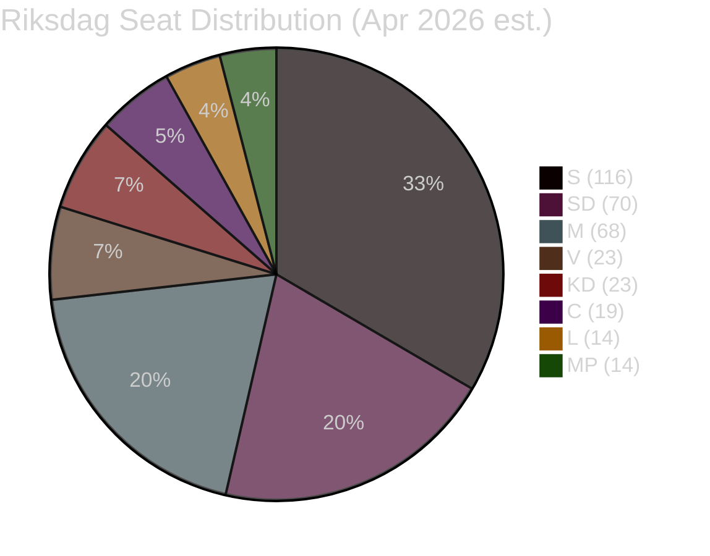

# Coalition Mathematics — Monthly Review 2026-04-29

**Date**: 2026-04-29  
**Days to election**: 137  
**Method**: Seat projection arithmetic + formation scenario analysis

---

## Current Seat Projections

### Party-Level (349 seats, majority = 175)

| Party | % est. | Seats est. | Bloc | Notes |
|-------|--------|------------|------|-------|
| S | 33.5% | 116 | Opposition | Dominant; stable |
| SD | 20.2% | 70 | Tidö | ↑ energy debate tailwind |
| M | 19.8% | 68 | Tidö | ↓ economic credibility pressure |
| V | 6.8% | 23 | Opposition | Stable |
| KD | 6.8% | 23 | Tidö | ↓ energy fault-line exposure |
| C | 5.5% | 19 | Opposition | Swing; depends on bloc |
| L | 4.2% | 14 | Tidö | ⚠️ threshold risk; citizenship sensitivity |
| MP | 4.0% | 14 | Opposition | ⚠️ threshold risk; critical for S bloc |

**Tidö total**: 175 (M68+SD70+KD23+L14) — exactly majority, ZERO margin  
**Opposition total**: 172 (S116+V23+MP14+C19) — 3 seats short of majority

---

## Threshold Scenarios

### Scenario T1: Both L and MP cross threshold

| Bloc | Seats | Majority? |
|------|-------|-----------|
| Tidö (M+SD+KD+L) | 175 | ✅ Exactly |
| Opposition (S+V+MP+C) | 172 | ❌ |
| **Formation**: Tidö-II continuation (176 with speaker) |

### Scenario T2: L crosses threshold, MP fails

| Bloc | Seats | Majority? |
|------|-------|-----------|
| Tidö (M+SD+KD+L) | 175 | ✅ |
| Opposition (S+V+C) | 158 | ❌ |
| **Formation**: Tidö-II stronger (MP seats redistribute to S, V, C proportionally) |

### Scenario T3: MP crosses threshold, L fails

| Bloc | Seats | Majority? |
|------|-------|-----------|
| Tidö (M+SD+KD) | 161 | ❌ |
| Opposition (S+V+MP+C) | 172 | ❌ |
| **Formation**: Hung parliament — S-led minority, SD abstention or support-and-confidence |

### Scenario T4: Both L and MP fail threshold

| Bloc | Seats | Majority? |
|------|-------|-----------|
| Tidö (M+SD+KD) | 161 | ❌ |
| Opposition (S+V+C) | 158 | ❌ |
| **Formation**: Maximum uncertainty — possibly C as kingmaker; government formation crisis |

---

## Probability-Weighted Outcome

| Scenario | Probability | Formation |
|----------|-------------|-----------|
| T1: Both clear | ~50% | Tidö-II or hung |
| T2: L in, MP out | ~18% | Tidö-II stronger |
| T3: MP in, L out | ~20% | S minority/hung |
| T4: Both fail | ~12% | Formation crisis |

**Expected government formation**:
- Tidö continuation: ~45% (T1 Tidö wins + T2)
- S-led: ~25% (T1 opposition wins + T3)
- Hung/crisis: ~30% (T1 tie + T4)

---

## FiU Supermajority Arithmetic

**FiU budget majority**: HC01FiU20 passed with Tidö majority (175/349). Opposition reservations from S, V, MP, C did not alter outcome. Budget arithmetic is stable through summer recess.

---

## Post-Election Formation Signals

### Signal 1: C's bloc ambiguity
C's 19 seats make it the potential kingmaker in Scenario T1 (hung) and T4. C leader has stated openness to "responsible government formation" across blocs. C's April position on HC01FiU20 (reservation) and HD01SfU28 (mixed) suggests they are not firmly committed to either bloc. [B2]

### Signal 2: SD's coalition dependency
SD at ~70 seats cannot form government without M+KD or M+KD+L. SD has NO alternative coalition partners. This structural dependency means SD congress energy resolution must not actually break KD partnership — it's theatrical differentiation with a hard floor. [B2]

### Signal 3: S+V+MP arithmetic requires MP threshold
If S is to form government, it needs MP to clear threshold AND needs either C or L to abstain/support. The S formation path requires: (a) S+V+MP+C ≥ 175, OR (b) S+V+MP ≥ 160 with C supply-and-confidence. [B2]

---

## Key Intelligence Finding for Coalition Mathematics

> The April 2026 month closes with **Tidö at exactly the majority threshold (175)** and **zero seats of margin**. The L threshold risk (4.2% ± 0.8pp) is the most arithmetically consequential uncertainty in the 137-day window. HD01SfU28 citizenship vote is the most proximate trigger for L voter attrition. **Every 0.1pp change in L polling within 0.5pp of threshold changes expected government formation probability by approximately 2–3%.** `[B2 — high uncertainty arithmetic]`
