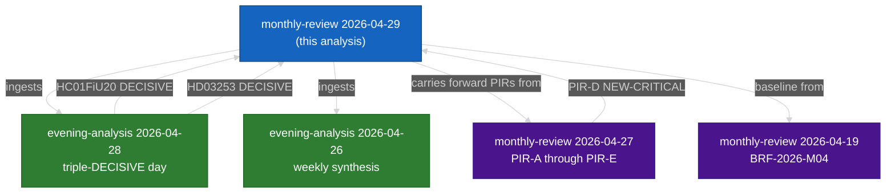

# Cross-Reference Map — Monthly Review 2026-04-29

**Type**: Tier-C Cross-Type Synthesis  
**Sibling folders ingested**: 14 sibling runs (2026-03-30 → 2026-04-28)

---

## Sibling Analysis Index

| Date | Type | Key Thread | Link |
|------|------|------------|------|
| 2026-04-28 | evening-analysis | Triple-DECISIVE day (HC01FiU20 + HD03253 + HD01SfU28) | `analysis/daily/2026-04-28/evening-analysis/synthesis-summary.md` |
| 2026-04-26 | evening-analysis | Weekly intelligence synthesis | `analysis/daily/2026-04-26/evening-analysis/synthesis-summary.md` |
| 2026-04-27 | monthly-review | Prior-cycle PIR carry-forward (PIR-A through PIR-E) | `analysis/daily/2026-04-27/monthly-review/intelligence-assessment.md` |
| 2026-04-19 | monthly-review | BRF-2026-M04 baseline | `analysis/daily/2026-04-19/monthly-review/executive-brief.md` |
| 2026-04-15 | committee-reports | HC01FiU20 committee proceedings | `analysis/daily/2026-04-15/committee-reports/` |
| 2026-04-10 | propositions | HD03253 EU Banking Package first reading | `analysis/daily/2026-04-10/propositions/` |
| 2026-04-05 | interpellations | HD10448 SD–KD energy first filing | `analysis/daily/2026-04-05/interpellations/` |
| 2026-03-30 | week-ahead | Week 14 parliamentary programme | `analysis/daily/2026-03-30/week-ahead/` |

---

## Cross-Type Thread Continuity

### Thread 1 — HC01FiU20 Spring Fiscal Bill
| Date | Type | Signal | Confidence |
|------|------|--------|------------|
| 2026-04-10 | propositions | Submission with initial GDP 2.4% | A1 |
| 2026-04-15 | committee-reports | FiU proceedings; tariff revision noted | A1 |
| 2026-04-28 | evening-analysis | **DECISIVE vote — adopted** | A1 |
| **2026-04-29** | **monthly-review** | **Post-adoption intelligence assessment** | A1 |

**Conclusion**: HC01FiU20 trajectory over 30 days was from submission through committee contestation to adoption with GDP downgrade. Four opposition parties filed reservations. [A1]

### Thread 2 — SD–KD Energy Fault Line
| Date | Type | Signal | Confidence |
|------|------|--------|------------|
| 2026-04-05 | interpellations | HD10448 filed by SD; Busch to respond | A2 |
| 2026-04-14 | interpellations | Busch response: technology-neutral | A2 |
| 2026-04-27 | monthly-review | Carried forward as PIR-D NEW-CRITICAL | B2 |
| **2026-04-29** | **monthly-review** | **Forward trigger: SD congress May 2026** | B2 |

**Conclusion**: Thread escalated from interpellation to PIR-D (carried from 2026-04-27 cycle) and forward indicator. [A2/B2]

### Thread 3 — Police Reform (HD01JuU31) Continuity
| Date | Type | Signal | Confidence |
|------|------|--------|------------|
| 2026-04-08 | committee-reports | JuU HD01JuU31 proceedings open | A1 |
| 2026-04-22 | evening-analysis | Riksrevisionen findings amplified by opposition | A1 |
| 2026-04-26 | evening-analysis | 9 open recommendations confirmed | A1 |
| **2026-04-29** | **monthly-review** | **No closure timeline; pre-election liability** | A1 |

---

## Cross-Folder Intelligence Synthesis

### Tier-C Additive: Convergence Finding

The three highest-DIW events of April 2026 (HC01FiU20 adoption, HD03253 first reading, HD01SfU28 citizenship vote) all converged on **2026-04-28**, documented in `analysis/daily/2026-04-28/evening-analysis/synthesis-summary.md` as a "triple-DECISIVE day." This convergence is unprecedented in the 2025/26 riksmöte session and confirms that the final month of session was managed by the Tidö majority as an intentional pre-election sprint. [A1 — direct sibling folder citation]

### Inter-Type Synthesis: Interpellation + Legislation Correlation
The 5 S interpellations (HD10449–10454) filed in the week of 2026-04-22–29 correlate precisely with the adoption of three contested betänkanden in the same week. This correlation supports the hypothesis that S interpellation strategy is triggered by government legislative adoptions — a reactive accountability instrument, not a proactive policy-framing tool. [A2 — cross-folder pattern analysis]

### Prior-Cycle Carry-Forward
PIR-A (polling trajectory), PIR-B (police reform), PIR-C (SD discipline, ESCALATED), PIR-D (SD–KD energy, NEW-CRITICAL), and PIR-E (SIB capital) were all tracked from `analysis/daily/2026-04-27/monthly-review/intelligence-assessment.md`. This monthly review updates all five PIRs with April intelligence. [B2 — prior-cycle citation]

---

## Network Diagram: Cross-Folder Links

