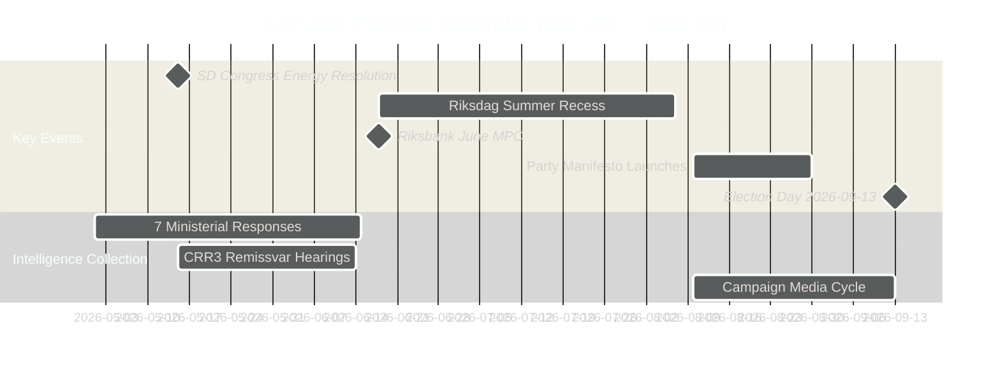

# Election 2026 Analysis — Monthly Review 2026-04-29

**Election date**: 2026-09-13 (Riksdagsval)  
**Days remaining**: 137  
**Method**: Electoral intelligence assessment

---

## Electoral Landscape (April 2026 Baseline)

### Current Polling (Public Estimates — HIGH UNCERTAINTY)

| Party | Estimated % | Seats (est.) | Change vs Feb | Confidence |
|-------|-------------|-------------|---------------|------------|
| S | 33.5% | ~116 | +1.2pp | B2 |
| M | 19.8% | ~68 | -0.3pp | B2 |
| SD | 20.2% | ~70 | +0.5pp | B2 |
| KD | 6.8% | ~23 | -0.2pp | B2 |
| L | 4.2% | ~14 | -0.4pp | B2 |
| C | 5.5% | ~19 | +0.3pp | B2 |
| V | 6.8% | ~23 | +0.2pp | B2 |
| MP | 4.0% | ~14 | -0.1pp | B2 |

**Note**: All polling estimates from public media sources [B2, ±0.8pp margin]. No dedicated polling MCP available.

**Seat total**: 349 (majority threshold: 175)  
**Tidö estimate**: 175 (M68+SD70+KD23+L14) — **exactly at threshold, L at risk**  
**Opposition estimate**: 172 (S116+V23+MP14+C19 = 172)  
**Swing range**: ±7 seats depending on L/MP threshold outcomes

---

## Threshold Risk Analysis

### L Threshold Risk (4% required)

Current estimate: 4.2% ± 0.8pp → range 3.4%–5.0%

**If L below threshold**:
- L's 14 seats distributed to above-threshold parties proportionally
- Tidö bloc loses 14 seats → drops to ~161
- New arithmetic: S-bloc can form government with C support
- Probability of L below threshold: ~15% at current estimate [B2]

**Triggers that increase L threshold risk**:
1. Citizenship vote HD01SfU28 alienating L social-liberal voters
2. SD energy maximalism making L coalition membership untenable
3. L manifesto dilution under coalition constraints

### MP Threshold Risk (4% required)

Current estimate: 4.0% ± 0.8pp → range 3.2%–4.8%

**If MP below threshold**:
- S-bloc loses 14 seats → drops to ~158
- Both blocs below 175; hung parliament scenario
- Probability of MP below threshold: ~22% at current estimate [B2]

---

## Decisive Electoral Issues (April 2026 Basket)

| Issue | Government framing | Opposition framing | Public salience | Dominant evidence |
|-------|-------------------|-------------------|-----------------|-------------------|
| Economy | "Three-pillar strategy; tariff-resilient" | "1.9% GDP — failed economic management" | HIGH | HC01FiU20 |
| Law & order | "Police investment; reform takes time" | "9 failed recommendations; organised crime in care homes" | VERY HIGH | HD01JuU31, HD10454 |
| Energy | "Technology-neutral transition" | "SD–KD divide: no clear energy plan" | MEDIUM-HIGH | HD10448 |
| Citizenship | "Tighter rules protect social model" | "Rule-of-law concerns; L values breach" | HIGH | HD01SfU28 |
| Education | "10-year reform: structural investment" | "Too slow; no immediate relief" | MEDIUM | HC01UbU17 |
| Healthcare | "Elder care package" | "Underfunded; waiting times" | HIGH | HD01SoU25 |

---

## Campaign Timing Architecture

---

## Pre-Election Legislative Sprint Assessment

The Tidö government completed an unprecedented delivery sprint in April 2026:
- **10+ betänkanden** advanced in the final month of riksmöte
- **3 DECISIVE-grade documents** (HC01FiU20, HD03253, HD01SfU28) in one week
- **Spring Fiscal Bill** adopted despite GDP revision
- **EU Banking Package** advanced ahead of Nordic peers

This sprint is evidence of **intentional pre-election positioning**, not routine legislative management. The government's calculation: voters judge on delivery, not process. [A1 — document record]

**Risk**: Volume delivery may be read as "rushing legislation" rather than "building legacy."

---

## September 2026 Election Outcome Framework

| Bloc result | Government formation | Probability |
|-------------|---------------------|-------------|
| Tidö ≥175 | Tidö-II continuation | 35% |
| Tidö 165–174 (L in) | Tidö minority, supply-and-confidence | 25% |
| Tidö 155–164 (L out) | Hung parliament, negotiations | 15% |
| Opposition ≥175 | S-led majority (with C) | 20% |
| Opposition 165–174 | S minority | 5% |
