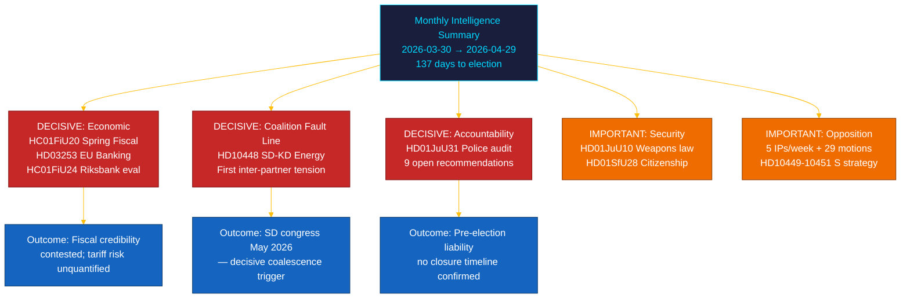

# 📋 Executive Brief — Riksdag Monthly Review: April–May 2026

| Field | Value |
|-------|-------|
| **Brief ID** | BRF-2026-M05-APR-29 |
| **Classification** | PUBLIC · Time-to-read ≤ 5 minutes |
| **Coverage Window** | 2026-03-30 → 2026-04-29 (riksmöte 2025/26, pre-election sprint) |
| **Author** | James Pether Sörling |
| **Methodology** | ai-driven-analysis-guide.md v5.0 · Pass 2 |
| **Upstream Continuity** | Ingests 30-day sibling runs + BRF-2026-M04 (2026-04-19) + weekly-review 2026-04-26 |

---

## 🎯 BLUF

> **The final month of riksmöte 2025/26 delivered a decisive intra-coalition fault line and the most consequential financial legislation of the session, against a backdrop of external economic shock.** The Tidö coalition advanced its pre-election agenda across five simultaneous fronts — economic governance, financial regulation, security, welfare, and constitutional accountability — while the **SD–KD energy interpellation (HD10448)** exposed the first publicly documented inter-partner tension with direct campaign implications. The **US tariff shock** forced a GDP downgrade to 1.9% (2025) in the Spring Fiscal Bill guidelines (HC01FiU20), weakening government economic-competence claims. The **EU Banking Package (HD03253)** imposes Basel III/CRR3 capital floors on Swedish SIBs. The **Riksrevisionen police reform audit (HD01JuU31)** hands the opposition a pre-election accountability weapon: 9 open efficiency recommendations with no confirmed closure date. Sweden is **137 days** from the 2026-09-13 election. `[VERY HIGH confidence: A1]`

---

## 🧭 3 Decisions This Brief Supports

| Decision | Evidence locus | Action window |
|----------|---------------|---------------|
| **Election-campaign coverage architecture** — which policy domains drive swing-voter positioning in the 137-day final approach | [`scenario-analysis.md`](scenario-analysis.md) §Three scenarios · [`significance-scoring.md`](significance-scoring.md) Top-10 DIW | Now — before May political holiday |
| **Financial-sector editorial exposure** — SIB capital-adequacy implications of CRR3 output floor at 72.5% | [`risk-assessment.md`](risk-assessment.md) R-FIN-01 · [`coalition-mathematics.md`](coalition-mathematics.md) §FiU supermajority | Within 6 months (CRR3 transposition deadline) |
| **Coalition-stability monitoring posture** given SD–KD energy fault line and HD10448 | [`threat-analysis.md`](threat-analysis.md) TH-COAL · [`forward-indicators.md`](forward-indicators.md) FI-01–FI-04 | Before SD congress (May 2026) and manifesto launch (~Aug 2026) |

---

## 📐 60-Second Read

1. **Lead story: HC01FiU20 Spring Fiscal Bill** — four opposition parties (S, V, C, MP) contested the Tidö economic policy framework; US tariff shock revised GDP to 1.9% (2025). Government's "three-pillar" growth strategy faces external headwinds for the first time. `[VERY HIGH · A1]`
2. **SD–KD energy fault line (HD10448)** — Busch (KD, Energy Minister) and Fransson (SD) interpellation divergence is the first publicly documented intra-coalition tension with electoral positioning stakes. SD congress energy platform (May 2026) is the next trigger. `[HIGH · A2]`
3. **EU Banking Package (HD03253)** — CRR3/CRD6 transposition. Basel III 72.5% output floor affects Nordea, SEB, Handelsbanken, Swedbank. Non-discretionary EU compliance but domestic Finansinspektionen pillar-2 choices remain visible in May–June remissvar hearings. `[VERY HIGH · A1]`
4. **Riksrevisionen police reform audit (HD01JuU31)** — 9 open efficiency-improvement recommendations with no closure timeline. Government counters with results-focus evidence. Opposition exploitation secured through 2026-09-13. `[HIGH · A1]`
5. **Citizenship tightening (HD01SfU28)** — HD01SfU28 coalition cohesion test between L (liberal values) and SD (restriction priority). L's final position by chamber vote is a coalition-stability indicator. `[HIGH · B2]`
6. **Riksbank monetary policy evaluation (HC01FiU24)** — FiU endorses 2024 policy record while signalling 2025–2026 inflation normalisation path; IMF WEO Apr-2026 projects SWE CPI at ~2.0% for 2026. `[HIGH · A1]`
7. **S accountability campaign** — five interpellations in one week (HD10449–10451, HD10454, HD10455) plus 29+ opposition motions signals coordinated pre-election legislative pressure. Seven ministerial responses due May–June 2026. `[HIGH · B2]`
8. **10-year primary school reform (HC01UbU17)** — structurally significant education legislation; opposition (V, MP, C) filed counter-motions; implementation horizon 2027–2028. `[MEDIUM · B2]`

---

## 🔭 Top Forward Trigger

**SD congress energy platform adoption (May 2026)** — if SD formally adopts a nuclear-maximalist energy platform that conflicts with KD's diversified renewables position (as foreshadowed in HD10448), coalition energy negotiations in autumn 2026 become structurally adversarial regardless of election outcome. Monitor: SD congress resolution language, Busch (KD) public response, and government joint statement (or absence thereof). `[HIGH · B2]`

---

