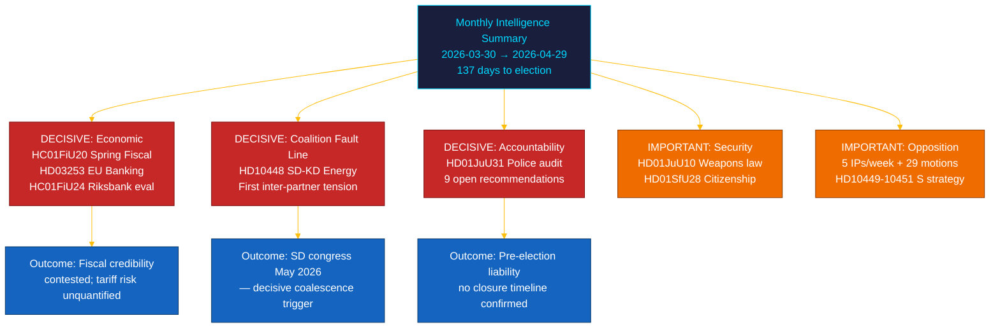

<!-- rtl -->
# 📋 الملخص التنفيذي — المراجعة الشهرية للريكسداغ: أبريل–مايو 2026

| الحقل | القيمة |
|-------|--------|
| **معرّف الملخص** | BRF-2026-M05-APR-29 |
| **التصنيف** | عام · وقت القراءة ≤ 5 دقائق |
| **فترة التغطية** | 2026-03-30 → 2026-04-29 (riksmöte 2025/26، سباق ما قبل الانتخابات) |
| **المؤلف** | James Pether Sörling |
| **المنهجية** | ai-driven-analysis-guide.md v5.0 · المرور 2 |
| **الاستمرارية المرجعية** | يتضمن تحليلات 30 يومًا + BRF-2026-M04 (2026-04-19) + المراجعة الأسبوعية 2026-04-26 |

---

## 🎯 خلاصة القول (BLUF)

> **قدّم الشهر الأخير من riksmöte 2025/26 صدعًا تحالفيًّا حاسمًا وأهم تشريع مالي في هذه الدورة على خلفية صدمات اقتصادية خارجية.** دفع تحالف Tidö أجندته الانتخابية على خمسة محاور في آنٍ واحد — الحوكمة الاقتصادية، والتنظيم المالي، والأمن، والرعاية الاجتماعية، والمساءلة الدستورية — فيما كشف **استجواب SD–KD حول الطاقة (HD10448)** عن أول توتر موثّق بين شركاء التحالف بتداعيات مباشرة على الحملة الانتخابية. **صدمة الرسوم الجمركية الأمريكية** أجبرت على مراجعة الناتج المحلي الإجمالي إلى 1.9% (2025) في مبادئ توجيهية لاقتراح الميزانية الربيعية (HC01FiU20). **حزمة البنوك الأوروبية (HD03253)** تفرض حدًّا أدنى لرأس المال وفق Basel III/CRR3 على البنوك السويدية ذات الأهمية النظامية. **تدقيق Riksrevisionen في إصلاح الشرطة (HD01JuU31)** يمنح المعارضة سلاحًا انتخابيًّا: 9 توصيات كفاءة مفتوحة دون تاريخ إغلاق مؤكّد. السويد على بُعد **137 يومًا** من انتخابات 13 سبتمبر 2026. `[ثقة عالية جدًّا: A1]`

---

## 🧭 3 قرارات يدعمها هذا الملخص

| القرار | موضع الأدلة | نافذة العمل |
|--------|------------|-------------|
| **هندسة الحملة الانتخابية** — أي مجالات السياسات تحدّد تموضع الناخبين المترددين خلال 137 يومًا | [`scenario-analysis.md`](scenario-analysis.md) §ثلاثة سيناريوهات · [`significance-scoring.md`](significance-scoring.md) أعلى 10 DIW | الآن — قبل عطلة أيار السياسية |
| **التعرض التحريري للقطاع المالي** — متطلبات رأس مال SIB وفق حد CRR3 البالغ 72.5% | [`risk-assessment.md`](risk-assessment.md) R-FIN-01 · [`coalition-mathematics.md`](coalition-mathematics.md) §أغلبية FiU | خلال 6 أشهر (موعد تطبيق CRR3) |
| **رصد استقرار التحالف** في ضوء صدع SD–KD حول الطاقة و HD10448 | [`threat-analysis.md`](threat-analysis.md) TH-COAL · [`forward-indicators.md`](forward-indicators.md) FI-01–FI-04 | قبل مؤتمر SD (مايو 2026) وإطلاق البرنامج (~أغسطس 2026) |

---

## 📐 قراءة 60 ثانية

1. **الموضوع الرئيسي: HC01FiU20 اقتراح الميزانية الربيعية** — أربعة أحزاب معارضة (S, V, C, MP) طعنت في الإطار الاقتصادي لـ Tidö؛ صدمة الرسوم راجعت الناتج المحلي إلى 1.9% (2025). `[عالية جدًّا · A1]`
2. **صدع SD–KD حول الطاقة (HD10448)** — التباين بين Busch (KD) وFransson (SD) هو أول توتر تحالفي موثّق. مؤتمر SD (مايو 2026) هو المحفّز التالي. `[عالية · A2]`
3. **حزمة البنوك الأوروبية (HD03253)** — تطبيق CRR3/CRD6. حدّ 72.5% يؤثر على Nordea وSEB وHandelsbanken وSwedbank. `[عالية جدًّا · A1]`
4. **تدقيق Riksrevisionen في إصلاح الشرطة (HD01JuU31)** — 9 توصيات مفتوحة دون جدول زمني للإغلاق. المعارضة مؤمَّنة حتى 2026-09-13. `[عالية · A1]`
5. **تشديد شروط الجنسية (HD01SfU28)** — اختبار تماسك التحالف بين L وSD. `[عالية · B2]`
6. **تقييم السياسة النقدية لـ Riksbank (HC01FiU24)** — FiU يوافق على سياسة 2024؛ توقعات IMF WEO أبريل-2026 للتضخم السويدي ~2.0% لعام 2026. `[عالية · A1]`
7. **حملة المساءلة لـ S** — خمسة استجوابات في أسبوع واحد (HD10449–10451, HD10454, HD10455) بالإضافة إلى 29+ اقتراحًا. `[عالية · B2]`
8. **إصلاح المرحلة الابتدائية لـ 10 سنوات (HC01UbU17)** — تشريع تعليمي مهم هيكليًّا؛ أفق التنفيذ 2027–2028. `[متوسطة · B2]`

---

## 🔭 أبرز محفّز مستقبلي

**اعتماد منصة الطاقة في مؤتمر SD (مايو 2026)** — إذا اعتمد SD رسميًّا منصة تعظيم للطاقة النووية تتعارض مع موقف KD (كما استُبق في HD10448)، ستكون مفاوضات الطاقة التحالفية في خريف 2026 متعارضة هيكليًّا بصرف النظر عن نتيجة الانتخابات. `[عالية · B2]`

---

<!-- source-sha: aef867f928a2f4069766f065dd0ce9404a49f679 -->
