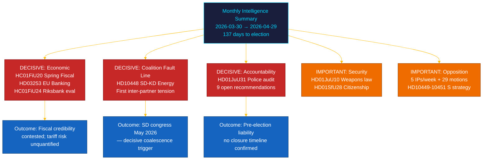

# 📋 Eksekutiv orientering — Riksdagens månedsoversigt: april–maj 2026

| Felt | Værdi |
|------|-------|
| **Orienterings-ID** | BRF-2026-M05-APR-29 |
| **Klassificering** | OFFENTLIG · Læsetid ≤ 5 minutter |
| **Dækningsperiode** | 2026-03-30 → 2026-04-29 (riksmöte 2025/26, valgspurt) |
| **Forfatter** | James Pether Sörling |
| **Metodologi** | ai-driven-analysis-guide.md v5.0 · Pass 2 |
| **Opstrøms kontinuitet** | Inkluderer 30-dages søsteranalyser + BRF-2026-M04 (2026-04-19) + ugegennemgang 2026-04-26 |

---

## 🎯 Kernebudskab

> **Riksmødets sidste måned 2025/26 leverede en afgørende intrakoalitionsrevne og den mest betydningsfulde finanslovgivning i sessionen mod baggrund af eksterne økonomiske chok.** Tidö-koalitionen fremførte sin valspurtsagenda på fem fronter simultant — økonomisk styring, finansregulering, sikkerhed, velfærd og konstitutionelt ansvar — mens **SD–KD-energiinterpellationen (HD10448)** afslørede den første dokumenterede inter-partnersspænding med direkte kampagneimplikationer. **Det amerikanske toldchok** tvang en BNP-nedjustering til 1,9% (2025) i retningslinjerne for forårets fiskalproposition (HC01FiU20). **EU's bankpakke (HD03253)** indfører Basel III/CRR3-kapitalgulve på svenske SIB'er. **Riksrevisionens politireformrevision (HD01JuU31)** giver oppositionen et valgvåben: 9 åbne effektivitetsanbefalinger uden bekræftet afslutningsdato. Sverige er **137 dage** fra valget den 13. september 2026. `[MEGET HØJ konfidens: A1]`

---

## 🧭 3 beslutninger dette notat understøtter

| Beslutning | Evidenslocus | Handlingsvindue |
|------------|--------------|-----------------|
| **Valgkampagnestrategi** — hvilke politikområder driver svingerens positionering i de sidste 137 dage | [`scenario-analysis.md`](scenario-analysis.md) §Tre scenarier · [`significance-scoring.md`](significance-scoring.md) Top-10 DIW | Nu — før politisk majferie |
| **Finanssektoriel redaktionel eksponering** — SIB-kapitalbehovsimplikationer af CRR3-outputgulv på 72,5% | [`risk-assessment.md`](risk-assessment.md) R-FIN-01 · [`coalition-mathematics.md`](coalition-mathematics.md) §FiU-supermajoritet | Inden for 6 måneder (CRR3-transpositionsfrist) |
| **Koalitionsstabilitetsovervågning** i lyset af SD–KD-energirevnen og HD10448 | [`threat-analysis.md`](threat-analysis.md) TH-COAL · [`forward-indicators.md`](forward-indicators.md) FI-01–FI-04 | Før SD's kongres (maj 2026) og manifestlancering (~aug 2026) |

---

## 📐 60-sekunders læsning

1. **Tophistorie: HC01FiU20 Forårets fiskalproposition** — fire oppositionspartier (S, V, C, MP) anfægtede Tidös politiske ramme; det amerikanske toldchok reviderede BNP til 1,9% (2025). `[MEGET HØJ · A1]`
2. **SD–KD energirevne (HD10448)** — Busch (KD) og Fransson (SD):s interpellationsdivergens er den første dokumenterede intrakoalitionsspænding. SD's kongres (maj 2026) er næste trigger. `[HØJ · A2]`
3. **EU's bankpakke (HD03253)** — CRR3/CRD6-transposition. Basel III 72,5%-outputgulv påvirker Nordea, SEB, Handelsbanken, Swedbank. `[MEGET HØJ · A1]`
4. **Riksrevisionens politireformrevision (HD01JuU31)** — 9 åbne anbefalinger uden lukningsfrist. Opposition sikret frem til 2026-09-13. `[HØJ · A1]`
5. **Statsborgerskabsstramning (HD01SfU28)** — koalitionskohesionstest mellem L og SD. `[HØJ · B2]`
6. **Riksbankens pengepolitisk evaluering (HC01FiU24)** — FiU godkender 2024-politik; IMF WEO apr-2026 projekterer SWE KPI til ~2,0% for 2026. `[HØJ · A1]`
7. **S's ansvarskampagne** — fem interpellationer på en uge (HD10449–10451, HD10454, HD10455) plus 29+ motioner. `[HØJ · B2]`
8. **10-årig grundskolereform (HC01UbU17)** — strukturelt betydningsfuld; implementeringshorisont 2027–2028. `[MIDDEL · B2]`

---

## 🔭 Fremmeste fremtidige trigger

**SD's kongresenergiplatformvedtagelse (maj 2026)** — hvis SD formelt vedtager en kerneenergimaximalistisk platform der kolliderer med KD's position (som varslet i HD10448), bliver koalitionsenergiforhandlingerne efteråret 2026 strukturelt konfliktfyldte uanset valgresultat. `[HØJ · B2]`

---

<!-- source-sha: aef867f928a2f4069766f065dd0ce9404a49f679 -->
