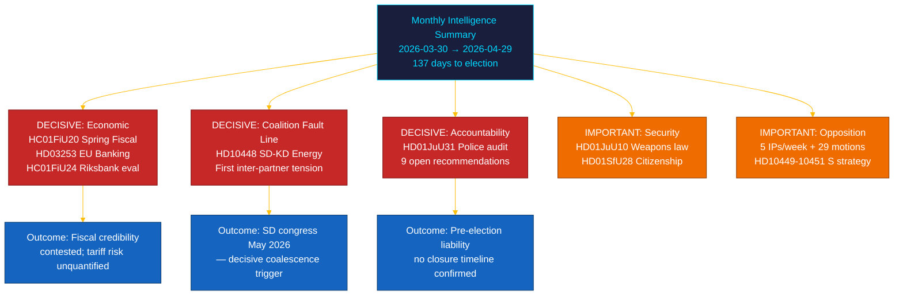

# 📋 Exekutive Zusammenfassung — Riksdag-Monatsrückblick: April–Mai 2026

| Feld | Wert |
|------|------|
| **Zusammenfassungs-ID** | BRF-2026-M05-APR-29 |
| **Klassifizierung** | ÖFFENTLICH · Lesezeit ≤ 5 Minuten |
| **Abdeckungszeitraum** | 2026-03-30 → 2026-04-29 (riksmöte 2025/26, Wahlendspurt) |
| **Autor** | James Pether Sörling |
| **Methodik** | ai-driven-analysis-guide.md v5.0 · Pass 2 |
| **Vorgelagerte Kontinuität** | Enthält 30-Tage-Schwesteranalysen + BRF-2026-M04 (2026-04-19) + Wochenrückblick 2026-04-26 |

---

## 🎯 Kernbotschaft

> **Der letzte Monat der Riksmöte 2025/26 lieferte einen entscheidenden Koalitionsriss und die folgenreichste Finanzgesetzgebung der Sitzung vor dem Hintergrund externer Wirtschaftsschocks.** Die Tidö-Koalition trieb ihre Vorwahlkampfagenda auf fünf Fronten gleichzeitig voran — Wirtschaftsführung, Finanzregulierung, Sicherheit, Wohlfahrt und verfassungsrechtliche Rechenschaftspflicht — während die **SD–KD-Energieinterpellation (HD10448)** die erste dokumentierte Spannung zwischen Koalitionspartnern mit direkten Kampagnenimplikationen offenbarte. **Der US-Zollschock** erzwang eine BIP-Abwärtskorrektur auf 1,9% (2025) in den Leitlinien zum Haushaltsentwurf (HC01FiU20). **Das EU-Bankenpaket (HD03253)** führt Basel III/CRR3-Kapitaluntergrenzen für schwedische SIBs ein. **Die Riksrevisionen-Prüfung der Polizeireform (HD01JuU31)** liefert der Opposition ein Wahlkampfinstrument: 9 offene Effizienzempfehlungen ohne bestätigten Abschlusstermin. Schweden befindet sich **137 Tage** vor den Wahlen am 13. September 2026. `[SEHR HOCH Konfidenz: A1]`

---

## 🧭 3 Entscheidungen, die dieser Brief unterstützt

| Entscheidung | Nachweislocus | Aktionsfenster |
|--------------|---------------|----------------|
| **Wahlkampfarchitektur** — welche Politikbereiche die Positionierung der Wechselwähler in den letzten 137 Tagen bestimmen | [`scenario-analysis.md`](scenario-analysis.md) §Drei Szenarien · [`significance-scoring.md`](significance-scoring.md) Top-10 DIW | Jetzt — vor dem politischen Maifeiertag |
| **Redaktionelle Exposition im Finanzsektor** — SIB-Kapitalanforderungsimplikationen des CRR3-Output-Floors bei 72,5% | [`risk-assessment.md`](risk-assessment.md) R-FIN-01 · [`coalition-mathematics.md`](coalition-mathematics.md) §FiU-Supermehrheit | Innerhalb von 6 Monaten (CRR3-Umsetzungsfrist) |
| **Koalitionsstabilitätsmonitoring** angesichts des SD–KD-Energierisses und HD10448 | [`threat-analysis.md`](threat-analysis.md) TH-COAL · [`forward-indicators.md`](forward-indicators.md) FI-01–FI-04 | Vor dem SD-Parteitag (Mai 2026) und Wahlprogrammveröffentlichung (~Aug 2026) |

---

## 📐 60-Sekunden-Lektüre

1. **Hauptthema: HC01FiU20 Frühjahrshaushalt** — vier Oppositionsparteien (S, V, C, MP) bestritten Tidös Wirtschaftsrahmen; US-Zollschock revidierte BIP auf 1,9% (2025). `[SEHR HOCH · A1]`
2. **SD–KD-Energieriss (HD10448)** — Divergenz zwischen Busch (KD) und Fransson (SD) ist die erste dokumentierte Intrakoalitionsspannung mit Wahlkampfrelevanz. SD-Parteitag (Mai 2026) ist der nächste Auslöser. `[HOCH · A2]`
3. **EU-Bankenpaket (HD03253)** — CRR3/CRD6-Umsetzung. Basel III 72,5%-Output-Floor betrifft Nordea, SEB, Handelsbanken, Swedbank. `[SEHR HOCH · A1]`
4. **Riksrevisionen-Polizeireformprüfung (HD01JuU31)** — 9 offene Empfehlungen ohne Abschlussfrist. Opposition bis 2026-09-13 gesichert. `[HOCH · A1]`
5. **Staatsbürgerschaftsverschärfung (HD01SfU28)** — Koalitionskohäsionstest zwischen L und SD. `[HOCH · B2]`
6. **Riksbank-Geldpolitikevaluierung (HC01FiU24)** — FiU billigt Politik 2024; IWF WEO Apr-2026 projiziert SWE VPI ~2,0% für 2026. `[HOCH · A1]`
7. **S-Rechenschaftskampagne** — fünf Interpellationen in einer Woche (HD10449–10451, HD10454, HD10455) plus 29+ Motionen. `[HOCH · B2]`
8. **10-jährige Grundschulreform (HC01UbU17)** — strukturell bedeutsam; Umsetzungshorizont 2027–2028. `[MITTEL · B2]`

---

## 🔭 Wichtigster künftiger Auslöser

**Annahme der SD-Parteitagsenergiplattform (Mai 2026)** — falls SD eine kernkraftmaximale Energieplattform beschließt, die mit KD:s Position kollidiert (wie in HD10448 angedeutet), werden die Koalitionsenergiegespräche im Herbst 2026 strukturell konfliktreich, unabhängig vom Wahlergebnis. `[HOCH · B2]`

---

<!-- source-sha: aef867f928a2f4069766f065dd0ce9404a49f679 -->
