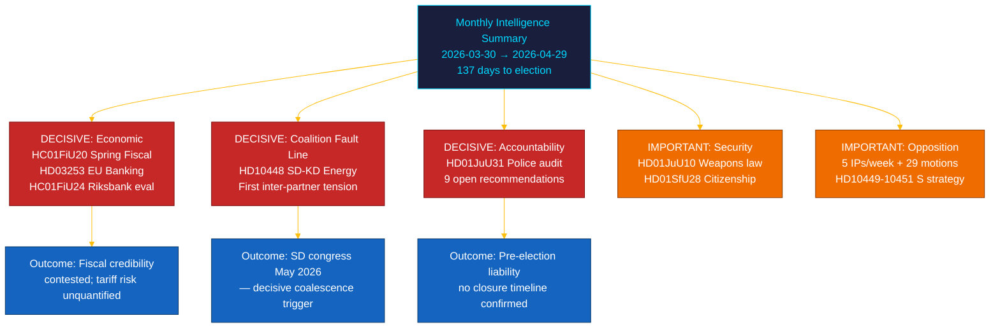

# 📋 Resumen ejecutivo — Revisión mensual del Riksdag: abril–mayo 2026

| Campo | Valor |
|-------|-------|
| **ID del resumen** | BRF-2026-M05-APR-29 |
| **Clasificación** | PÚBLICO · Tiempo de lectura ≤ 5 minutos |
| **Período de cobertura** | 2026-03-30 → 2026-04-29 (riksmöte 2025/26, sprint electoral) |
| **Autor** | James Pether Sörling |
| **Metodología** | ai-driven-analysis-guide.md v5.0 · Paso 2 |
| **Continuidad ascendente** | Incorpora análisis de 30 días + BRF-2026-M04 (2026-04-19) + revisión semanal 2026-04-26 |

---

## 🎯 Mensaje central (BLUF)

> **El último mes del riksmöte 2025/26 reveló una fractura intracoalicional decisiva y la legislación financiera más importante de la sesión, en el contexto de choques económicos externos.** La coalición Tidö avanzó su agenda pre-electoral en cinco frentes simultáneos — gobernanza económica, regulación financiera, seguridad, bienestar y rendición de cuentas constitucional — mientras la **interpelación SD–KD sobre energía (HD10448)** expuso la primera tensión documentada entre socios de coalición con implicaciones directas para la campaña. **El choque arancelario estadounidense** forzó una revisión del PIB al 1,9% (2025) en las directrices de la propuesta presupuestaria primaveral (HC01FiU20). **El paquete bancario europeo (HD03253)** impone suelos de capital Basel III/CRR3 a los SIBs suecos. **La auditoría de la reforma policial por la Riksrevisionen (HD01JuU31)** da a la oposición un arma electoral: 9 recomendaciones de eficiencia abiertas sin fecha de cierre confirmada. Suecia está a **137 días** de las elecciones del 13 de septiembre de 2026. `[MUY ALTA confianza: A1]`

---

## 🧭 3 decisiones que este informe apoya

| Decisión | Locus de evidencia | Ventana de acción |
|----------|--------------------|-------------------|
| **Arquitectura de campaña electoral** — qué áreas de política orientan el posicionamiento de los votantes indecisos en los últimos 137 días | [`scenario-analysis.md`](scenario-analysis.md) §Tres escenarios · [`significance-scoring.md`](significance-scoring.md) Top-10 DIW | Ahora — antes del período festivo de mayo |
| **Exposición editorial del sector financiero** — implicaciones de los requisitos de capital de los SIBs del suelo de producción CRR3 al 72,5% | [`risk-assessment.md`](risk-assessment.md) R-FIN-01 · [`coalition-mathematics.md`](coalition-mathematics.md) §Supermayoría FiU | En los próximos 6 meses (plazo de transposición CRR3) |
| **Monitoreo de la estabilidad de la coalición** ante la fractura SD–KD en energía y HD10448 | [`threat-analysis.md`](threat-analysis.md) TH-COAL · [`forward-indicators.md`](forward-indicators.md) FI-01–FI-04 | Antes del congreso SD (mayo 2026) y el lanzamiento del manifiesto (~agosto 2026) |

---

## 📐 Lectura en 60 segundos

1. **Historia principal: HC01FiU20 Propuesta presupuestaria primaveral** — cuatro partidos de oposición (S, V, C, MP) impugnaron el marco económico de Tidö; el choque arancelario revisó el PIB al 1,9% (2025). `[MUY ALTA · A1]`
2. **Fractura SD–KD en energía (HD10448)** — la divergencia entre Busch (KD) y Fransson (SD) es la primera tensión intracoalicional documentada con apuestas de posicionamiento electoral. Congreso SD (mayo 2026) es el próximo desencadenante. `[ALTA · A2]`
3. **Paquete bancario europeo (HD03253)** — transposición CRR3/CRD6. Suelo Basel III 72,5% afecta a Nordea, SEB, Handelsbanken, Swedbank. `[MUY ALTA · A1]`
4. **Auditoría de reforma policial de la Riksrevisionen (HD01JuU31)** — 9 recomendaciones abiertas sin cronograma de cierre. Oposición asegurada hasta 2026-09-13. `[ALTA · A1]`
5. **Endurecimiento de la ciudadanía (HD01SfU28)** — test de cohesión coalicional entre L y SD. `[ALTA · B2]`
6. **Evaluación de política monetaria del Riksbank (HC01FiU24)** — FiU aprueba la política 2024; FMI WEO abr-2026 proyecta IPC SWE ~2,0% para 2026. `[ALTA · A1]`
7. **Campaña de rendición de cuentas de S** — cinco interpelaciones en una semana (HD10449–10451, HD10454, HD10455) más 29+ mociones. `[ALTA · B2]`
8. **Reforma de la escuela primaria de 10 años (HC01UbU17)** — legislación educativa estructuralmente significativa; horizonte de implementación 2027–2028. `[MEDIA · B2]`

---

## 🔭 Principal desencadenante futuro

**Adopción de la plataforma energética del congreso SD (mayo 2026)** — si SD adopta formalmente una plataforma que maximiza la energía nuclear y entra en conflicto con la posición de KD (anticipada en HD10448), las negociaciones energéticas de la coalición en otoño de 2026 serán estructuralmente conflictivas independientemente del resultado electoral. `[ALTA · B2]`

---

<!-- source-sha: aef867f928a2f4069766f065dd0ce9404a49f679 -->
