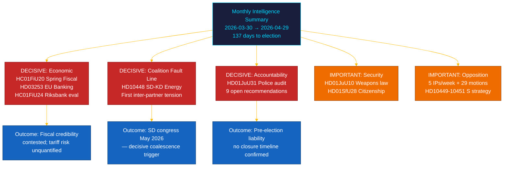

# 📋 Johdon katsaus — Riksdagin kuukausikatsaus: huhtikuu–toukokuu 2026

| Kenttä | Arvo |
|--------|------|
| **Katsaus-ID** | BRF-2026-M05-APR-29 |
| **Luokitus** | JULKINEN · Lukuaika ≤ 5 minuuttia |
| **Kattavuusjakso** | 2026-03-30 → 2026-04-29 (riksmöte 2025/26, vaalispurtti) |
| **Tekijä** | James Pether Sörling |
| **Menetelmä** | ai-driven-analysis-guide.md v5.0 · Pass 2 |
| **Ylävirran jatkuvuus** | Sisältää 30 päivän sisaranalyysit + BRF-2026-M04 (2026-04-19) + viikkokatsaus 2026-04-26 |

---

## 🎯 Ydinviesti

> **Riksmöten viimeinen kuukausi 2025/26 toi mukanaan ratkaisevan koalition sisäisen halkeaman ja istunnon merkittävimmän finanssilainsäädännön ulkoisen taloussokin taustoilla.** Tidö-koalitio vei vaaliohjelmaansa eteenpäin viidellä rintamalla samanaikaisesti — talouden hallinta, rahoitussääntely, turvallisuus, hyvinvointi ja perustuslaillinen vastuullisuus — kun **SD–KD-energiainterpelaatio (HD10448)** paljasti ensimmäisen dokumentoidun kumppaneiden välisen jännitteen suorin kampanjaseurauksiin. **Yhdysvaltojen tullishokki** pakotti BKT:n alentamisen 1,9%:iin (2025) kevään talousarvioproposition (HC01FiU20) suuntaviivoissa. **EU:n pankkipaketti (HD03253)** tuo Basel III/CRR3-pääomatasoitteet ruotsalaisille SIB-pankeille. **Riksrevisionenin poliisiuudistustarkastus (HD01JuU31)** antaa oppositiolle vaalielektiä: 9 avointa tehokkuussuositusta ilman vahvistettua sulkemispäivää. Ruotsissa on **137 päivää** 13. syyskuuta 2026 vaaleihin. `[ERITTÄIN KORKEA luotettavuus: A1]`

---

## 🧭 3 päätöstä, joita tämä katsaus tukee

| Päätös | Todisteperusta | Toimintaikkuna |
|--------|---------------|----------------|
| **Vaalikampanjastrategia** — mitkä politiikka-alueet ohjaavat heiluriäänestäjien asemoitumista viimeisen 137 päivän aikana | [`scenario-analysis.md`](scenario-analysis.md) §Kolme skenaariota · [`significance-scoring.md`](significance-scoring.md) Top-10 DIW | Nyt — ennen toukokuun poliittista lomaa |
| **Rahoitussektorin toimituksellinen altistuminen** — SIB-pääomavaatimusten vaikutukset CRR3-tuotantolattian 72,5% perusteella | [`risk-assessment.md`](risk-assessment.md) R-FIN-01 · [`coalition-mathematics.md`](coalition-mathematics.md) §FiU-supermajoriteetti | 6 kuukauden kuluessa (CRR3-täytäntöönpanon määräaika) |
| **Koalition vakausvalvonta** SD–KD-energihalkeaman ja HD10448:n valossa | [`threat-analysis.md`](threat-analysis.md) TH-COAL · [`forward-indicators.md`](forward-indicators.md) FI-01–FI-04 | Ennen SD:n puoluekokousta (toukokuu 2026) ja ohjelmaesittelyä (~elokuu 2026) |

---

## 📐 60 sekunnin luku

1. **Pääuutinen: HC01FiU20 Kevään talousarvioesitys** — neljä oppositiopuoluetta (S, V, C, MP) riitautti Tidön kehyksen; tullishokki alensi BKT:n 1,9%:iin (2025). `[ERITTÄIN KORKEA · A1]`
2. **SD–KD energiahalkeama (HD10448)** — Busch (KD) ja Fransson (SD):n interpellaatiodivergensi on ensimmäinen dokumentoitu koalition sisäinen jännite. SD:n puoluekokous (toukokuu 2026) on seuraava laukaisija. `[KORKEA · A2]`
3. **EU:n pankkipaketti (HD03253)** — CRR3/CRD6-täytäntöönpano. Basel III 72,5%-lattia vaikuttaa Nordeaan, SEB:iin, Handelsbankeniin, Swedbankiin. `[ERITTÄIN KORKEA · A1]`
4. **Riksrevisionenin poliisiuudistustarkastus (HD01JuU31)** — 9 avointa suositusta ilman sulkemisaikataulua. Oppositio voi hyödyntää tätä 2026-09-13 asti. `[KORKEA · A1]`
5. **Kansalaisuuden tiukentaminen (HD01SfU28)** — koheesiotesti L:n ja SD:n välillä. `[KORKEA · B2]`
6. **Riksbankenin rahapolitiikan arviointi (HC01FiU24)** — FiU hyväksyy vuoden 2024 politiikan; IMF WEO huhti-2026 ennustaa SWE KPI ~2,0% vuodelle 2026. `[KORKEA · A1]`
7. **S:n vastuullisuuskampanja** — viisi interpellaatiota viikossa (HD10449–10451, HD10454, HD10455) ja 29+ motiota. `[KORKEA · B2]`
8. **10-vuotinen peruskouluuudistus (HC01UbU17)** — rakenteellisesti merkittävä; täytäntöönpanoikkuna 2027–2028. `[KESKITASO · B2]`

---

## 🔭 Tärkein tuleva laukaisija

**SD:n puoluekokouksen energiaohjelma-alustan hyväksyminen (toukokuu 2026)** — jos SD virallisesti hyväksyy ydinvoimamaksimalistisen energiaohjelman, joka on ristiriidassa KD:n position kanssa (kuten ennakoitiin HD10448:ssa), koalition energianeuvottelut syksyllä 2026 ovat rakenteellisesti ristiriitaisia vaalituloksesta riippumatta. `[KORKEA · B2]`

---

<!-- source-sha: aef867f928a2f4069766f065dd0ce9404a49f679 -->
