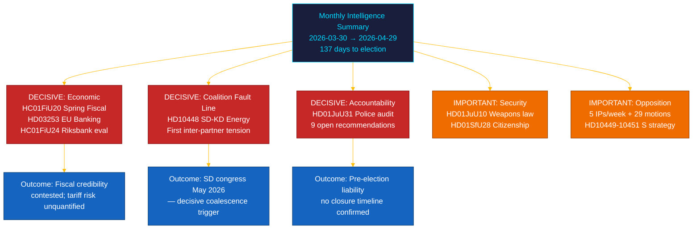

# 📋 Note exécutive — Revue mensuelle du Riksdag : avril–mai 2026

| Champ | Valeur |
|-------|--------|
| **ID de la note** | BRF-2026-M05-APR-29 |
| **Classification** | PUBLIC · Temps de lecture ≤ 5 minutes |
| **Période couverte** | 2026-03-30 → 2026-04-29 (riksmöte 2025/26, sprint électoral) |
| **Auteur** | James Pether Sörling |
| **Méthodologie** | ai-driven-analysis-guide.md v5.0 · Passe 2 |
| **Continuité amont** | Intègre les analyses de 30 jours + BRF-2026-M04 (2026-04-19) + revue hebdomadaire 2026-04-26 |

---

## 🎯 Message central (BLUF)

> **Le dernier mois de la riksmöte 2025/26 a révélé une fracture intracoalitionnelle décisive et la législation financière la plus conséquente de la session, sur fond de chocs économiques externes.** La coalition Tidö a fait avancer son agenda de fin de campagne sur cinq fronts simultanément — gouvernance économique, régulation financière, sécurité, bien-être social et responsabilité constitutionnelle — tandis que l'**interpellation SD–KD sur l'énergie (HD10448)** a exposé la première tension documentée entre partenaires de coalition aux implications directes pour la campagne. **Le choc tarifaire américain** a forcé une révision du PIB à 1,9% (2025) dans les orientations de la proposition budgétaire printanière (HC01FiU20). **Le paquet bancaire européen (HD03253)** impose des planchers de fonds propres Basel III/CRR3 aux SIBs suédoises. **L'audit de la réforme policière par la Riksrevisionen (HD01JuU31)** donne à l'opposition une arme électorale : 9 recommandations d'efficacité ouvertes sans date de clôture confirmée. La Suède est à **137 jours** des élections du 13 septembre 2026. `[TRÈS HAUTE confiance : A1]`

---

## 🧭 3 décisions que ce brief soutient

| Décision | Locus probatoire | Fenêtre d'action |
|----------|-----------------|------------------|
| **Architecture de campagne électorale** — quels domaines politiques orientent le positionnement des électeurs indécis dans les 137 derniers jours | [`scenario-analysis.md`](scenario-analysis.md) §Trois scénarios · [`significance-scoring.md`](significance-scoring.md) Top-10 DIW | Maintenant — avant les congés de mai |
| **Exposition rédactionnelle dans le secteur financier** — implications des exigences de fonds propres SIB du plancher de production CRR3 à 72,5% | [`risk-assessment.md`](risk-assessment.md) R-FIN-01 · [`coalition-mathematics.md`](coalition-mathematics.md) §Supermajorité FiU | Dans les 6 mois (délai de transposition CRR3) |
| **Surveillance de la stabilité coalitionnelle** face à la fracture SD–KD sur l'énergie et HD10448 | [`threat-analysis.md`](threat-analysis.md) TH-COAL · [`forward-indicators.md`](forward-indicators.md) FI-01–FI-04 | Avant le congrès SD (mai 2026) et le lancement du manifeste (~août 2026) |

---

## 📐 Lecture en 60 secondes

1. **Sujet principal : HC01FiU20 Proposition budgétaire printanière** — quatre partis d'opposition (S, V, C, MP) ont contesté le cadre économique de Tidö ; le choc tarifaire américain a révisé le PIB à 1,9% (2025). `[TRÈS HAUTE · A1]`
2. **Fracture SD–KD sur l'énergie (HD10448)** — la divergence entre Busch (KD) et Fransson (SD) est la première tension intracoalitionnelle documentée aux enjeux électoraux. Le congrès SD (mai 2026) est le prochain déclencheur. `[HAUTE · A2]`
3. **Paquet bancaire européen (HD03253)** — transposition CRR3/CRD6. Plancher Basel III 72,5% affecte Nordea, SEB, Handelsbanken, Swedbank. `[TRÈS HAUTE · A1]`
4. **Audit de la réforme policière par la Riksrevisionen (HD01JuU31)** — 9 recommandations ouvertes sans calendrier de clôture. Opposition assurée jusqu'au 2026-09-13. `[HAUTE · A1]`
5. **Durcissement de la nationalité (HD01SfU28)** — test de cohésion coalitionnelle entre L et SD. `[HAUTE · B2]`
6. **Évaluation de la politique monétaire de la Riksbank (HC01FiU24)** — FiU approuve la politique 2024 ; FMI WEO avr-2026 projette IPC SWE ~2,0% pour 2026. `[HAUTE · A1]`
7. **Campagne d'imputabilité de S** — cinq interpellations en une semaine (HD10449–10451, HD10454, HD10455) plus 29+ motions. `[HAUTE · B2]`
8. **Réforme de l'école primaire sur 10 ans (HC01UbU17)** — législation éducative structurellement importante ; horizon de mise en œuvre 2027–2028. `[MOYEN · B2]`

---

## 🔭 Déclencheur futur principal

**Adoption de la plateforme énergétique du congrès SD (mai 2026)** — si SD adopte formellement une plateforme maximisant le nucléaire qui entre en conflit avec la position de KD (préfigurée dans HD10448), les négociations énergétiques coalitionnelles à l'automne 2026 deviendront structurellement conflictuelles quel que soit le résultat électoral. `[HAUTE · B2]`

---

<!-- source-sha: aef867f928a2f4069766f065dd0ce9404a49f679 -->
