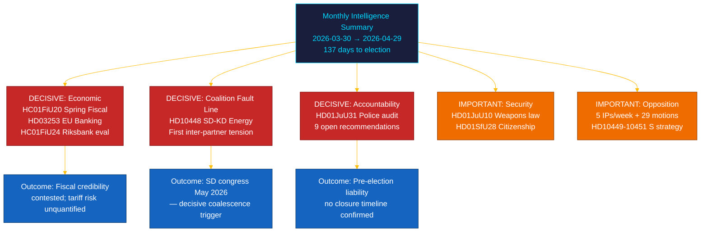

<!-- rtl -->
# 📋 תקציר מנהלים — סקירה חודשית של הריקסדאג: אפריל–מאי 2026

| שדה | ערך |
|-----|-----|
| **מזהה התקציר** | BRF-2026-M05-APR-29 |
| **סיווג** | ציבורי · זמן קריאה ≤ 5 דקות |
| **תקופת הכיסוי** | 2026-03-30 → 2026-04-29 (riksmöte 2025/26, ספרינט טרום-בחירות) |
| **מחבר** | James Pether Sörling |
| **מתודולוגיה** | ai-driven-analysis-guide.md v5.0 · מעבר 2 |
| **המשכיות מקור** | כולל ניתוחי 30 יום + BRF-2026-M04 (2026-04-19) + סקירה שבועית 2026-04-26 |

---

## 🎯 מסר מרכזי (BLUF)

> **החודש האחרון של riksmöte 2025/26 הניב סדק קואליציוני מכריע ואת החקיקה הפיננסית המשמעותית ביותר של הפגישה, על רקע זעזועים כלכליים חיצוניים.** קואליציית Tidö קידמה את אג'נדת הבחירות שלה על חמישה חזיתות בו-זמנית — ממשל כלכלי, רגולציה פיננסית, ביטחון, רווחה ואחריות חוקתית — כאשר **בין-ההצבעה SD–KD בנושא אנרגיה (HD10448)** חשפה את המתח המתועד הראשון בין שותפי קואליציה עם השלכות ישירות על הקמפיין. **הלם המכסים האמריקאי** אילץ עדכון כלפי מטה של התוצר המקומי הגולמי ל-1.9% (2025) בהנחיות הצעת התקציב האביבית (HC01FiU20). **חבילת הבנקים האירופית (HD03253)** מטילה רצפות הון Basel III/CRR3 על SIBs שוודיות. **ביקורת Riksrevisionen על רפורמת המשטרה (HD01JuU31)** מעניקה לאופוזיציה נשק בחירות: 9 המלצות פתוחות לייעול ללא תאריך סגירה מאושר. שוודיה נמצאת **137 ימים** מהבחירות ב-13 בספטמבר 2026. `[ביטחון גבוה מאוד: A1]`

---

## 🧭 3 החלטות שתקציר זה תומך בהן

| החלטה | מיקום הראיות | חלון פעולה |
|-------|-------------|------------|
| **ארכיטקטורת קמפיין בחירות** — אילו תחומי מדיניות מנחים את מיצוב הבוחרים המתנדנדים ב-137 הימים האחרונים | [`scenario-analysis.md`](scenario-analysis.md) §שלושה תרחישים · [`significance-scoring.md`](significance-scoring.md) 10 DIW מובילים | עכשיו — לפני חג העבודה של מאי |
| **חשיפה עורכת דין בסקטור הפיננסי** — השלכות דרישות ההון SIB של רצפת הפלט CRR3 על 72.5% | [`risk-assessment.md`](risk-assessment.md) R-FIN-01 · [`coalition-mathematics.md`](coalition-mathematics.md) §רוב FiU | תוך 6 חודשים (מועד יישום CRR3) |
| **ניטור יציבות קואליציה** לנוכח סדק SD–KD באנרגיה ו-HD10448 | [`threat-analysis.md`](threat-analysis.md) TH-COAL · [`forward-indicators.md`](forward-indicators.md) FI-01–FI-04 | לפני ועידת SD (מאי 2026) והשקת מצע (~אוגוסט 2026) |

---

## 📐 קריאת 60 שניות

1. **כותרת: HC01FiU20 הצעת התקציב האביבית** — ארבעה מפלגות אופוזיציה (S, V, C, MP) ערערו על מסגרת Tidö הכלכלית; הלם המכסים עדכן את התוצר ל-1.9% (2025). `[גבוה מאוד · A1]`
2. **סדק SD–KD באנרגיה (HD10448)** — הסתירה בין Busch (KD) לFransson (SD) היא המתח הקואליציוני התוך-קואליציוני הראשון המתועד. ועידת SD (מאי 2026) היא הגורם המפעיל הבא. `[גבוה · A2]`
3. **חבילת הבנקים האירופית (HD03253)** — יישום CRR3/CRD6. רצפה 72.5% משפיעה על Nordea, SEB, Handelsbanken, Swedbank. `[גבוה מאוד · A1]`
4. **ביקורת Riksrevisionen (HD01JuU31)** — 9 המלצות פתוחות ללא לוח זמנים לסגירה. האופוזיציה מובטחת עד 2026-09-13. `[גבוה · A1]`
5. **החמרת אזרחות (HD01SfU28)** — מבחן לכידות קואליציה בין L ל-SD. `[גבוה · B2]`
6. **הערכת מדיניות מוניטרית של Riksbank (HC01FiU24)** — FiU מאשר מדיניות 2024; תחזיות IMF WEO אפריל-2026 לאינפלציה שוודית ~2.0% ל-2026. `[גבוה · A1]`
7. **קמפיין האחריות של S** — חמישה בין-הצבעות בשבוע אחד (HD10449–10451, HD10454, HD10455) ועוד 29+ הצעות. `[גבוה · B2]`
8. **רפורמת בית-ספר יסודי ל-10 שנים (HC01UbU17)** — חקיקה חינוכית משמעותית מבנית; אופק יישום 2027–2028. `[בינוני · B2]`

---

## 🔭 הגורם המפעיל המרכזי הבא

**אימוץ פלטפורמת אנרגיה בועידת SD (מאי 2026)** — אם SD תאמץ רשמית פלטפורמה מקסימליסטית לאנרגיה גרעינית המתנגשת עם עמדת KD (כפי שנרמז ב-HD10448), משא-ומתן אנרגיה קואליציוני בסתיו 2026 יהיה מתנגש מבנית ללא קשר לתוצאת הבחירות. `[גבוה · B2]`

---

<!-- source-sha: aef867f928a2f4069766f065dd0ce9404a49f679 -->
