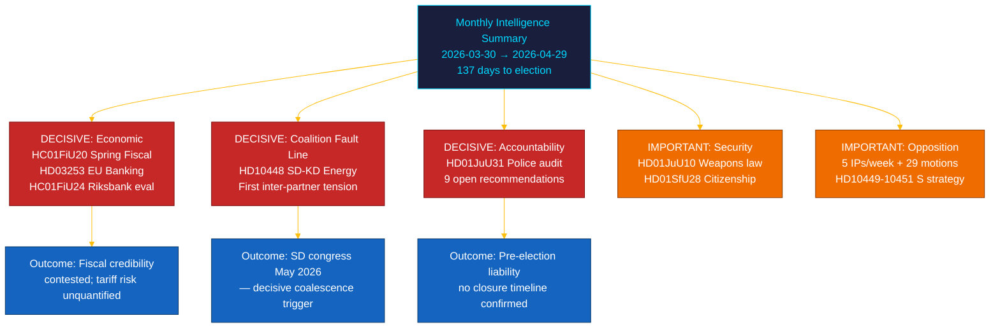

# 📋 エグゼクティブ・ブリーフ — リクスダーグ月次レビュー：2026年4月～5月

| 項目 | 内容 |
|------|------|
| **ブリーフID** | BRF-2026-M05-APR-29 |
| **分類** | 公開 · 読了時間 ≤ 5分 |
| **対象期間** | 2026-03-30 → 2026-04-29 (riksmöte 2025/26、選挙スプリント) |
| **著者** | James Pether Sörling |
| **方法論** | ai-driven-analysis-guide.md v5.0 · パス2 |
| **上流継続性** | 30日姉妹分析 + BRF-2026-M04 (2026-04-19) + 週次レビュー2026-04-26を包含 |

---

## 🎯 主要メッセージ（BLUF）

> **riksmöte 2025/26の最終月は、外部経済ショックを背景に、連立内の決定的亀裂とセッション最大の財政立法をもたらした。** Tidö連立は選挙前アジェンダを5つの戦線で同時に推進した — 経済ガバナンス、金融規制、安全保障、福祉、憲法上の説明責任 — その一方で**SD–KDエネルギー質問（HD10448）**が直接的な選挙への影響を持つ連立パートナー間の最初の文書化された緊張を露わにした。**米国の関税ショック**により春の財政提案（HC01FiU20）の指針でGDPが1.9%（2025年）に下方修正された。**EUバンキングパッケージ（HD03253）**はスウェーデンのシステム上重要な銀行にBasel III/CRR3資本下限を課す。**Riksrevisionenの警察改革監査（HD01JuU31）**は野党に選挙兵器を提供する：確認済み閉鎖日なしの9つの未解決効率化勧告。スウェーデンは2026年9月13日選挙まで**137日**。`[非常に高い信頼度：A1]`

---

## 🧭 このブリーフが支援する3つの意思決定

| 意思決定 | 証拠の所在 | 行動ウィンドウ |
|---------|-----------|--------------|
| **選挙キャンペーン戦略** — 残り137日で無党派層の動向を左右する政策分野 | [`scenario-analysis.md`](scenario-analysis.md) §三つのシナリオ · [`significance-scoring.md`](significance-scoring.md) DIW上位10 | 今すぐ — 5月の政治休暇前 |
| **金融セクターの編集上の露出** — CRR3産出下限72.5%のSIB資本要件への影響 | [`risk-assessment.md`](risk-assessment.md) R-FIN-01 · [`coalition-mathematics.md`](coalition-mathematics.md) §FiU超多数 | 6か月以内（CRR3移行期限） |
| **連立安定性モニタリング** SD–KDエネルギー亀裂とHD10448を踏まえて | [`threat-analysis.md`](threat-analysis.md) TH-COAL · [`forward-indicators.md`](forward-indicators.md) FI-01–FI-04 | SD党大会（2026年5月）とマニフェスト発表（~2026年8月）前 |

---

## 📐 60秒で読む

1. **主要ニュース：HC01FiU20 春の財政提案** — 4野党（S, V, C, MP）がTidöの経済的枠組みに異議；米国関税ショックでGDPが1.9%（2025）に修正。`[非常に高い · A1]`
2. **SD–KDエネルギー亀裂（HD10448）** — Busch（KD）とFransson（SD）の対立は選挙上の賭けを持つ最初の連立内緊張。SD党大会（2026年5月）が次のトリガー。`[高い · A2]`
3. **EUバンキングパッケージ（HD03253）** — CRR3/CRD6移行。Basel III 72.5%下限がNordea、SEB、Handelsbanken、Swedbankに影響。`[非常に高い · A1]`
4. **Riksrevisionenの警察改革監査（HD01JuU31）** — 閉鎖スケジュールなしの9つの未解決勧告。野党は2026-09-13まで確保済み。`[高い · A1]`
5. **市民権厳格化（HD01SfU28）** — LとSDの間の連立結束テスト。`[高い · B2]`
6. **Riksbankの金融政策評価（HC01FiU24）** — FiUが2024年の政策を承認；IMF WEO 2026年4月はSWE CPIを~2.0%（2026年）と予測。`[高い · A1]`
7. **Sの説明責任キャンペーン** — 1週間で5件の質問（HD10449–10451, HD10454, HD10455）と29以上の動議。`[高い · B2]`
8. **10年間の初等教育改革（HC01UbU17）** — 構造的に重要な教育立法；実施見通し2027–2028年。`[中程度 · B2]`

---

## 🔭 最重要の今後のトリガー

**SD党大会エネルギープラットフォームの採択（2026年5月）** — SDがHD10448で予見されたようにKDの立場と相容れない原子力最大化プラットフォームを正式に採択すれば、2026年秋の連立エネルギー交渉は選挙結果にかかわらず構造的に対立的となる。`[高い · B2]`

---

<!-- source-sha: aef867f928a2f4069766f065dd0ce9404a49f679 -->
