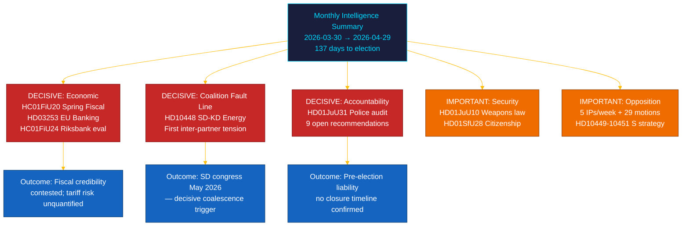

# 📋 임원 브리핑 — 릭스다그 월간 리뷰: 2026년 4월~5월

| 항목 | 내용 |
|------|------|
| **브리핑 ID** | BRF-2026-M05-APR-29 |
| **분류** | 공개 · 읽기 시간 ≤ 5분 |
| **대상 기간** | 2026-03-30 → 2026-04-29 (riksmöte 2025/26, 선거 스프린트) |
| **저자** | James Pether Sörling |
| **방법론** | ai-driven-analysis-guide.md v5.0 · 패스 2 |
| **상위 연속성** | 30일 자매 분석 + BRF-2026-M04 (2026-04-19) + 주간 리뷰 2026-04-26 포함 |

---

## 🎯 핵심 메시지 (BLUF)

> **riksmöte 2025/26의 마지막 달은 외부 경제 충격을 배경으로 연립 내 결정적 균열과 세션 최대의 재정 입법을 가져왔다.** Tidö 연립은 경제 거버넌스, 금융 규제, 안보, 복지, 헌법적 책임 등 5개 전선에서 선거 전 의제를 동시에 추진했으며, **SD–KD 에너지 질의(HD10448)**가 직접적인 선거 영향을 가진 연립 파트너 간 첫 번째 문서화된 긴장을 드러냈다. **미국의 관세 충격**으로 춘계 재정안(HC01FiU20)의 지침에서 GDP가 1.9%(2025년)로 하향 조정되었다. **EU 은행 패키지(HD03253)**는 스웨덴의 시스템적으로 중요한 은행에 Basel III/CRR3 자본 하한을 부과한다. **Riksrevisionens의 경찰 개혁 감사(HD01JuU31)**는 야당에 선거 무기를 제공한다: 확인된 마감일 없는 9개의 미해결 효율화 권고안. 스웨덴은 2026년 9월 13일 선거까지 **137일** 남았다. `[매우 높은 신뢰도: A1]`

---

## 🧭 이 브리핑이 지원하는 3가지 의사결정

| 의사결정 | 증거 위치 | 행동 창 |
|---------|----------|--------|
| **선거 캠페인 전략** — 남은 137일 동안 무당파층을 좌우하는 정책 영역 | [`scenario-analysis.md`](scenario-analysis.md) §세 가지 시나리오 · [`significance-scoring.md`](significance-scoring.md) DIW 상위 10 | 지금 — 5월 정치 휴가 전 |
| **금융 섹터 편집 노출** — CRR3 산출 하한 72.5%의 SIB 자본 요건 영향 | [`risk-assessment.md`](risk-assessment.md) R-FIN-01 · [`coalition-mathematics.md`](coalition-mathematics.md) §FiU 초다수 | 6개월 이내 (CRR3 전환 기한) |
| **연립 안정성 모니터링** HD10448을 감안한 SD–KD 에너지 균열 | [`threat-analysis.md`](threat-analysis.md) TH-COAL · [`forward-indicators.md`](forward-indicators.md) FI-01–FI-04 | SD 전당대회(2026년 5월)와 매니페스토 발표(~2026년 8월) 전 |

---

## 📐 60초 요약

1. **주요 뉴스: HC01FiU20 춘계 재정안** — 4개 야당(S, V, C, MP)이 Tidö의 경제 프레임에 이의 제기; 미국 관세 충격으로 GDP 1.9%(2025)로 수정. `[매우 높음 · A1]`
2. **SD–KD 에너지 균열(HD10448)** — Busch(KD)와 Fransson(SD)의 대립은 선거 판돈을 가진 첫 연립 내 긴장. SD 전당대회(2026년 5월)가 다음 트리거. `[높음 · A2]`
3. **EU 은행 패키지(HD03253)** — CRR3/CRD6 전환. Basel III 72.5% 하한이 Nordea, SEB, Handelsbanken, Swedbank에 영향. `[매우 높음 · A1]`
4. **Riksrevisionens의 경찰 개혁 감사(HD01JuU31)** — 마감 일정 없는 9개의 미해결 권고안. 야당은 2026-09-13까지 확보. `[높음 · A1]`
5. **시민권 강화(HD01SfU28)** — L과 SD 간 연립 결속 테스트. `[높음 · B2]`
6. **Riksbank 통화정책 평가(HC01FiU24)** — FiU가 2024년 정책 승인; IMF WEO 2026년 4월은 SWE CPI를 ~2.0%(2026)로 예측. `[높음 · A1]`
7. **S의 책임 캠페인** — 1주일에 5건의 질의(HD10449–10451, HD10454, HD10455)와 29개 이상의 동의. `[높음 · B2]`
8. **10년간의 초등교육 개혁(HC01UbU17)** — 구조적으로 중요한 교육 입법; 시행 전망 2027–2028. `[중간 · B2]`

---

## 🔭 최중요 향후 트리거

**SD 전당대회 에너지 플랫폼 채택(2026년 5월)** — SD가 HD10448에서 예고된 것처럼 KD의 입장과 양립할 수 없는 원전 최대화 플랫폼을 공식 채택하면, 2026년 가을 연립 에너지 협상은 선거 결과에 관계없이 구조적으로 대립적이 된다. `[높음 · B2]`

---

<!-- source-sha: aef867f928a2f4069766f065dd0ce9404a49f679 -->
