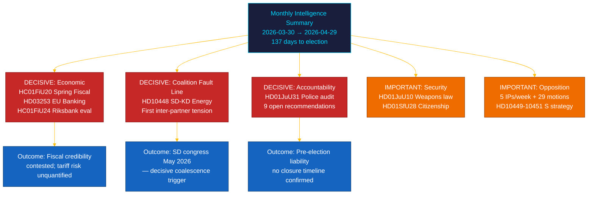

# 📋 Uitvoerende samenvatting — Maandoverzicht Riksdag: april–mei 2026

| Veld | Waarde |
|------|--------|
| **Samenvatting-ID** | BRF-2026-M05-APR-29 |
| **Classificatie** | OPENBAAR · Leestijd ≤ 5 minuten |
| **Dekningsperiode** | 2026-03-30 → 2026-04-29 (riksmöte 2025/26, verkiezingsspurt) |
| **Auteur** | James Pether Sörling |
| **Methodologie** | ai-driven-analysis-guide.md v5.0 · Doorloop 2 |
| **Bovenstrooms continuïteit** | Omvat 30-daagse zusteranalyses + BRF-2026-M04 (2026-04-19) + weekoverzicht 2026-04-26 |

---

## 🎯 Kernboodschap (BLUF)

> **De laatste maand van de riksmöte 2025/26 leverde een beslissende intracoalitiesbreuk en de meest consequente financiële wetgeving van de zitting op, tegen de achtergrond van externe economische schokken.** De Tidö-coalitie voerde haar pre-verkiezingsagenda op vijf fronten tegelijkertijd — economisch bestuur, financiële regulering, veiligheid, welzijn en constitutionele verantwoording — terwijl de **SD–KD-energieinterpellatie (HD10448)** de eerste gedocumenteerde spanning tussen coalitiepartners met directe campagne-implicaties blootlegde. **De Amerikaanse tariefschok** dwong tot een bbp-neerwaartse bijstelling naar 1,9% (2025) in de richtlijnen van het voorjaarsbudget (HC01FiU20). **Het EU-bankenpakket (HD03253)** introduceert Basel III/CRR3-kapitaalvloeren voor Zweedse SIBs. **De Riksrevisionen-audit van de politiehervorming (HD01JuU31)** geeft de oppositie een verkiezingswapen: 9 openstaande efficiëntieaanbevelingen zonder bevestigde sluitingsdatum. Zweden is **137 dagen** verwijderd van de verkiezingen op 13 september 2026. `[ZEER HOGE betrouwbaarheid: A1]`

---

## 🧭 3 beslissingen die dit overzicht ondersteunt

| Beslissing | Bewijslocus | Actievenster |
|------------|-------------|--------------|
| **Verkiezingscampagnearchitectuur** — welke beleidsterreinen de positionering van zwevende kiezers in de laatste 137 dagen bepalen | [`scenario-analysis.md`](scenario-analysis.md) §Drie scenario's · [`significance-scoring.md`](significance-scoring.md) Top-10 DIW | Nu — vóór de politieke meivakantie |
| **Redactionele blootstelling aan de financiële sector** — SIB-kapitaalvereisten van de CRR3-outputvloer op 72,5% | [`risk-assessment.md`](risk-assessment.md) R-FIN-01 · [`coalition-mathematics.md`](coalition-mathematics.md) §FiU-supermeerderheid | Binnen 6 maanden (CRR3-omzettingstermijn) |
| **Coalitie-stabiliteitsbewaking** gezien de SD–KD-energiespreuk en HD10448 | [`threat-analysis.md`](threat-analysis.md) TH-COAL · [`forward-indicators.md`](forward-indicators.md) FI-01–FI-04 | Vóór het SD-congres (mei 2026) en de lancering van het manifest (~aug 2026) |

---

## 📐 60-secondenlezing

1. **Hoofdonderwerp: HC01FiU20 Voorjaarsbudgetvoorstel** — vier oppositiepartijen (S, V, C, MP) betwistten het economische kader van Tidö; de tariefschok herzag het bbp naar 1,9% (2025). `[ZEER HOOG · A1]`
2. **SD–KD-energiesbreuk (HD10448)** — de divergentie tussen Busch (KD) en Fransson (SD) is de eerste gedocumenteerde intracoalitie-spanning. SD-congres (mei 2026) is de volgende trigger. `[HOOG · A2]`
3. **EU-bankenpakket (HD03253)** — CRR3/CRD6-omzetting. Basel III 72,5%-vloer raakt Nordea, SEB, Handelsbanken, Swedbank. `[ZEER HOOG · A1]`
4. **Riksrevisionen-audit politiehervorming (HD01JuU31)** — 9 openstaande aanbevelingen zonder sluitingstermijn. Oppositie verzekerd tot 2026-09-13. `[HOOG · A1]`
5. **Aanscherping staatsburgerschap (HD01SfU28)** — coalitie-cohesietest tussen L en SD. `[HOOG · B2]`
6. **Riksbank-monetaire-beleidsevaluatie (HC01FiU24)** — FiU keurt beleid 2024 goed; IMF WEO apr-2026 projecteert SWE CPI ~2,0% voor 2026. `[HOOG · A1]`
7. **S-verantwoordingscampagne** — vijf interpellaties in één week (HD10449–10451, HD10454, HD10455) plus 29+ moties. `[HOOG · B2]`
8. **10-jarige basisschoolhervorming (HC01UbU17)** — structureel belangrijke onderwijswetgeving; implementatiehorizon 2027–2028. `[GEMIDDELD · B2]`

---

## 🔭 Belangrijkste toekomstige trigger

**Aanname van de SD-congressenergieplatform (mei 2026)** — als SD formeel een kernenergie-maximaliserende energieplatform aanneemt die botst met KD:s positie (zoals voorzien in HD10448), worden de coalitie-energieonderhandelingen in de herfst van 2026 structureel conflictueus, ongeacht de verkiezingsuitslag. `[HOOG · B2]`

---

<!-- source-sha: aef867f928a2f4069766f065dd0ce9404a49f679 -->
